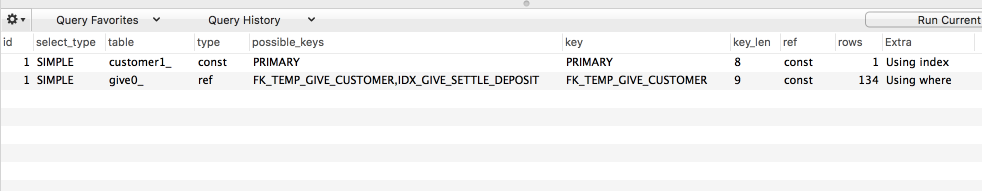

# MySQL 실행계획

## 칼럼별 설명

일반적으로 MySQL의 실행계획은 아래와 같은 형태로 나타납니다.



select_type부터 시작해서 각 항목에 대해 소개하겠습니다.

### select_type

각 단위의 select 쿼리가 (서브쿼리, 조인 등) 어떤 타입의 쿼리인지 표시되는 칼럼

* SIMPLE
  * **union이나 서브쿼리를 사용하지 않는** 단순한 select 쿼리에 표시됨
  * 실행계획에서는 SIMPLE은 **단 하나만 존재**한다.
  * 일반적으로 제일 상단의 select 쿼리에 표기 된다.
* PRIMARY
  * **union이나 서브쿼리를 사용하는** select 쿼리에 표시됨
  * 실행계획에서는 SIMPLE과 마찬가지로 **단 하나만 존재**한다.
  * 일반적으로 제일 상단의 select 쿼리에 표기 된다.
* UNION
  * union으로 조합한 쿼리에서 첫번째 select외에 나머지 select 쿼리들의 타입

* DEPENDENT(의존하는) UNION
  * UNION과 마찬가지로 union, union all로 조합하는 쿼리에서 표시
  * **내부 쿼리가 외부의 값을 참조**해서 처리될때 생성
  * 해당 서브쿼리는 **비효율적인 경우가 있다.**

* UNION RESULT
  * union의 결과를 담아두는 테이블
  * union all, union distinct 등이 실행될때 생성되는 임시테이블을 가리킴

* SUBQUERY
  * from 절 이외에서 사용되는 서브쿼리에 표시
  * from 절에서 사용되는 서브쿼리는 **DERIVED** 라고 표시

* DEPENDENT(의존하는) SUBQUERY
  * 서브쿼리가 최상단의 쿼리에 정의된 컬럼을 사용할때 표시됨  
  * 무조건 의존하고 있는 최상단 쿼리가 실행되어야 해당 서브쿼리도 실행될수 있어 비효율적일때가 있다.

* DERIVED
  * 서브쿼리가 from 절에 사용될 경우 항상 표시
  * 단위 select 쿼리의 실행 결과를 임시테이블로 생성하는 것을 의미
  * **임시테이블은 인덱스가 전혀 없으므로** 성능상 이슈가 많다.
  * 조인으로 해결할 수 있는 경우라면 **서브쿼리보다는 조인을 사용**하는 것을 권장

* UNCACHEABLE SUBQUERY
  * 조건이 똑같은 서브쿼리가 실행될 경우 이전에 실행한 동일한 서브쿼리의 결과를 캐시하여 사용한다.
  * SUBQUERY, DEPENDENT SUBQUERY는 캐시를 사용하지만, **UNCACHEABLE SUBQUERY는 캐시를 사용하지 못하는 쿼리에 표시**된다.
  * 사용자 변수가 사용되었거나, NOT-DETERMINISTIC 스토어드 루틴이 서브쿼리에 사용되었거나, UUID()/RAND() 같은 호출할때마다 결과값이 다른 함수가 서브쿼리에 있는 경우 캐시는 사용되지 않는다.

* UNCACHEABLE UNION
  * 바로 위 UNCACHEABLE SUBQUERY와 동일한 조건이며 UNION에서 발생

### table

MySQL의 실행 계획은 단위 select 쿼리 기준이 아니라, **테이블 기준**으로 표시 됩니다.  

```<derived>, <union>```과 같이 ```<>```로 된 이름은 임시테이블을 의미합니다.  
```<derived2>```와 같이 표시되는데 마지막 숫자는 실행계획상 id를 나타냅니다.  

### type

**type 이후의 컬럼**은 MySQL 서버가 각 테이블의 row를 어떤 방식으로 읽었는지를 의미합니다.  
각 테이블의 접근 방식으로 보면 되는데, 그만큼 반드시 체크해야할 중요한 정보입니다.  
  
**ALL을 제외한 나머지**는 모두 **인덱스를 사용**하는 접근 방식이며, ALL은 풀 테이블 스캔 방식임을 먼저 말씀드립니다.  

* const
  * 쿼리가 PK나 유니크키를 이용하는 where 조건을 통해 반드시 **1건을 전달**하는 처리 방식
  * 유니크 인덱스 스캔 이라고 한다.
  * 인덱스에 **유니크 컬럼이 여러 키와 조합된 상태**이면 실제 결과가 1건이 조회될지는 직접 읽어봐야만 알 수 있기 때문에 const 타입이 될 수 없다.
* eq_ref
* ref
* fulltext
* ref_or_null
* unique_subquery
* index_subquery
* range