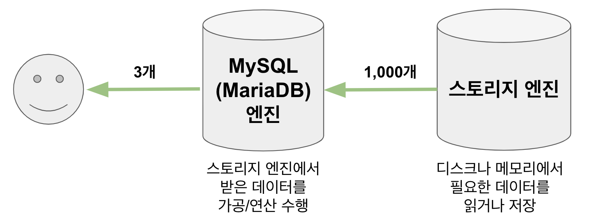
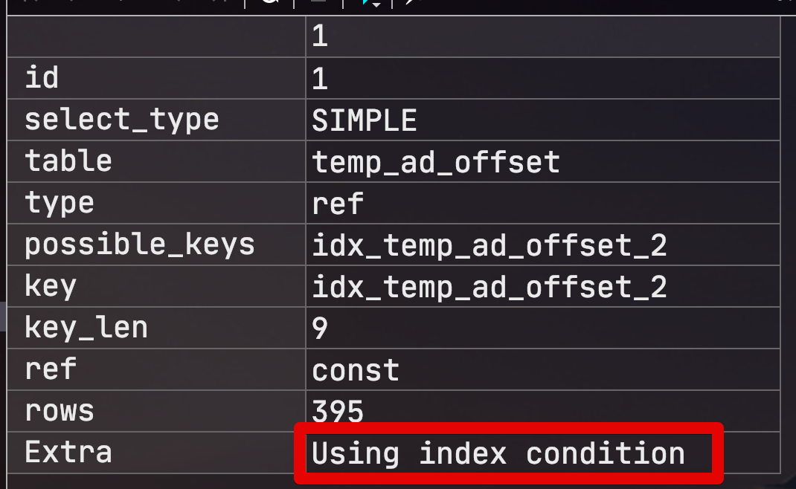

# MySQL (MariaDB) 인덱스 컨디션 푸시다운

팀에서 운영중이던 시스템에서 전반적인 성능 개선작업을 진행중 특정 쿼리의 실행 계획에서 ```Using index condition``` 값을 Extra 항목에서 보게 되었습니다.  
커버링 인덱스 (```Using index```) 와는 어떤점이 다른지 정리하던 중, 인덱스 컨디션 푸시 다운 (ICP: Index Condition Pushdown)에 대해 알게되어서 정리하게 되었습니다.  

> 커버링 인덱스도 정리중입니다.  
> 혹시 정리되기전에 알고싶으신분들은 [성동찬님이 작성하신 글](https://gywn.net/2012/04/mysql-covering-index/)을 참고해보세요.
  
MariaDB 5.3 이상 혹은 MySQL 5.6 버전 이상부터 도입된 인덱스 컨디션 푸시 다운에 대해 간단하게 테스트로 확인해보겠습니다.
  
> 최근에 MariaDB를 설치하신 분들은 다 10.x 버전을 쓰실거라 기본으로 해당 옵션이 ON되어있을겁니다.

## 1. 사전 작업

먼저 테스트로 사용할 MySQL (or MariaDB) 에서 옵티마이저 스위치 값을 조정하여 인덱스 컨디션 푸시다운 옵션을 off 하겠습니다.

```sql
set optimizer_switch = 'index_condition_pushdown=off';
```

정상적으로 되었는지 확인해봅니다.

```sql
show variables like 'optimizer_switch';
```

여러 옵션이 나오는데 아래와 같은 옵션이 있다면 정상적으로 off된 것입니다.

```sql
...index_condition_pushdown=off;...
```

그리고 테스트에 사용할 환경을 구성합니다.  
임의의 테스트 테이블(```temp_ad_offset```)을 만들고 대략 1300만건의 데이터를 넣어봅니다.  
그리고 사용할 인덱스(```customer_id, offset_type```) 역시 추가해줍니다.

```sql
ALTER TABLE temp_ad_offset ADD INDEX idx_temp_ad_offset_2 (customer_id, offset_type);
```

## 2. 테스트

인덱스 컨디션 푸시다운 옵션이 off된 상태(```index_condition_pushdown=off```) 에서 아래 쿼리의 실행 계획(```explain```) 을 확인해봅니다.

```sql
select *
from temp_ad_offset
where customer_id = 7 and offset_type like '%LIST';
```

실행 계획을 보시면 ```Using where```가 나타난 것을 알 수 있습니다.


어찌보면 이건 당연한거죠?  
  
MySQL (MariaDB) 에서는 ```like``` 사용시 와일드카드 (ex: ```like %abc```)로 시작되는 값에 대해서는 **인덱스가 적용되지 않기 때문**에, ```customer_id = 7``` 는 인덱스를 통해 걸러내고, ```offset_type like '%LIST'``` 에 대해서는 인덱스가 적용되지 않는 방식이니 걸러진 데이터를 **테이블에서 하나씩 비교했기** 때문입니다.  

> [참고](https://mariadb.com/kb/en/like/#optimizing-like)
  
좀 더 자세히 알아보기 위해 MySQL (MariaDB)의 쿼리 실행 구조를 확인해보겠습니다.  
  
MySQL (MariaDB) 는 내부적으로 MySQL (MariaDB) 엔진과 스토리지 엔진 (InnoDB/XtraDB) 로 나눠져 있습니다.  


  
스토리지 엔진이 넘겨 준 데이터 (인덱스를 사용해 걸러진 데이터) 중에서 MySQL (MariaDB) 엔진이 한번 더 걸러야되는 조건 (필터링 혹은 체크 조건)이 있다면 ```Using where```이 됩니다.  
  
즉, 이 쿼리에서 스토리지 엔진이 걸러 낼수 있는 조건은 ```customer_id=7``` 뿐이며 ```offset_type like '%LIST'``` 조건은 MySQL (MariaDB) 엔진에서 담당하여 ```customer_id=7``` 인 데이터들을 **테이블**에서 모두 찾아 ```offset_type like '%LIST'``` 조건을 비교하게 됩니다.  
  
헌데 여기서 한가지 의문이 생깁니다.  
  
이미 ```customer_id=7``` 을 통해 idx_temp_ad_offset_2 인덱스 필드 (customer_id, offset_type) 를 읽은 상태인데 **offset_type 비교를 테이블에서 굳이 할 필요가 있을까요**?  
  
이건 이유가 있습니다.  
MySQL 5.5 (MariaDB 5.2) 버전까지는 인덱스에 포함된 필드이지만, **인덱스 범위 조건으로 사용할 수 없는 경우**엔 스토리지 엔진으로 조건 자체를 **전달 조차 못했습니다**.  
스토리지 엔진에서 해당 필드에 대한 조건은 받은게 없으니 처리할수가 없는 것이죠.  
  
그 이후 버전 (MySQL 5.6 / MariaDB 5.3) 부터는 인덱스 범위 조건에 사용될 수 없어도, **인덱스에 포함된 필드**라면 스토리지 엔진으로 전달하여 **최대한 스토리지 엔진에서 걸러낸 데이터**만 MySQL (MariaDB) 엔진에만 전달되도록 개선되었습니다.  

> 인덱스 조건을 스토리지 엔진으로 넘겨주기 때문에 **인덱스 컨디션 푸시 다운**이란 이름이 되었습니다.

자 그럼 다시 ```index_condition_pushdown``` 옵션을 ```on``` 해보겠습니다.

```sql
set optimizer_switch = 'index_condition_pushdown=on';
```

그럼 아래와 같이 인덱스 컨디션 푸시 다운 잘 작동되는 것을 확인할 수 있습니다.



## 3. 결론

이미 높은 버전의 MySQL (MariaDB)를 사용하신다면 별다른 설정할게 없습니다.  
인덱스 컨디션 푸시 다운 옵션이 기본적으로 활성화되어있기 때문이죠.  
낮은 버전을 사용중이시라면 빨리 버전을 올리셔서 해당 옵션에 대해 체감해보시는게 좋을것 같습니다.

* [MySQL 공식 문서 - index-condition-pushdown-optimization](https://dev.mysql.com/doc/refman/5.6/en/index-condition-pushdown-optimization.html)