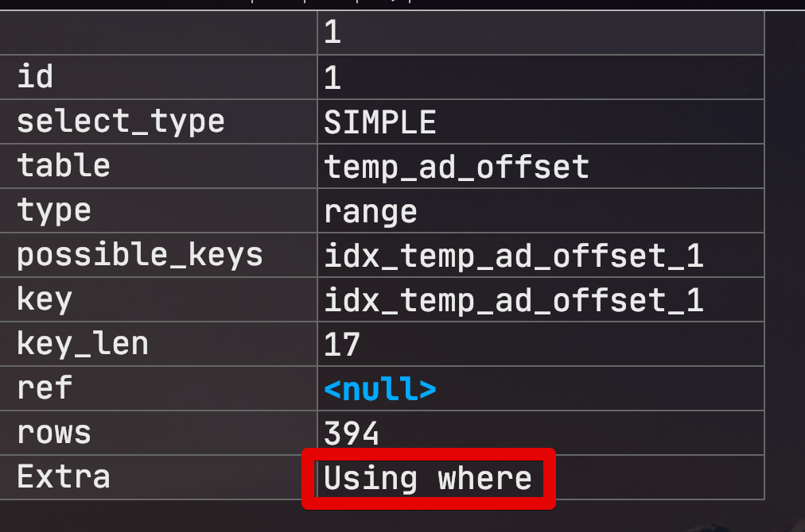

# MySQL (MariaDB) 인덱스 컨디션 푸시다운

MariaDB 5.3 이상 혹은 MySQL 5.6 버전 이상부터는 인덱스 컨디션 푸시 다운이라는 옵션이 도입 되었습니다.  
  
이 기능이 어떤 역할을 하는지 간단하게 테스트로 확인해보겠습니다.

## 1. 사전 작업

먼저 테스트로 사용할 MySQL (or MariaDB) 에서 옵티마이저 스위치 값을 조정하여 인덱스 컨디션 푸시다운 옵션을 off 하겠습니다.

>최근에 MariaDB를 설치하신 분들은 다 10.x 버전을 쓰실거라 기본 옵션이 인덱스 컨디션 푸시다운 옵션이 ON되어있을겁니다.

```sql
set optimizer_switch = 'index_condition_pushdown=off';
```

정상적으로 되었는지 확인해봅니다.

```sql
show variables like 'optimizer_switch';
```

여러 옵션이 나오는데 아래와 같은 옵션이 있다면 정상적으로 off된 것입니다.

```sql
...index_condition_pushdown=off;...
```

그리고 테스트에 사용할 환경을 구성합니다.  
임의의 테스트 테이블(```temp_ad_offset```)을 만들고 대략 1300만건의 데이터를 넣어봅니다.  
그리고 사용할 인덱스 역시 추가해줍니다.

```sql
ALTER TABLE temp_ad_offset ADD INDEX idx_temp_ad_offset_1 (customer_id, amount);
```


## 2. 테스트

인덱스 컨디션 푸시다운 옵션이 off된 상태(```index_condition_pushdown=off```) 에서 아래 쿼리의 실행 계획을 확인해봅니다.

```sql
select *
from temp_ad_offset
where customer_id = 7 and amount < 100000;
```



여기에서 ```Using where```는 InnoDB/XtraDB와 같은 **스토리지 엔진**이 읽어서 리턴해준 레코드가 인덱스를 사용할 수 없는 WHERE 조건에 일치하는지 검사하는 과정을 의미한다.  
이 쿼리에서는 ```amount < 100000``` 이 검사 과정에서 사용된 조건인 것이다.  


여기서 만약 ```customer_id=7```인 데이터가 10만건이나 되는데, 그 중 ```amount < 100000```인 데이터가 1개라면 어떻게 될까?  
9만9999건의 불필요한 레코드 읽기가 발생하게 될 것입니다.  


[](http://blog.naver.com/PostView.nhn?blogId=seuis398&logNo=70111486432)