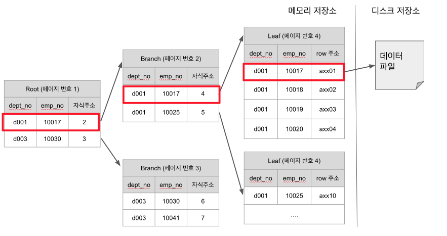
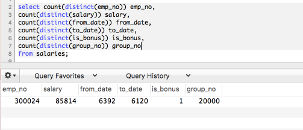

# MySQL 인덱스

MySQL 인덱스에 관해 정리를 하였습니다.  
MySQL을 잘 알아서 정리를 한것이 아니라, 잘 알고 싶어서 정리한 것이라 오류가 있을수도 있습니다.  

## 1. 인덱스란?

> 인덱스 == 정렬

인덱스는 결국 지정한 컬럼들을 기준으로 메모리 영역에 일종의 목차를 생성하는 것입니다.  
insert, update, delete (Command)의 성능을 희생하고 대신 **select (Query)의 성능을 향상**시킵니다.  
여기서 주의하실것은 update, delete 행위가 느린것이지, **update, delete를 하기 위해 해당 데이터를 조회하는것은 인덱스가 있으면 빠르게 조회**가 됩니다.  
인덱스가 없는 컬럼을 조건으로 update, delete를 하게 되면 굉장히 느려 많은 양의 데이터를 삭제 해야하는 상황에선 인덱스로 지정된 컬럼을 기준으로 진행하는것을 추천드립니다.



(B-Tree 인덱스 구조)  
  
위 인덱스 구조와 함께 몇가지 설명을 드리겠습니다.

* 인덱스 탐색은 Root -> Branch -> Leaf -> 디스크 저장소 순으로 진행됩니다.
  * 예를 들어 Branch (페이지번호 2) 는 dept_no가 d001이면서 emp_no가 10017 ~ 10024까지인 Leaf의 부모로 있습니다.
  * 즉, ```dept_no=d001 and emp_no=10018```로 조회하면 페이지 번호 4인 Leaf를 찾아 데이터파일의 주소를 불러와 반환하는 과정을 하게 됩니다. 

* 인덱스의 **두번째 컬럼은 첫 번째 컬럼에 의존해서 정렬**되어 있습니다.
  * 즉, 두번째 컬럼의 정렬은 첫번째 컬럼이 똑같은 열에서만 의미가 있습니다.
  * 만약 3번째, 4번째 인덱스 컬럼도 있다면 두번째 컬럼과 마찬가지로 3번째 컬럼은 2번째 컬럼에 의존하고, 4번째 컬럼은 3번째 컬럼에 의존하는 관계가 됩니다.

* 디스크에서 읽는 것은 메모리에서 읽는것보다 성능이 훨씬 떨어집니다.
  * 결국 인덱스 성능을 향상시킨다는 것은 **디스크 저장소에 얼마나 덜 접근**하게 만드느냐, 인덱스 **Root에서 Leaf까지 오고가는 횟수를 얼마나 줄이느냐**에 달려있습니다.

  
## 2. 인덱스 키 값의 크기

InnoDB (MySQL)은 디스크에 데이터를 저장하는 가장 기본 단위를 페이지라고 하며, **인덱스 역시 페이지 단위로 관리** 됩니다.  
(B-Tree 인덱스 구조에서 Root, Branch, Leaf 참고)  
  
**페이지는 16KB 로 크기가 고정**되어 있습니다.  
  
만약 본인이 설정한 인덱스 키의 크기가 16 Byte 라고 하고, 자식노드(Branch, Leaf)의 주소(위 인덱스 구조 그림 참고)가 담긴 크기가 12 Byte 정도로 잡으면, ```16*1024 / (16+12) = 585```로 인해 하나의 페이지에는 585개가 저장될 수 있습니다.  
여기서 인덱스 키가 32 Byte로 커지면 어떻게 될까요?  
 ```16*1024 / (32+12) = 372```로 되어 372개만 한 페이지에 저장할 수 있게 됩니다.  
  
조회 결과로 500개의 row를 읽을때 16byte일때는 1개의 페이지에서 다 조회가 되지만, 32byte일때는 2개의 페이지를 읽어야 하므로 이는 성능 저하가 발행하게 됩니다.  

> 인덱스의 키는 길면 길수록 성능상 이슈가 있습니다.

## 3. 인덱스 컬럼 기준

먼저 말씀드릴 것은 1개의 컬럼만 인덱스를 걸어야 한다면, 해당 컬럼은 **카디널리티(Cardinality)가 가장 높은 것**을 잡아야 한다는 점입니다.  

> 카디널리티(Cardinality)란 해당 컬럼의 **중복된 수치**를 나타냅니다.  
예를 들어 성별, 학년 등은 카디널리티가 낮다고 얘기합니다.  
반대로 주민등록번호, 계좌번호 등은 카디널리티가 높다고 얘기합니다.

인덱스로 최대한 효율을 뽑아내려면, **해당 인덱스로 많은 부분을 걸러내야 하기 때문**입니다.  
만약 성별을 인덱스로 잡는다면, 남/녀 중 하나를 선택하기 때문에 인덱스를 통해 50%밖에 걸러내지 못합니다.  
하지만 주민등록번호나 계좌번호 같은 경우엔 **인덱스를 통해 데이터의 대부분을 걸러내기 때문에** 빠르게 검색이 가능합니다.  
  
### 3-1. 여러 컬럼으로 인덱스 구성시 기준

자 그럼 여기서 궁금한 것이 있습니다.  
**여러 컬럼으로 인덱스를 잡는다면 어떤 순서로 인덱스를 구성**해야 할까요?  
카디널리티가 낮은->높은순으로 구성하는게 좋을까요?  
카디널리티가 높은->낮은순으로 구성하는게 좋을까요?  
실제 실험을 통해 확인해보겠습니다.  

> 테스트 환경은 AWS EC2 Ubuntu 16.04를 사용했습니다.  
최대한 극적인 비교를 위해 메모리는 1G, 디스크는 마그네틱(SSD X)을 사용했습니다.  

테이블 형태는 아래와 같습니다.

```sql
CREATE TABLE `salaries` (
  `id` bigint(20) unsigned NOT NULL AUTO_INCREMENT,
  `emp_no` int(11) NOT NULL,
  `salary` int(11) NOT NULL,
  `from_date` date NOT NULL,
  `to_date` date NOT NULL,
  `is_bonus` tinyint(1) unsigned zerofill DEFAULT NULL,
  `group_no` varchar(255) DEFAULT NULL,
  PRIMARY KEY (`id`)
) ENGINE=InnoDB DEFAULT CHARSET=utf8;
```

전체 Row는 약 **1700만건**으로 생성했습니다.  
각 컬럼의 카디널리티는 다음과 같습니다.



자 그럼 인덱스를 2가지 형태로 생성해보겠습니다.

```sql
CREATE INDEX IDX_SALARIES_INCREASE ON salaries 
(is_bonus, from_date, group_no);

CREATE INDEX IDX_SALARIES_DECREASE ON salaries 
(group_no, from_date, is_bonus);
```

첫번째 인덱스는 ```is_bonus, from_date, group_no```순으로 **카디널리티가 낮은순에서 높은순 (중복도가 높은 순에서 낮은순으로)** 으로,  
두번째 인덱스는 ```group_no, from_date, is_bonus```순으로 **카디널리티가 높은순에서 낮은순 (중복도가 낮은 순에서 높은순으로)** 으로 생성했습니다.  
  
사용한 쿼리는 다음과 같습니다.

```sql
select SQL_NO_CACHE * 
from salaries 
use index (IDX_SALARIES_INCREASE)
where from_date = '1998-03-30' 
and group_no in ('abcdefghijklmn10494','abcdefghijklmn3968', 'abcdefghijklmn11322', 'abcdefghijklmn13902', 'abcdefghijklmn100', 'abcdefghijklmn10406') 
and is_bonus = true;

select SQL_NO_CACHE * 
from salaries 
use index (IDX_SALARIES_DECREASE)
where from_date = '1998-03-30' 
and group_no in ('abcdefghijklmn10494','abcdefghijklmn3968', 'abcdefghijklmn11322', 'abcdefghijklmn13902', 'abcdefghijklmn100', 'abcdefghijklmn10406') 
and is_bonus = true;
```

옵티마이저가 인덱스를 자동 선택해버리니 Index Hint (```use index (IDX_SALARIES_INCREASE)```) 로 강제로 인덱스를 사용하도록 하였습니다.  
  
이 인덱스 2개를 총 10회로 테스트하였습니다.  
결과가 어떻게 될까요?  

|      | IDX_SALARIES_INCREASE | IDX_SALARIES_DECREASE |
|------|-----------------------|-----------------------|
|  1   | 110ms                 | 46.9ms                |
|  2   | 89.5ms                | 24.6ms                |
|  3   | 95.4ms                | 38.1ms                |
|  4   | 85.6ms                | 29.3ms                |
|  5   | 83.6ms                | 29.3ms                |
|  6   | 85.2ms                | 38.2ms                |
|  7   | 59.4ms                | 26.1ms                |
|  8   | 64.2ms                | 29.4ms                |
|  9   | 93.7ms                | 25.7ms                |
|  10  | 102ms                 | 35.4ms                |
|  평균 | 86.86ms               | 32.3ms                |

월등한 차이가 나진 않지만 10회만으로 비교는 가능한것 같습니다.  
즉, 여러 컬럼으로 인덱스를 잡는다면 **카디널리티가 높은순에서 낮은순으로 (```group_no, from_date, is_bonus```) 구성하는게 더 성능이 뛰어**납니다.

> 정확한 성능비교를 위해서는 MySQL 캐시 이외에 **OS 캐시도 비워야만** 했습니다.  
그래서 쿼리의 조건 (```group_no in ()```) 에 포함되는 값들을 하나씩 추가하면서 쿼리가 캐시 안되게 하여 비교하였습니다.

## 4. 인덱스 컬럼을 조회조건으로 사용시 주의 사항

* ```between```, ```like```, ```<```, ```>``` 등 범위 조건은 해당 컬럼은 인덱스를 타지만, 그 뒤 인덱스 컬럼들은 인덱스가 사용되지 않습니다.
  * 즉, ```group_no, from_date, is_bonus```으로 인덱스가 잡혀있는데 조회 쿼리를 ```where group_no=XX and is_bonus=YY and from_date > ZZ```등으로 잡으면 is_bonus는 인덱스가 사용되지 않습니다.
* 반대로 ```=```, ```in``` 은 다음 컬럼도 인덱스를 사용합니다.
  * ```in```은 결국 **```=```를 여러번 실행**시킨 것이기 때문입니다.
  * 단, ```in```은 인자값으로 상수가 포함되면 문제 없지만, **서브쿼리를 넣게되면 성능상 이슈가 발생**합니다.
  * ```in```의 인자로 **서브쿼리가 들어가면 서브쿼리의 외부가 먼저 실행**되고, ```in``` 은 체크조건으로 실행되기 때문입니다.

## 5. 인덱스가 효과 없는 상황

* ```AND```연산자는 각 조건들이 읽어와야할 ROW수를 줄이는 역할을 하지만, **```or``` 연산자는 비교해야할 ROW가 더 늘어나기 때문에 풀 테이블 스캔이 발생할 확률**이 높습니다.
  * ```WHERE``` 에서 ```OR```을 사용할때는 주의가 필요합니다. 
* 인덱스 컬럼을 가공한 상황
  * 인덱스는 가공된 데이터를 저장하고 있지 않습니다.
* ```null```을 비교값으로 사용한 경우


## 6. 인덱스 컬럼 순서와 조회 컬럼 순서

최근엔 이전과 같이 **꼭 인덱스 순서와 조회 순서를 지킬 필요는 없습니다**.  
단, 옵티마이저가 **조회 조건의 컬럼을 인덱스 컬럼 순서에 맞춰 재배열하는 과정이 추가**되기 때문에 특별한 이유가 없다면 인덱스 순서와 조회 컬럼 순서를 지켜주시면 더 좋을것 같습니다.  
(거의 차이가 없긴합니다.)


## 쿼리 프로파일링

```sql
show variables like 'profiling';
```

```sql
set profiling=1;
```

```sql
show profiles;

SELECT query_id, duration, state
FROM information_schema.profiling WHERE query_id = 쿼리ID;
```


## 참고

* [what-makes-a-good-mysql-index-part-2-cardinality](https://webmonkeyuk.wordpress.com/2010/09/27/what-makes-a-good-mysql-index-part-2-cardinality/)

* [mysql-indexes-multi-column-indexes-and-order-of-columns](http://www.ovaistariq.net/17/mysql-indexes-multi-column-indexes-and-order-of-columns/)

* [Real MySQL](http://egloos.zum.com/kwon37xi/v/4805538)

* [MySQL 5.0 한글 메뉴얼](http://www.mysqlkorea.com/sub.html?mcode=manual&scode=01&m_no=21436&cat1=7&cat2=0&cat3=0&lang=k)