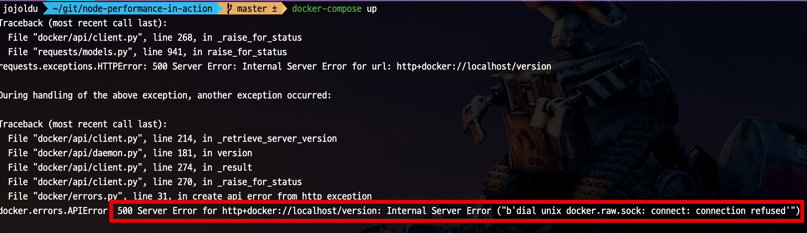
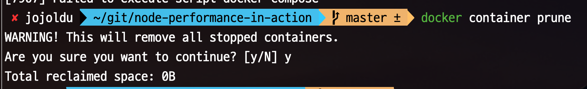
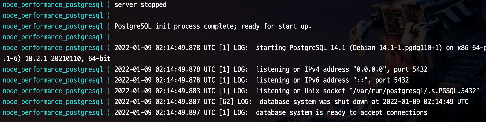

# Mac 업데이트 이후 Docker 실행 안될 경우

어느날 Mac 업데이트 이후부터, `docker-compose` 실행이 안되기 시작했습니다.  
아래와 같은 에러가 발생했는데요.



전체 에러로그는 다음과 같습니다.

```bash
Traceback (most recent call last):
  File "docker/api/client.py", line 268, in _raise_for_status
  File "requests/models.py", line 941, in raise_for_status
requests.exceptions.HTTPError: 500 Server Error: Internal Server Error for url: http+docker://localhost/version

During handling of the above exception, another exception occurred:

Traceback (most recent call last):
  File "docker/api/client.py", line 214, in _retrieve_server_version
  File "docker/api/daemon.py", line 181, in version
  File "docker/api/client.py", line 274, in _result
  File "docker/api/client.py", line 270, in _raise_for_status
  File "docker/errors.py", line 31, in create_api_error_from_http_exception
docker.errors.APIError: 500 Server Error for http+docker://localhost/version: Internal Server Error ("b'dial unix docker.raw.sock: connect: connection refused'")

During handling of the above exception, another exception occurred:

Traceback (most recent call last):
  File "docker-compose", line 3, in <module>
  File "compose/cli/main.py", line 81, in main
  File "compose/cli/main.py", line 200, in perform_command
  File "compose/cli/command.py", line 60, in project_from_options
  File "compose/cli/command.py", line 152, in get_project
  File "compose/cli/docker_client.py", line 41, in get_client
  File "compose/cli/docker_client.py", line 170, in docker_client
  File "docker/api/client.py", line 197, in __init__
  File "docker/api/client.py", line 221, in _retrieve_server_version
docker.errors.DockerException: Error while fetching server API version: 500 Server Error for http+docker://localhost/version: Internal Server Error ("b'dial unix docker.raw.sock: connect: connection refused'")
[7907] Failed to execute script docker-compose
```

관련해서 Docker Github 이슈를 찾던 중에 다음과 같은 이슈를 보게 되었습니다.

* [After installing MacOS version 10.15.6](https://github.com/docker/for-mac/issues/4934)

해당 이슈에서는 `prune` 를 통해 해결할 수 있다고 되어있는데요.  
  
여기서 `prune` 는 일종의 **Docker 오브젝트의 가비지 컬렉션** 입니다.  
  
로컬 개발 용으로 Docker를 오랜 시간 사용하게 되면 여러가지 오브젝트들이 시스템에 쌓이게 됩니다.  
Docker 컨테이너, 이미지, 볼륨등이 디스크를 차지하고, 네트워크도 많이 만들어지면 관리가 어려워집니다.  
  
이때 이 오브젝트들을 일일히 삭제하거나 통째로 날려버릴 수도 있습니다만, **사용하지 않는 오브젝트들을 파악해 빠르게 시스템 자원을 확보**하는 방법도 있습니다.  
이때 `prune` 커맨드가 이런 역할을 합니다.  
  
그래서 위와 같은 에러 발생후 아래 커맨드를 입력합니다.

```bash
docker container prune
```



그리고 다시 `docker-compose` 를 실행해보면?

```bash
docker-compose up
```

정상적으로 수행되는 것을 볼 수 있습니다.

