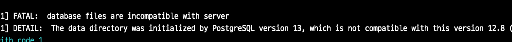
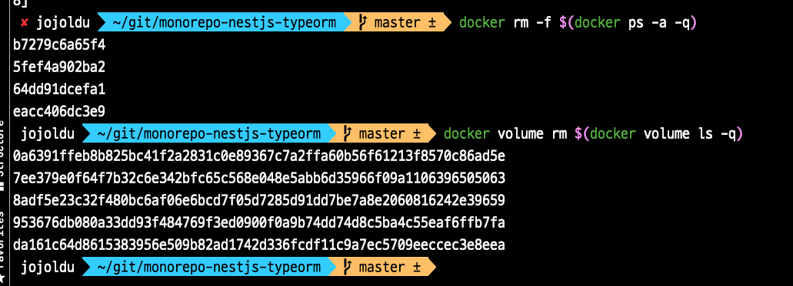

# docker-compose clean restart 하기

docker를 사용하다보면 한번씩 전체 컨테이너를 싹 다 지우고, 깔끔하게 다시 시작하고 싶을때가 있습니다.  



```bash
FATAL:  database files are incompatible with server
DETAIL:  The data directory was initialized by PostgreSQL version xx, which is not compatible with this version yy
```

> 언제든 삭제해도 되는 데이터가 아니라, 실제로 계속 저장이 되어야 한다면 Volume에 있는 모든 데이터들을 백업해놓고 진행하셔야 합니다.
> 지금 같은 경우는 테스트 코드로만 수행될 컨테이너들이라서 바로 삭제할 수 있었습니다.


먼저 기존의 도커 컨테이너를 모두 삭제합니다.  
(물론 실행중인 컨테이너가 있다면 `docker-compose down` 로 중지합니다.)  

```bash
docker rm -f $(docker ps -a -q)
```

그리고 기존의 모든 volume 을 지웁니다.

```bash
docker volume rm $(docker volume ls -q)
```




그리고 다시 docker compose를 다시 시작하면 됩니다.

```bash
docker-compose up
```
