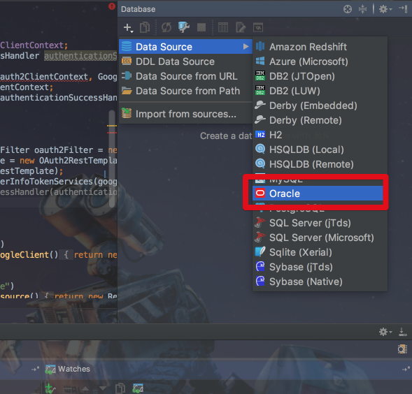
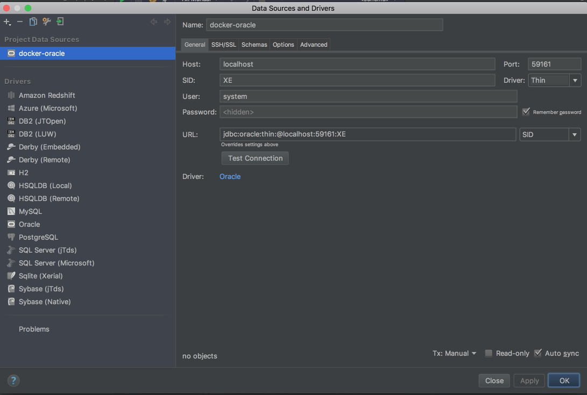
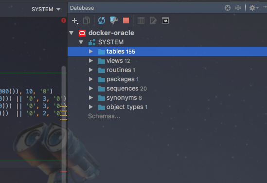

# 맥북에서 오라클 11g 데이터베이스 사용하기

보통 데이터베이스 관련 스터디나 학원의 경우 대부분이 오라클 데이터베이스를 기준으로 합니다.  
하지만 저처럼 맥북을 사용하시는 분들은 오라클을 사용할 수 없어 VM머신등을 사용하는등 어려움이 많습니다.  
(저같은 경우 패스트캠퍼스 SQL 튜닝 캠프에서 오라클 데이터베이스를 기준으로 하여 어쩔수없이 오라클을 사용하게 되었습니다 ㅠㅠ)
  
그럼 이제 진행하겠습니다.  

### 0. 도커 설치

도커를 기본적으로 알고 계시면 전혀 문제 될게 없지만, 모르신다 하여도 요즘은 도커 설치가 OS별로 아주 쉽게 되어있어 금방 하실수 있습니다.  
  
[Docker 사이트](https://www.docker.com/docker-mac)에 접속하여 Docker For Mac 설치파일을 받아 설치하시면 됩니다.

### 1. 도커 컨테이너 생성 및 실행

설치가 끝나시면 터미널을 열어 컨테이너를 받아야합니다.  
오라클 11g 이미지 중, wnameless/oracle-xe-11g 가 가장 인기가 많으니 해당 이미지를 받습니다.

```zsh
docker pull wnameless/oracle-xe-11g
```

그리고 컨테이너를 실행시키겠습니다.

```zsh
docker run -d -p 59160:22 -p 59161:1521 wnameless/oracle-xe-11g
```

여기서 ```-p 59161:1521``` 를 보시면 어디로 접근해야할지 명확히 알 수 있습니다.  
  
**오라클 도커 컨테이너의 1521 포트를 로컬호스트(localhost, 127.0.0.1)의 59161 포트로 연결**되었다는 것입니다.  
즉, 로컬호스트의 59161 포트로 접근하면 오라클 데이터베이스에 접근할 수 있게 됩니다.  


### 2. 오라클 클라이언트 프로그램으로 접근

올챙이나 기타 다른 오라클에 접근 가능한 맥북용 클라이언트를 사용하여 오라클 데이터베이스에 접근하겠습니다.  
저 같은 경우 IntelliJ의 데이터베이스 플러그인으로 접근하겠습니다.  
맥북 기준으로 ```command + shift + a```를 눌러 database를 검색합니다.  


제가 선택한 것과 동일한 아이콘을 클릭하시면 화면 우측에 데이터베이스 설정창이 등장합니다.  



클릭하시고 아래와 같이 필요한 값들을 입력합니다. 



미리 생성된 계정이 없으니 ```system / oracle``` (ID/PASSWORD)로 접근하였습니다.  
  
여기서 맥OS가 Sierra라면 **로케일을 찾을 수 없습니다** 라는 커넥션 실패 메세지를 받을 수 있습니다.  
그럴 경우 ```시스템 환경 설정 -> 언어 및 지역 -> 지역```으로 이동하셔서 **지역을 다른 지역으로 바꿨다가 다시 대한민국으로** 바꿔주시면 정상적으로 인식하게 됩니다.  



짠 정상적으로 접근 되어 쿼리를 사용할수 있음을 확인할 수 있습니다.  