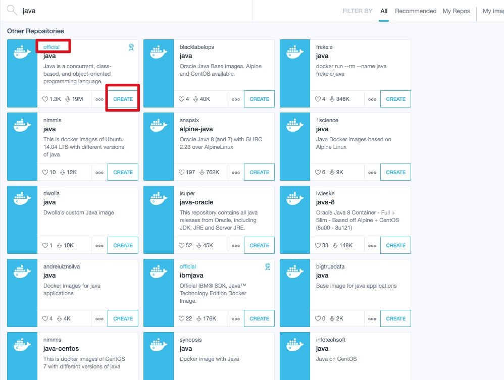
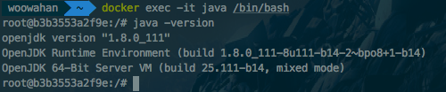
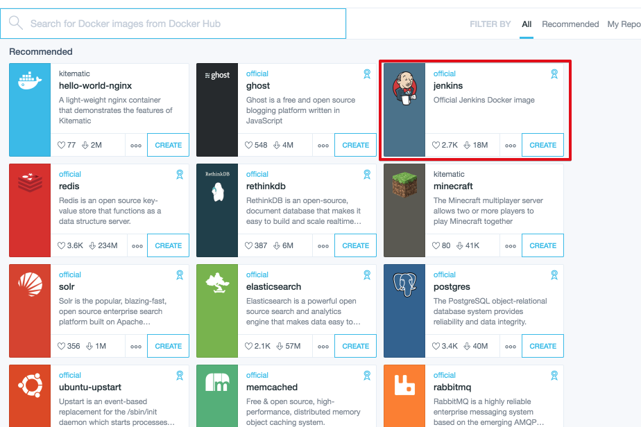
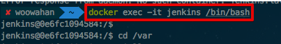
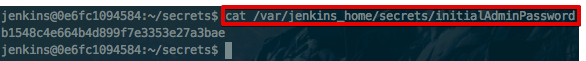
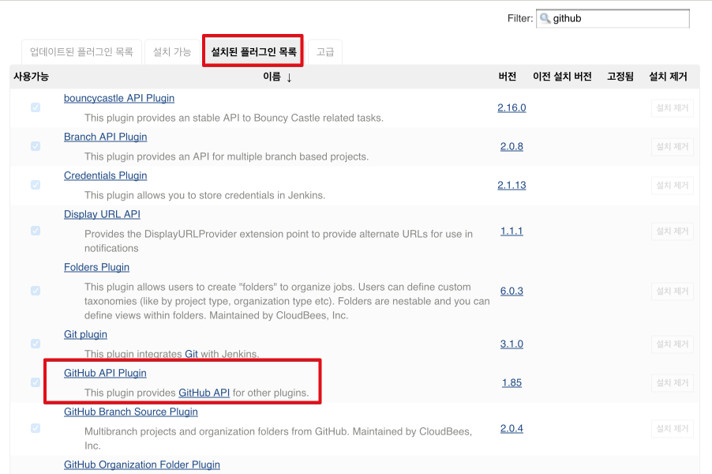
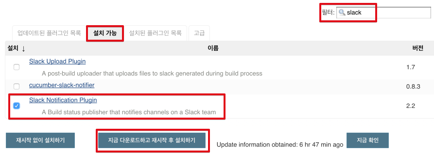

# 도커에 스프링부트 배포하기

## Java





## 젠킨스












설치해야할 플러그인 목록
* Git plugin
* Github plugin
* Gradle
젠킨스 java위치  

```
/usr/lib/jvm/java-8-openjdk-amd64
```

## 참고
* [iamkyu.com](http://www.iamkyu.com/121)