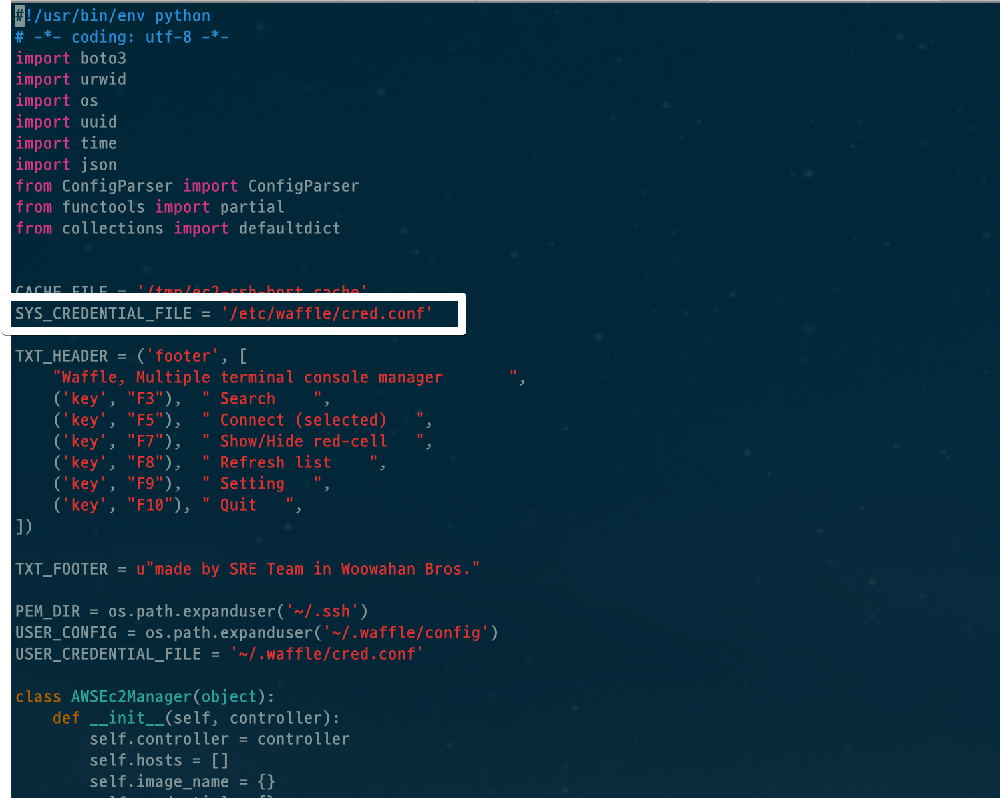
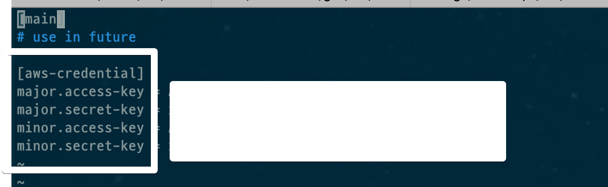

# ec2-gauza 최신 버전 반영

## 순서

### 1. clone

```bash
git clone https://github.com/leejaycoke/ec2-gazua.git
cd ./ec2-gazua/
pip install --user -r requirements.txt
```

```bash
vim $(which ec2-ssh)
```




```bash
vim /etc/waffle/cred.conf
```



키 복사

```
vim ~/.ec2-gz
```

```
name: minor

ssh-path: ~/.ssh

credential:
    aws_access_key_id: access-key
    aws_secret_access_key: secret-key
    region: ap-northeast-2

group-tag: Team
name-tag: Name

filter:
    connectable: true

connect-ip:
    default: private

key-file:
    default: auto

user:
    default: ec2-user
```


```bash
mkdir ~/.ssh
```

pem키 복사해서 만든다

```bash
vim ~/.bashrc
```

```bash
alias ec2-gz="python /home/사용자계정/ec2-gazua/ec2-gz.py"
```


## 로컬에서 pem키 복사하기 귀찮을때

```bash
cat pem키주소| pbcopy
```

```bash
cat > majorbilling.pem
```