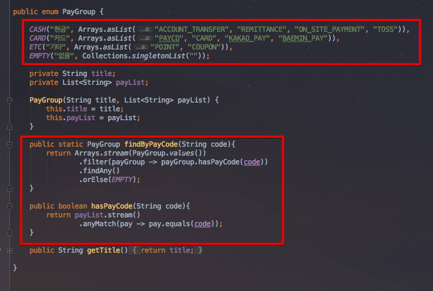

# Enum 활용기

안녕하세요? 우아한 형제들에서 결제/정산 시스템을 개발하고 있는 이동욱입니다.  
  
상반기 저희팀 최대 과제인 정산 플랫폼 개편을 진행함에 있어 저에게 큰 힘이 되었던 것이 Enum이였습니다.  
이미 기존의 많은 블로그와 책에서 Enum의 정의와 기본적인 내용을 소개했기 때문에, 여기서 소개드릴 것은 "**프로젝트를 진행함에 있어 발생한 문제를 Enum을 통해 어떻게 해결했는가**" 입니다.  
어마어마한 비법이나 신기술을 담은 내용은 없지만, 보시는 분들에게 조금이나마 도움이 되었으면 하는 바램입니다.

> 나 : 선임님 코드 "CARD"는 뭔가요?  

> 선임님 : 신용카드결제에요

> 나 : 선임님 여기서 "CARD"도 신용카드결제죠?

> 선임님 : 아 여기선 카드결제종류에요

> 나 : ...?


(여기에서 사용된 코드는 실제 회사에서 사용한 코드는 아니며, 포스팅을 위해 별도 샘플로 작성한 코드임을 먼저 말씀드립니다.)  

## 들어가며

개발을 진행할때 Enum을 통해 얻는 기본적인 장점들은 아래와 같습니다.  

* 문자열과 비교해, **IDE의 적극적인 지원**을 받을 수 있다.
  * 자동완성, 오타검증, 텍스트 리팩토링 등등
* 허용 가능한 값들을 제한할 수 있다.
* **리팩토링시 변경 범위가 최소화** 된다.
  * 내용의 추가가 필요하더라도, Enum 코드외에 수정할 필요가 없다.

이 장점들은 모든 언어들의 Enum에서 얻을 수 있는 공통된 장점입니다.  
하지만 Java의 Enum은 이보다 **더 많은 장점**을 갖고 있습니다.  
타 언어의 경우 Enum이 결국 int값이지만, Java의 Enum은 완전한 기능을 갖춘 **클래스**이기 때문입니다. (이팩티브 자바 규칙 30 참고)  
  
그 장점들을 예제로 하나씩 소개드리겠습니다.  

### 1. 데이터들 간의 연간관계 표현

여러 시스템과 연계되다보니 **동일한 데이터를 서로 다른 API 스펙에 맞춰** 전달받고 / 전달해야하는 경우가 있습니다.  
  
예를 들어 A API에서 상태값 "Y", "N"을 받아, 이를 B API에 "1", "0"으로 전달하고, C API에는 true, false로 전달하는 기능입니다.  
일반적으로는 if문과 메소드로 구현하게 됩니다.


기능상의 문제는 없지만, 보시는것처럼 메소드로 추출해도 코드가 깔끔하지 않습니다.  
추가로 "Y", "1", true는 모두 **같은 의미**라는 것을 코드만으로 파악하는게 쉽지 않습니다.  
  
그래서 이 부분을 Enum으로 추출해보겠습니다.


"Y", "1", true 가 한 묶음으로, "N", "0", false가 한 묶음이 된 것을 코드로 바로 확인할 수 있습니다.  
이를 사용하는 곳에서도 역시 깔끔하게 표현이 가능합니다.  


Response 타입을 ApiStatus enum으로 받게 되면 별도의 치환작업이 전혀 필요 없게 되며, 필요한 곳에서 getXXX 메소드를 호출만 하면 됩니다.  

### 2. 상태와 행위를 한곳에서 관리

서로 다른 계산식을 적용해야할 때가 있습니다.  
예를 들어 DB에 저장된 code의 값이 "CALC_A"일 경우엔 값 그대로, "CALC_B"일 경우엔 *10 한 값을, "CALC_C"일 경우엔 *3을 계산하여 전달해야만 합니다.  
가장 쉬운 해결 방법은 아래와 같이 static 메소드를 작성하여 필요한 곳에서 호출하는 방식일 것입니다.


이렇게 메소드로 분리하고 실제로 사용해보면, **코드는 코드대로** 조회하고 **계산은 또다시 별도의 클래스&메소드를 통해** 진행해야함을 알 수 있습니다.


이렇게 되면 문제가 있다고 생각합니다.  
LegacyCalcualtor의 메소드와 code는 **서로 관계가 있음을 코드로 표현**할 수가 없기 때문입니다.  
  
뽑아낸 Code에 따라 지정된 메소드에서만 계산되길 원하는데, 현재 상태로는 **강제할 수 있는 수단**이 없습니다.  
지금은 **문자열 인자를 받고, long 타입을 리턴하는 모든 메소드를 사용**할 수 있는 상태라서 히스토리를 모르는 분들이 실수할 여지가 다분합니다.  
  
"**특정 DB의 테이블에서 뽑은 값은 특정 메소드만 수행가능 하다.**"  
이 사실을 항상 문서와 구두로만 표현해야 하는게 올바른 방식일까 고민하였습니다.  
더불어 역활과 책임이라는 관점으로 봤을때, 위 메세지는 A Code에 책임이 있다고 생각하였습니다.  
그래서 이를 해결하기 위해 Enum을 활용하였습니다.  


보시는것처럼 각각의 code가 **본인만의 계산식**을 갖도록 지정하였습니다.  
(Java8이 업데이트 되면서 이제 인자값으로 함수를 사용할 수 있게 되었습니다.  
물론 내부적으로는 인터페이스를 사용하니 완전하다고 할순 없겠죠^^;)  
  
테이블에 선언할 경우에는 String이 아닌 enum을 선언하시면 됩니다.  


(ORM을 사용하는 경우입니다.)  
그리고 실제로 사용하는 곳에서도 이젠 직접 Code에게 계산을 요청하면 됩니다.


값(상태)과 메소드(행위)가 어느 것들과 관계가 있는지에 대해 더이상 다른 곳을 찾을 필요가 없게 되었습니다.  
코드내에 전부 표현되어 있고, enum type에게 직접 물어보면 되기 때문입니다.  
  
추가로 Java7 이하 버전을 사용하시는 분들은 **상수별 메소드 구현**을 사용하시면 됩니다.


Enum의 필드로 추상메소드를 선언하고, 이를 Enum의 상수들이 구현하도록 하면 Java8의 Function 인터페이스를 사용한 것과 동일한 효과를 보실수 있습니다.

### 3. 데이터 그룹관리

결제라는 데이터는 **결제 종류**와 **결제 수단**이라는 2가지 형태로 표현됩니다.  
예를 들어 신용카드 결제는 **신용카드 결제**라는 결제 수단이며, **카드**라는 결제 종류에 포함됩니다.  
이 **카드 결제**는 페이코, 카카오페이등 여러 결제 수단이 포함되어 있다고 생각하시면 될 것 같습니다.  
간단하게 그림으로 표현하자면 아래와 같습니다.


(배민에도 간편 결제인 배민페이가 있답니다.)  
  
결제된 건이 어떤 결제수단으로 진행됐으며, 해당 결제 방식이 **어느 결제 종류에 속하는지**를 확인할 수 있어야만 하는 조건이 있습니다.  
이를 해결하는 가장 쉬운 방법은 (또!?) 문자열과 메소드, if문으로 구현하는 것입니다.


여기에서도 여러 문제가 있다고 생각하였습니다.  
일단 가독성이 정말 좋지 못하며, 예측불가능하며, 둘의 관계를 확인하기가 정말 어렵습니다.  
지금이야 간단한 샘플코드로 구성되어 있어 위의 단점들이 보이지 않지만 실제 프로젝트 코드상에서 보았을때는 코드의 흐름이 계속해서 끊기는 것을 알 수 있었습니다.  
추가로! **결제종류에 따라 추가 기능**이 필요할 경우, 또다시 상태와 행위가 분리된 현상이 발생할수 있습니다.
그래서 이런 데이터들의 그룹을 Enum으로 추출해보겠습니다.



**Java의 Enum은 결국 클래스**인 점을 이용하여, Enum의 상수에 결제종류 문자열 리스트를 갖도록 하였습니다.  
각 Enum 상수들은 본인들이 갖고 있는 문자열들을 확인하여 문자열 인자값이 어느 Enum 상수에 포함되어있는지 확인할 수 있게 되었습니다.

```java
public static PayGroup findByPayCode(String code){
    return 
            //PayGroup의 Enum 상수들을 순회하며
            Arrays.stream(PayGroup.values())
            //payCode를 갖고 있는게 있는지 확인합니다.
            .filter(payGroup -> payGroup.hasPayCode(code))
            .findAny()
            .orElse(EMPTY);
}

public boolean hasPayCode(String code){
    return payList.stream()
            .anyMatch(pay -> pay.equals(code));
}
``` 

여기까지 코드에서도 문제가 조금 있었습니다.  
결제수단이 **문자열**인 것입니다.  
DB 테이블의 결제수단 컬럼에 잘못된 값을 등록하거나,
파라미터로 전달된 값이 잘못되었을 경우가 있을 때 전혀 관리가 안됩니다.  
그래서 이 경제수단 역시 Enum으로 전환하였습니다.  


### 4. Layer별 분리된 관리 포인트 - Enum Mapper

정산 플랫폼은 수많은 카테고리가 존재하기 때문에 UI에서 select box로 표현되는 부분이 많습니다.  

별도의 Bean으로 관리 포인트를 만들어두면 


## 마무리

Enum은 정말 강력한 기능입니다.  
A라는 상황에서 "a"와 B라는 상황에서 "a"는 똑같은 "a"지만 전혀 다른 의미입니다.  
문자열은 이를 표현할 수 없지만, Enum은 **문맥(Context)을 담을 수 있습니다**.  
  
문맥을 코드로 표현할 수 있다는 것이 중요한것 같습니다.  
실행되는 코드를 이해하기 위해 **추가로 무언가를 찾아보는 행위를 최소화** 할 수 있기 때문입니다.   
이 코드의 의미와 용도를 파악하기 위해 컨플루언스를 검색하고, 엑셀과 워드 파일을 찾고, 레거시 테이블을 Join & Group by 하고, PHP 코드를 다시 찾는 과정이 정말 정말 **비효율적**이라고 생각하였습니다.  
(역설적이게도 해당 시스템을 가장 잘아시는분이 문서를 작성할 수록, **당연한 내용의 범위가 넓어** 누락되는 내용이 많아지고 이 과정이 더 많아지는것 같습니다.)  
  


