# Java Enum 활용기

안녕하세요? 우아한 형제들에서 결제/정산 시스템을 개발하고 있는 이동욱입니다.  
  
이번 사내 블로그 포스팅 주제로 저는 Java Enum 활용 경험을 선택하였습니다.   
이전에 개인 블로그에 Enum에 관해 알게 된 점들을 정리했음에도 선택한 이유는 제가 **Enum을 통해 많은 도움**을 얻었기 때문입니다.  
상반기 팀 최대 과제인 신규 정산 플랫폼을 개발하면서 Enum이 정말 많은 문제를 해결해주고 예방해주었습니다.  
그래서 새로운 주제, 신기술보다 기본적이지만 실질적으로 저에게 도움을 주었던 Enum을 다시 정리하게 되었습니다.  
  
이미 기존의 많은 블로그와 책에서 Enum의 정의와 기본적인 내용을 소개했기 때문에 그런 부분들은 생략하고, 여기서 소개드릴 것은 "**프로젝트를 진행함에 있어 발생한 문제를 Enum을 통해 어떻게 해결했는가**" 입니다.  
"얘는 이런 것도 몰랐구나" 라는 넓은 마음으로 봐주시면 될 것 같습니다.


(뉴비는 아니지만 **뉴비와 같은 마음과 실력**으로 갑니다!)  
  
  
여기에서 사용된 코드는 실제 회사에서 사용한 코드는 아니며, 포스팅을 위해 최대한 유사하게 만들어진 별도의 [샘플 코드](https://github.com/jojoldu/blog-code/tree/master/enum-settler)임을 먼저 말씀드립니다.  

## 들어가며

개발을 진행할때 Enum을 통해 얻는 기본적인 장점들은 아래와 같습니다.  

* 문자열과 비교해, **IDE의 적극적인 지원**을 받을 수 있습니다.
  * 자동완성, 오타검증, 텍스트 리팩토링 등등
* 허용 가능한 값들을 제한할 수 있습니다.
* **리팩토링시 변경 범위가 최소화** 됩니다.
  * 내용의 추가가 필요하더라도, Enum 코드외에 수정할 필요가 없습니다.

이 장점들은 모든 언어들의 Enum에서 얻을 수 있는 공통된 장점입니다.  
하지만 Java의 Enum은 이보다 **더 많은 장점**을 갖고 있습니다.  
C/C++의 경우 Enum이 결국 int값이지만, Java의 Enum은 완전한 기능을 갖춘 **클래스**이기 때문입니다.  
(이 글의 제목이 Enum 활용기가 아닌, **Java Enum** 활용기인것도 이 때문입니다.)  
  
예제로 그 장점들을 하나씩 소개드리겠습니다.  

> 이펙티브 자바의 Enum 파트를 보시면 더 다양하고 깊은 사례를 보실 수 있으십니다.

### 1. 데이터들 간의 연간관계 표현

매일 배치를 돌며 하나의 테이블(테이블명 : origin)에 있는 내용을 2개의 테이블(테이블명 : table1, table2)에 등록하는 기능이 있습니다.  
  
문제가 됐던 것은 origin 테이블의 값은 "Y", "N"인데, table1, table2는 "1"/"0", true/false 형태인 것입니다.  
그러다보니 구 정산 시스템에선 이를 분류하는 메소드를 만들어 사용해왔습니다.

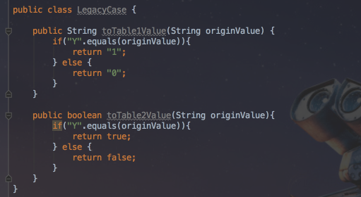

기능상의 문제는 없지만, 몇가지 문제가 있었습니다.  

* "Y", "1", true는 **모두 같은 의미**라는 것을 알 수 없습니다.
  * Y란 값은 "1"이 될 수도 있고, true가 될 수도 있다는 것을 확인하려면 항상 위에서 선언된 클래스와 메소드를 찾아야만 합니다.
* 불필요한 코드량이 많습니다.
  * Y, N 외에 R, S 등의 추가 값이 필요한 경우 **if문을 포함한 메소드 단위**로 코드가 증가하게 됩니다.
  * 동일한 타입의 값이 추가되는것에 비해 너무 많은 **반복성 코드가 발생**하게 됩니다.

그래서 이 부분을 Enum으로 추출했습니다.

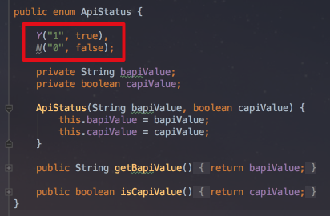

"Y", "1", true 가 한 묶음으로, "N", "0", false가 한 묶음이 된 것을 코드로 바로 확인할 수 있습니다.  
또한 추가 타입이 필요한 경우에도 Enum 상수와 get메소드만 추가하면 됩니다.  
(만약 lombok의 ```@Getter```을 사용하신다면 Enum의 get 메소드까지 제거가 되어 더욱 깔끔한 코드가 됩니다.)  
이를 사용하는 곳에서도 역시 깔끔하게 표현이 가능합니다.  

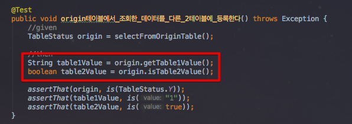

TableStatus라는 Enum 타입을 전달받기만 한다면, 그에 맞춘 table1, table2값을 바로 얻을 수 있는 것을 확인할 수 있습니다.

### 2. 상태와 행위를 한곳에서 관리

서로 다른 계산식을 적용해야할 때가 있습니다.  
예를 들어 DB에 저장된 code의 값이 "CALC_A"일 경우엔 값 그대로, "CALC_B"일 경우엔 *10 한 값을, "CALC_C"일 경우엔 *3을 계산하여 전달해야만 합니다.  
가장 쉬운 해결 방법은 아래와 같이 static 메소드를 작성하여 필요한 곳에서 호출하는 방식일 것입니다.

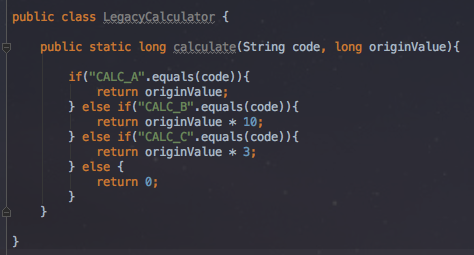

이렇게 메소드로 분리하고 실제로 사용해보면, **코드는 코드대로 조회**하고 **계산은 별도의 클래스&메소드를 통해** 진행해야함을 알 수 있습니다.

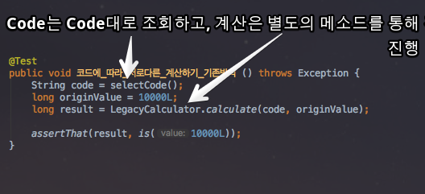

이 상황에 문제가 있다고 생각했습니다.  
LegacyCalcualtor의 메소드와 code는 **서로 관계가 있음을 코드로 표현**할 수가 없기 때문입니다.  
  
뽑아낸 **Code에 따라 지정된 메소드에서만** 계산되길 원하는데, 현재 상태로는 **강제할 수 있는 수단**이 없습니다.  
지금은 **문자열 인자를 받고, long 타입을 리턴하는 모든 메소드를 사용**할 수 있는 상태라서 히스토리를 모르는 분(저와 같은^^;)들은 실수할 확률이 높습니다.  

* 똑같은 기능을 하는 메소드를 **중복 생성**할 수 있습니다.
  * 히스토리가 관리 안된 상태에서 신규화면이 추가되어야 할 경우 계산 메소드가 있다는 것을 몰라 다시 만드는 경우가 빈번합니다.
  * 만약 기존 화면의 계산 로직이 변경 될 경우, 신규 인력은 2개의 메소드의 로직을 다 변경해야하는지, 해당 화면만 변경해야하는지 알 수 없습니다.
  * 관리 포인트가 증가할 확률이 매우 높습니다.
* 계산 메소드를 누락할 수 있습니다.  
  * 결국 문자열과 메소드로 분리 되어 있기 때문에 이 계산 메소드를 써야함을 알 수 없어 새로운 기능 생성시 계산 메소드 호출이 누락될 수 있습니다.

"**DB의 테이블에서 뽑은 특정 값은 지정된 메소드와 관계가 있다.**"  
이 사실을 항상 문서와 구두로만 표현해야 하는게 올바른 방식일까 고민하였습니다.  
더불어 역활과 책임이라는 관점으로 봤을때, 위 메세지는 Code에 책임이 있다고 생각하였습니다.  
그래서 이를 해결하기 위해 Enum을 활용하였습니다.  


보시는것처럼 각각의 Code가 **본인만의 계산식**을 갖도록 지정하였습니다.  
(Java8이 업데이트 되면서 이제 인자값으로 함수를 사용할 수 있게 되었습니다.  
물론 내부적으로는 인터페이스를 사용하니 완전하다고 할순 없겠죠^^;)  
  
Entity 클래스에 선언하실 경우에는 String이 아닌 enum을 선언하시면 됩니다.  

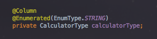

> JPA를 사용하시는 경우 위 처럼 ```@Enumerated```를 선언하시면 Enum 필드가 테이블에 저장시 숫자형인 1,2,3이 아닌, **Enum의 name**이 저장됩니다.  
여기서는 ```CALC_A```, ```CALC_B```, ```CALC_C```등이 저장된다고 생각하시면 됩니다.  
ordinal(숫자형)을 사용하게 되면 Enum 상수 값들 사이에 하나가 추가 될 경우 (ex: CALC_B_2) 3이란 ordinal은 CALC_C가 아닌 CALC_B_2를 가리키게 됩니다.  
전체 값이 변경되버리는 위험한 일이기 때문에 Enum에선 ```@Enumerated```를 함께 사용하시는걸 추천드립니다.  
(김영한 선임님의 [JPA 책](http://www.yes24.com/24/goods/19040233?scode=032&OzSrank=1) 4.7.2절을 참고하시면 좀 더 자세히 확인하실 수 있습니다.)  
  
그리고 실제로 사용하는 곳에서도 이젠 직접 Code에게 계산을 요청하면 됩니다.

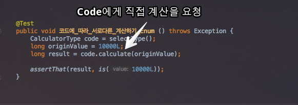

값(상태)과 메소드(행위)가 어떤 관계가 있는지에 대해 더이상 다른 곳을 찾을 필요가 없게 되었습니다.  
코드내에 전부 표현되어 있고, **Enum 상수에게 직접** 물어보면 되기 때문입니다.  
  
추가로 Java7 이하 버전을 사용하시는 분들은 추상메소드를 활용하여 **상수별 메소드 구현**을 하시면 됩니다.

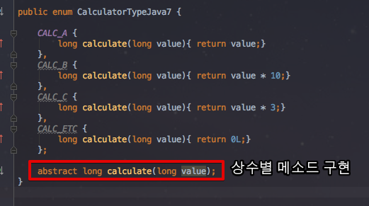

Enum의 필드로 추상메소드를 선언하고, 이를 상수들이 구현하도록 하면 Java8의 Function 인터페이스를 사용한 것과 동일한 효과를 보실수 있습니다.

### 3. 데이터 그룹관리

결제라는 데이터는 **결제 종류**와 **결제 수단**이라는 2가지 형태로 표현됩니다.  
예를 들어 신용카드 결제는 **신용카드 결제**라는 결제 수단이며, **카드**라는 결제 종류에 포함됩니다.  
이 **카드 결제**는 페이코, 카카오페이등 여러 결제 수단이 포함되어 있다고 생각하시면 될 것 같습니다.  
간단하게 그림으로 표현하자면 아래와 같습니다.

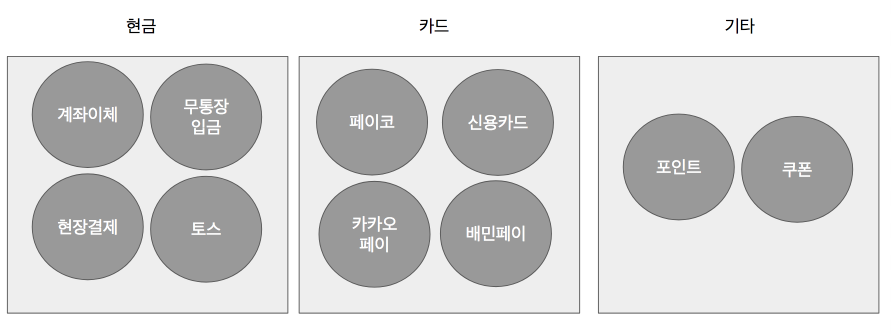

(배민에도 간편 결제인 배민페이가 있답니다.)  
  
결제된 건이 어떤 결제수단으로 진행됐으며, 해당 결제 방식이 **어느 결제 종류에 속하는지**를 확인할 수 있어야만 하는 조건이 있습니다.  
이를 해결하는 가장 쉬운 방법은 (또!?) 문자열과 메소드, if문으로 구현하는 것입니다.

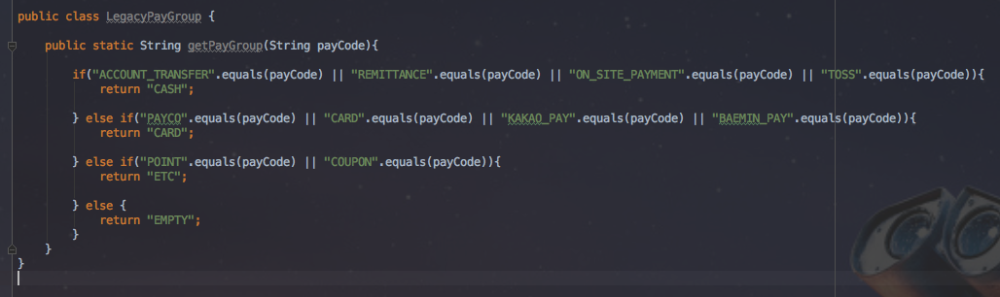

여기에서도 여러 문제가 있다고 생각하였습니다.  

* **둘의 관계를 파악하기가 어렵습니다**.
  * 위 메소드는 포함관계를 나타내는 것일까요? 아니면 단순한 대체값을 리턴한것일까요? 
  * 현재는 결제종류가 결제수단을 **포함**하고 있는 관계인데, 메소드만으로 표현이 불가능합니다.
* 입력값과 결과값이 **예측 불가능**합니다.
  * **결제 수단의 범위를 지정할수 없어서** 문자열이면 전부 파라미터로 전달 될 수 있습니다.
  * 마찬가지로 결과를 받는 쪽에서도 **문자열**을 받기 때문에 결제종류로 지정된 값만 받을 수 있도록 검증코드가 필요하게 됩니다.
* 그룹별 기능을 추가하기가 어렵습니다.
  * 결제 종류에 따라 추가 기능이 필요할 경우 현재 상태라면 어떻게 구현 할수 있을까요?
  * **또다시 결제종류에 따른 if문으로 메소드를 실행**하는 코드를 작성해야 할까요? 

그래서 이를 Enum으로 전환하였습니다.

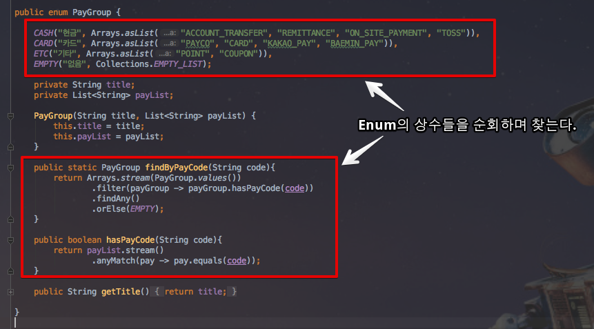

**Java의 Enum은 결국 클래스**인 점을 이용하여, Enum의 상수에 결제종류 문자열 리스트를 갖도록 하였습니다.  
각 Enum 상수들은 **본인들이 갖고 있는 문자열들을 확인**하여 문자열 인자값이 어느 Enum 상수에 포함되어있는지 확인할 수 있게 되었습니다.

```java
public static PayGroup findByPayCode(String code){
    return 
            //PayGroup의 Enum 상수들을 순회하며
            Arrays.stream(PayGroup.values())
            //payCode를 갖고 있는게 있는지 확인합니다.
            .filter(payGroup -> payGroup.hasPayCode(code))
            .findAny()
            .orElse(EMPTY);
}

public boolean hasPayCode(String code){
    return payList.stream()
            .anyMatch(pay -> pay.equals(code));
}
``` 

관리 주체를 ```PayGroup```에게 준 결과로, 이젠 ```PayGroup```에게 **직접 물어보면** 됩니다.  

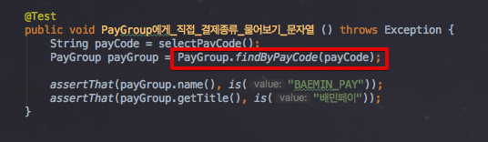

여기까지 진행 후 코드를 해결하지 못한 문제가 하나 남아 있었습니다.  
결제수단이 **문자열**인 것입니다.  
DB 테이블의 결제수단 컬럼에 잘못된 값을 등록하거나,  
파라미터로 전달된 값이 잘못되었을 경우가 있을 때 전혀 관리가 안됩니다.  
그래서 이 결제수단 역시 Enum으로 전환하였습니다.  

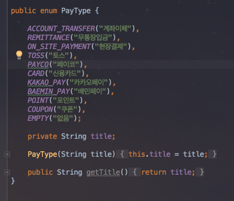

이렇게 Enum으로 결제종류를 만들고, ```PayGroup```에서 이를 사용하도록 하겠습니다.

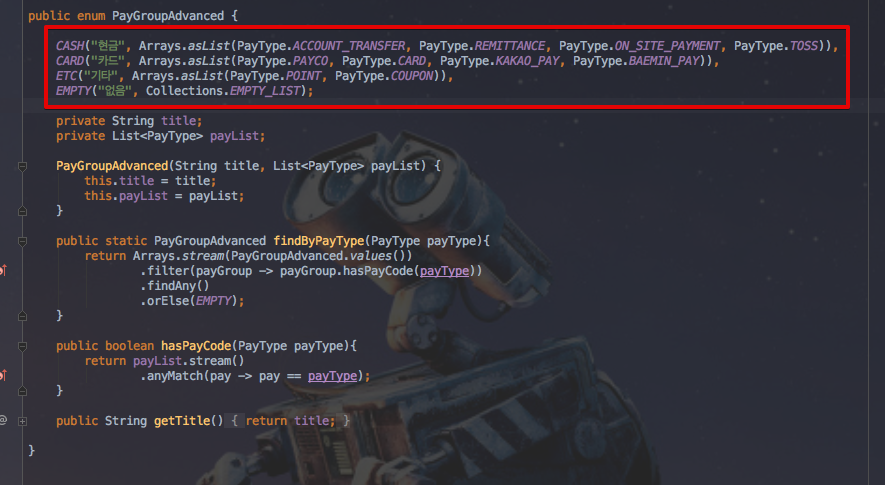

그리고 이를 사용하는 코드가 아래와 같이 변경되었습니다.

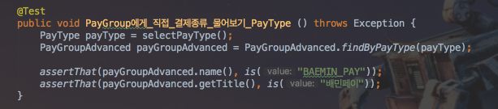

DB 혹은 API에서 ```PayType```으로 데이터를 받아, **타입 안전성**까지 확보하여 ```PayGroup``` 관련된 처리를 진행할 수 있게 되었습니다.  

### 4. 관리 주체를 DB에서 객체로

정산 플랫폼은 수많은 카테고리가 존재하기 때문에 UI에서 select box로 표현되는 부분이 많습니다.  
구 정산 시스템에선 카테고리 관련 데이터를 DB에서 관리하고 있었습니다.  

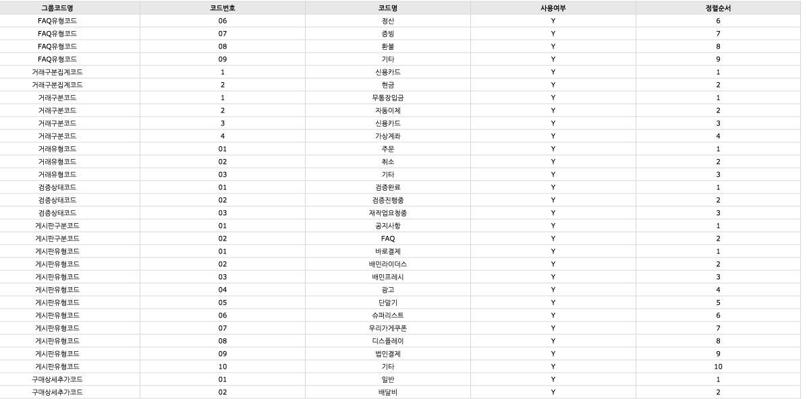

(기존에 관리되던 코드테이블)  
  

코드 테이블을 별도로 두고 이를 조회하여 사용하다보니, 계속해서 문제가 발생했습니다.

* 코드명만 봐서는 무엇을 나타내는지 알 수가 없었습니다.
  * 처음 프로젝트에 투입되는데, 모든 메소드들이 ```01```, ```1``` 등등의 매직넘버를 if 조건의 기준으로 되어있다고 상상해보겠습니다. 
  * ```01```이란 코드가 뭔지 알기 위해서 서버코드에서 실행되는 코드를 보고 Grp_cd를 찾아내고, DB에서 조회해야만 했습니다.
  * 문서화가 되어있다 하더라도, 문서 업데이트가 잘되어있는지 확신할 수 없기에 DB를 다시 찾아봐야했습니다.
* 항상 코드 테이블 조회 쿼리가 실행되어야만 했습니다.
  * 특별히 조회를 하지 않음에도 UI를 그리기 위해 항상 코드 테이블을 조회해야만 했습니다.
* 카테고리 코드를 기반으로한 **서비스 로직을 추가할 때** 그 위치가 애매했습니다. 
  * 1 ~ 3 사례들과 비슷한 경우인데, 해당 코드에 따라 수행되야 하는 기능이 있을 경우 메소드의 위치는 ```Service``` 혹은 ```유틸 클래스```가 될 수 밖에 없었습니다. 

특히나 카테고리의 경우 **6개월에 1~2개가 추가될까말까**한 영역인데 굳이 테이블로 관리하는 것은 장점보다 단점이 더 많다고 생각하였습니다.  
(물론 CI가 구축되어 **하루에도 몇번씩 배포할 수 있는 상황**이기에 가능하다고 생각합니다.)  
카테고리성 데이터를 Enum으로 전환하고, 팩토리와 인터페이스 타입을 선언하여 일관된 방식으로 관리되고 사용할 수 있도록 진행하게 되었습니다.  
  
Enum을 바로 JSON으로 리턴하게 되면 **상수 name만 출력**이 됩니다.  
저에게 필요했던건 **DB의 컬럼값으로 사용될 Enum의 name과 View Layer에서 출력될 title** 2개의 값이기 때문에 Enum을 인스턴스로 생성하기 위한 클래스 선언이 필요했습니다.  

먼저 클래스의 생성자로 일관된 타입을 받기 위해 인터페이스를 하나 생성하였습니다.  


값을 담을 클래스(VO)는 이 인터페이스를 생성자 인자로 받아 인스턴스를 생성하도록 합니다.  

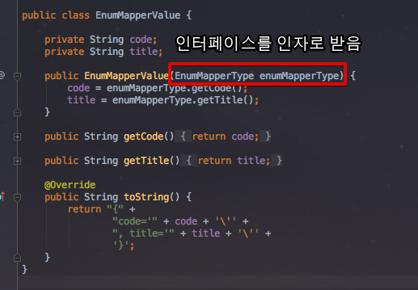

Enum은 미리 선언한 인터페이스를 구현(```implements```)만 하면 됩니다.

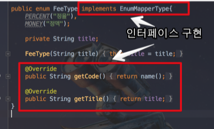

이젠 필요한 곳에서 Enum을 Value 클래스로 변환한 후, 전달하기만 하면 됩니다.  

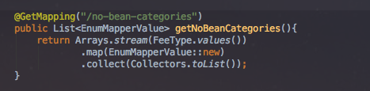

원했던대로, JSON 결과가 나오는 것을 확인할 수 있습니다.

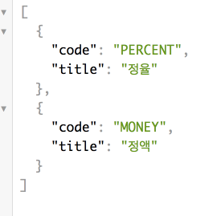

Enum을 중심으로 해서 View Layer와 Application, DB가 하나로 관리되도록 변경은 되었지만 한가지 아쉬운 점이 발견되었습니다.  
필요할 때마다 Enum.values를 통해 **Value 인스턴스를 생성하는 과정이 반복되는 것** 이였습니다.  
런타임에 Enum의 상수들이 변경될 일이 없기에, 관리 대상인 Enum들은 미리 Bean에 등록하여 사용하도록 변경해보았습니다.  
Enum Value들을 담을 팩토리 클래스를 생성하고,  

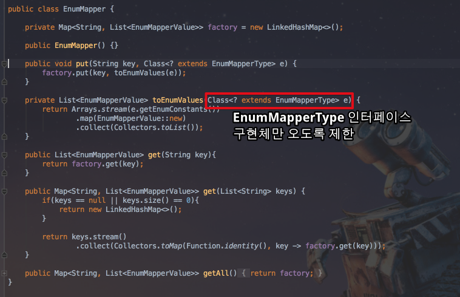

이를 Bean으로 등록하였습니다.

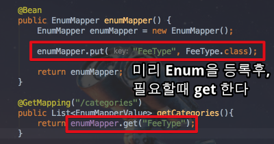

View Layer에서 사용하길 원하는 Enum 타입들은 ```EnumMapper```라는 Bean에 등록하기만 하면 됩니다.  

## 마무리

Enum을 적극적으로 활용하면서 많은 장점을 얻게 되었습니다.  
  
도대체 이 코드가 어디에서 쓰이는 것인지,  
이 필드에는 어떤 값들만 허용 가능한 것인지,  
A값과 B값이 실제로는 동일한 것인지, 전혀 다른 의미인지,  
이 코드를 사용하기 위해 추가로 필요한 메소드들은 무엇이고, 변경되면 어디까지 변경해야하는 것인지 등등  
불확실한 것들이 너무 많았던 상황에서 Enum을 통해 **확실한 부분과 불확실한 부분을 분리**할 수 있었습니다.  
  
특히 가장 실감했던 장점은 **문맥(Context)을 담는다는 것**이였습니다.   
A라는 상황에서 "a"와 B라는 상황에서 "a"는 똑같은 문자열 "a"지만 전혀 다른 의미입니다.  
문자열은 이를 표현할 수 없지만, **Enum은 이를 표현할 수 있었습니다**.  
이로 인해 실행되는 코드를 이해하기 위해 **추가로 무언가를 찾아보는 행위를 최소화** 할 수 있게 되었습니다.   
이 코드의 의미와 용도를 파악하기 위해 컨플루언스를 검색하고, 엑셀과 워드 파일을 찾고, 레거시 테이블을 Join & Group by 하고, PHP 코드를 다시 찾는 과정이 정말 정말 **비효율적**이였습니다.  
(역설적이게도 해당 시스템을 가장 잘아시는분이 문서를 작성할수록, **당연한 내용의 범위가 넓어** 누락되는 내용이 많아지고 위 과정이 더 많아지게 되었습니다.)  
  
Enum을 사용하는데 있어 가장 큰 허들은 "**변경이 어렵다**"란 의견입니다.  
코드를 변경후 재배포를 하는 것보다, 관리자 페이지에서 관리자가 직접 변경하는 것이 훨씬 편리할 수도 있겠다고 생각합니다.   
하지만 생각해보면 우리가 관리하는 이 **코드 테이블은 과연 얼마나 자주 변경**될까요?  

* 한번 생성된 코드들은 얼마나 많은 테이블에서 사용되시나요?
  * 사용되는 테이블이 많아 변경하게 되면 **관련된 테이블 데이터를 전부다 변경**해야 하진 않으신가요?  
  * 한번 생성된 코드테이블의 코드들을 변경할 일이 자주 있으셨나요?
* 추가되는 코드는 한달에 몇번이나 발생하시나요? 
  * 1년에 몇번 발생하시나요? 
  * 매일 발생하시나요?  
* 하루에 배포는 몇번을 하시나요? 
  * 저희팀을 예로 들면 하루에도 4~5번은 배포하고 있습니다.  
  
만약 위와 같은 상황이라면 테이블로 관리함으로써 얻는 장점이 정적언어를 활용함으로써 얻는 장점을 버릴정도로 더 큰지 고민해봐야할 문제라고 생각합니다.  
실제로 신규 정산 플랫폼은 **단순 코드 테이블이 하나도 없습니다**.  
구 정산 플랫폼은 3개의 코드테이블에서 수백개의 코드를 관리하고 있었지만, 이를 모두 제거하였습니다.  
그만큼 Enum을 적극적으로 사용하고 있고 그 효과를 보고 있습니다.  
(물론 **망치질밖에 모르는 사람은 모든 것이 못으로 보인다**는 말처럼 Enum으로 모든걸 해결하려고 하면 안된다고 생각합니다.  
적정선에서 Enum으로 관리할 부분과 테이블로 관리할 부분을 잘 나누어야 된다고 생각합니다.)  
  
제가 준비한 내용은 여기까지입니다.  
부족함이 많은 글임에도 끝까지 읽어주셔서 감사합니다.  
다음에도 이와 같이 기본적인 내용이지만, 프로젝트에서 도움을 받는 일이 발생한다면 잘 정리해서 공유드리겠습니다.  
그럼,  
다음에 또 뵙겠습니다.  
감사합니다!


(사용된 모든 짤은 레진코믹스의 레바 웹툰입니다.)  


