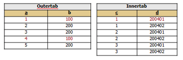
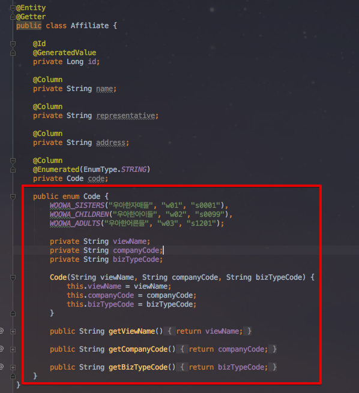
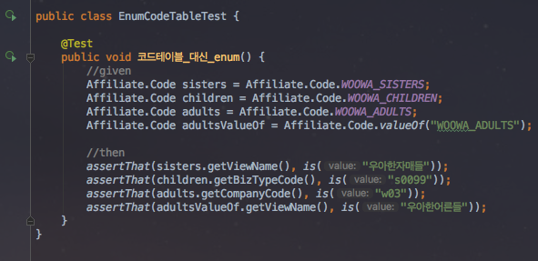
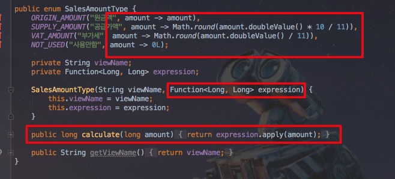
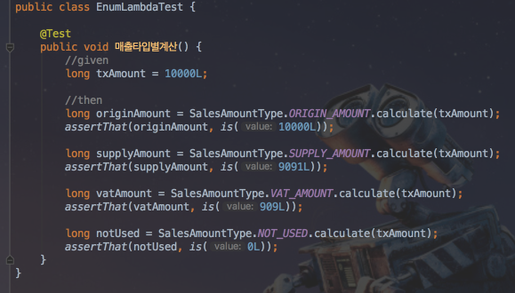
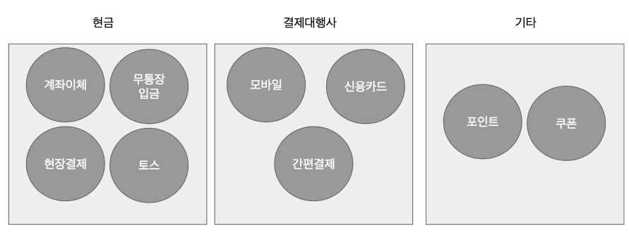
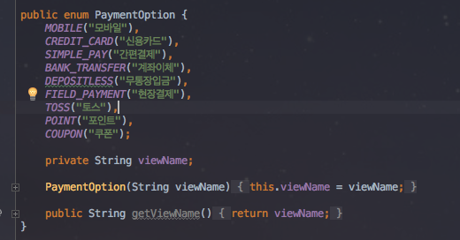
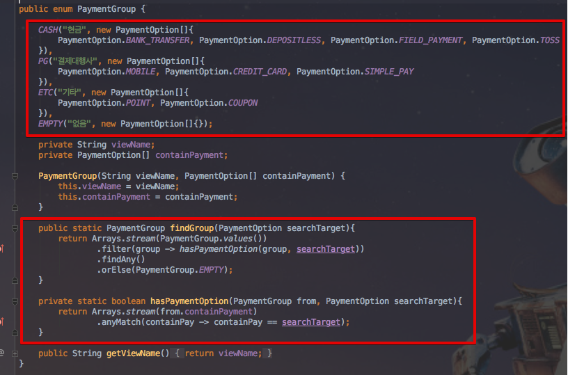
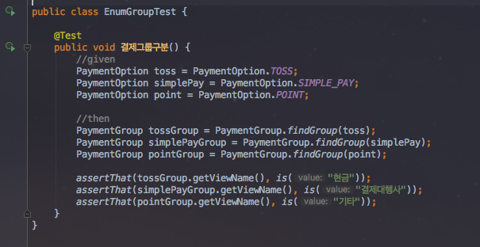

# enum 활용사례 3가지
안녕하세요? 이번 시간엔 enum 활용사례를 3가지정도 소개하려고 합니다.  
모든 코드는 [Github](https://github.com/jojoldu/blog-code/tree/master/enum-uses)에 있기 때문에 함께 보시면 더 이해하기 쉬우실 것 같습니다.  
(공부한 내용을 정리하는 [Github](https://github.com/jojoldu/blog-code)와 세미나+책 후기를 정리하는 [Github](https://github.com/jojoldu/review), 이 모든 내용을 담고 있는 [블로그](http://jojoldu.tistory.com/)가 있습니다. )<br/>
  
최근에 레거시 프로젝트를 개편하면서 enum을 적극 사용하였습니다.  
혹시나 비슷한 고민이 있으신분들에게 참고가 될까 싶어 포스팅하게 되었습니다.  
이런식으로 해결할 수도 있네? 정도로 봐주시면 될것 같습니다.  
그럼 시작하겠습니다!   
  
### 사례1 - code 관리용 테이블 대체하기
프로젝트를 진행하다보면 **code 들을 관리하기 위한 테이블**을 별도로 만드는 경우가 빈번합니다.  



(출처 : [실천하는삶님의 블로그](http://blog.daum.net/_blog/BlogTypeView.do?blogid=0dzBb&articleno=14&_bloghome_menu=recentthumb&totalcnt=17))  

이 경우가 무조건 나쁜것은 아니지만, 무조건 옳다고 할수도 없다고 생각합니다.  
제가 생각하기에 code 테이블로 code를 관리하는 것의 문제는 다음과 같습니다.  

* 관련된 테이블은 조회를 할때마다 항상 ```join```으로 code용 테이블에 있는 데이터를 함께 가져와야 한다.
  * 해당 code 테이블의 값을 기준으로 비지니스 로직을 구현하고, 컬럼 값을 할당하는 여러 테이블이 존재할 경우 그 **테이블들을 조회할때마다 항상 code 테이블도 같이 조회**해야하는 경우가 발생합니다.
* 컴파일 단계에서 체크할 수 있는 것이 없다.
  * 오타 혹은 해당 row에 들어가면 안되는 값이 있어도 체크를 할 수 없습니다.
* 코드레벨에서 확인할 수 있는 것이 없다.
  * 바로 위에서 연결된 내용인데, 이 타입일 경우 이 코드와 저 코드가 필요하다는 내용을 코드만으론 확인할 수 없습니다.
  * code table 또한 여러개로 분리된 경우 작성된 쿼리를 통해 여러 테이블을 다 찾아서 확인해야합니다.
  * 히스토리관리가 안되어있을 경우 신규 인력이 개발에 투입되려면 많은 문서가 필요합니다.

예를 들어 한 그룹사의 계열사 관리를 해야한다고 가정하겠습니다.  
계열사의 정보는 DB에 관리되겠지만, 계열사에 필요한 code 정보들은 enum으로 분리하여 관리하면 위에서 제시한 문제들을 해결할 수 있습니다.  



테스트 코드를 작성하게 되면, 



Entity 클래스에 선언한 ```@Enumerated(javax.persistence.EnumType.STRING)```을 entity의 필드에 선언하시면, 해당 enum 타입의 name이 DB에 저장됩니다.  
(여기서는 ```WOOWA_SISTERS```, ```WOOWA_CHILDREN``` 등이 DB에 저장되며, DB에서 조회하면 ```Affiliate.Code.WOOWA_SISTERS```와 ```Affiliate.Code.WOOWA_CHILDREN```으로 값이 할당됩니다.)  
  
```Affiliate.Code```을 여러 Entity 클래스에서 ```join select``` 없이 사용할 수 있으며, 어떤 계열사일때 어떤 code가 사용될지 바로 알 수가 있습니다.  
단, 대전제는 **enum으로 관리되는 데이터가 빈번하게 변경(추가/제거) 되지 않아야**하는 것과 이 code enum을 다른 테이블에서도 빈번하게 사용해야 한다는 것입니다.   
이럴 경우 enum을 고려해보심을 추천드립니다.   

### 사례2 - 타입별 다른 연산식 처리하기
예를 들어 매출금을 계산하는 프로그램이 필요하다고 가정하겠습니다.  
매출금의 경우 원금액, 공급가액, 부가세 이 3가지로 분류할 수 있는데, 한번의 결제가 발생하면 결제된 총 금액을 **원금액**으로, 원금액을 1.1로 나눈 금액을 **공급가액**으로, 공급가액의 10%를 **부가세**로 분류해야 합니다.   


(영수증을 보시면 쉽게 확인할 수 있습니다.)  

보통 이런 경우 가장 쉽게 진행할 수 있는 방법은 매출액 타입을 ```String``` 혹은 ```enum```으로 분리하고 서비스 코드에서 타입에 따라 ```if``` 분기처리 하는 것입니다.  
  
이런 경우가 제가 생각하기엔 전형적인 **데이터와 로직이 분리**된 사례라고 생각합니다.  
매출타입별 **연산식에 대한 책임**은 누가 갖고있어야 할까요?  
서비스코드일까요?  
각 매출타입이 갖고있어야 하지 않을까요?  
A 타입은 a식으로 계산해야하고,  
B 타입은 b식으로 계산해야한다라는건  
A와 B가 책임져야하는 부분이 아닐까요?  
  
이전에는 이 사례를 코드로 풀려면 익명클래스 혹은 인터페이스 구현체를 사용해야되서 지저분해질수 밖에 없었습니다.  
하지만 Java8이 되면서 ```Function 인터페이스```가 등장하게 되어 **function을 값**으로 사용할 수 있게 되었습니다.  
(물론 내부적으로는 인터페이스의 구현체를 사용하나, 겉으로 드러나는 코드상으론 다른 함수형 언어처럼 function을 갖고 있는것처럼 보이는것입니다.)  



이 코드를 사용하게 되면  



이렇게 각 타입은 거래 금액(```txAmount```)에 대해 본인의 계산식을 실행만 시키면 됩니다.  
어느 코드에서든 특정 금액에 대해 타입별 계산금이 어떻게 되는지는 이제 그 타입에 직접 물어보면 되는 것입니다.  

> 꼭 이 상황에서 enum을 써야하느냐 보다는, **타입별로 다른 연산식을 적용해야 할 경우**엔 이렇게 사용하면 좋다 정도로 보시면 될것 같습니다.  

### 사례3 - 각 타입을 그룹화 하기
마지막 사례는 그룹화를 해야할때 입니다.  
예를 들어 결제방식에 따라 다른 수수료를 부가해야하는 과정이 필요하다고 가정하겠습니다.  
아래와 같이 결제방식에 따른 수수료 그룹이 있는 것입니다.  



이 경우 **각 결제방식이 어느 그룹에 포함되는지에 대한 분기로직**이 필요합니다.  
이 분기로직을 어디에 두는것이 좋을까요?   
서비스 클래스에 두자니 서비스 클래스가 담당하기엔 책임이 모호합니다.  
또한 그룹별 로직이나 추가 메소드가 필요한 경우와 그룹을 select box로 표시해야하는 경우 등까지 고려하면 클래스나 데이터베이스로 해결하기엔 코드가 너무 분산됩니다.  
이때 enum을 활용해보겠습니다.  



(결제수단 enum)  
위와 같이 결제수단들이 있고 이를 그룹화하는 enum을 생성하겠습니다.  



```PaymentGroup```은 ```PaymentOption```의 배열을 갖고 있습니다.  
특정 ```PaymentOption```이 있을때 이 값이 어느 그룹에 포함될지는 ```PaymentGroup```에 직접 물어보면(```findGroup```) 됩니다.  
각 그룹별로 추가 기능이 필요한 경우엔 ```PaymentGroup```에 추가하면 됩니다.  
또한 select box로 그룹 리스트를 출력해야하는 경우엔 ```PaymentGroup.values()```을 사용하면 아주 쉽게 대응할 수 있습니다.  
(이걸 만약 Group이란 인터페이스를 두고, 하위 클래스들의 구현체로 해결(추상화)하려고하면 select box에서 막히게 됩니다.  
추가로 코드 작성량 또한 enum에 비교해 크게 많아지는 단점이 있습니다.)  
  
자 그럼 테스트 코드를 작성해서 확인을 해보겠습니다.  



결제수단에 따라 ```PaymentGroup```에게 물어보고 값을 가져오는 것을 명확하게 확인할 수 있습니다.  
앞으로 **결제수단의 그룹에 관련된 일**은 ```PaymentGroup```에게 맡기면 되겠죠?  

### 후기

> 이번 포스팅은 enum에 대한 이야기를 했지만, 핵심은 **객체간 책임을 확실히 분리하자**로 보시면 될것 같습니다.  
모든 데이터를 데이터베이스에 의존하게 되면 객체를 중심으로 코드 작성과 설계가 정말 힘든것 같습니다.  
그 일에 대한 책임을 갖고 있는 **객체가 상태(값)와 행위(로직)를 갖고** 있는것이 좋다고 생각합니다.  
코드레벨에서 많은 것을 검증과 확인이 가능해야 좀 더 유지보수하기가 쉽지 않을까 생각합니다.
enum으로 조금이나마 답답함을 해소할 수 있었던 것 같습니다.  
긴 글 끝까지 읽어주셔서 감사합니다!  