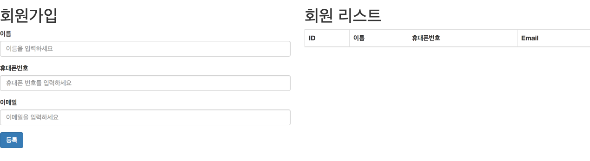
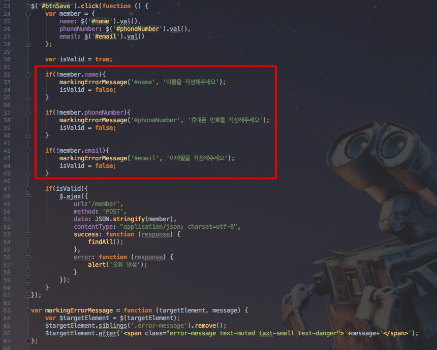
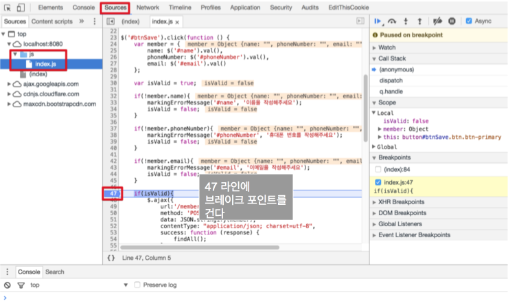
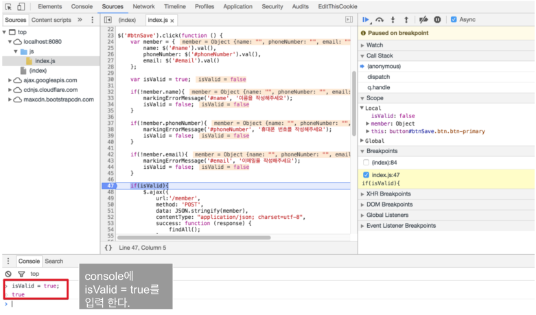
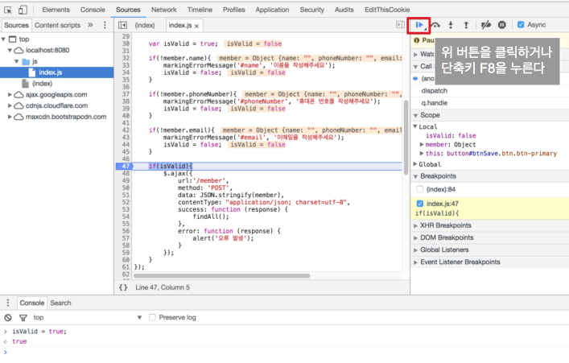
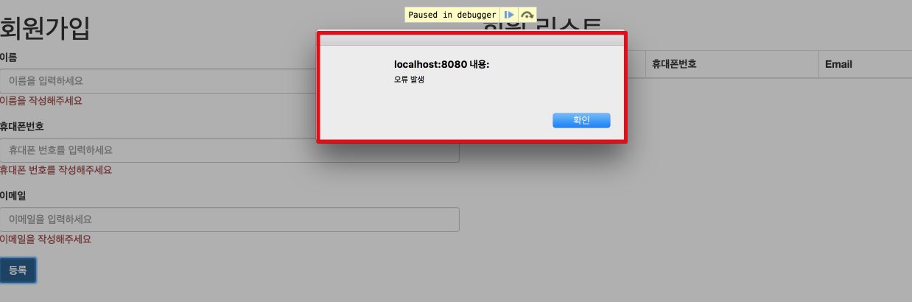
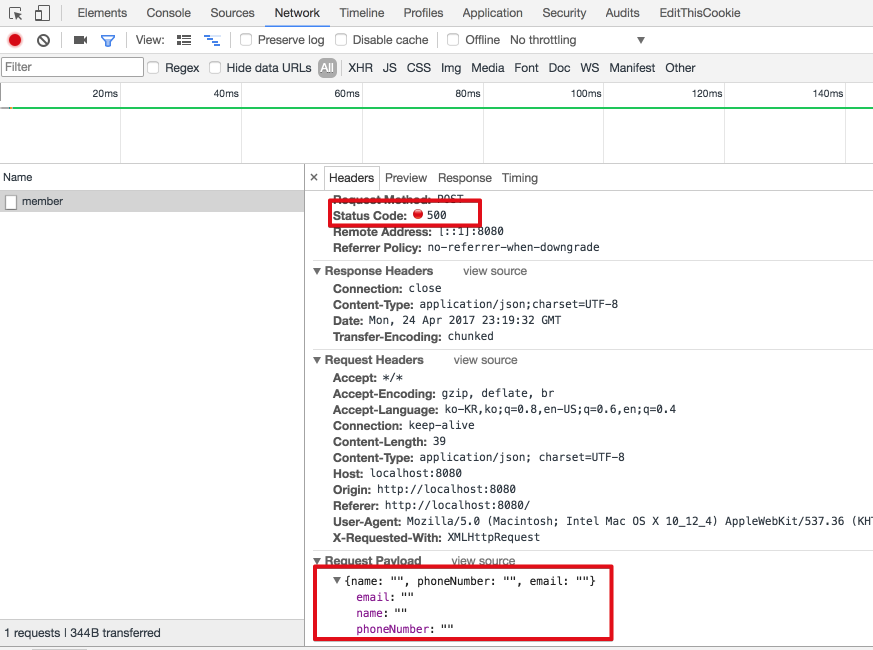
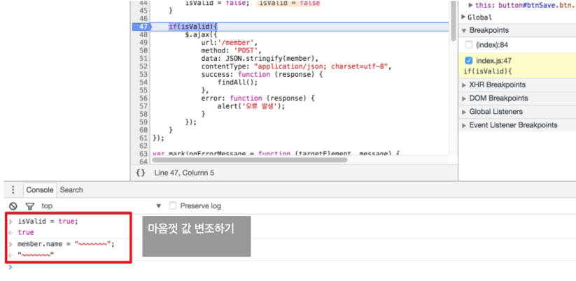
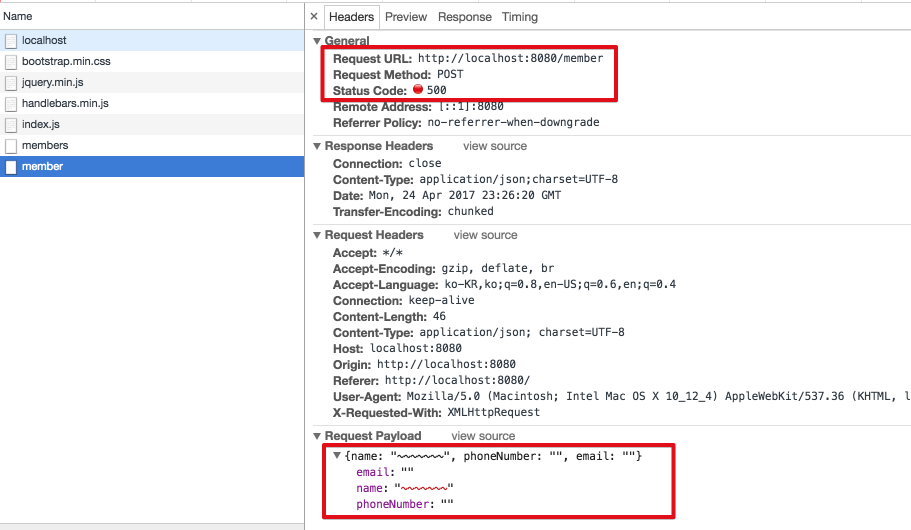

# 프론트엔드에서 유효성 검사가 문제인 이유

안녕하세요? 이번 시간엔 프론트엔드에서 유효성 검사가 문제인 이유에 대해 간단한 예제를 통해 소개하려고 합니다.  
모든 코드는 [Github](https://github.com/jojoldu/blog-code/tree/master/front-validate-problem)에 있기 때문에 함께 보시면 더 이해하기 쉬우실 것 같습니다.  
(공부한 내용을 정리하는 [Github](https://github.com/jojoldu/blog-code)와 세미나+책 후기를 정리하는 [Github](https://github.com/jojoldu/review), 이 모든 내용을 담고 있는 [블로그](http://jojoldu.tistory.com/)가 있습니다. )<br/>

이미 아시는 분들에겐 너무나 당연한 이야기겠지만, 포털과 같이 일반 사용자 서비스가 아닌 내부 시스템을 주로 하시는 분들은 크게 신경쓰지 않는 부분이라 모르실 수도 있다는 생각에 진행하게 되었습니다.  
길지 않은 내용이라 빠르게 보실 수 있으실것 같습니다^^;  
사용된 코드는 전부 위에 링크된 Github 주소에 있으니 참고해주세요!  
그럼 시작하겠습니다.

### 문제 상황

결론적으로 **클라이언트 사이드에서만 검증 코드를 작성해서는 안됩니다**.  
서버 사이드에서 검증코드가 필수입니다.  



위처럼 회원 가입 페이지를 만든다고 가정하겠습니다.  
일반적으로 회원 가입 서비스는 유효성 검사가 존재하며, 해당 검사를 통해 사용자에게 경고 메세지를 전달하는 기능을 기본적으로 갖고 있습니다.  
이럴때 해당 값이 비어있는지, 잘못된 값이 입력되었는지, 길이 제한을 초과하지 않았는지에 대해 검사(앞으로 유효성 검사라 하겠습니다)하는 코드를 어디에 둘지 고민할 수 있습니다.  
사용자에게 메세지를 전달하기 편하게 하려고 무심코 자바스크립트로 유효성 검사 코드를 작성할 수 있습니다.  
아래는 스크립트로 작성된 유효성 검사 코드입니다.  



클라이언트 사이드에서 input 박스에 빈 값이 있으면 메세지를 출력시키고, 전부 값이 채워져 있으면 Ajax를 통해 save하도록 코드를 작성하였습니다.  
클라이언트 사이드에서 체크하는 일반적인 코드라 보시면 됩니다.  
그럼 기능을 한번 수행해보겠습니다.  
화면에서 빈값으로 등록 버튼을 클릭하면!


이렇게 에러 메세지를 잘 노출시킵니다.  
기능상 문제가 없어보이는데 왜 이렇게 하면 안될까요?  
크롬의 개발자 도구를 열어 (단축키 : ```alt+command+i```) 다음과 같이 **브레이크 포인트를 찍어보겠습니다.**



최종 유효성 검사 ```flag```체크인 ```if(isValid)``` 부분에 브레이크 포인트를 걸고, 다시 input box에 빈값을 채운채로 등록 버튼을 클릭하겠습니다.  
그러면 코드가 실행 도중 47라인에서 브레이크가 걸리실텐데요,  
이때 하단 console 창에 아래와 같이 ```isValid = true```를 입력해보겠습니다.  



그리고 브레이크를 넘어가겠습니다.



자 이렇게 하면 어떤 결과가 발생할까요?  



ajax의 error 실행 코드인 ```alert("오류발생")``` 코드가 실행되었습니다.  
네트워크 탭을 통해 어떻게 진행되었는지 자세히 보겠습니다.  



500라인과 함께 비어있는 값들이 Ajax로 요청된 것을 확인할 수 있습니다.  
프론트의 검증 코드를 브라우저의 개발자도구에서 값 변조를 통해 회피한 것입니다.  
추가로 전송 전 데이터도 얼마든지 변조할 수 있습니다.  



똑같이 브레이크를 건 뒤, 마음껏 원하는대로 console 창에서 값을 변경합니다.  
이렇게 하면



변조된 값 그대로 서버에 요청하게 됩니다.  
  
즉, **프론트의 검증코드는 언제든지 회피할 수 있습니다**.  
그래서 프론트의 검증코드는 사실상 의미가 없습니다.

### 해결

크게보면 2가지가 있습니다.  

* 프론트와 백엔드 양쪽에 모두 검증 코드를 작성한다.
* 백엔드에 검증 코드를 작성 후, 백엔드 결과에 따라 프론트는 메세지만 노출한다.

1번째 방식은 단순하게 양쪽에 전부 검증 코드를 작성하기 때문에 귀찮을 뿐이지, 어렵지는 않다고 생각합니다.  
2번째 방식은 백엔드에서 검증 후, 오류 혹은 결과값을 통일시켜 프론트에서 처리하도록 하는 방식인데, 이전에 관련해서 포스팅을 하였으니 참고 부탁드립니다!  

* [Spring Validation 공통모듈 만들기](http://jojoldu.tistory.com/129)

### 후기

굉장히 짧은 내용이고 간단한 내용이라 굳이 포스팅해야하나? 고민했었는데 예전에 제가 선임 개발자 분들이 얘기만 하셨을때 당장 이해가 안됐던 기억이나서 작성하게 되었습니다.  
혹시나 도움이 되셨다면 정말 다행일것 같습니다.  
부족한 내용이지만 끝까지 읽어주셔서 감사합니다!