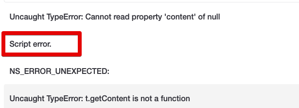
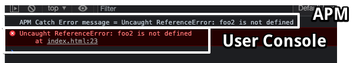

# 프론트엔드 모니터링에서 Script error. 만 나올때

프론트엔드 모니터링을 보다보면 다음과 같이 `Script error.` 만 나올때가 있습니다.



나머지 에러들은 정확하게 에러가 노출되지만, 특정 케이스에 한해서 `Script error.` 만 나오게 되는 것인데요.  
  
왜 모니터링에서는 `Script error.` 만 나오며, 이를 해결하기 위해선 어떻게 해야하는지 알아보겠습니다.

## 1. 배경 소개

예를 들어 다음과 같은 `sdk.js` 파일을 사용하는 웹 페이지가 있다고 가정해봅니다.

**sdk.js**

```javascript
function foo() {
    console.log($('#a').text());
}
```

**index.html**

```html
<body>
<script src="https://code.jquery.com/jquery-1.12.4.min.js"></script>
<script src="https://junior-recruit-scheduler.s3.ap-northeast-2.amazonaws.com/sdk.js"></script>

<p id="a"> test </p>
<script>
    /**
     * 비지니스 로직
     */
    foo();

</script>
</body>
```

코드는 간단합니다.

* `sdk.js` 와 `jquery`를 호출하고, 이를 `index.html`이 `sdk.js`의 `foo` funciton을 호출
    * `sdk.js`는 `jquery`를 의존

현 코드상에는 큰 문제가 없습니다.  
자 그리고 이제 **프론트 모니터링 코드**를 간략하게 만들어볼텐데요.  

```html
<body>
<script src="https://code.jquery.com/jquery-1.12.4.min.js"></script>
<script src="https://junior-recruit-scheduler.s3.ap-northeast-2.amazonaws.com/sdk.js"></script>

<p id="a"> test </p>
<script>
    /**
     * APM 내부 구현
     */
    window.onerror = function (message) {
        // 원래는 ajax로 에러 내용을 전달해야하지만, 여기서는 간단하게 console로 출력
        console.log(`APM Catch Error message = ${message}`);
    }

    /**
     * 비지니스 로직
     */
    foo();

</script>
</body>
```

> 실제 모니터링의 코드는 위 보다 훨씬 고도화 되었지만, 저희가 사용중인 프론트 모니터링의 코드는 [글로벌 에러 핸들링](https://developer.mozilla.org/en-US/docs/Web/API/GlobalEventHandlers/onerror) 하는 관점에서는 비슷한 컨셉으로 보면 될 것 같습니다. 

이렇게 구성할 경우 HTML 페이지 어디에서 발생하는 에러라도 `window.onerror`를 통해 내용을 수신 받을 수 있는데요.  



모니터링에 대한 로그와 실제 콘솔에 출력되는 로그가 동일하게 출력되는 것을 볼 수 있습니다.  
  
## 2. 문제 상황

자 그럼 강제로 문제 상황을 만들어볼텐데요.  
기존 `sdk.js`는 코드 변경이 없는데, 의존하고 있는 `jquery`를 못불러오는 상황을 만들어보겠습니다.

```html
<body>
<!-- jquery 호출을 주석처리해 sdk.js가 문제가 발생하도록 -->
<!-- <script src="https://code.jquery.com/jquery-1.12.4.min.js"></script> -->
<script src="https://junior-recruit-scheduler.s3.ap-northeast-2.amazonaws.com/sdk.js"></script>

<p id="a"> test </p>
<script>
    /**
     * APM 내부 구현
     */
    window.onerror = function (message) {
        // 원래는 ajax로 에러 내용을 전달해야하지만, 여기서는 간단하게 console로 출력
        console.log(`APM Catch Error message = ${message}`);
    }

    /**
     * 비지니스 로직
     */
    foo();

</script>
</body>
```

이렇게 할 경우 콘솔 로그와 모니터링 로그는 어떻게 될까요?


## 3. 원인 분석

외부 SDK 오류가 나도 Console에는 잘 찍히는데??
이건 APM의 한계인데, cors가 열려있지 않은 외부 SDK에 대한 에러는 APM이 정확히 추적이 힘들다.


즉, 사용자측에서는 정상적으로 무슨 에러인지 보이나, APM에서는 CORS로 인해 정확한 에러를 받을 수가 없다.


[참고-What the heck is "Script error"](https://blog.sentry.io/2016/05/17/what-is-script-error)

그래서 제니퍼 APM에서는 CORS가 열려있지 않은 SDK의 오류는 정확히 추적이 불가능하다.

그리고 우리가 사용하는 SDK는 CORS가 열려있지 않다


그래서 SDK에서 발생하는 에러에 대해서는 APM이 정상적으로 추적이 불가능하여 Script Error로만 남아있었다.

APM도 정상적으로 에러 내용을 보려면 어떡해야하나?

## 4. 해결책


아래 2가지가 둘다 적용되면 우리 도메인이 아니여도 APM에서 정확하게 에러를 캐치해서 모니터링 가능하다.

### 4-1. 

### 4-2. 내부 CDN 이관

* 꼭 도메인 문제가 아니더라도, **외부 CDN이 장애나면 우리서비스까지 영향이 가는것을 막기 위해**

(우리 도메인이면 문제가 없다)

호출하는 우리쪽 코드는 crossorigin="anonymous" 을 넣고,


SDK 측에서는 CORS를 글로벌 OPEN (*) 하거나 우리 도메인만 허용하던가 둘 중 하나는 적용 되어 CORS 문제가 발생하지 않도록 한다.


이렇게 할 경우 다음과 같이 APM에도 정상적으로 에러를 추적할 수 있다.


위 내용은 APM에서 어떻게 하면 에러로그를 정확히 추적하냐에 대한 이야기

실제로 에러자체가 발생하지 않도록 하기 위해서는 외부 CDN이 아닌 내부 CDN을 사용하도록해서, 외부 CDN의 이슈로 우리 결제가 실패나지 않도록 해야한다.

결제에 필요한 2개의 SDK를 모두 외부 CDN이 아니라 내부 CDN으로 교체