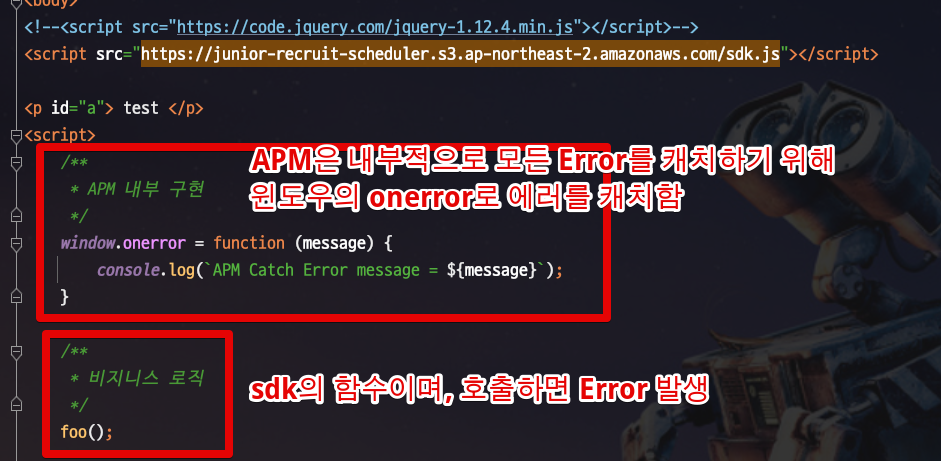
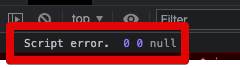
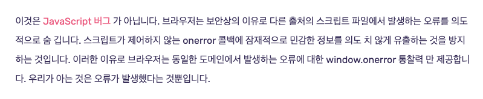
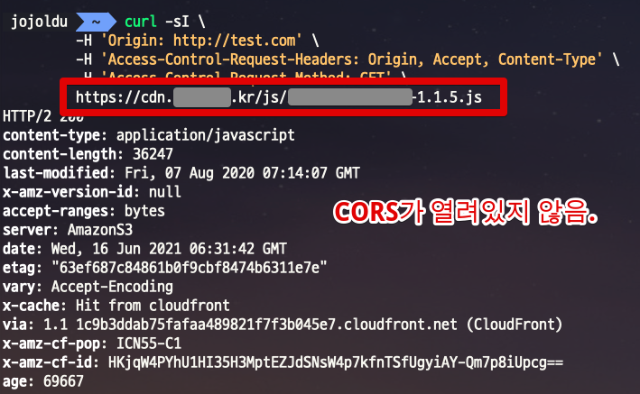
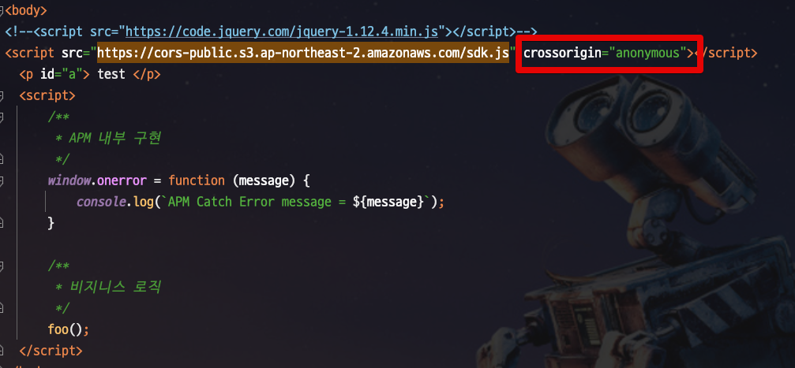
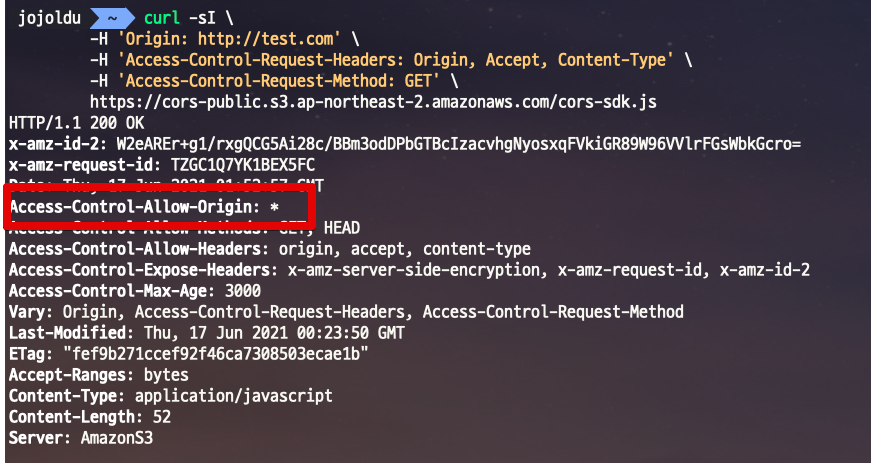
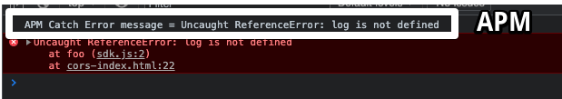

# 프론트엔드 모니터링에서 Script error. 만 나올때

프론트엔드 모니터링을 보다보면 다음과 같이 

왜 Script Error 만 APM에서 노출되나
일단 Script error 메세지가 왜 발생하는지는 What the heck is "Script error"?  를 읽어보면 도움이 된다.

결제와 관련되서 Script Error가 발생할 수 있는 지점은 다음과 같다.

**sdk.js**

```javascript
function foo() {
    console.log($('#a').text());
}
```

```html
<body>
<!--<script src="https://code.jquery.com/jquery-1.12.4.min.js"></script>-->
<script src="https://junior-recruit-scheduler.s3.ap-northeast-2.amazonaws.com/sdk.js"></script>

<p id="a"> test </p>
<script>
    /**
     * APM 내부 구현
     */
    window.onerror = function (message) {
        console.log(`APM Catch Error message = ${message}`);
    }

    /**
     * 비지니스 로직
     */
    foo();

</script>
</body>
```

SDK가 있고, SDK는 jQuery에 대해 의존하고 있다.


외부 SDK 오류가 나도 Console에는 잘 찍히는데??
이건 APM의 한계인데, cors가 열려있지 않은 외부 SDK에 대한 에러는 APM이 정확히 추적이 힘들다.

상황을 재현해보자.

예를 들어 다음과 같이 sdk.js 의 foo 에서는 jquery를 의존하게 하자. 

그리고 APM의 내부 구현체를 임의로 구현하면 다음과 같습니다.



> 실제 APM의 코드는 위와 조금 다르지만, [글로벌 에러 핸들링](https://developer.mozilla.org/en-US/docs/Web/API/GlobalEventHandlers/onerror) 하는 관점에서는 비슷한 컨셉으로 보면 될 것 같습니다.

(APM의 경우 해당 웹페이지 전체를 잡기 위해 window.onerror 를 사용하게 된다.)

위 코드는 에러가 발생하는데, (foo에서 필요한 jQuery가 없으니)

로그를 보면 다음과 같다.



즉, 사용자측에서는 정상적으로 무슨 에러인지 보이나, APM에서는 CORS로 인해 정확한 에러를 받을 수가 없다.



[참고-What the heck is "Script error"](https://blog.sentry.io/2016/05/17/what-is-script-error)

그래서 제니퍼 APM에서는 CORS가 열려있지 않은 SDK의 오류는 정확히 추적이 불가능하다.

그리고 우리가 사용하는 SDK는 CORS가 열려있지 않다



그래서 SDK에서 발생하는 에러에 대해서는 APM이 정상적으로 추적이 불가능하여 Script Error로만 남아있었다.

APM도 정상적으로 에러 내용을 보려면 어떡해야하나?
 

아래 2가지가 둘다 적용되면 우리 도메인이 아니여도 APM에서 정확하게 에러를 캐치해서 모니터링 가능하다.

(우리 도메인이면 문제가 없다)

호출하는 우리쪽 코드는 crossorigin="anonymous" 을 넣고,



SDK 측에서는 CORS를 글로벌 OPEN (*) 하거나 우리 도메인만 허용하던가 둘 중 하나는 적용 되어 CORS 문제가 발생하지 않도록 한다.



이렇게 할 경우 다음과 같이 APM에도 정상적으로 에러를 추적할 수 있다.




위 내용은 APM에서 어떻게 하면 에러로그를 정확히 추적하냐에 대한 이야기

실제로 에러자체가 발생하지 않도록 하기 위해서는 외부 CDN이 아닌 내부 CDN을 사용하도록해서, 외부 CDN의 이슈로 우리 결제가 실패나지 않도록 해야한다.

결제에 필요한 2개의 SDK를 모두 외부 CDN이 아니라 내부 CDN으로 교체