# 커밋된 내용에서 author 수정하기

하나의 Source Tree로 github 계정 여러개를 사용할 경우 간혹 신규생성 or 새로 클론 받은 저장소 작성자가 원치않는 계정으로 등록되어 커밋될 경우가 있습니다.  

이럴 경우 원하는 계정으로 커밋이 되지 않아 github 컨트리뷰션에 남지않는 불상사가 생기는데요, 이럴때 rebase를 이용하여 문제를 해결할 수 있습니다.  

이번 시간에는 rebase에 초점을 맞추는 것이 아니기 때문에 rebase에 대해 좀 더 찾아보고 싶으신 분들은 [아웃사이더님의 포스팅](https://blog.outsider.ne.kr/666)과 [김찬웅님의 NDC2016 발표자료(p.38부터)](http://www.slideshare.net/kexplo/ndc2016-effective-git) 을 참고 부탁드립니다.  

## 문제상황

로컬 git에 잘못된 github 계정을 등록하여 커밋 & 푸시가 github에 반영이 안되는 경우 어떻게 해야할까요?  
예를 들어 아래와 같이 git작성자에 오타가 났다고 가정하겠습니다.  

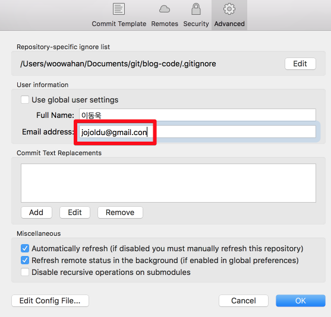

(gmail.com이 되어야하지만, gmail.**con**이 되었습니다.)  

이로 인해 github저장소에는 푸시가 되었어도, 컨트리뷰션에는 정상반영이 되지 않습니다.  

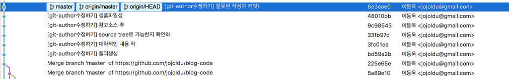

로컬 커밋 & 원격 저장소 푸시까지는 되었습니다만..  

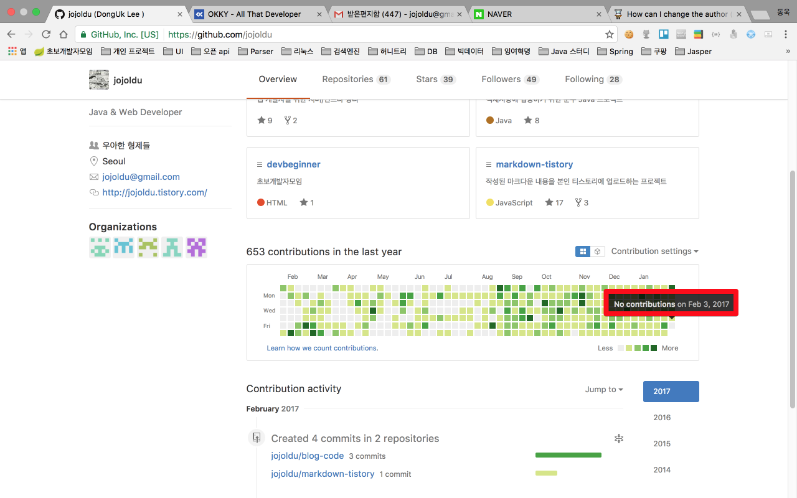

제 github 계정은 컨트리뷰션이 없습니다. 해당 커밋은 **.con** 메일주소를 가진 계정이 한것이기 때문이죠.  
  
자 이럴 경우 다시 정상적으로 컨트리뷰션을 반영하려면 어떻게 해야할까요?  
이미 커밋된 내용의 작성자를 수정하려면 어떻게 해야할까요?  
이 문제를 ```rebase```를 통해 해결해보겠습니다.

## 해결책

해당 저장소 위치에서 터미널을 혹은 CMD를 열겠습니다.  
그리고 수정하고 싶은 커밋 혹은 커밋들의 **바로 직전 커밋 hash**를 확인하겠습니다.  

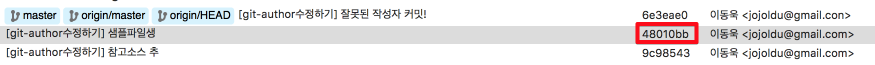

> 잘못된 커밋 직전 커밋의 hash가 ```48010bb```인것을 확인!  

확인이 되셨으면 바로 rebase를 진행해보겠습니다.  

### 1. rebase 시작

해당 git 저장소에서 연 터미널에서 아래와 같이 명령어를 입력합니다.  

```baseh
git rebase -i -p 커밋hash
```

저를 기준으로 하면 아래와 같이 되겠죠?  

  

이렇게 입력할 경우 ```48010bb``` 커밋 **이후부터의 모든 커밋들을 rebase대상으로** 지정하게 됩니다.  

### 2. 변경 원하는 커밋을 edit로 변경 및 나가기

위 명령어를 입력하면 아래와 같이 vi편집창이 오픈될 것입니다.  

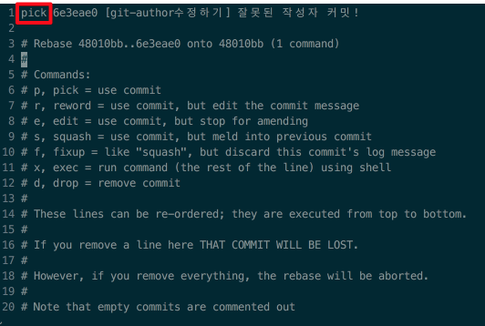

> ```#```이 있는 텍스트는 모두 주석처리된 것이니 설명서처럼 읽어보시면 됩니다.  

고쳐야할 곳은 ```pick```으로 되어있는 부분입니다.  
  
rebase 하고 싶은 커밋의 경우 ```pick```을 ```edit```로 수정하면 해당 커밋을 rebase 대상으로 지정하게 됩니다.  
  
즉, vi에디터에 등장한 모든 커밋을 rebase대상으로 보는 것이 아니라 등장한 커밋 중 ```edit```로 된 커밋들만 rebase대상으로 보는것입니다.  

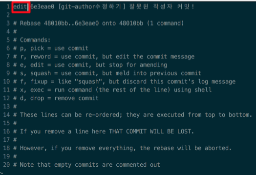  

저장 및 종료 (```:wq```)를 이용하여 편집창을 저장 종료하면 바로 rebase가 시작됩니다.

### 3. author 수정

rebase 진행 모드로 변경된 후 바로 아래의 명령어를 입력하시면 됩니다.

```bash
git commit --amend --author="사용자명 <이메일>"
```

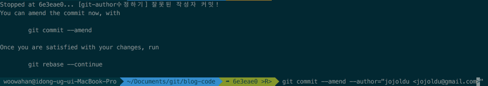  

> 각자의 이메일 주소를 입력하시면 됩니다.  

입력하시면 성공의 메세지를 확인하실 수 있습니다.  

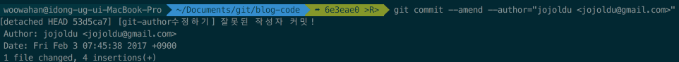  

### 4. 다음 커밋으로 계속 진행  

rebase 종료 혹은 다음 rebase 대상으로 진행하고 싶으시면 아래 명령어를 입력하시면 됩니다.  

```bash
git rebase --continue
```

위 명령어는 다음 rebase 대상이 있을 경우 진행하며, 없을 경우 종료를 진행합니다.  

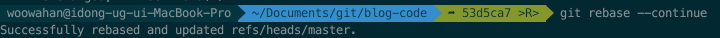  

### 5. 수정을 원하는 커밋일 경우 다시 rebase로 수정

```bash
git commit --amend --author="사용자명 <이메일>"
```

### 6. 3~5 과정 반복  

### 7. 확인  

자 6번까지의 과정을 통해서 정상적으로 커밋이 수정되었는지 확인해보겠습니다.  

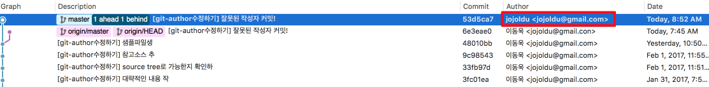  

(**.con**이 **.com**으로 변경된 것 보이시나요!?)  

자 그럼 커밋을 푸시하여 github에도 반영이 되는지 확인해보겠습니다.  

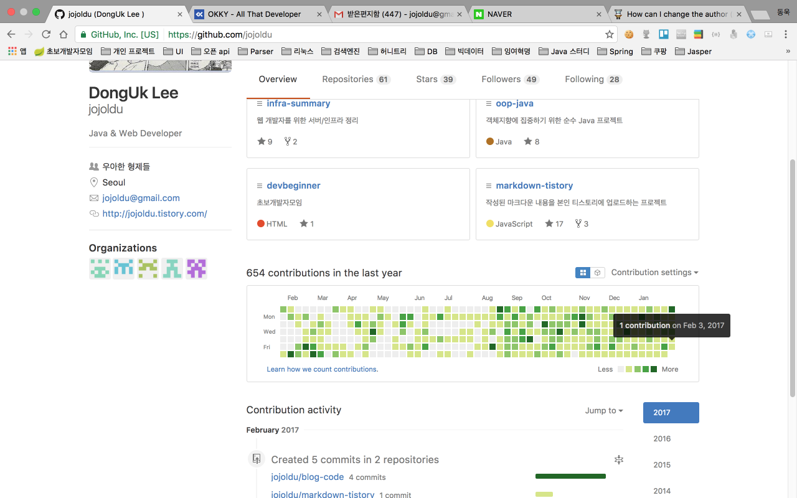  

짠! 정상적으로 컨트리뷰션이 반영된 것을 확인할 수 있습니다.  
회사용 github계정과 본인 계정을 동시 사용하다가 컨트리뷰션이 잘못된 분들에게 도움이 되셨으면 좋겠습니다^^;  

> 제가 이걸 포스팅 하게 된 계기가 이런 상황을 2번 겪었기 때문입니다.  
> 1번 실수한 뒤에 해결책을 검색하고 해결하고 난뒤, 같은 일이 또 벌어질까 하는 생각에 정리를 안했더니, 또 같은 문제가 발생해서 구글링 하는게 답답해서 포스팅하게 되었습니다.  
> 앞으로도 실수한 내용들은 정리해서 바보같은 반복을 하지 않도록 하겠습니다.  

## 참고

* [git-tower](https://www.git-tower.com/learn/git/faq/change-author-name-email)
* [stackoverflow](http://stackoverflow.com/questions/3042437/change-commit-author-at-one-specific-commit)
