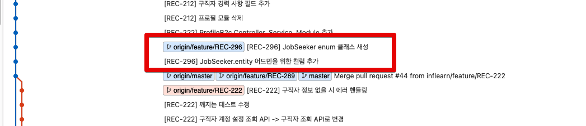
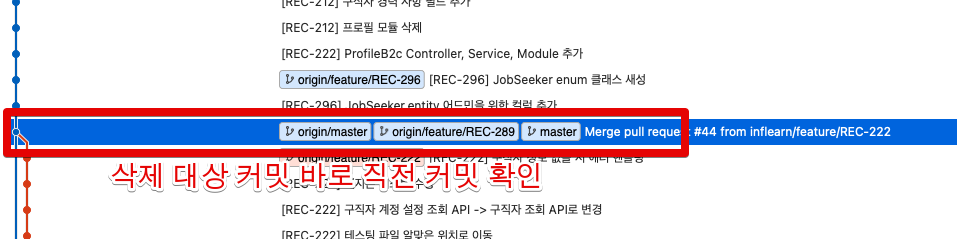
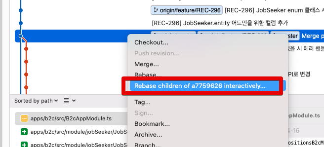
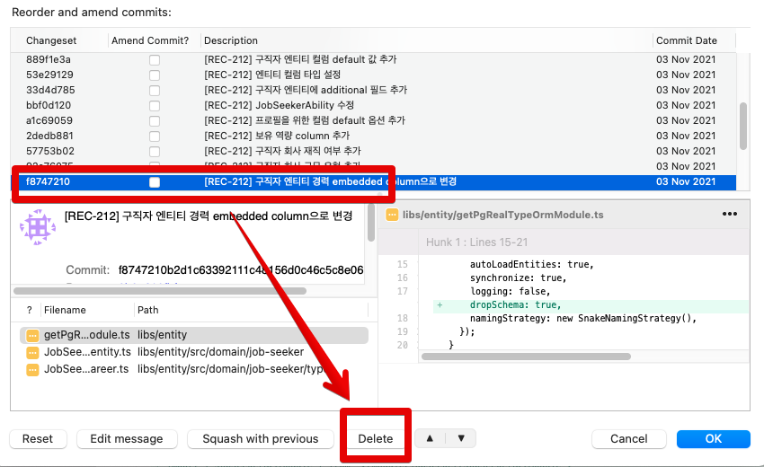
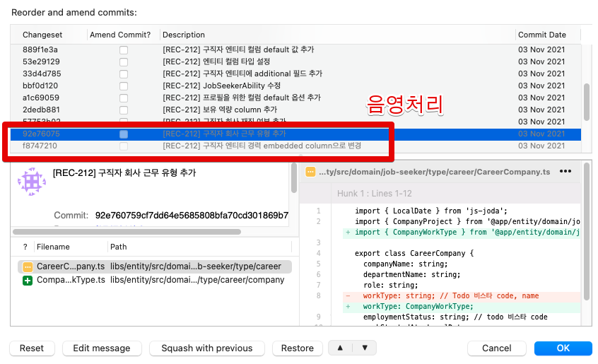
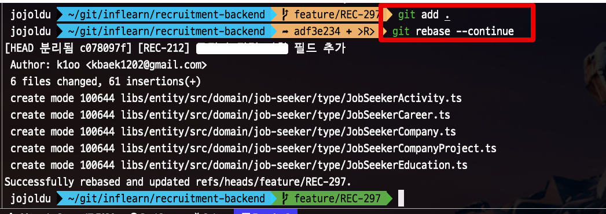
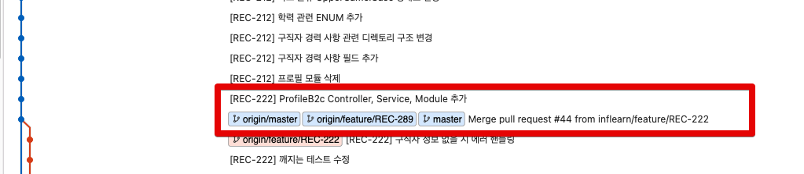

# Git에서 SourceTree로 원하는 커밋만 제거하기

Git을 사용하다보면 특정 커밋들만 날리고 싶을때가 있습니다.  
근데 하필 그게 한참 전 커밋들이거나, 중간 커밋들이면 `reset`으로 골라내기가 쉽지 않은데요.  
이럴때 `rebase interactively` 를 사용하기가 좋습니다.

## 해결방법

예를 들어 아래와 같이 `REC-296` 커밋 2개를 모두 빼고 싶은 상황이라고 가정해봅니다.

그럼 **그 직전 커밋**을 선택합니다.

해당 커밋을 우클릭을 하신뒤, `Rebase children of ... interactively` 을 선택합니다.

그럼 아래와 같이 리베이스 화면이 나오는데, 여기서 삭제를 원하는 커밋을 선택한뒤, 하단의 Delete를 클릭합니다.

그럼 해당 커밋을 삭제 표기가 됩니다.  
지우고싶었던 2개의 커밋을 모두 delete를 하고, OK를 누르시면 그때부터 **Rebase가 시작**됩니다.

Rebase 중 Conflict 난 부분은 수정해서 Rebase를 마무리 합니다.

Rebase가 잘 마무리되시면?  
아래와 같이 문제가 있었던 `REC-212` 커밋들이 모두 삭제된 깃 그래프를 볼 수 있습니다.

