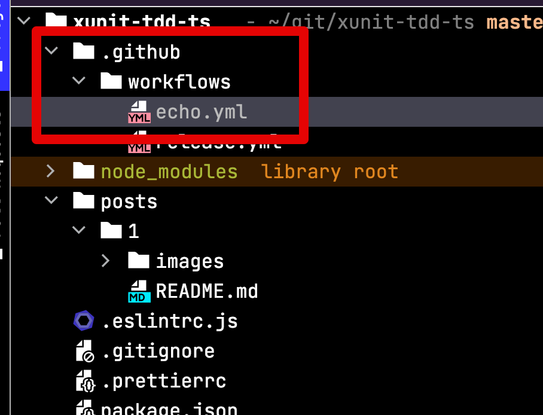
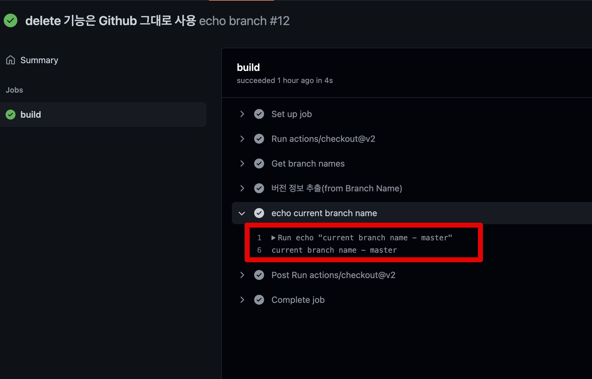
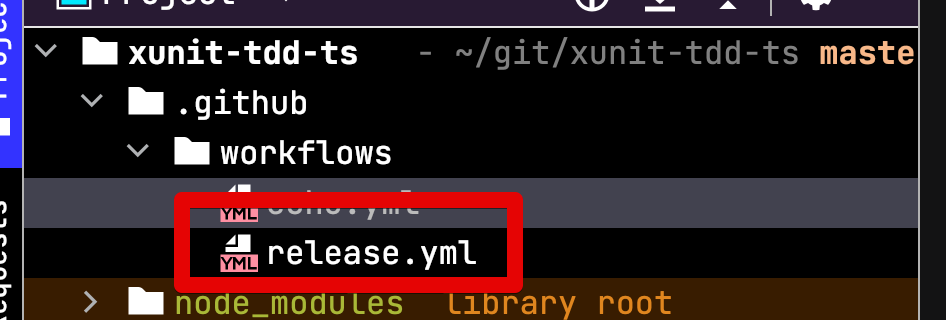
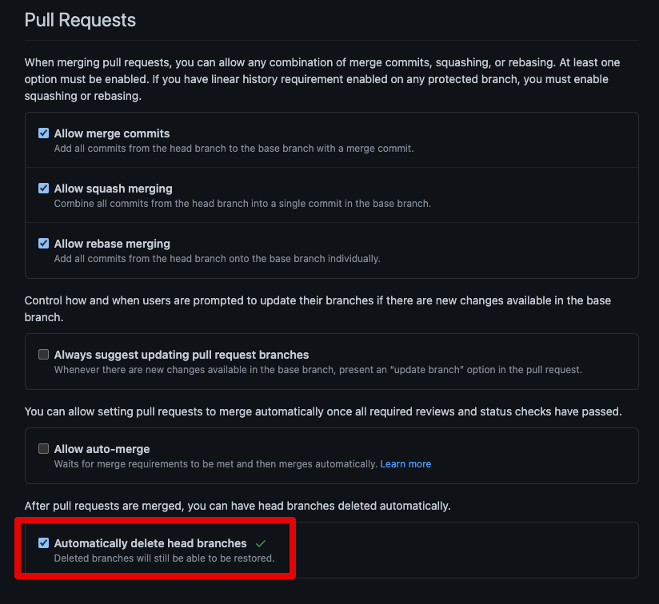

# Release Merge시 Tag 생성, Release 삭제하기 (feat. Gihtub Action)

최근에 상권님의 포스팅을 보고나서 기존 프로젝트의 Release 자동화를 진행했다.  

* [앱 배포후 Jira에서 버전 Release처리 자동으로 하는 방법(feat. GitHub Action)](https://medium.com/prnd/%EC%95%B1-%EB%B0%B0%ED%8F%AC%ED%9B%84-jira%EC%97%90%EC%84%9C-%EB%B2%84%EC%A0%84-release%EC%B2%98%EB%A6%AC-%EC%9E%90%EB%8F%99%EC%9C%BC%EB%A1%9C-%ED%95%98%EB%8A%94-%EB%B0%A9%EB%B2%95-feat-github-action-ab4c4ecf437d)

상권님의 포스팅에서는 다음과 같이 Github Action 의 자동화를 구성하셨다.

* Master 브랜치에서 Push가 발생하면
  * PR Merge 가 되어도 Master 에서는 Push가 발동된다
* Merge Commit으로 발생한 커밋 메세지에서 버저닝 번호만 추출해서 Tag로 생성

우리 프로젝트는 일반적으로 Release 브랜치의 반영이 다음과 같이 진행된다.

그래서 그대로 적용할수는 없었고, 우리팀 스타일에 맞게 개조가 필요했다.

* Master Push가 아니라 **PR이 Merge가 되었을때만** Github Action이 작동하기
  * 상권님의 Github Action에서는 Master Push에서는 전부 Action이 실행 된다.
  * 현재 **우리팀의 규칙상 Rollback 배포등**을 고려해야되기 때문에 Push 를 실행 기준으로 삼지 않았다.
* **Release 브랜치명에서 버전 추출하기**
  * Release -> Master로 반영할때 Merge Commit을 생성하지 않는다
  * 그래서 Merge Commit Message에서 버전을 추출할 수가 없다.

위와 같은 상황으로 
목표로 하는 것은 2가지 이다.

* Release 브랜치가 Master 브랜치로 Merge 될 경우에만 **Release 브랜치의 버전으로 Tag/Release 생성**
* Merge가 되면 Release 브랜치 삭제
  * 이 부분은 Github Action이 아니고, Github 기본 기능으로 지원된다

## 1. Release 브랜치명에서 버전명 추출하기

먼저 Release 브랜치명에서 버전명 추출하기부터 해본다.  
  
해당 작업은 [branch-names](https://github.com/marketplace/actions/branch-names) 을 사용한다.  
  
먼저 시범삼아 해당 Action으로 브랜치명이 잘 추출되는지 검증한다.  
  
간단하게 workflow를 하나 생성한다.



코드는 다음과 같다.

```yml
name: echo branch Name
on:
  push:
    branches:
      - master
jobs:
  build:
    runs-on: ubuntu-latest
    steps:
      - uses: actions/checkout@v2
      - name: Get branch names
        id: branch-name
        uses: tj-actions/branch-names@v4.9

      - name: 버전 정보 추출(from Branch Name)
        run: echo "TAG=$(echo '${{ steps.branch-name.outputs.current_branch }}')" >> $GITHUB_ENV

      - name: echo current branch name
        run: echo "current branch name - ${{ env.TAG }}"
```

핵심 로직은 다음과 같다.

* `echo "TAG=$(echo '${{ steps.branch-name.outputs.current_branch }}')" >> $GITHUB_ENV`
  * 현재의 브랜치를 `TAG` 라는 **Github 환경 변수에 저장**한다.
  * 이렇게 저장된 환경 변수는 `${{ env.TAG }}` 와 같이 **다른 Step에서 사용할 수 있다**

저장된 환경변수 값이 잘 출력되는지 확인해본다.



브랜치명 추출 작업이 잘 되는것이 확인되었으니 본격 작업에 들어간다.

## 2. 최종 Github Action 작성하기

다음과 같이 `release.yml` workflow 파일을 하나 만들고



```yml
name: Release
on:
  pull_request:
    branches:
      - master
    types: [ closed ]
jobs:
  build:
    runs-on: ubuntu-latest
    steps:
      - uses: actions/checkout@v2
      - name: Get branch names
        id: branch-name
        uses: tj-actions/branch-names@v4.9

      - name: 버전 정보 추출(from Branch Name)
        run: echo "TAG=$(echo '${{ steps.branch-name.outputs.current_branch }}' | egrep -o '[0-9]{1,3}\.[0-9]{1,3}\.[0-9]{1,3}')" >> $GITHUB_ENV

      - name: Release & Tag 생성
        if: github.event.pull_request.merged == true
        uses: actions/create-release@v1
        env:
          GITHUB_TOKEN: ${{ secrets.GITHUB_TOKEN }}
        with:
          tag_name: ${{ env.TAG }}
          release_name: ${{ env.TAG }}
```

## Merge된 Release 브랜치 삭제

Merge된 Release 브랜치 삭제에 대한 Github Action이 별도로 필요하진 않다.  
이미 Github 에서 해당 기능을 제공하기 때문이다.

