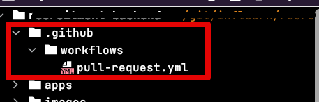
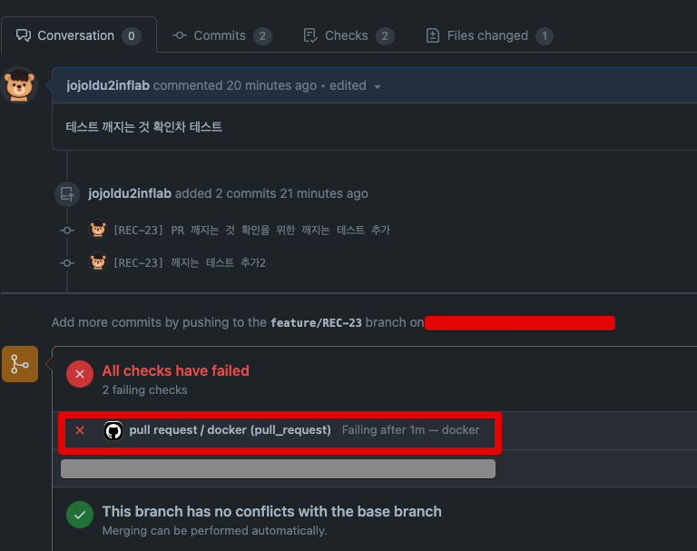
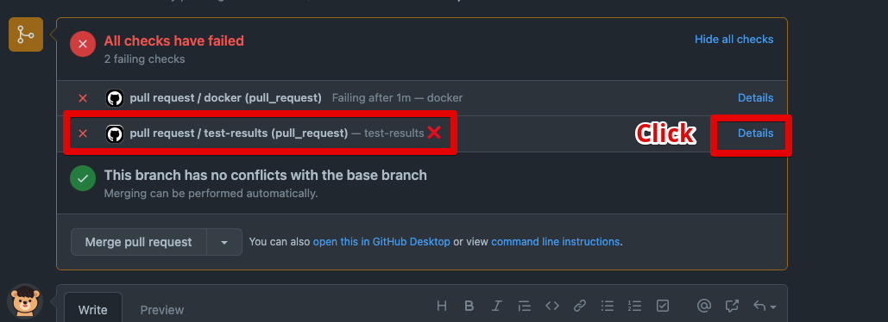
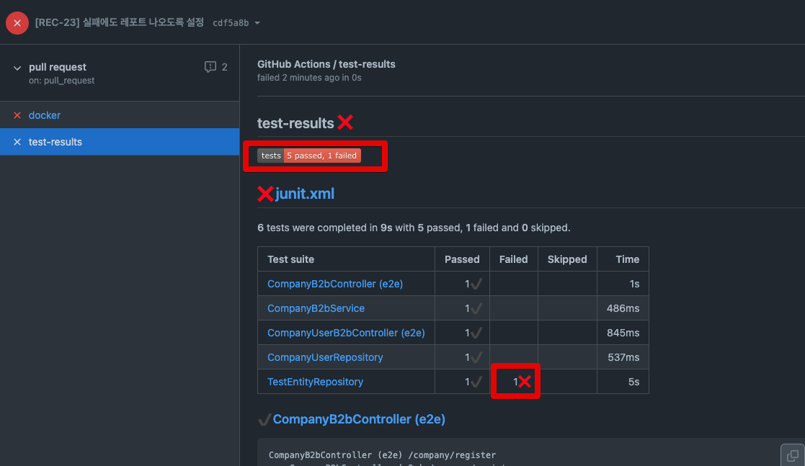
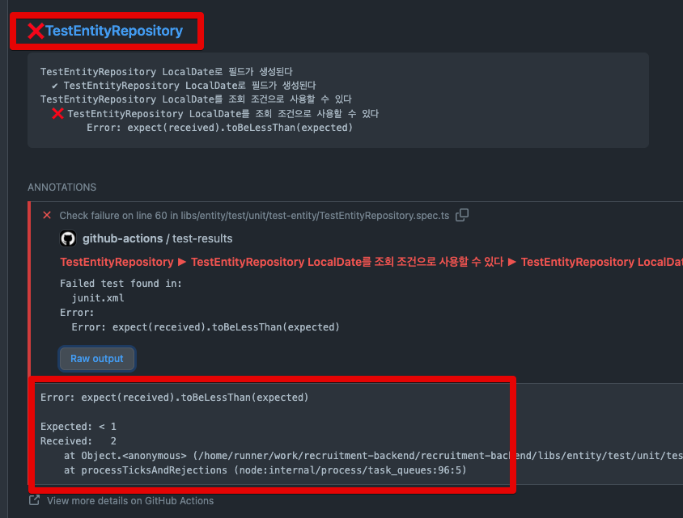
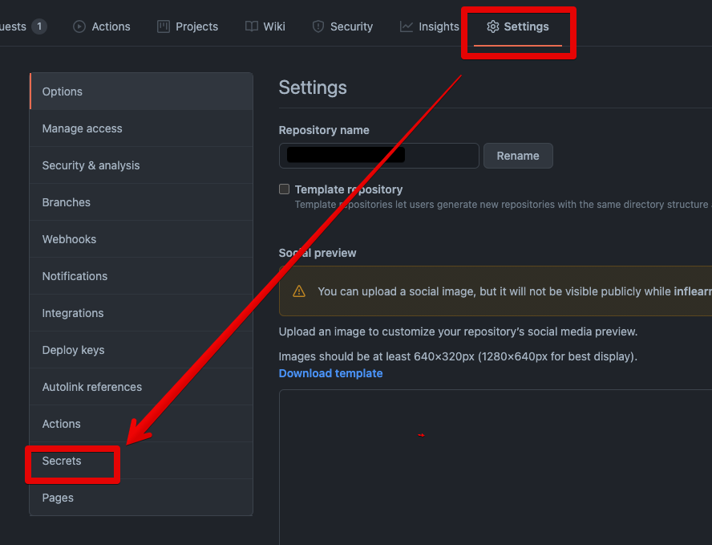
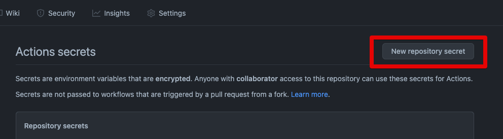
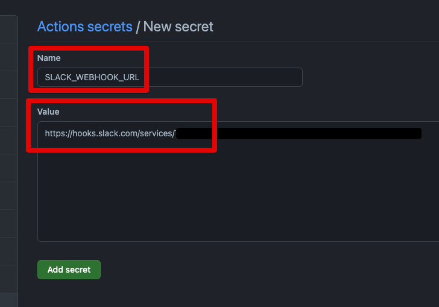
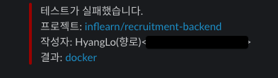
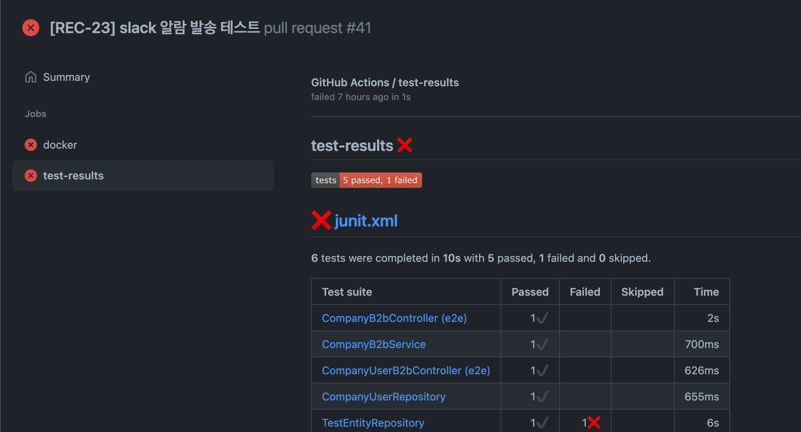

# Github Pull Request시 Jest & Docker Test Code 수행하기

테스트 코드를 작성과 함께 항상 해주어야하는 기반 작업중 하나가 Pull Request와 Develop & Master 브랜치 Push시에 전체 테스트 코드가 수행되도록 테스트 자동화 환경을 구축 하는 것입니다.  
  
그래야만, Pull Request의 코드리뷰를 진행할때 **기존 기능이 정상작동하는 것을 믿고 리뷰만 진행**할 수 있기 때문입니다.  
  
이를 위해 젠킨스와 같은 설치형 CI를 써도 되지만,  
배포용도가 아닌 **코드리뷰로 요청온 Pull Request는 무조건 전체 테스트를 수행한다**로 본다면 Github Action은 꽤나 좋은 선택지입니다.  
  
그래서 이번 시간에는 Jest & Docker 환경에서 Pull Reqeust 발생시 Github Action으로 테스트 수행과 결과를 알려주는 환경을 구성해보겠습니다.  
  

## 1. Docker & Jest 테스트 환경 구축

먼저 프로젝트에 아래와 같이 `.github/workflows` 디렉토리를 만들고, Github Action 파일 (여기서는 `pull-request.yml`) 을 하나 생성합니다.



그리고 아래의 코드를 추가합니다.

```yaml
name: Pull request

on:
  push:
    branches:
      - master
      - develop
  pull_request:
    branches:
      - "**"

jobs:
  docker:
    timeout-minutes: 10
    runs-on: ubuntu-latest

    steps:
      # 해당 저장소의 코드를 가져옵니다.
      - name: Checkout
        uses: actions/checkout@v2

      # docker-compose를 활용해 테스트를 위한 컨테이너 환경을 구성합니다.
      - name: Start containers
        run: docker-compose -f "docker-compose.yml" up -d --build

      # Node 16 버전을 사용합니다.
      - name: Install node
        uses: actions/setup-node@v2
        with:
          node-version: '16'
          cache: 'npm'

      # yarn을 설치합니다.
      - name: Install Yarn
        run: npm install yarn

      # 설치된 yarn을 통해 패키지를 설치합니다.
      - name: Install dependencies
        run: yarn install

      # 테스트를 수행합니다.
      - name: Run tests
        run: yarn test

      # 앞의 작업이 실패/성공과 관계 없이 컨테이너들을 종료합니다.
      - name: Stop containers
        if: always()
        run: docker-compose -f "docker-compose.yml" down
```

배포를 목적으로 하는 것은 아니기 때문에 별도의 배포과정을 거치진 않습니다.  
  
이렇게 Github Action 파일이 생성되었다면 일부러 **테스트가 실패하도록 테스트 코드를 수정**하고 Pull Request를 보내봅니다.  
  
Pull Request를 보내보면, 아래와 같이 테스트가 실패했음을 Github Pull Request 페이지에서 확인할 수 있습니다.



단순히 이렇게만 해도 테스트가 깨진것은 알 수 있으나 **좀 더 상세하게 확인이 되어야** 빠르게 테스트를 고치고 다시 Push를 할 수 있겠죠?  
  
바로 테스트 레포트를 만들어보겠습니다.

## 2. 테스트 커버리지

테스트 커버리지의 레포트가 필요한 경우 단순 Jest만 가지고는 상세하게 표기가 어렵습니다.  
이런 점에서 Junit (JVM 계열의 단위 테스트 도구) 을 호환하는 `junit.xml` 형식은 레포트를 표현하기에 최적화 되어있습니다.  
  
그래서 대부분의 상세 커버리지와 깨진 테스트 표기를 지원하는 Github Action 플러그인들은 **JUnit을 기반**으로 하는데요.  

* [test-reporter](https://github.com/marketplace/actions/test-reporter)
* [Jest Github Action Reporter](https://github.com/marketplace/actions/jest-github-action-reporter)

이때 필요한 패키지가 [jest-junit](https://www.npmjs.com/package/jest-junit) 입니다.  
  
jest-junit을 통해 테스트 결과를 `junit.xml` 형식으로 추출한 뒤, 이를 레포트로 표현하는 방식입니다.  

본인의 프로젝트에 `jest-junit` 를 적용해봅니다.

### 프로젝트에 jest-junit 적용

먼저 `dev` 의존성으로 `jest-junit`을 설치합니다.

```bash
yarn add --dev jest-junit
```

그리고 package.json에 아래와 같이 `jest-junit` 을 사용하도록 script를 추가합니다.

```json
  "scripts": {
    ...
    "test:report": "jest --ci --reporters=default --reporters=jest-junit",
    ...
  },
```

### Yaml에 레포트 생성 적용

그리고 이에 맞게 `yaml` 파일을 변경합니다. 
크게 2가지가 변경됩니다.

* `yarn test`에서 `yarn test:report` 로 변경
* 생성된 xml파일을 기반으로 레포트를 생성

그래서 이 둘이 적용된 버전의 yaml은 다음과 같습니다.

```yaml
name: pull request

on:
  push:
    branches:
      - develop
      - master
  pull_request:
    branches:
      - "**"

jobs:
  docker:
    timeout-minutes: 10
    runs-on: ubuntu-latest

    steps:
      # 해당 저장소의 코드를 가져옵니다.
      - name: Checkout
        uses: actions/checkout@v2

      # docker-compose를 활용해 테스트를 위한 컨테이너 환경을 구성합니다.
      - name: Start containers
        run: docker-compose -f "docker-compose.yml" up -d --build

      # Node 16 버전을 사용합니다.
      - name: Install node
        uses: actions/setup-node@v2
        with:
          node-version: '16'
          cache: 'npm'

      # yarn을 설치합니다.
      - name: Install Yarn
        run: npm install yarn

      # 설치된 yarn을 통해 패키지를 설치합니다.
      - name: Install dependencies
        run: yarn install

      # 테스트 수행과 그 테스트 결과를 xml파일로 생성합니다.
      - name: Run tests
        run: yarn test:report

      # 테스트 결과를 담은 xml 파일을 레포트로 변환합니다.
      - name: Test Report
        uses: dorny/test-reporter@v1
        if: success() || failure()    # run this step even if previous step failed
        with:
          name: test-results
          path: junit.xml
          fail-on-error: 'false'
          reporter: jest-junit        # Format of test results
          token: ${{ secrets.GITHUB_TOKEN }}

      # 앞의 작업이 실패/성공과 관계 없이 컨테이너들을 종료합니다.
      - name: Stop containers
        if: always()
        run: docker-compose -f "docker-compose.yml" down

```

여기서 못보던 Key값이 있어서 새롭게 등록해야하나 싶으실텐데요.
전혀 그러실필요는 없습니다.

* `secrets.GITHUB_TOKEN` 
  * Github Action이 내장하고 있는 비밀키입니다.
  * 별도로 Secret 페이지에서 등록할 필요가 없으니 코드 그대로 사용하시면 됩니다.
  * 좀 더 자세한 설명은 [링크](https://techwell.wooritech.com/docs/github-action/config-wf/token/) 를 참고해보세요.

이렇게 변경하고, 다시 Push를 해봅니다.  
(여전히 테스트가 실패하는 코드여야만 합니다.)  
  
그럼 Pull Request 페이지는 전과 비슷하나 **Details**를 클릭해보시면 레포트를 보실 수 있습니다.








## 3. Slack으로 결과 받기

마지막으로 테스트가 실패하면 해당 내용을 슬랙으로 알람이 오도록 구성합니다.  
기존에 작성된 `yaml` 파일에 아래의 코드가 추가됩니다.

```yaml
steps:
  - uses: 8398a7/action-slack@v3
  with:
    status: custom
    fields: workflow,job,commit,repo,ref,author,took
    custom_payload: |
      {
        attachments: [{
          color: '${{ job.status }}' === 'success' ? 'good' : '${{ job.status }}' === 'failure' ? 'danger' : 'warning',
          text: `${process.env.AS_WORKFLOW}\n${process.env.AS_JOB} (${process.env.AS_COMMIT}) of ${process.env.AS_REPO}@${process.env.AS_REF} by ${process.env.AS_AUTHOR} ${{ job.status }} in ${process.env.AS_TOOK}`,
        }]
      }
  env:
    SLACK_WEBHOOK_URL: ${{ secrets.SLACK_WEBHOOK_URL }}
  if: always()
```

그리고 여기서 사용되는 `secrets.SLACK_WEBHOOK_URL` 은 **직접 슬랙 웹훅 URL을 생성해서** Github Action에 등록해야만 합니다.

### 슬랙 웹훅 URL Github Action에 추가하기

> Slack Webhook 생성이 처음이시라면 [기존 포스팅](https://jojoldu.tistory.com/552)을 참고해서 생성합니다.

웹훅 URL을 생성하셨다면, 아래 절차를 따라서 등록합니다.





여기서는 Key값을 `SLACK_WEBHOOK_URL` 로 설정했습니다.



(yaml에서도 위 Key값을 사용하니 동일한 명을 사용해주셔야합니다.)  
  
이렇게 다 설정이 되시면 최종 `pull-request.yml` 은 아래와 같습니다.

```yaml
name: pull request

on:
  push:
    branches:
      - develop
      - master
  pull_request:
    branches:
      - "**"

jobs:
  docker:
    timeout-minutes: 10
    runs-on: ubuntu-latest

    steps:
      # 해당 저장소의 코드를 가져옵니다.
      - name: Checkout
        uses: actions/checkout@v2

      # docker-compose를 활용해 테스트를 위한 컨테이너 환경을 구성합니다.
      - name: Start containers
        run: docker-compose -f "docker-compose.yml" up -d --build

      # Node 16 버전을 사용합니다.
      - name: Install node
        uses: actions/setup-node@v2
        with:
          node-version: '16'
          cache: 'npm'

      # yarn을 설치합니다.
      - name: Install Yarn
        run: npm install yarn

      # 설치된 yarn을 통해 패키지를 설치합니다.
      - name: Install dependencies
        run: yarn install

      # 테스트 수행과 그 테스트 결과를 xml파일로 생성합니다.
      - name: Run tests
        run: yarn test:report

      # 테스트 결과를 담은 xml 파일을 레포트로 변환합니다.
      - name: Test Report
        uses: dorny/test-reporter@v1
        if: success() || failure()    # run this step even if previous step failed
        with:
          name: test-results
          path: junit.xml
          fail-on-error: 'false'
          reporter: jest-junit        # Format of test results
          token: ${{ secrets.GITHUB_TOKEN }}

      # 앞의 작업이 실패/성공과 관계 없이 컨테이너들을 종료합니다.
      - name: Stop containers
        if: always()
        run: docker-compose -f "docker-compose.yml" down

      # 슬랙으로 결과를 발송합니다.
      - name: Slack Notifications
        uses: 8398a7/action-slack@v3
        with:
          status: custom
          fields: workflow,job,commit,repo,ref,author,took
          custom_payload: |
            {
              attachments: [{
                color: '${{ job.status }}' === 'success' ? 'good' : '${{ job.status }}' === 'failure' ? 'danger' : 'warning',
                text: `테스트가 실패했습니다.\n프로젝트: ${process.env.AS_REPO}\n작성자: ${process.env.AS_AUTHOR}\n결과: ${process.env.AS_JOB}\n`,
              }]
            }
        env:
          SLACK_WEBHOOK_URL: ${{ secrets.SLACK_WEBHOOK_URL }}
        if: failure()
```

이렇게해서 마지막으로 Push를 해보시면,  
아래와 같이 슬랙 메세지가 전달되고 **결과 링크를 클릭하면 Github Action 수행 페이지로 바로 이동**합니다.



