# Github Action 빌드 결과 Telegram Bot으로 보내기

팀 단위의 프로젝트에서는 Github Action 빌드의 결과를 Slack으로 보내겠지만,  
개인적인 프로젝트에서는 [Telegram](https://telegram.org/)을 사용할 때가 많다.  
  
* 메세지 제한이 없고
  * 슬랙은 무료 Plan에서는 채널당 메세지가 10,000개 제한이 있다.  
* 네이티브 앱이라 슬랙에 비해 속도 체감이 심하다

특정 프로젝트의 `build` 결과를 텔레그램 메신저로 받을 수 있도록 진행한다.

## 1. bot 생성

먼저 텔레그램 봇을 생성한다.  
  
텔레그램 메신저로 이동하여 `BotFather` 를 찾는다.

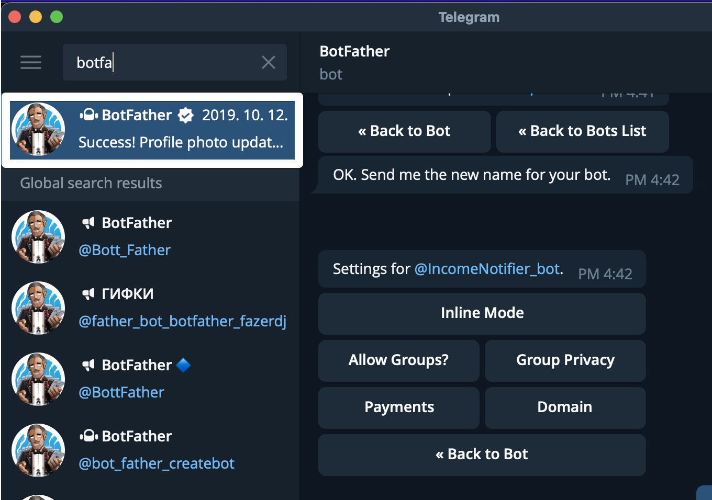

아래와 같이 `BotFather` 채팅방에서 `/newbot`을 입력한다

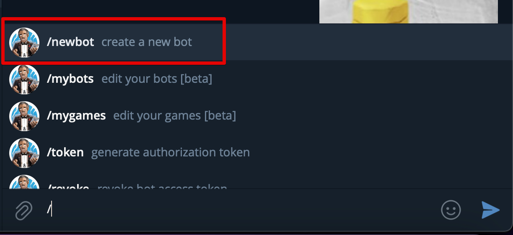

그리고 나선 봇 이름을 등록한다.

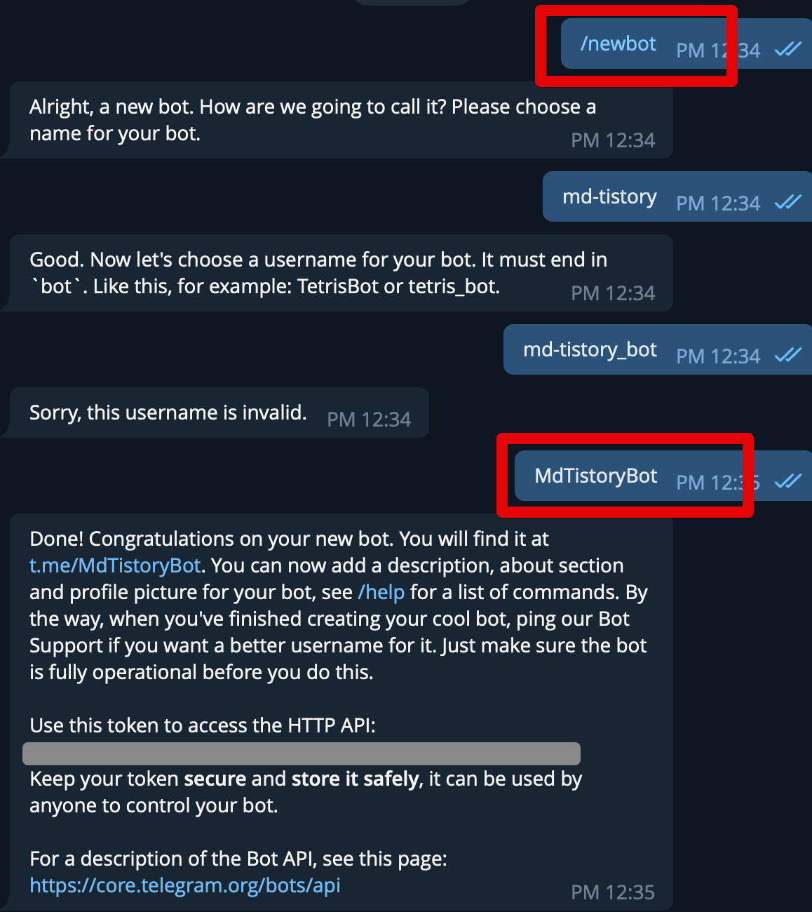

봇 이름은 다음과 같은 규칙이 필요하다

* `XXXBot` 혹은 `XXX_bot` 과 같이 마지막 뒤에 `Bot` 혹은 `_bot` 이 들어가야만한다

생성이 완료되었다면, 여기서 끝이 아니고 2개의 값을 가져와야 한다

* 텔레그램 봇 토큰
* 텔래그램 봇 채팅방 ID

정상적으로 생성되었다면 위 이미지의 회색 박스처럼 `Token` 이 나온다.  
이는 잠깐 두고,  
생성된 Bot 채팅방으로 이동해서 **간단하게 메세지를 하나 보낸다**.

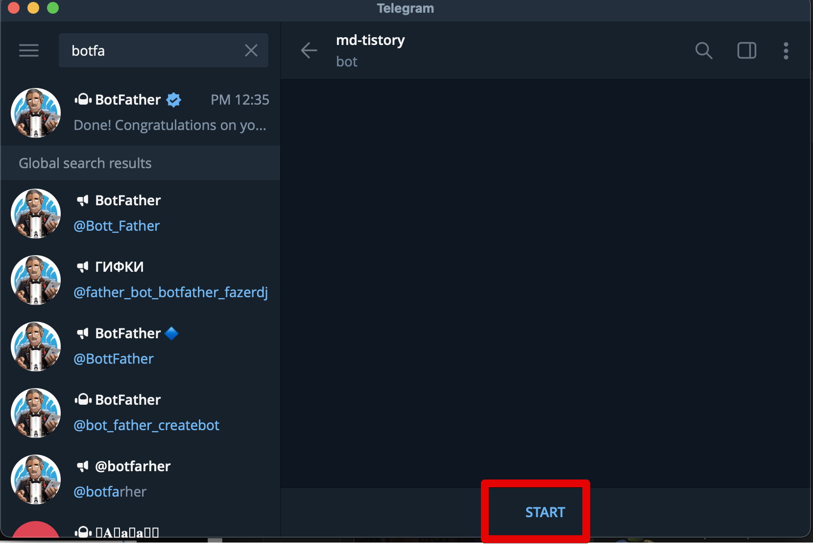

이 메세지를 보내고 나면 이제 텔레그램 API를 통해 채팅방 ID를 가져올 수 있다.  
  
아래 API로 생성된 토큰을 넣어 호출해본다.  
(HTTP `Get` 요청이라 브라우저에서 직접 입력해도 된다.)

* `https://api.telegram.org/bot봇토큰/getUpdates` 
  * `bot`과 `봇토큰` 을 합쳐야 한다

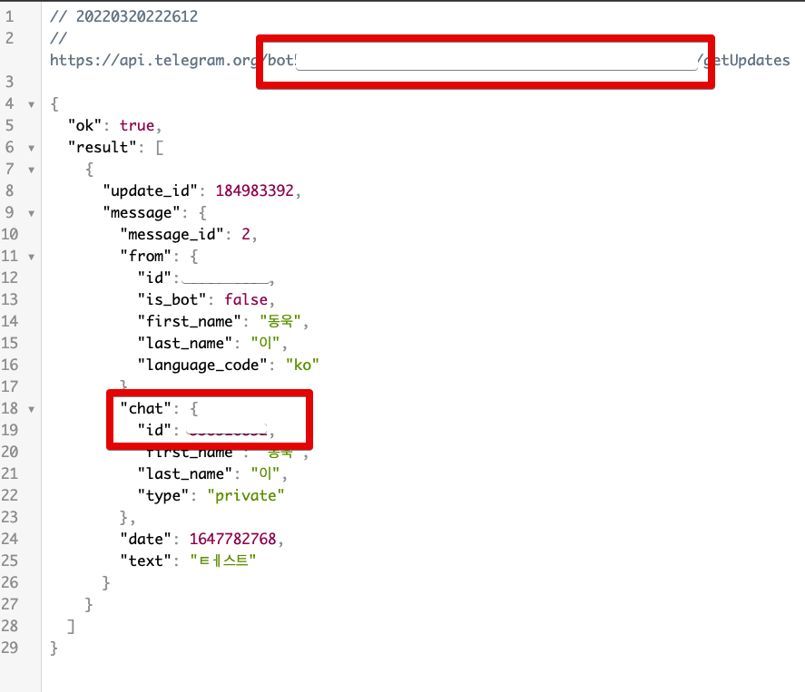

여기서 나온 `chat.id` 와 토큰값을 이제 Github Action에서 사용한다.

### bot profile 이미지 등록

여담으로 만약 생성한 Bot의 프로필을 수정하고 싶다면 다음과 같이 등록할 수 있다.  
  
아래와 같이 `BotFather` 로 가서 차례로 다음을 입력한다

*  `/setuserpic` -> 챗봇 선택 -> `BotFather` 에서 프로필 이미지 업로드

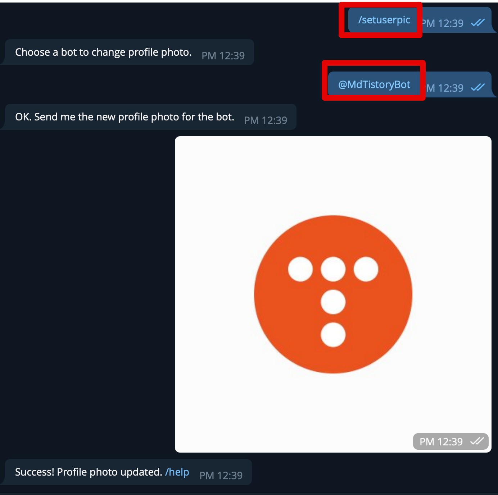

그럼 다음과 같이 챗봇의 이미지가 교체된다.

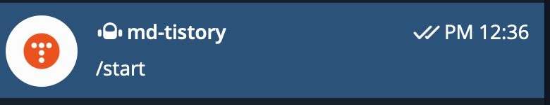

## 2. 토큰 등록 설정

1에서 생성된 토큰와 채팅방 ID를 Github Action의 Secrets에 등록한다.  
  
public repository를 사용하는 경우 텔레그램 토큰값이 외부에 공개되는 일을 막기 위함이다.  
  
해당 저장소로 이동한뒤, `Settings` -> `Secrets` -> `Actions` -> `New repository secret` 버튼을 클릭한다.  

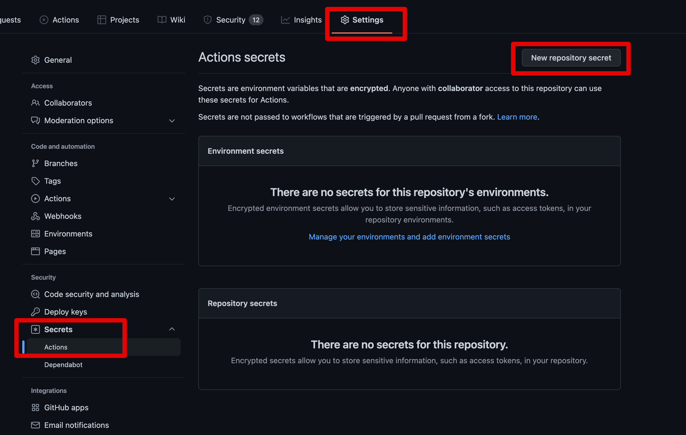

그리고 아래와 같이 생성된 채팅방 ID과 토큰을 차례로 등록한다

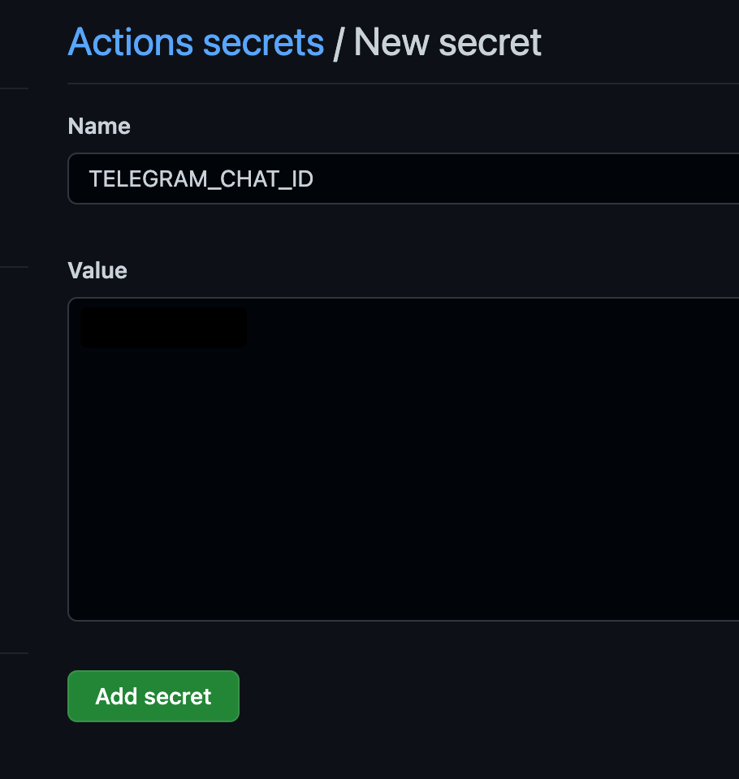

* `TELEGRAM_CHAT_ID`: 채팅방 ID
* `TELEGRAM_TOKEN`: 토큰

## 3. github yml 등록

마지막으로 `build` 결과를 텔레그램으로 보내기 위한 Github Action yml 파일을 설정한다.  
 
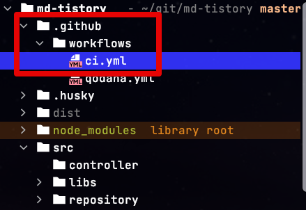

> 전체 코드는 [Github](https://github.com/jojoldu/md-tistory/blob/master/.github/workflows/ci.yml)에 있다.

사용할 Github Action 플러그인은 [telegram-action](https://github.com/appleboy/telegram-action) 이다.  
사용법이 굉장히 심플하고, 텔레그램 관련해서는 가장 많은 `star` 를 받았기 때문에 선택했다.  
  
기존에 Github Action의 Build 과정 마지막에 다음과 같이 코드를 등록한다

```yaml
....

      # 빌드 성공 메세지 발송
      - name: Send Build Success Message
        uses: appleboy/telegram-action@master
        if: success()
        with:
          to: ${{ secrets.TELEGRAM_CHAT_ID }}
          token: ${{ secrets.TELEGRAM_TOKEN }}
          format: markdown
          message: |
            Author: ${{github.actor}}
            
            Status: 😚 **Success**
            
            Commit message: ${{ github.event.commits[0].message }}
            
            [See changes](https://github.com/${{ github.repository }}/commit/${{github.sha}}) 

      # 빌드 실패 메세지 발송
      - name: Send Build Success Message
        uses: appleboy/telegram-action@master
        if: failure()
        with:
          to: ${{ secrets.TELEGRAM_CHAT_ID }}
          token: ${{ secrets.TELEGRAM_TOKEN }}
          format: markdown
          message: |
            Author: ${{github.actor}}
            
            Status: 😱 **Failure**
            
            Commit message: ${{ github.event.commits[0].message }}
            
            [link](https://github.com/${{ github.repository }}/actions)
```


> 텔레그램 메세지 발송과 별개로 빌드 & 테스트 & 테스트 레포트 생성 등의 과정을 등록하는 것은 [이전 포스팅](https://jojoldu.tistory.com/602)을 참고한다.

다음과 같이 등록이 마무리되고 Github 로 Push 하면 다음과 같이 메세지를 볼 수 있다.

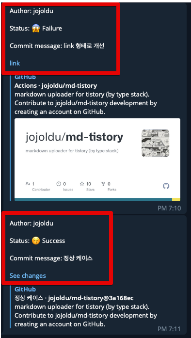

(캡쳐를 위해 일부러 실패와 성공 테스트를 둘다 진행했다)