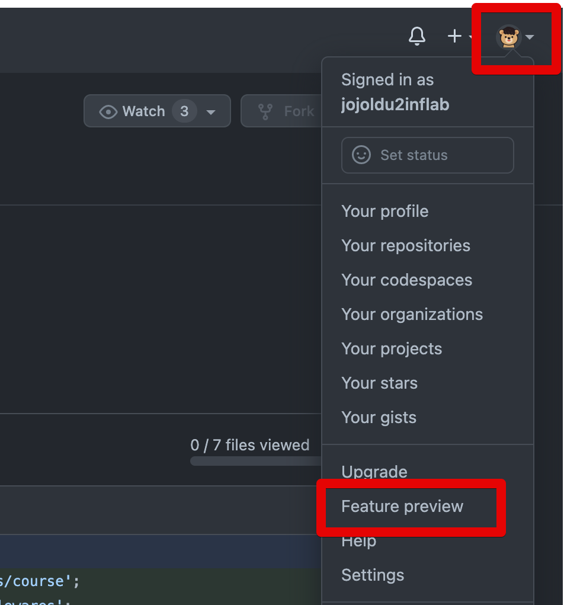
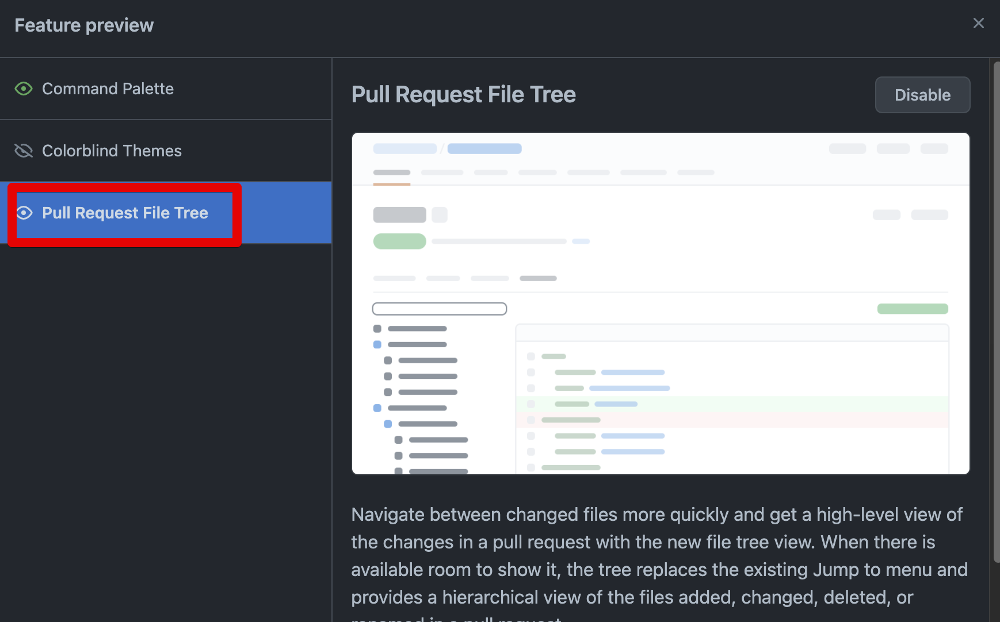
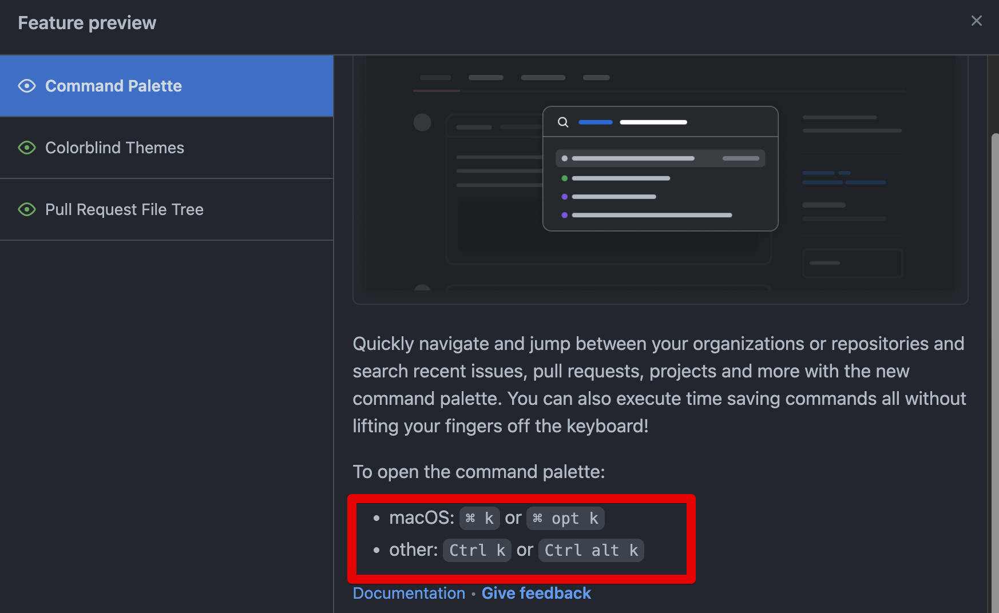
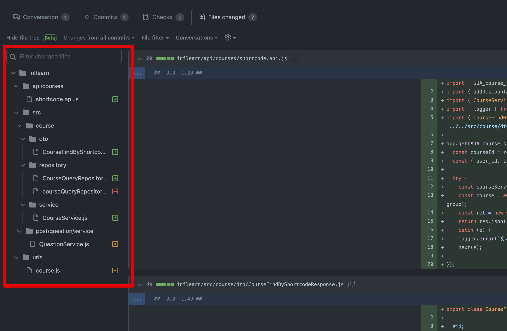
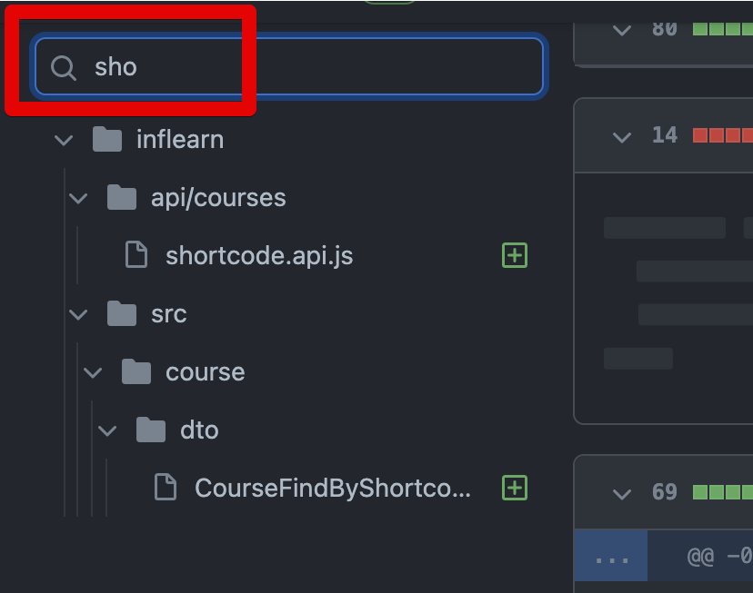
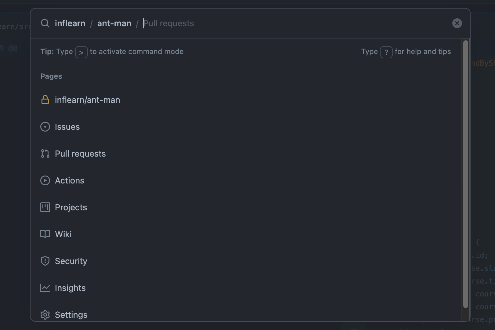

# Github 기능 미리 써보기 (Code Review시 디렉토리 미리보기)

Github 에는 앞으로 출시할 기능 (Beta) 을 미리 써볼 수 있는 옵션이 있습니다.  
특히 최근에 **Pull Request시 파일 트리**를 볼 수 있는 기능이 베타 출시되었는데요.  
코드리뷰시에 굉장히 큰 도움을 주기 때문에 바로 적용해서 써보시는 것을 추천드립니다.

> 이 포스팅은 2022.03.05에 작성된 것이기 때문에, 소개되는 베타기능들은 이후에 대부분 정식 출시된 상태일 것입니다. 

## 설정

Github 우측 상단의 프로필 아이콘을 클릭하신뒤, **Feature preview**를 선택합니다.

그럼 아래와 같이 Modal이 나오는데, 이때 원하시는 베타 기능들을 선택하시고 **Enable** 을 누르시면 됩니다.  
(Enable을 클릭하면 아래와 같이 Disable로 버튼이 변경됩니다.)

저는 여기서 Command Palette 와 Pull Request File Tree를 사용하도록 선택했습니다.  

설정하신 후에 새로고침을 해보시면 다음과 같이 Pull Request 화면의 좌측 사이드바에 **검색창과 파일/디렉토리**가 생긴 것을 볼 수 있습니다.

해당 검색창에서 파일명으로 검색도 가능하며, 파일 클릭시 **코드리뷰 화면에서도 바로 해당 파일로 이동**이 됩니다.

Command Palette도 적용되어 `Command + k` (맥 기준) 다음과 같이 Github 웹 사이트에서 커맨드로 여러 액션을 수행할 수 있습니다.

## 마무리

기존에 Octotree 를 통해서 코드리뷰시 디렉토리와 파일을 보던 입장에서는 아주 환영할만한 기능이 추가되었습니다.  
Github에서 이야기하는 여러 기능들을 미리 볼 수 있는 **Feature preview** 를 자주 보시면서 신규 기능이 나올때마다 사용해보시면 훨씬 재밌는 Github 경험을 해볼 수 있을것 같습니다.