# Github Two Factor 인증 설정하기 (feat. OTP)

보안상 문제로 사내 계정 혹은 그룹 계정 등은 Two Factor (2FA) 를 적용해야만 합니다.  
다른 분들의 블로그에선 대부분 SMS 인증 + Git 터미널 방식에 대해서만 소개되어 있어, OTP + GUT Client 에서의 적용 방법을 정리했습니다.  
  
## 0. 들어가기 전에

들어가기 전에 크롬 확장 프로그램이 설치되어 있어야만 합니다.  
  
[Authenticator](https://chrome.google.com/webstore/detail/authenticator/bhghoamapcdpbohphigoooaddinpkbai) 라고 불리는 OTP 코드 발급기입니다.  
  
굳이 Github의 2FA 때문이 아니더라도 AWS 2FA 등 여러 2FA 에서 유용하게 사용되니 이번 기회에 한번 설치해보시는것도 좋습니다.  
  
일단 이 플러그인 설치 후 다음으로 진행합니다.

## 1. Github 2FA 활성화

본인 Github 프로필에서 Settings 항목으로 이동합니다.

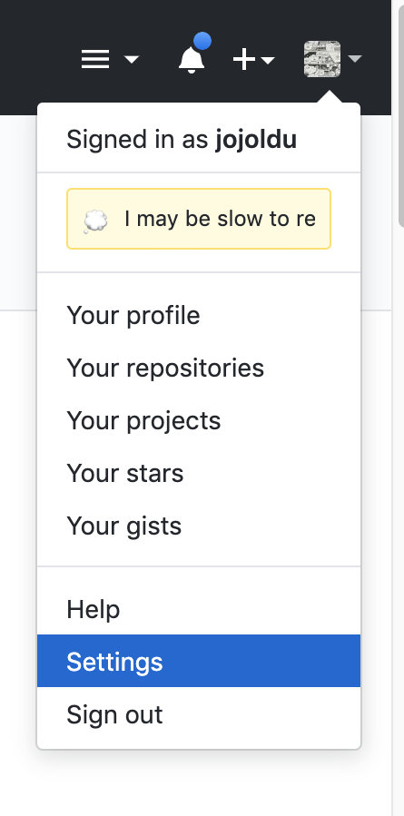

Security -> Enable two-factor 항목을 차례로 클릭합니다.

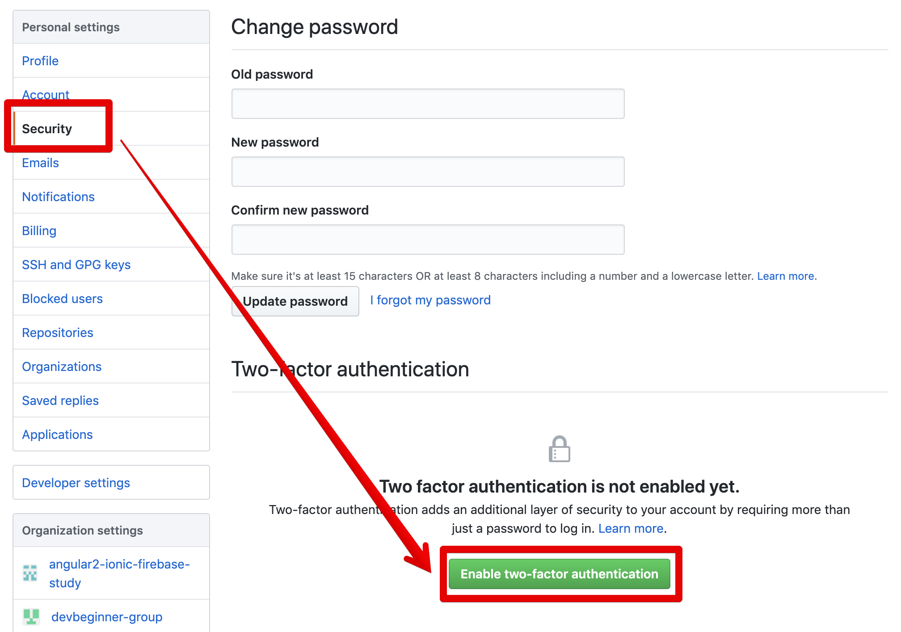

여기서 인증 방식을 OPT / SMS (문자) 중에 선택할 수 있는데요.  
SMS로 할 경우 안드로이드를 사용하시는 분들은 매번 폰으로 문자를 받아 눈으로 보면서 6숫자를 입력해야만 합니다.

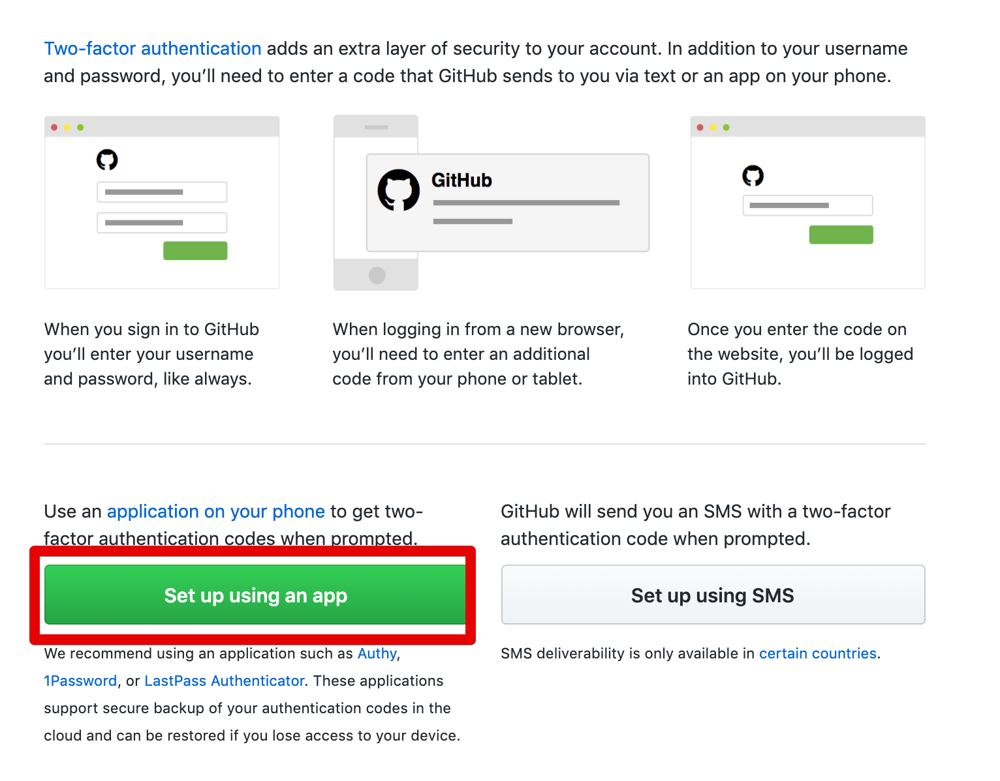

그 과정이 귀찮습니다.  
OTP의 경우 휴대폰이나 

복구용 코드가 자동으로 발급됩니다.  
2FA 인증 방법을 사용할 수 없을때 필요한 코드이므로 **별도로 관리**가 필요합니다.

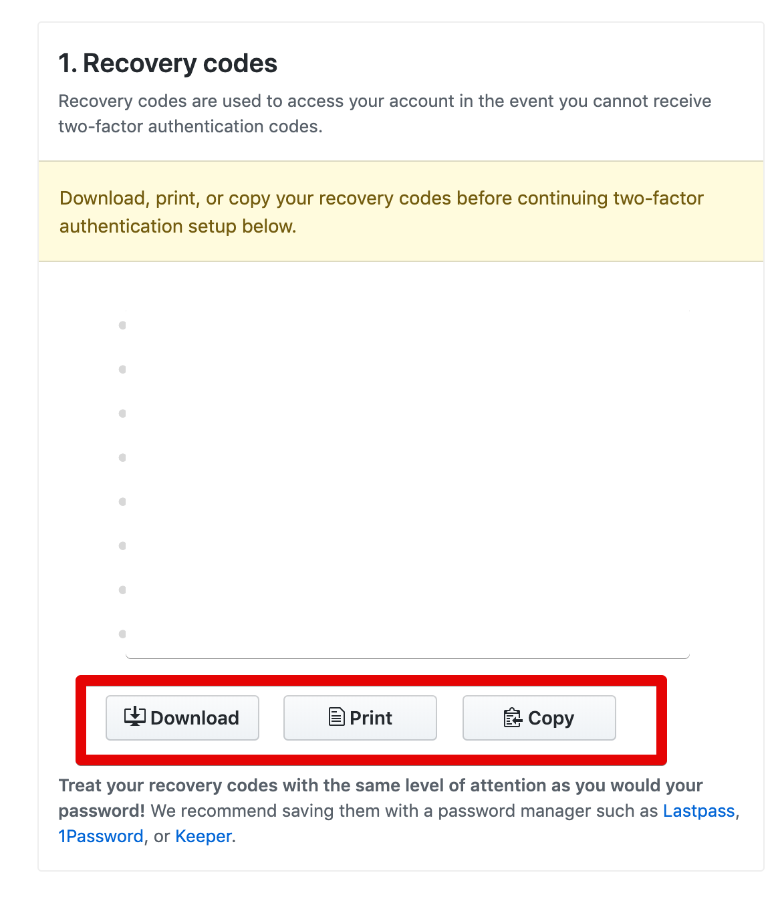

드랍박스, 에버노트 등 사용 중인 클라우드 서비스에 저장하시면 됩니다.  
(저같은 경우 Copy 하여 에버노트에 저장을 했습니다.)  
  
다음으로 넘어가시면 인증 바코드가 등장합니다.

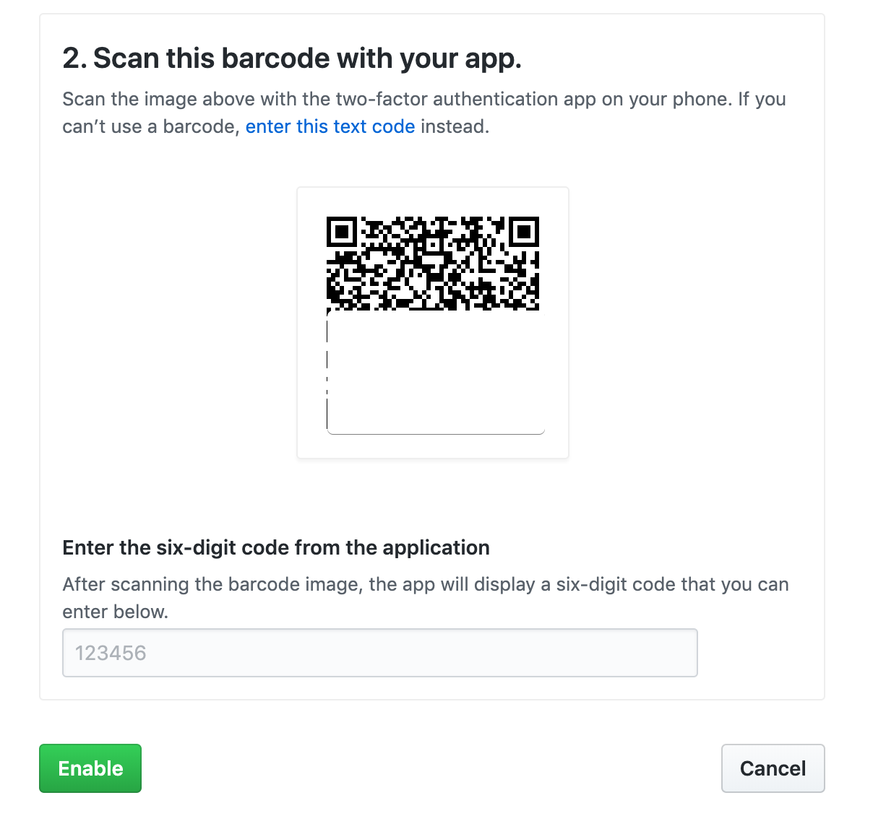

해당 바코드를 앞서 설치한 Authenticator 를 통해 스캔합니다.

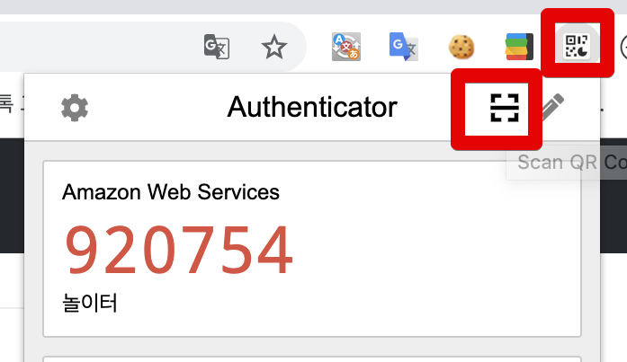

정상적으로 스캔 하시면 다음과 같이 본인 Github 계정이 정상적으로 추가되었다는 Alert를 볼 수 있습니다.

Authenticator 목록에 Github 계정이 추가된 것을 확인합니다.

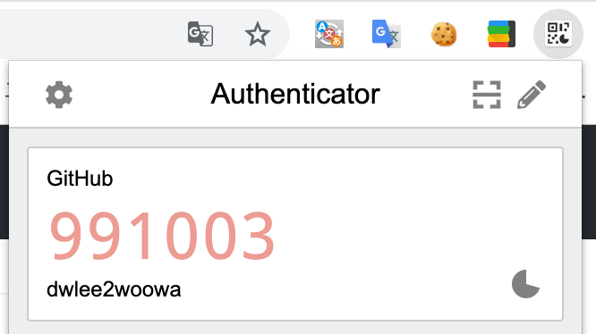

Authenticator에서 발급된 번호를 바코드가 있는 화면의 숫자 입력창에 입력하시면 인증 성공입니다.

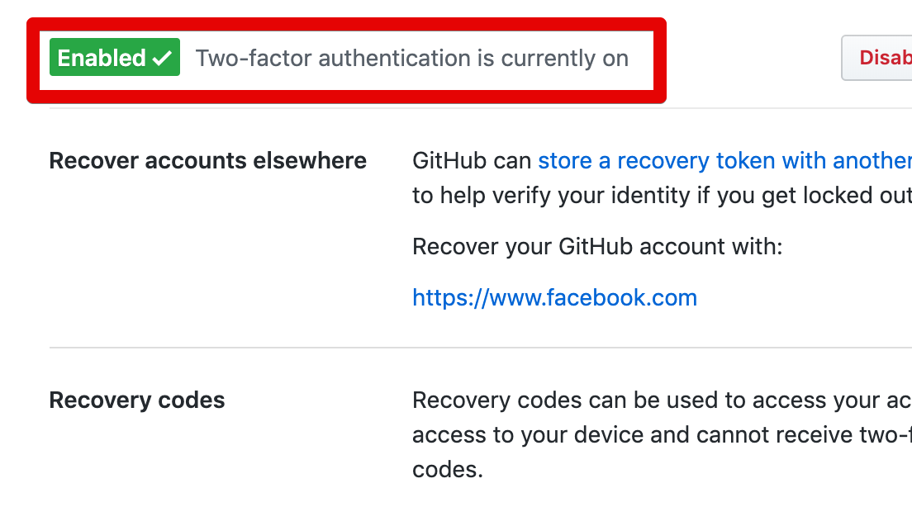

여기까지 하시면 2FA 적용 성공입니다.  
이후에는 로그인시마다 항상 아래와 같이 Authenticator 에서 코드를 발급 받아 입력하시면 됩니다.

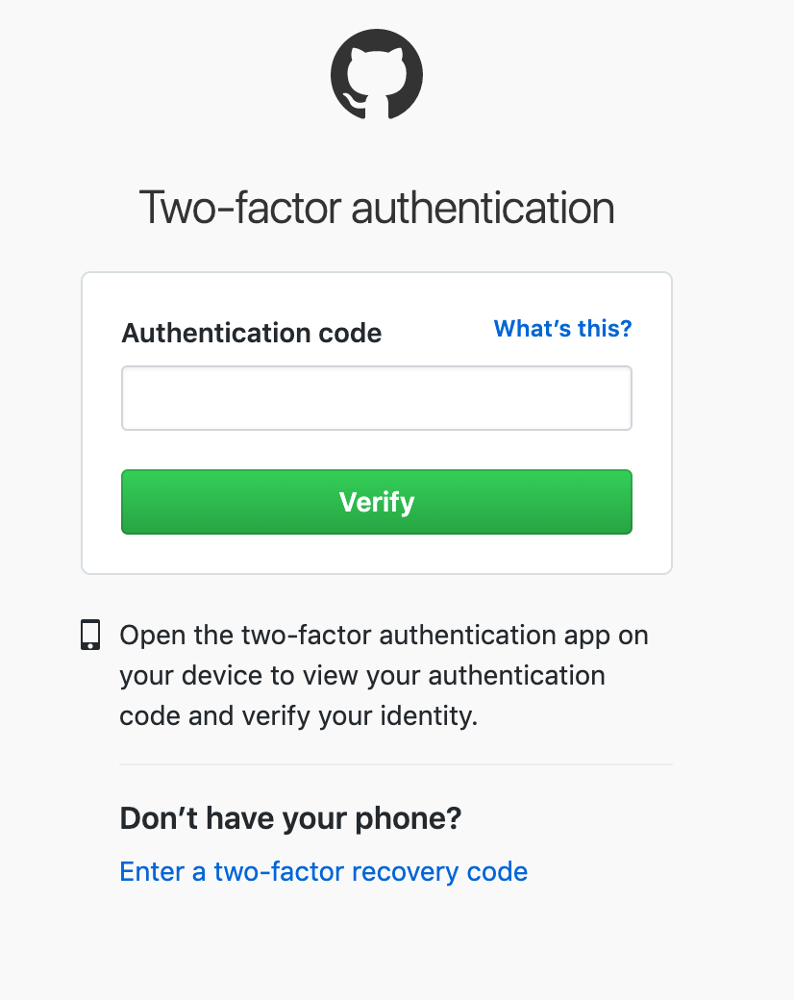

## 2. Gui Client 적용

Gui Client (SourceTree, IntelliJ 등) 에선 더이상 Github 계정의 비밀번호 방식으로는 사용할 수 없습니다.  

> ssh key의 경우 2FA 인증 후 다시 발급받으시거나 갱신하시면 됩니다.

2FA 인증을 하고나면 비밀번호 대신에 Access Token 값을 비밀번호처럼 사용할 수 있습니다.  
  
적절하게 저장소 접근 권한만 가진 Access Token을 발급 받고 이를 사용해보도록 하겠습니다.  
  
Github 프로필에서 Settings로 이동하신뒤 Developer settings를 클릭합니다.

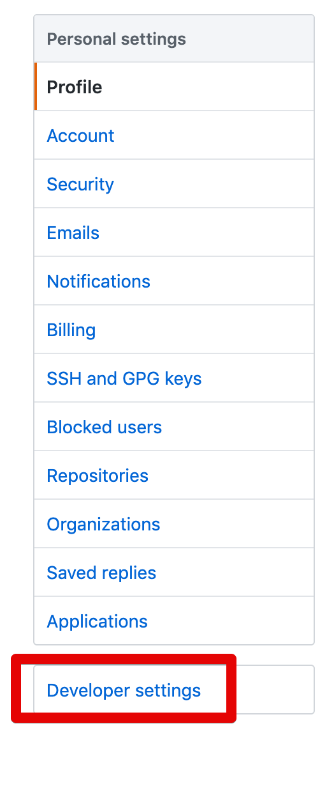

Personal access tokens -> Generate new token 을 차례로 클릭합니다.

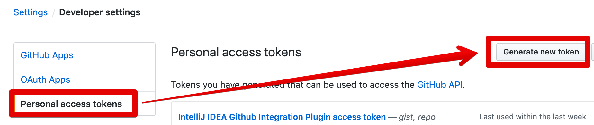

scope의 경우 write 권한 등은 필요하지 않기 때문에 저 같은 경우 **repo** 와 **gist** 만 체크하고 나머지는 다 체크하지 않았습니다.

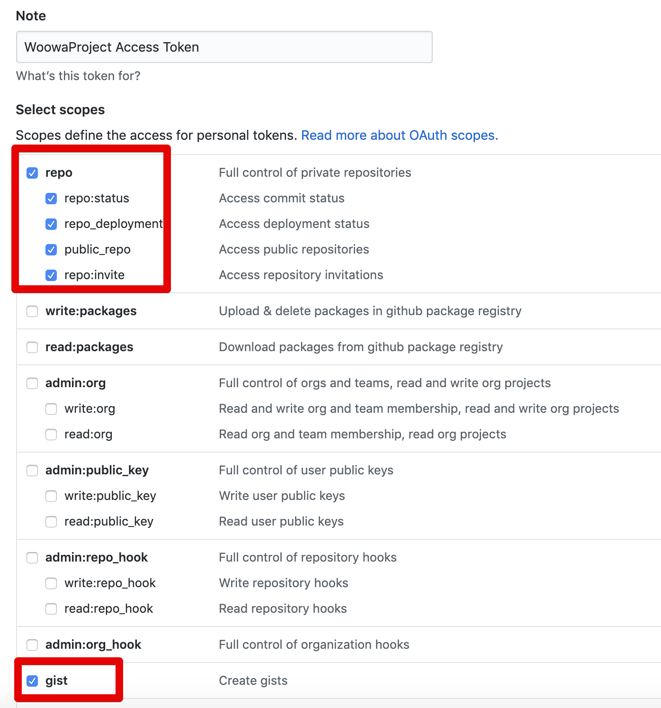

이렇게 발급 받은 Token값을 저장 후, 본인의 Gui Client에 등록합니다.

### 2-1. Source Tree

Preferences -> Account로 이동합니다.  
기존에 등록되어있던 정보가 있다면 Edit, 신규 등록이라면 Add 를 클릭합니다.

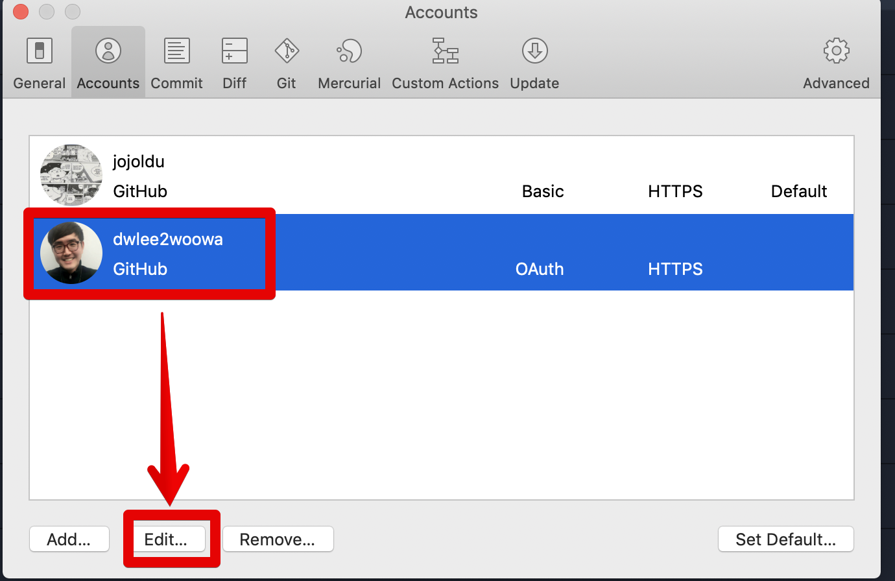

인증 방식을 Basic으로 선택 하신뒤, Password에 **생성한 AccessToken** 값을 입력합니다.

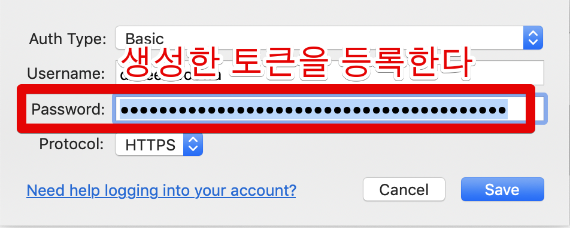

간단한 테스트용 브랜치를 생성하고 Push, Fetch 등에 대한 테스트를 해봅니다.

### 2-2. IntelliJ

SourceTree와 마찬가지로 IntelliJ 역시 비밀번호를 Access Token으로 변경합니다.  
  
Preferences -> Version Control -> Github 으로 이동 합니다.

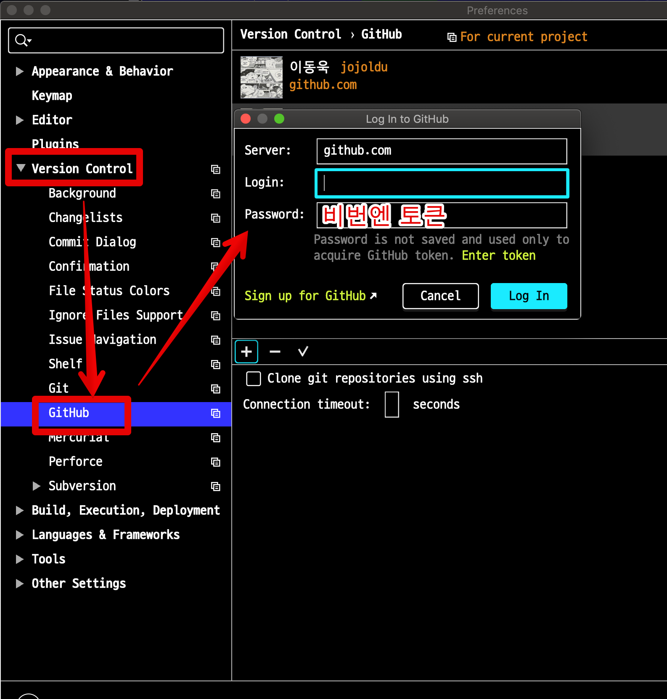

기존 계정 혹은 신규 계정의 비밀번호를 Access Token으로 변경 후 Github 기능을 테스트해봅니다.
