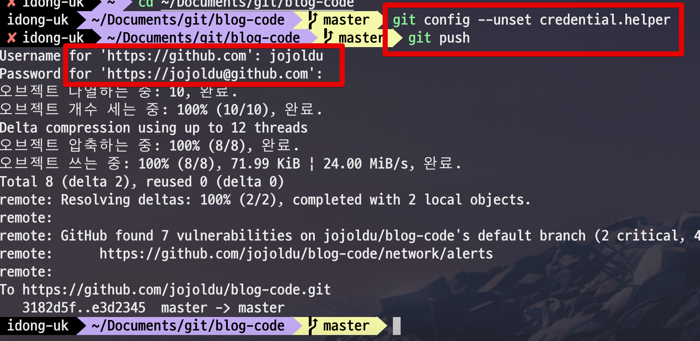

# Github 패스워드 교체시 로컬 비밀번호도 변경하기

Github 패스워드 변경시 기존에 패스워드 인증 방식을 사용하는 프로젝트들은 인증실패로 push와 같은 원격 명령어가 정상적으로 수행되지 않습니다.  
  
그래서 비밀번호를 다시 등록하는 방법을 소개드립니다.  
  

먼저 해당 프로젝트로 이동한 뒤

```bash
cd 프로젝트위치
```

Github 인증을 리셋시킵니다

```bash
git config --unset credential.helper
```

그리고 다시 ```Github push```를 진행해봅니다.

```bash
git push
```

그럼 아래와 같이 username과 password를 입력하라는 화면이 등장합니다.  
새로운 비밀번호를 입력하시면 정상적으로 비밀번호가 변경되어 사용됩니다.

```bash
Username for 'https://github.com':
Password for 'https://jojoldu@github.com':
```

