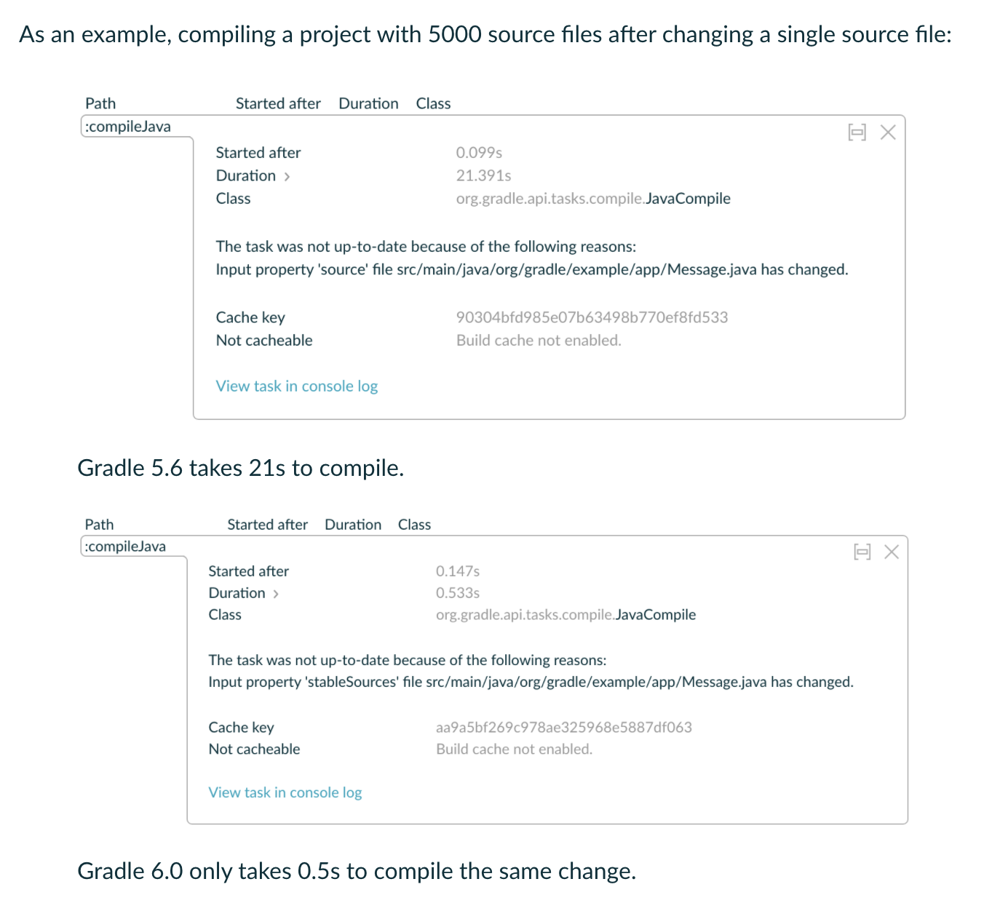
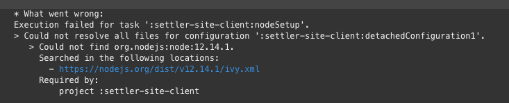

# Gradle5 -> 6 마이그레이션

최근 팀에서 운영중인 프로젝트의 Gradle 버전을 6으로 올리게 되었습니다.  
사유는 여러가지가 있는데요.  

* 점점 Spring Boot 최신 버전들이 최소한으로 요구하는 Gradle 버전이 높아지고 있고
  * Spring Boot 2.4는 Gradle **5.6.x 버전만** 혹은 6.3 이상의 버전만 지원합니다.
* Gradle 7.0이 곧 나올 예정
* 증분 컴파일 등의 성능 개선



> Gradle 5.6에선 21초, Gradle 6.0에선 0.5초

등등 여러 이유로 슬슬 올려야하는 시점이 되었습니다.  
  
Gradle 6으로 업그레이드에 관해서는 아래 2개의 글이 좀 더 상세하게 나와있으니 참고해주시면 좋습니다.

* [Gradle 6 Release Notes](https://docs.gradle.org/6.0/release-notes.html)
* [Gradle 5.x to 6.0 Migration Guide](https://docs.gradle.org/current/userguide/upgrading_version_5.html)

> 이 글은 상황에 따라 계속 변경/추가 될 수 있습니다.

## 0. Gradle 버전업

프로젝트의 Gradle 버전업은 **해당 프로젝트의 디렉토리**로 이동하여 다음과 같은 방법으로 진행할 수 있습니다.

```bash
gradle wrapper --gradle-version 6.7.1
```

## 1. Dependency

기존에 사용중이던 Dependency 함수인 ```compile```이 **Soft Deprecated** 되었습니다.  
  
즉, 6.7.1 버전에서도 사용은 가능하나, 언제 Deprecated 될지 모르니 ```compile``` 대신에 아래 2개로 변경하는 것을 추천드리는데요.

* ```implementation```
* ```api```


**as-is**

```groovy
dependencies {
    compile 'org.springframework.boot:spring-boot-starter-data-jpa'
    compile 'com.h2database:h2'
}
```

**to-be**

```groovy
dependencies {
    api 'org.springframework.boot:spring-boot-starter-data-jpa'
    implementation 'com.h2database:h2'
}
```

둘에 대해 좀 더 알아보겠습니다.

### 1-1. implementation

거의 대부분의 경우에 compile을 대신해서 사용하시면 됩니다.  
다만, ```implementation```을 통해 의존성이 등록되면, **하위 프로젝트들은 해당 의존성을 가질 수 없습니다**.  
  
즉, 아래와 같이 module-api (하위모듈)가 module-core (상위모듈)을 의존하고 있다면  
  
**module-core**

```groovy
dependencies {
    api 'org.springframework.boot:spring-boot-starter-data-jpa'  // module-api에서 사용가능
    compile 'org.springframework.data:spring-data-envers' // module-api에서 사용가능
    implementation 'com.h2database:h2' // module-api에서 사용 X
}
```

**module-api**

```groovy
dependencies {

    compile project(':settler-core')
```

moduel-api에서는 module-core에서 ```implementation```으로 선언된 ```'com.h2database:h2'```는 사용할 수가 없습니다.  
  
이렇게 함으로써 멀티 모듈에서의 의존관계에 개방/폐쇄를 적용할 수가 있습니다.

### 1-2. api

위에서 언급한대로 기존의 ```compile```과 거의 유사하게 작동하는데요.  
다만, 일반적으로 사용되는 plugin인 ```java``` 외에 ```java-library``` 가 있어야만 사용할 수 있습니다.

```groovy
plugins {
    id 'java-library'
}

apply plugin: 'java-library'

dependencies {
    api 'org.springframework.boot:spring-boot-starter-data-jpa'
}
```

아직까지 java & Kotlin 혹은 Java & Groovy 등의 조합에서 ```java-library``` 플러그인으로 100% 커버가 되는지 확인이 안되어서 ```java```와 함께 사용하는 것을 추천드립니다.

> 이 둘에 대한 실무적인 사용법은 [멀티모듈 설계 이야기 with Spring, Gradle](https://woowabros.github.io/study/2019/07/01/multi-module.html#3-%EC%A0%91%EA%B7%BC-%EA%B0%9C%EB%B0%A9%ED%8F%90%EC%87%84) 글을 참고하시면 좋습니다.

## 2. Jacoco Plugin

Gradle 6으로 업데이트 이후 Jacoco 플러그인에서 아래와 같은 메세지가 발생합니다.


```java
The JacocoReportBase.setExecutionData(FileCollection) method has been deprecated.
```

그럴 경우 다음과 같이 변경합니다.  
  
**as-is**

```groovy
executionData = files("${buildDir}/jacoco/jacoco.exec")
```

**to-be**

```groovy
executionData.from = files("${buildDir}/jacoco/jacoco.exec")
```

## Sonar Plugin

Gradle 5를 쓰고 계신다면 문제가 없는데, 만약 Gradle4에서 한번에 6으로 올리면 Sonar 플러그인이 가끔 아래와 같은 에러 메세지와 함께 작동이 안될 수 있습니다.

```bash
org.gradle.api.tasks.SourceSetOutput.getClassesDir()Ljava/io/File
```

Sonar 플러그인이 Gradle 5부터는 최소 **2.7버전 이상**이어야 하므로, 아래와 같이 플러그인 버전을 올립니다.

```groovy
plugins {
    id "org.sonarqube" version "2.7"
}
```

## Node Plugin

기존에 사용하던 [Node Gradle 플러그인](https://github.com/srs/gradle-node-plugin)이 더이상 개선되지 않는 이슈가 있습니다.

* [Github 이슈](https://github.com/srs/gradle-node-plugin/issues/351)

그래서 Gradle 6부터는 정상작동을 하지 않습니다.
  


해당 플러그인을 Fork한 [신규 플러그인](https://github.com/node-gradle/gradle-node-plugin)으로 교체를 하면 정상적으로 작동을 합니다.

**as-is**

```groovy
plugins {
    id 'com.moowork.node' version '1.3.1'
}

apply plugin: 'com.moowork.node'
```

**to-be**

```groovy
plugins {
    id "com.github.node-gradle.node" version "2.2.4"
}

apply plugin: 'com.github.node-gradle.node'
```

## Querydsl Plugin

Honeymon님의 블로그글에서 아주 상세하게 적혀있기 때문에 여기서는 최종 코드만 반영하겠습니다.

* [그레이들 Annotation processor 와 Querydsl](http://honeymon.io/tech/2020/07/09/gradle-annotation-processor-with-querydsl.html)

> 왜 이렇게 해야하는지, 어떤게 그동안 이슈였는지 아주 상세하게 설명해주시니 Querydsl을 계속해서 사용하신다면 꼭 읽어보시길 추천드립니다.

일단 아래처럼 하면 Gradle5에서도 정상작동합니다.

```groovy
apply plugin: "com.ewerk.gradle.plugins.querydsl"

def queryDslDir = "src/main/generated"
querydsl {
    library = "com.querydsl:querydsl-apt:4.2.2" // 사용할 AnnotationProcesoor 정의
    jpa = true
    querydslSourcesDir = queryDslDir
}
sourceSets {
    main {
        java {
            srcDir queryDslDir
        }
    }
}

compileQuerydsl {
    options.annotationProcessorPath = configurations.querydsl
}

configurations {
    querydsl.extendsFrom compileClasspath
}
```

다만 Querydsl 플러그인이 언제까지 지원할지 모르니 Gradle 6부터는 다음과 같이 사용합니다.

> Querydsl Plugin이 제거된 방법입니다.

```groovy
configure(querydslProjects) {
    apply plugin: "io.spring.dependency-management"

    dependencies {
        compile "com.querydsl:querydsl-jpa"
        compile "com.querydsl:querydsl-apt"
        annotationProcessor "com.querydsl:querydsl-apt:${dependencyManagement.importedProperties['querydsl.version']}:jpa" // querydsl JPAAnnotationProcessor 사용 지정
        annotationProcessor "jakarta.persistence:jakarta.persistence-api:2.2.3"
        annotationProcessor "jakarta.annotation:jakarta.annotation-api:1.3.5"
    }

    // querydsl 적용
    def generated='src/main/generated'
    sourceSets {
        main.java.srcDirs += [ generated ]
    }

    tasks.withType(JavaCompile) {
        options.annotationProcessorGeneratedSourcesDirectory = file(generated)
    }

    clean.doLast {
        file(generated).deleteDir()
    }
}
```