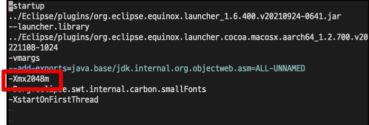
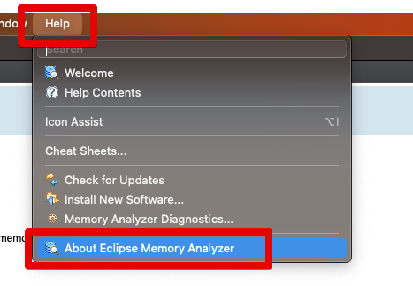
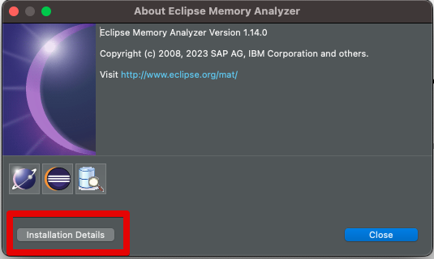
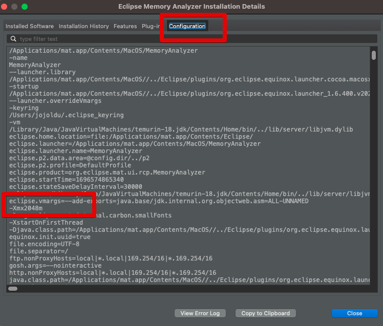

# Eclipse Mat xmx 조정 (Mac OS)

Heap Dump를 분석하기 위해 Eclipse mat를 종종 사용한다.

```bash
An internal error occurred during: "Parsing heap dump" 
Out of Memory
```


```bash
vim /Applications/mat.app/Contents/Eclipse/MemoryAnalyzer.ini
```

원하는 크기 만큼의 메모리를 할당한다.  
나는 2048mb 를 할당했다.  
(기본값은 1024mb)



mat 을 재시작하고 정상적으로 적용되었는지 확인해본다.





