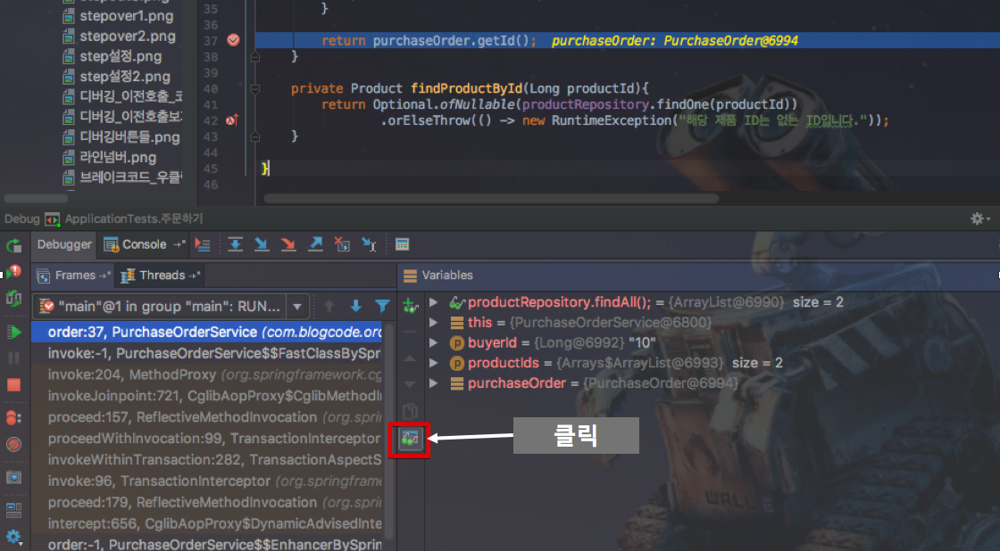
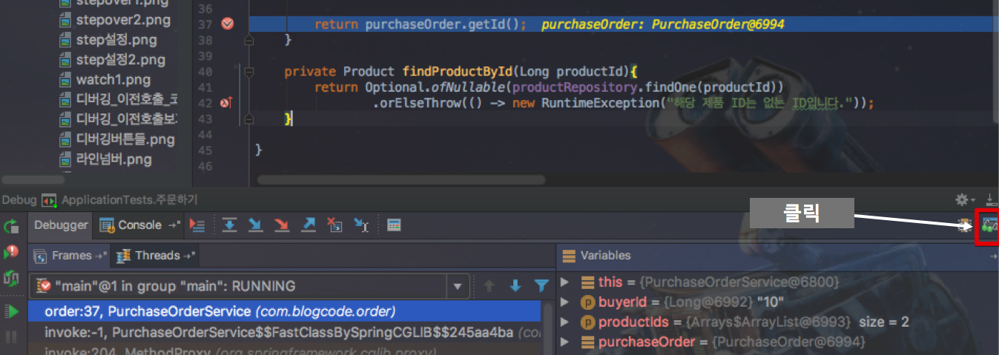
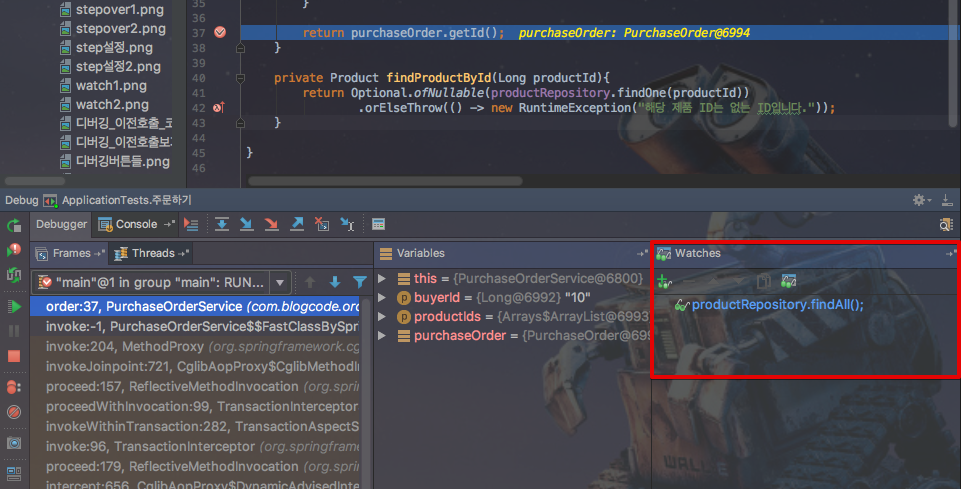
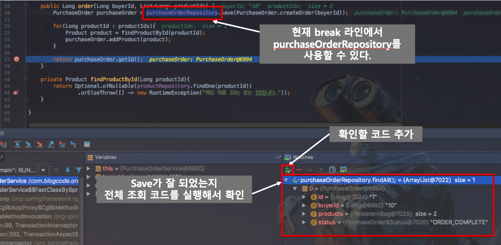

# Intellij-debugging

안녕하세요? 이번 시간엔 intellij의 debugging 을 간단하게 진행해보려고 합니다.  
모든 코드는 [Github](https://github.com/jojoldu/blog-code/tree/master/intellij-debugging)에 있기 때문에 함께 보시면 더 이해하기 쉬우실 것 같습니다.  
(공부한 내용을 정리하는 [Github](https://github.com/jojoldu/blog-code)와 세미나+책 후기를 정리하는 [Github](https://github.com/jojoldu/review), 이 모든 내용을 담고 있는 [블로그](http://jojoldu.tistory.com/)가 있습니다. )<br/>
  
굉장히 기초적인 수준이지만, ```System.out.println```으로 디버깅 하셨던 분들에게 도움이 될것 같아 정리하였습니다.  

## 주요 단축키

꼭 디버깅이 아니더라도 아래 단축키 정도는 익혀두면 여러모로 쓸 곳이 많다.

* ```shift + shift``` : 전체 검색 (file, action 모두 검색)


* ```command + shift + a``` : action 검색 (설정, Refactor 등)


* ```command + shift + o``` : 파일 찾기


* ```command + e``` : 최근 열었던 파일 리스트 보기


* ```command+[``` / ```command+]``` : 이전/다음 포커스로 이동

### 단축키 팁

빠른 디버깅을 위해서 단축키를 익혀놓으면 편하다.  
하지만 하나하나 찾아서 하기는 귀찮으니, 아래 처럼 ```key promoter``` 플러그인을 설치하자.


설치하면 **내가 클릭한 기능의 단축키**를 바로 보여준다.  


단축키를 확인 한 후, 다음부터는 단축키로 명령을 실행하자.

## Break Point

습관적으로 ```run```을 실행하지만, 로컬 개발에서는 웬만하면 ```debug```로 실행하자.  
어플리케이션 구동 중에 Break Point를 사용하려면 ```debug```여야만 한다.  
  
코드 좌측의 여백을 우클릭하면 ```Show Line Numbers```가 나오는데 이를 체크하면 아래처럼 코드 라인에 숫자가 부여된다.  
에러가 발생했을 때, 몇 번째 Line에서 발생했는지 ```log```에 표시되는데, 저 표시가 없으면 개발자가 보기 힘드니 **미리 체크**해놓자.


**라인 넘버와 코드 사이의 여백을 클릭**하면 아래처럼 그 Line에 Break Point가 표시 된다.


어플리케이션이 ```debug``` 모드일때, 해당 Break Point가 지정된 라인이 실행되는 시점에서 멈추게 된다.  
이때 여러 값을 확인하고, 명령어를 실행하면서 디버깅을 시작하면 된다.   
추가로 여기서 **Break Point를 우클릭** 하면 **조건으로 break**를 걸 수가 있다.  
(굉장히 중요함)


(productId가 2L일때만 위 point에서 break가 되도록 지정)  

특히나 ```for```, ```while```등의 **반복적인 행위속에, 특정값이 들어올때만 break**를 하고 싶은 때가 있다.  
이때 정말 유용하게 사용할 수 있는 기능이다.

## 디버깅 버튼

위 내용을 통해 break를 걸게 되면, 아래처럼 여러 버튼을 사용할 수 있다.  


(break가 된 상태에서만 사용 가능하다)  

### resume

* 단축키 : ```option+command+r```
* 기능 : **다음 break point로 이동**


첫번째 break point에서


다음 break point로 이동한다.  
  
이클립스의 resume(```F8```)과 동일한 기능이다.  
  
step 버튼들은 왼쪽에서 오른쪽 순으로 하겠다.

### step over

* 단축키 : ```F8```
* 기능 : 현재 break 된 파일에서 **다음 라인 이동**


break 걸린 라인을 전부 실행 후, 다음라인으로 이동한다.


이 기능을 몰라서 라인 하나하나에 전부 break를 걸었다면, ```F8```을 사용하자.

### step into

* 단축키 : ```F7```
* 기능 : 현재 break 된 라인에서 **실행하고 있는 라인**으로 이동한다.


break 걸린 라인에서 다음 실행될 코드는 ```PurchaseOrder.createOrder```다.  
이때 ```F7```을 누르면


이렇게 ```createOrder```로 이동한다.

### Force step into

* 단축키 : ```option+shift+F7```
* 기능 : 다음 실행되는 라인으로 이동하나, ```step into```와 달리 ```Stepping```을 무시하고 진행한다.  
  
예를 들어, ```command+shift+a``` -> ```stepping```으로 설정창을 오픈후,


아래처럼 ```skip simple getters```를 **체크** 하자.


이렇게 한 뒤, ```getter``` 메소드를 호출하는 곳에 break point를 지정한 후,


번갈아가며 step into와 force step into를 입력해보자.  
  
**step into**(```F7```)


이렇게 메소드 invoke 영역으로 바로 이동한다.  
  
반면에  
  
**force step into**(```option+shift+F7```)  


설정과 무관하게 ```getter``` 메소드까지 이동한다.  
굳이 확인이 불필요한 ```getter```, ```생성자``` 등에 skip 옵션을 설정한 뒤, **skip이 필요할때는 step into**로, **전부 확인이 필요하다면 force step into**로 이동하면서 디버깅 하면 된다.

### Step out

* 단축키 : ```shift+F8```
* 기능 : 현재 break 된 라인에서 **호출한 곳으로 이동**한다.


step into 로 ```createOrder``` 메소드로 이동 후, 


step out의 단축키인 ```shift+F8```을 입력하면,


메소드를 빠져나오게 된다.  
  
보통은 ```step into```로 **파고들어간 라인을 빠져나오려할때** 많이 사용한다.

### Drop Frame

* 단축키 : 없음
* 기능 : **call stack을 거슬러 올라간다**.

이것만 보면 step out과 별차이 없어 보이는데, 큰 차이점은 step out은 해당 라인이 **실행된 후 돌아**가지만, drop frame은 해당 라인이 **실행되기 전에** 돌아간다.


### Run to Cursor

* 단축키 : ```option+F9```
* 기능 : 포커스 되어있는 라인으로 이동


위 처럼 break된 상태에서 다음에 실행될 코드 중, ```ApplicationTests```의 ```assert```에 포커스를 두고,


(51라인에 포커스를 두었다.)  

여기서 ```option+F9```를 누르면 


이렇게 포커스가 지정된 51라인으로 break가 이동한다.  
  
보통 break point로 지정하지 않고, **단발성으로 break를 걸고 싶을때** 사용한다. 

## Watch와 Call Stack

break point와 디버그 버튼들로 break line을 사용하는 법과 이동하는 법을 배웠다.  
이제는 break된 라인에서 어떤 일이 가능한지 확인하겠다.

### Evaluate

break 된 상태에서 코드를 실행할 수 있는 방법은 2가지가 있다.  
**Evaluate**와 **Watch**인데, 둘 중에 한가지만 사용하기 보다는 둘다 인지하고 그때그때 상황에 따라 사용하면 될것 같다.  
  
디버깅 버튼들 가장 우측(```run to cursor``` 우측)에 계산기처럼 되어 있는 버튼이 **Evaluate** 버튼이다.

* 단축키 : ```option+F8```
* 기능 : break 된 라인에서 사용가능한 모든 코드를 실행할 수 있음

**Evaluate**를 클릭하면 아래와 같이 팝업이 하나 등장하는데, 여기서 확인하고 싶은 코드를 입력하고 실행시키면 결과를 바로 확인할 수 있다.


모든 코드를 사용할수는 없다.  
**현재 라인에서 사용 가능한 코드** (메소드 변수, 클래스 필드 등)만 사용할 수 있다.

### Watch

바로 위 **Evaluate**와 거의 동일한 기능이다.  
사용법은 간단하다.  
먼저 디버그 모드에서 아래처럼 watch를 활성화 시키자.





위 클릭을 따라가면 아래와 같은 형태가 된다.



우측 하단에 있는 ```watches```에서 우리는 마음껏 디버깅 코드를 작성해보면 된다.  
예를 들어, ```purchaseOrderRepository.save``` 기능이 잘 수행되었는지 확인하기 위해, 아래와 같이 확인해볼 수 있다.



**해당 라인에서 가능한 모든 값, 메소드를 사용**할 수 있다.  
단순한 변수값부터 시작해서 ```Autowired```된 코드까지 전부 사용가능하다.  

### Evaluate vs Watch

2개의 기능은 동일하다.  
단, Evaluate의 경우 코드를 계속 **수동 실행**해야하지만, Watch의 경우 삭제하지 않는한, break line이 실행될때마다 **자동 실행**된다.  
값을 변경하는 코드를 watch에 등록했다면 **의도치 않게 값이 변경**되서 다른 로직을 수행하게 되는 경우도 있으니 주의하자.  
하지만 Watch는 **여러 디버깅 코드의 결과를 동시에 확인**이 가능하고, 반복적으로 디버깅 코드를 사용할 필요 없어서 개인적으로 더 선호한다.

> evaluate를 선호하는 분들의 경우 **단축키** 때문에 많이들 사용한다.  
watch는 기본 단축키가 없어 마우스를 사용하거나, 단축키를 추가해야하는데 evaluate는 ```option+F8```으로 열고 바로 코드 작성 후 실행하면 되서 사용하기 편하다

### Call Stack

디버깅 화면의 좌측 하단에는 해당 **break line에 오기까지의 call stack 이 출력**된다.  
이를 통해 이전에 어떤 값들이 넘어 온것인지, 이전에 다른 연산을 했으면 어떻게 값이 바뀔지를 모두 확인할 수 있다.  
  
예를 들어, ```order``` 메소드를 호출한 ```test``` 코드의 값을 확인하고 몇가지 연산식을 사용한다고 하자.  
  
좌측 하단의 Call Stack에서 찾고자 하는 코드라인을 클릭하면 해당 라인으로 이동하게 된다.


이동후에는, break line에서 했던것 처럼 ```Variables```와 ```Watches```를 이용해 확인하고자 하는 값과 코드를 확인하면 된다.
  
특히 Spring과 같은 **프레임워크에서 어떻게 코드가 실행되고 값이 변경되는지 확인**할때 굉장히 유용하게 사용된다.  


## 후기

이미 많은 분들이 아실 수 있겠지만, 적지 않은 분들이 **break point와 resume 버튼만 사용**하는 것을 보게 되었습니다.  
조금이나마 IntelliJ로 디버깅하시는데 도움이 되셨으면 하는 바램입니다.  

IntelliJ는 정말 좋은 툴입니다.  
이외에도 많은 기능들이 담겨 있기에 공유할만한 내용들이 발견될때마다 꼭 정리해서 남기도록 하겠습니다.  
  
끝까지 읽어주셔서 감사합니다^^ 


