# Intellij-debugging

Good morning? This time I'm going to do a simple debugging of intellij.
All code is in [Github](https://github.com/jojoldu/blog-code/edit/master/intellij-debugging/README_EN.md), so it's easier to understand if you look at it together.
  
It is a very basic level, but it seems to be helpful for those who debugged with ```System.out.println```.  

## Main Hotkeys

It is not necessarily debugging, but there are many places to write if you learn about the following shortcut key.

* ```Shift + shift```: Full search (search all files and actions)

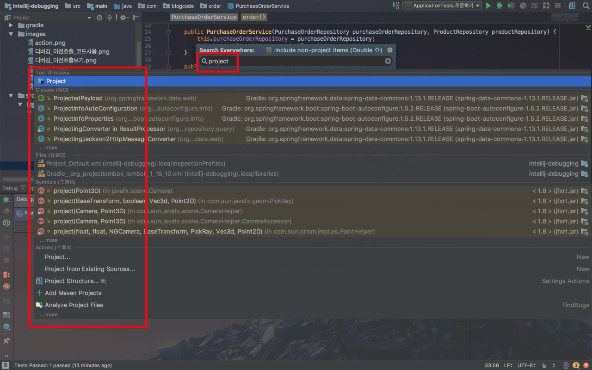

* ```Command + shift + a```: search for action (setting, refactor, etc.)

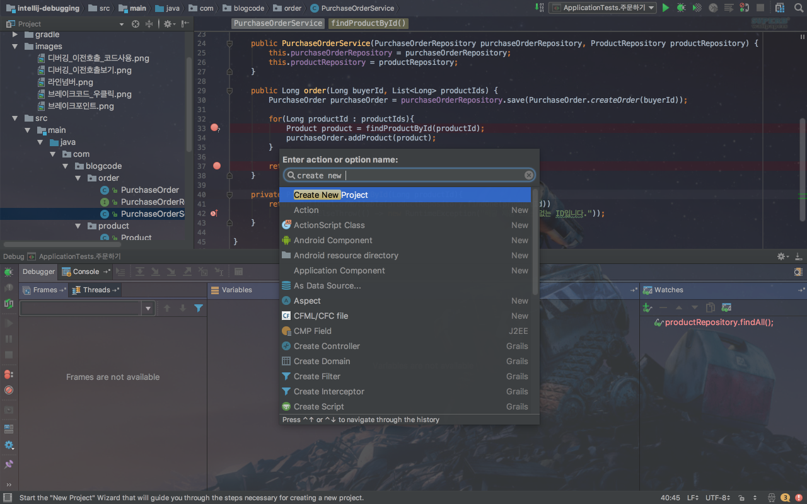

* ```Command + shift + o```: Find files

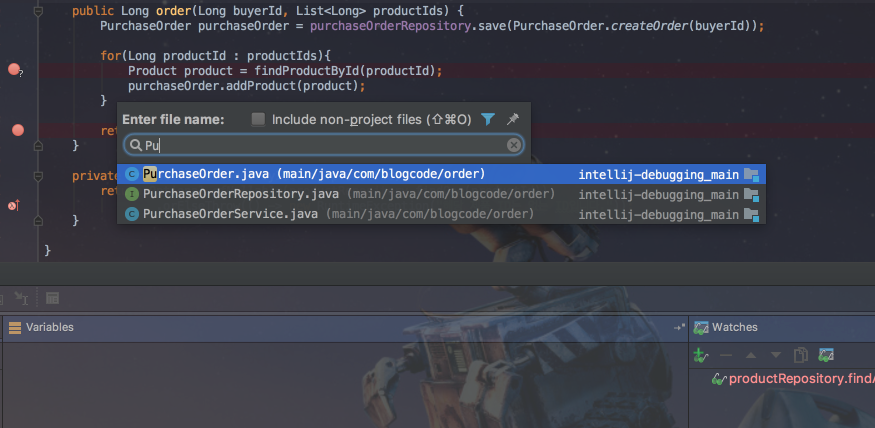

* ```Command + e```: View recently opened file list


* ```Command + [``` / ```command +]```: Move to previous / next focus

### Hotkey Tips

It is easy to learn shortcuts for quick debugging.
But it is annoying to find one by one, so let's install the ```key promoter``` plugin as shown below.

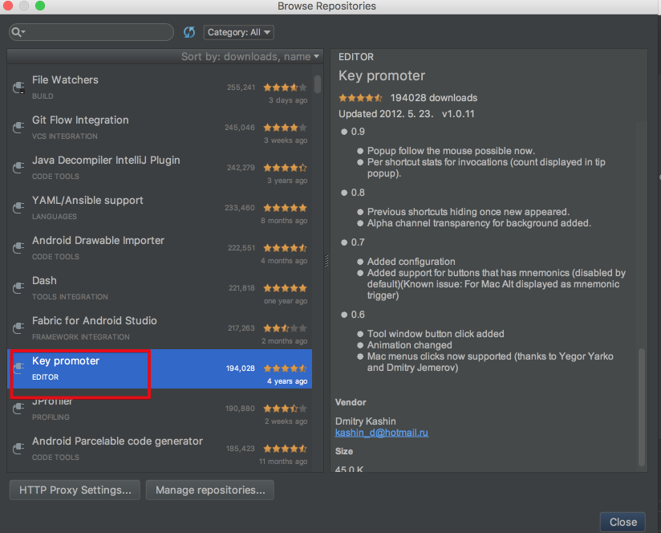

Once installed, it will show you the shortcuts **for the features you've clicked on**.

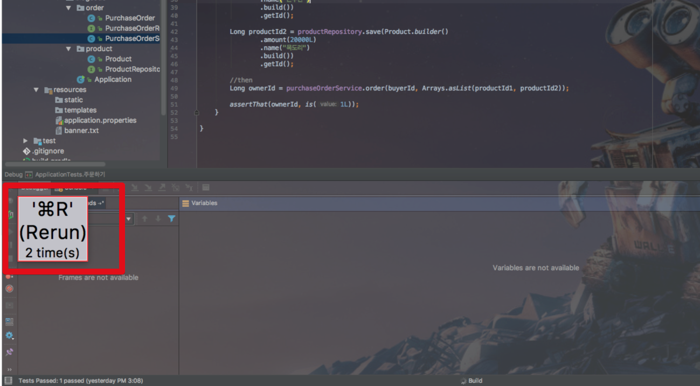

After checking the hotkeys, run the commands with the hotkeys from now on.

## Break Point

```Run``` habitually, but in local development you should run ```debug``` if you can.  
To use a breakpoint while running an application, it must be ```debug```.  
  
Right-click on the margin to the left of the code to see ```Show Line Numbers```.
When an error occurs, it will be displayed in the ```log``` line on the second line.  
If there is no mark, it will be difficult for the developer to check.

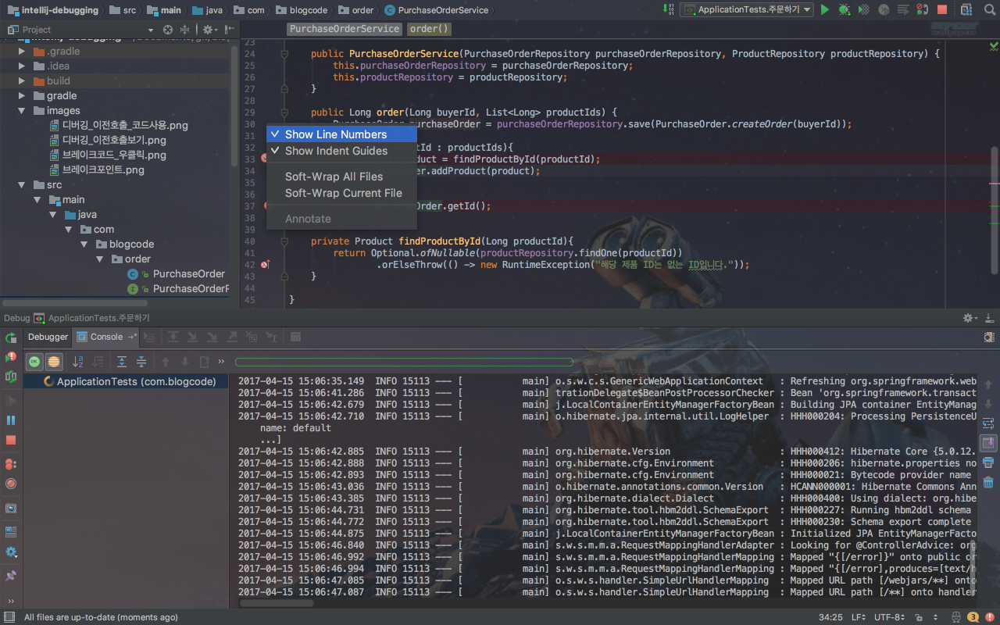

**If you click on the margin between the line number and the code**, the Break Point will be displayed on the line as below.

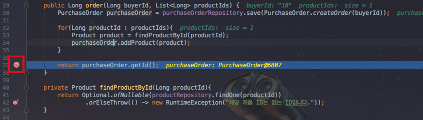

When the application is in ```debug``` mode, the breakpoint stops at the point the specified line is executed.  
At this time, you can check various values and start debugging by executing the command.  
In addition, right click **Break Point** to break **in** condition.  
(Very important)

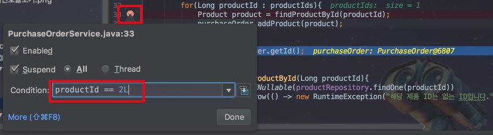

(If productId is 2L, it is specified to break at the above point)  
  
In particular, there are times when you want to break **only when certain values come in** repetitive actions such as ```for```, ```while``` and so on.  
This is a really useful feature.

## debug button

If you break through the above, you can use several buttons like below.  

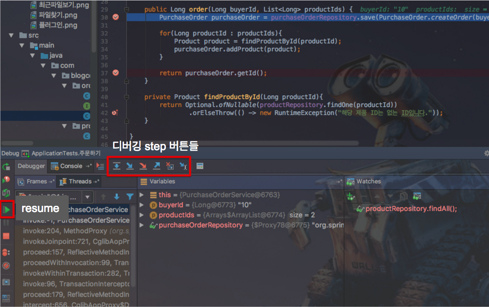

(It can only be used with a break) 

### resume

* Shortcut: ```option + command + r```
* Function: **Go to next break point**

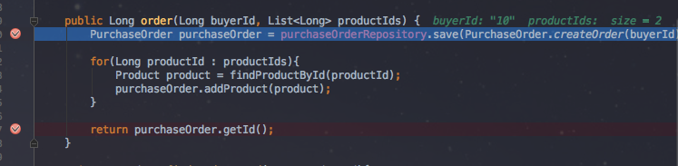

At the first break point

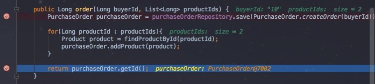

Go to the next breakpoint.  
  
It is equivalent to Eclipse resume (```F8```).  
  
Step buttons will be left to right.

### step over

* Shortcut: ```F8```
* Function: Move **next line from current break file**


Break Execute all the lines that are caught and move to the next line.

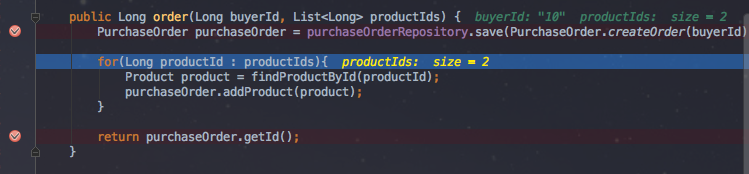

If you do not know this feature and you break all the lines, use ```F8``.

### step into

* Hotkey: ```F7```
* Function: Moves from the currently broken line to the line **that is being executed**.

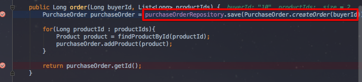

The next line of code to execute on the line where the break occurred is ```PurchaseOrder.createOrder```.  
At this time, pressing ```F7```

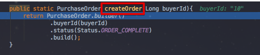

This goes to ```createOrder()```.

### Force step into

* Shortcut: ```option + shift + F7```
* Function: Moves to the next line to be executed, but ignores ```Stepping``` as opposed to ```Step into```.
  
For example, after opening the configuration window with ```command + shift + a``` ->```stepping```,

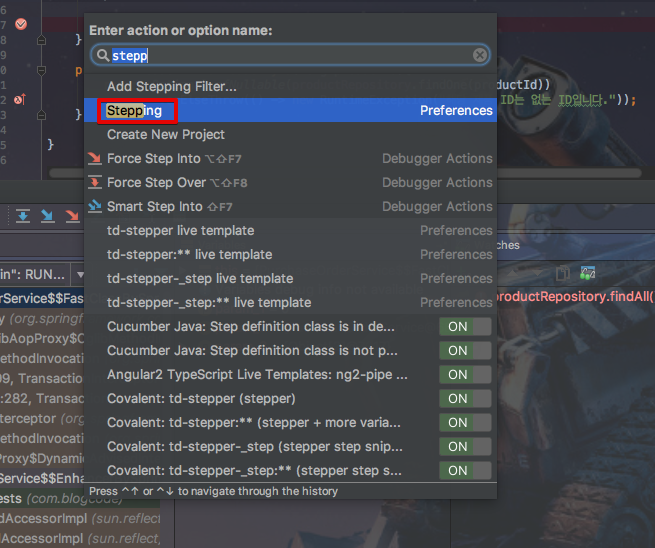

Check ```skip simple getters``` as follows.

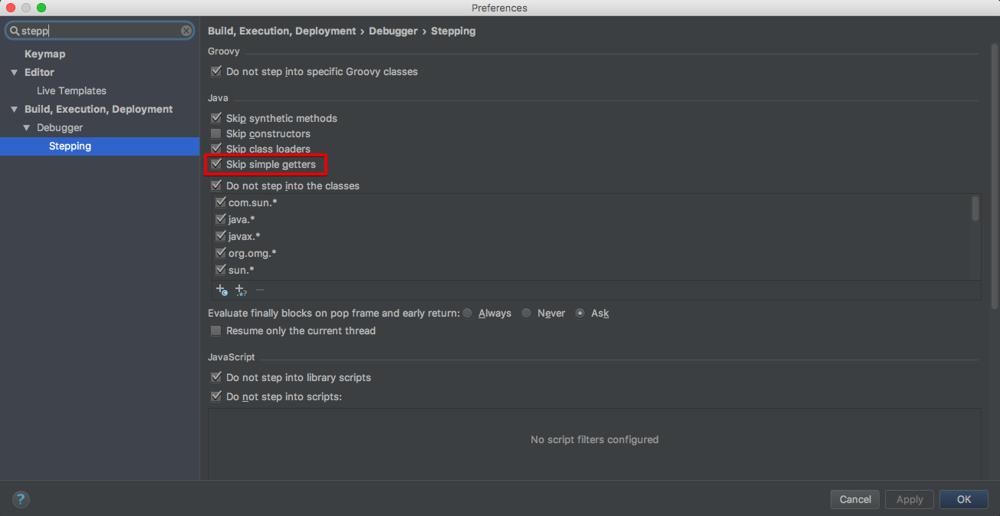

After doing this, you can specify a break point where you call the ```getter``` method,

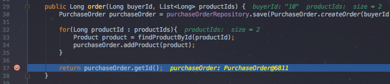

Let's enter step into and force step into.  
  
**step into**(```F7```)

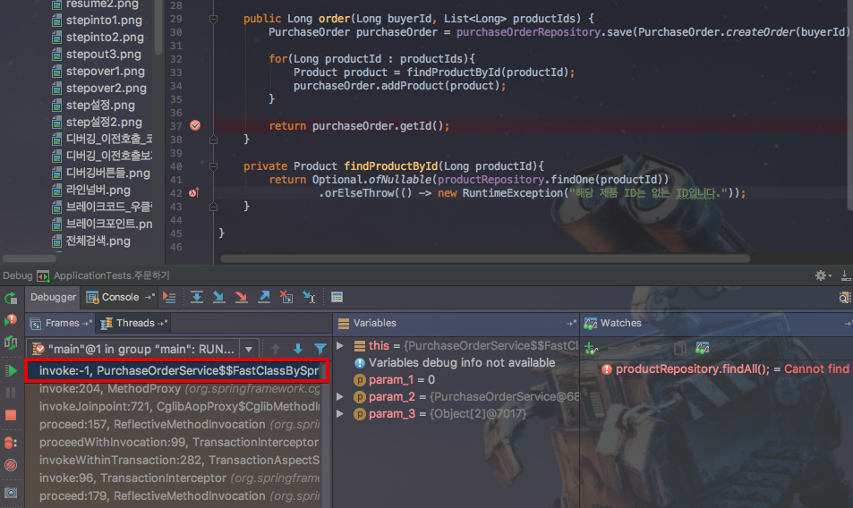

This moves directly to the method invoke area.
  
On the other hand  
  
**force step into**(```option+shift+F7```)  

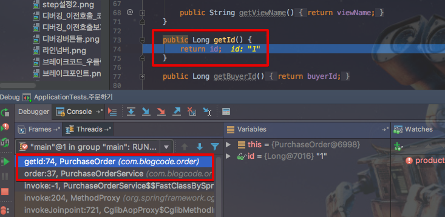

It goes to the ```getter``` method regardless of the setting.  
  
After setting the skip option to ```getter```,``` constructor```, etc., which need no confirmation, step into **if you need** skip, **if you need to verify everything, you can just go to force step into** and debug.

### Step out

* Shortcuts: ```shift + F8```
* Function: Move to the place of **call** on the current break line.


After step into into ```createOrder``` method, 


If you type ```shift + F8```, the shortcut key for step out,

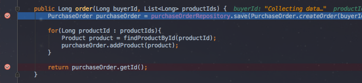

The method is exited.  
  
Usually you use ```step into``` when you want to get out of a line that you dig into.

### Drop Frame

* Hotkey: None
* Function: **Go up the call stack**.

The difference is that the step out is done **after the line is executed**, but the drop frame is executed **before the line is executed **.


### Run to Cursor

* Shortcut: ```option + F9```
* Function: Move to focus line


With the above breaks, you can focus on the ```ApplicationTests.assertThat()```,

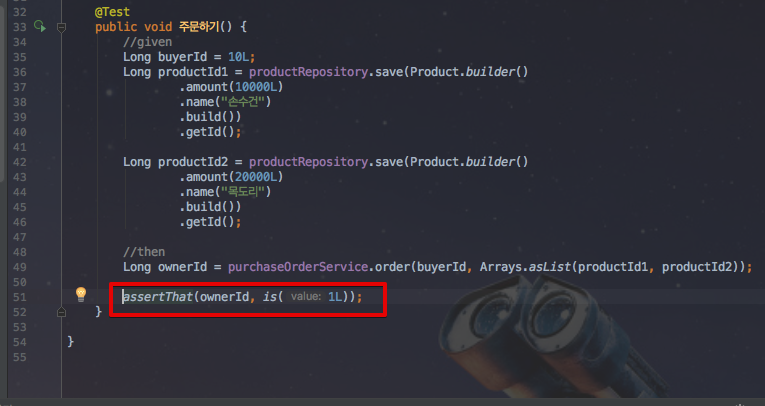

(Focus on line 51)  
  
If you press ```option + F9``` 

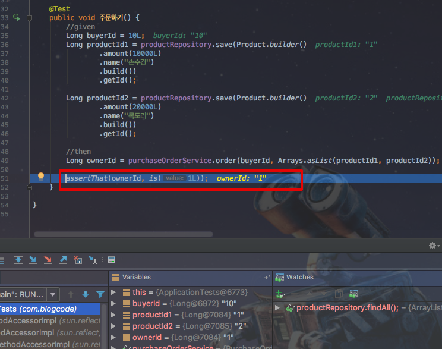

The break is moved to the 51 lines with this focus.  
  
It is usually used when you want to make a break at a **single point without specifying a break point**. 

## Watch & Call Stack

You learned how to use break lines with break points and debug buttons.
Now I will see what is possible on the break line.

### Evaluate

There are two ways you can execute your code in a broken state.  
**Evaluate** and **Watch**, both of which are used instead of just one of them.  
  
At the far right of the debugging buttons (right of ```run to cursor```), the button that is like a calculator is the **Evaluate** button.

* Shortcut: ```option + F8```
* Function: It is possible to execute all available code in a broken line

**If you click Evaluate**, you will see a pop-up as below.  
Enter the code you want to check here and run it.

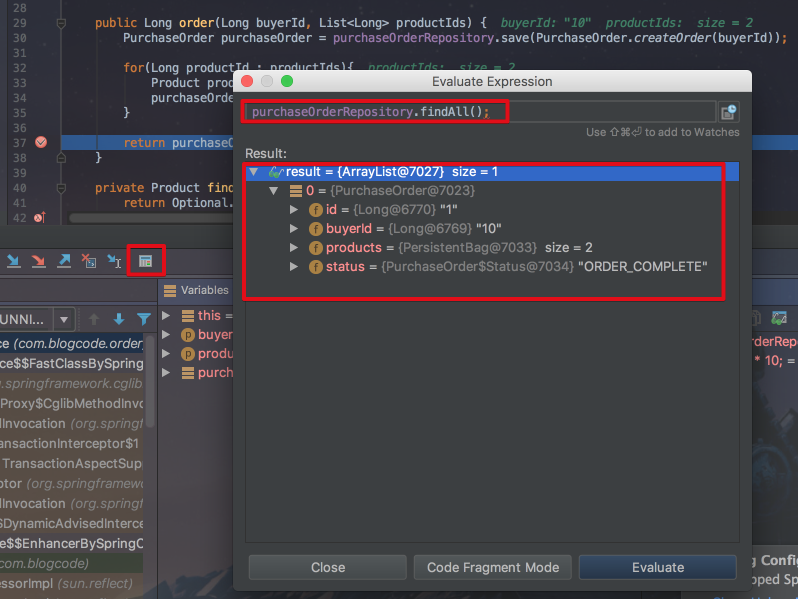

Not all code is available.  
**Only code** (method variables, class fields, etc.) available on the current line can be used.

### Watch

Almost the same as **Evaluate** above.  
Usage is simple.  
First, let's turn on watch in debug mode as below.


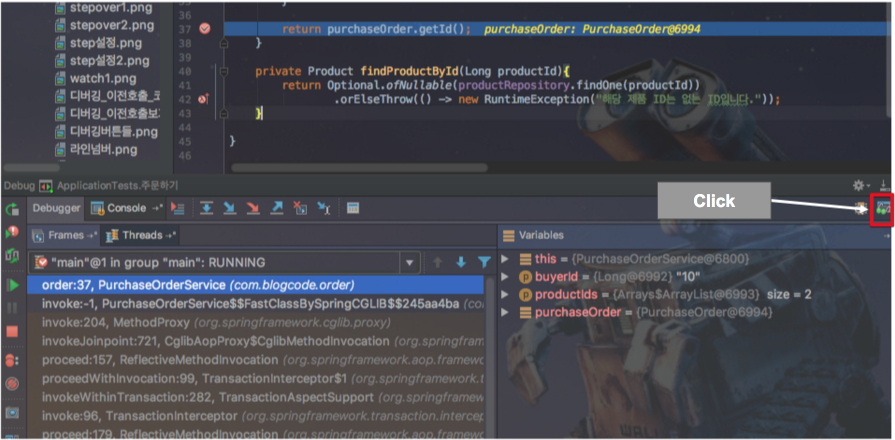

If you follow the above click, you will get the following shape.


In the ```watches``` at the bottom right, we can write our debugging code.  
  
For example, to check that ```purchaseOrderRepository.save``` function is performed well, you can check as follows.


**You can use all possible values and methods on the line**.  
It is possible to use everything from simple variable values to ```Autowired``` code.  

### Evaluate vs Watch

The two functions are the same.  
However, in the case of Evaluate, the code should continue to **run manually**, but **every time the break line is executed**, it will be executed automatically unless it is deleted in Watch.  
  
Please note that if you register the code to change the value of watch, it will **change the value unintentionally** and perform other logic.  
  
Watch, however, can **see the results of multiple debugging codes** at the same time, and I personally prefer it because I do not have to use it repeatedly.  
  
For those who prefer> evaluate, I use it a lot because of the **shortcut key**.  
Watch is not easy to use because you do not have a default shortcut key or you need to use a mouse or add a shortcut key.

### Call Stack

At the bottom left of the debugging screen, the call stack until the **break line is output**.  
  
This allows you to see which values ​​have passed in the past, and how they will change if you have previously performed other operations.  
  
For example, you can check the value of the ```test``` code that called ```the order method```  and use some expression.  
  
In the Call Stack at the bottom left, click on the line of code you want to find.

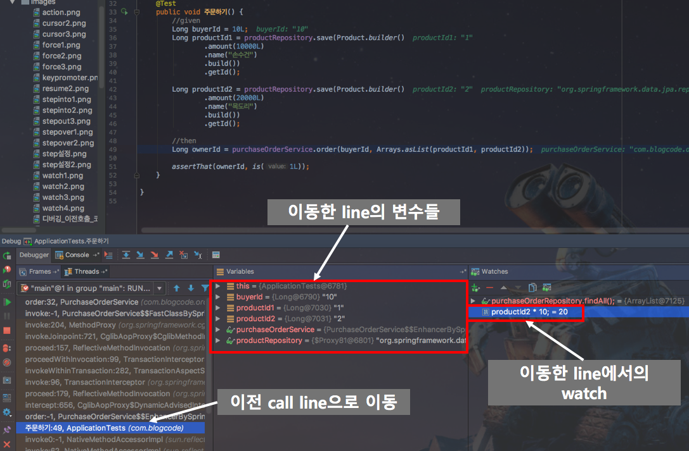

After the move, check the values and code you want to check using ```Variables``` and ```Watches``` as you did on the break line.  
  
It is especially useful when you are looking at how **code runs and changes values in** frameworks such as Spring.


## Finally

As many of you may already know, I've seen a lot of people use **break point and resume buttons**.  
I hope you can help debugging with IntelliJ a little bit.  
  
IntelliJ is a really good tool.  
We have a lot of other features, so we will keep it together whenever we find something we can share.  
  
Thank you for reading to the end.


