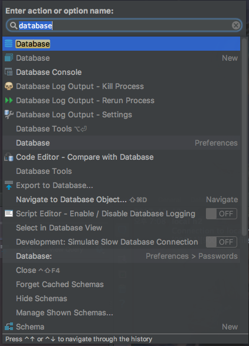
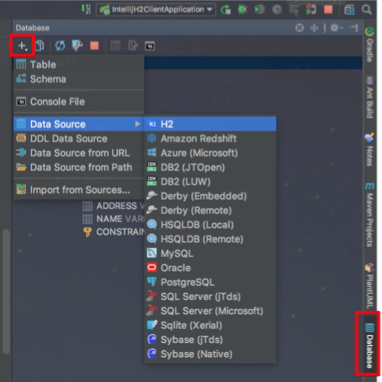
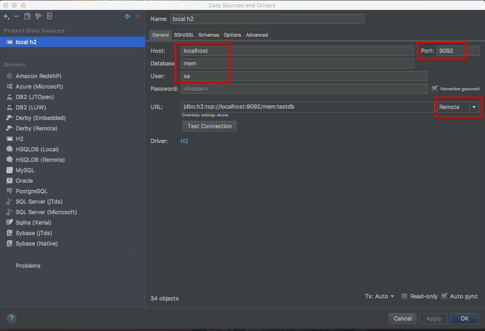
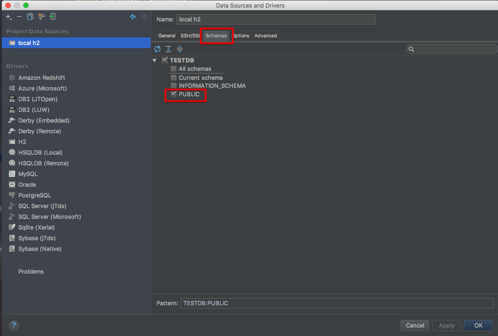
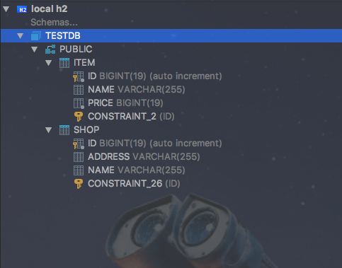
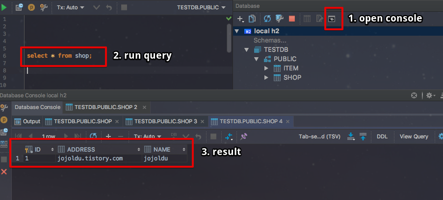

# SpringBoot H2 DB 클라이언트로 IntelliJ 사용하기 

안녕하세요? 이번 시간엔 SpringBoot H2 DB 클라이언트로 IntelliJ를 사용하는 방법을 소개드리려고 합니다.    
모든 코드는 [Github](https://github.com/jojoldu/blog-code/tree/master/intellij-h2-client)에 있기 때문에 함께 보시면 더 이해하기 쉬우실 것 같습니다.  
(공부한 내용을 정리하는 [Github](https://github.com/jojoldu/blog-code)와 세미나+책 후기를 정리하는 [Github](https://github.com/jojoldu/review), 이 모든 내용을 담고 있는 [블로그](http://jojoldu.tistory.com/)가 있습니다. )<br/>

## 들어가며

보통 로컬에서 개발환경을 구축하면 H2 DB를 많이 사용합니다.  
여기서 H2는 설치형이 아니라, SpringBoot에 의존성을 둔 H2 내장 DB를 사용하는 경우입니다.  
이 경우에 일반적으로는 h2-console 이라는 웹 형태의 콘솔을 사용합니다.  
하지만 **웹 콘솔은 결국 기능상 한계점이 많아** 전문적인 DB Client가 필요할때가 많습니다.  
이때 좋은 해결 방안이 IntelliJ의 Database Client 기능을 사용하는 것입니다.  
기존에 계속 해결책을 못찾다가 오늘 **사내 동료님!의 링크**로 알게 되어 정리하게 되었습니다.  
 
> 참고로 IntelliJ의 Database Client 기능은 Ultimate (유료) 버전에만 있습니다.  
무료버전에는 해당 기능이 없습니다.

## 사용법

### 샘플 프로젝트

먼저 샘플로 사용할 프로젝트 코드를 생성하겠습니다.

```java
@Entity
@Getter
@NoArgsConstructor
public class Shop {

    @Id
    @GeneratedValue
    private Long id;

    private String name;
    private String address;

    public Shop(String name, String address) {
        this.name = name;
        this.address = address;
    }
}

@Entity
@Getter
@NoArgsConstructor
public class Item {

    @Id
    @GeneratedValue
    private Long id;

    private String name;
    private long price;

    public Item(String name, long price) {
        this.name = name;
        this.price = price;
    }
}

public interface ShopRepository extends JpaRepository<Shop, Long> {
}

public interface ItemRepository extends JpaRepository<Item, Long> {
}

```

Entity 클래스들은 위와 같이 설정하고, main 메소드를 가진 Application.java에는 부트 실행시 임시 데이터를 하나씩 등록하도록 코드를 추가하겠습니다.

```java
@SpringBootApplication
public class Application implements CommandLineRunner {

	@Autowired
	private ShopRepository shopRepository;

	@Autowired
	private ItemRepository itemRepository;

	@Override
	public void run(String... args) throws Exception {
		shopRepository.save(new Shop("jojoldu", "jojoldu.tistory.com"));
		itemRepository.save(new Item("jojoldu's Github", 1000));
	}

	public static void main(String[] args) {
		SpringApplication.run(Application.class, args);
	}
}
```

여기까지가 프로젝트의 기본 구성입니다.  
지금부터는 실제로 H2 DB에 접속하기 위한 설정을 진행하겠습니다.  
  
### 프로젝트 설정

먼저 프로젝트에 h2 의존성을 등록해야하는데요.  
여기서 주의하실 점은 IntelliJ에서 자동 등록시 **```runtime```으로 scope가 등록되는 것을 ```compile```로 변경**해야하는 것입니다.

```groovy
compile('com.h2database:h2')
```

SpringBoot에서 h2를 띄울때 기본적으로 JVM 메모리에 올리게 됩니다.  
이렇게 되면 외부에선 절대 h2에 접근할수가 없습니다.  
그래서 이를 회피하여 접근하기 위해 **h2 라이브러리에서 제공하는 TcpServer를 사용**하겠습니다.  


> 이를 위해 h2 라이브러리의 scope를 runtime이 아닌 compile로 한것입니다.  
runtime일 경우 코드 작성시에 라이브러리가 호출되지 않습니다.

TcpServer를 Bean으로 등록하는 클래스를 생성하겠습니다.

```java
@Configuration
@Profile("local")
public class H2ServerConfiguration {

    @Bean
    public Server h2TcpServer() throws SQLException {
        return Server.createTcpServer()
                .start();
    }
}

``` 

위 코드는 Profile이 ```local```일 경우에만 실행되도록 어노테이션을 지정하였습니다.(개발/QA/운영 환경에서는 작동될 필요가 없습니다.)  
그리고 ```application.yml```로 이동하겠습니다.

```yml
spring:
  profiles:
    active: local

---
spring:
  profiles: local

  datasource:
    platform: h2
    url: jdbc:h2:tcp://localhost:9092/mem:testdb;MVCC=TRUE
    username: sa
    password:
    driver-class-name: org.h2.Driver
  jpa:
    database-platform: H2
    show-sql: false
    hibernate:
      ddl-auto: create-drop
```

기본적으로 SpringBoot를 사용할때는 profile이 local이 되도록 설정하였습니다.  
그리고 하나 더 추가 된것은 프로젝트가 바라보는 datasource의 url은 ```jdbc:h2:tcp://localhost:9092/mem:testdb```로 지정한것입니다.  
Tcp 서버의 DB 기본 포트는 9092입니다.  
(기존에 하던 웹콘솔로 할때는 8082가 기본 포트였습니다.)  
별다른 설정을 추가하지 않으면 위 설정이 기본 설정이라고 보시면 됩니다.  

> datasource url을 위처럼 하지 않으면 **웹 콘솔로 띄울 JVM 내의 H2 DB로 JPA가 접근**하게 됩니다

프로젝트 설정은 끝났습니다!  
그럼 IntelliJ로 접근해보겠습니다.

### IntelliJ 설정

맥 기준으로 ```command+shift+a``` (Action 검색)을 사용하여 ```database```를 검색합니다.



실행하시면 IntelliJ 우측 화면에 Database Client가 보입니다.  
+버튼 -> Data Source -> H2를 차례로 클릭합니다.



application.yml에 입력한 정보를 참고하여 접속정보를 입력합니다.  
(아래를 그대로 따라하시면 됩니다.)



> URL 접근 타입은 memory가 아니라 REMOTE여야 합니다.  

그리고 Client에 Table을 노출시키기 위해 Schema 탭 -> Public 체크



이렇게 해서 설정을 마치면!



접속이 잘 된것을 확인할 수 있습니다.  
  
쿼리를 한번 실행해보겠습니다.



결과가 아주 예쁘게 노출되는것을 확인할 수 있습니다.  
  
TCP 서버로 붙는다고 해도 결국 Application에 의존하고 있기 때문에 프로젝트를 끄면 DB는 삭제되고, 실행하면 다시 생성됩니다.  
기존의 H2 DB를 쓸때와 동일하게 편의성을 제공하면서도 웹콘솔과 같이 불편한 Client를 사용하는것이 아닌, IntelliJ DB Client를 사용할 수 있게 되었습니다.  
  
제가 준비한 내용은 여기까지입니다.  
끝까지 읽어주셔서 감사합니다^^

## 참고

* [QUERYING THE EMBEDDED H2 DATABASE OF A SPRING BOOT APPLICATION](https://techdev.io/en/developer-blog/querying-the-embedded-h2-database-of-a-spring-boot-application)