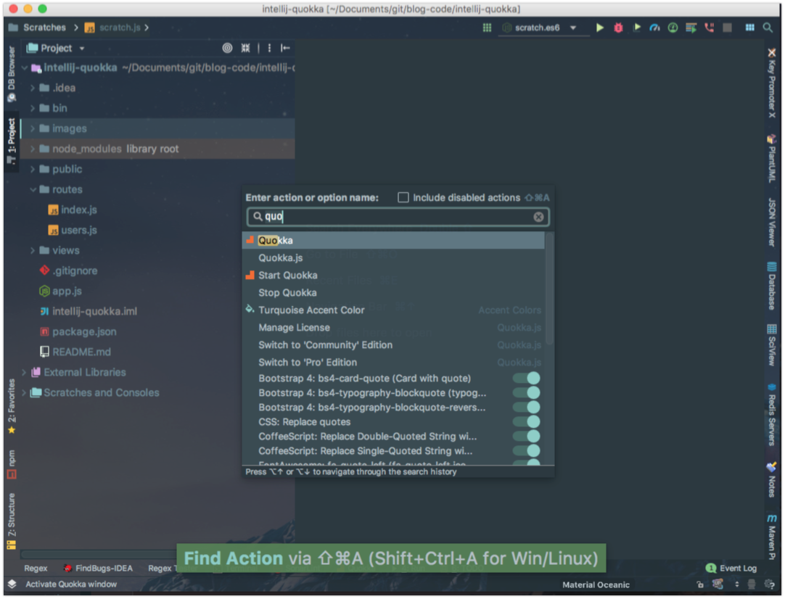
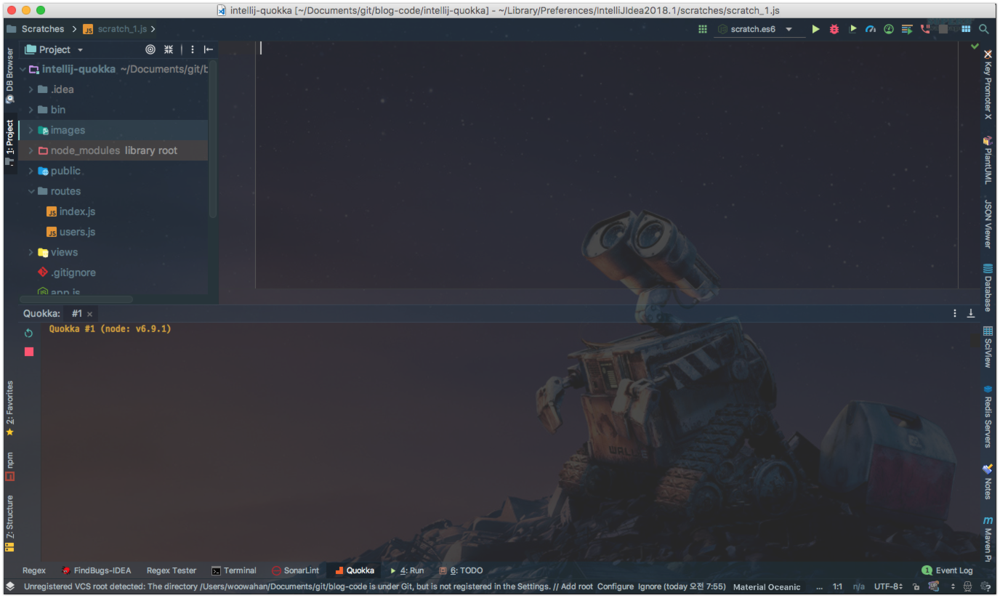
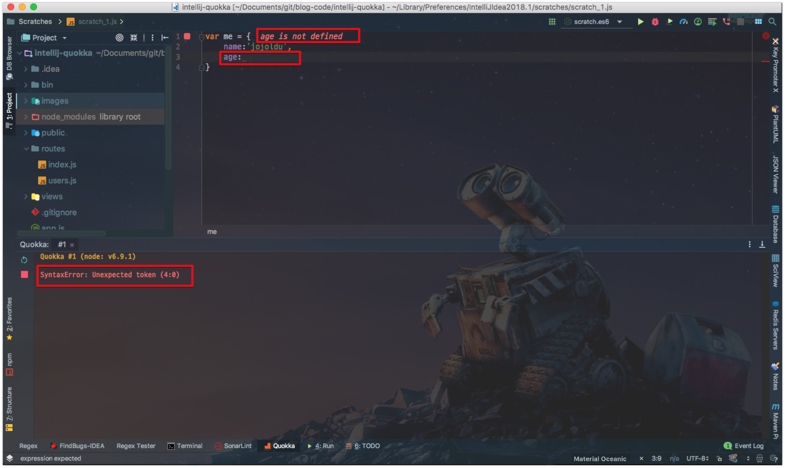
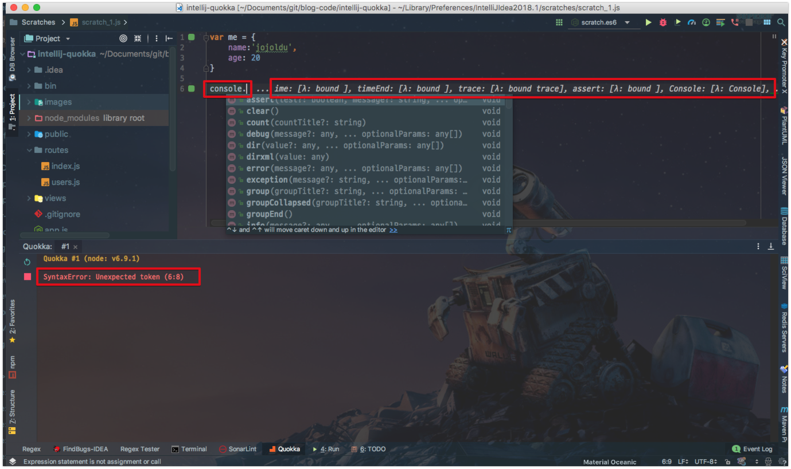
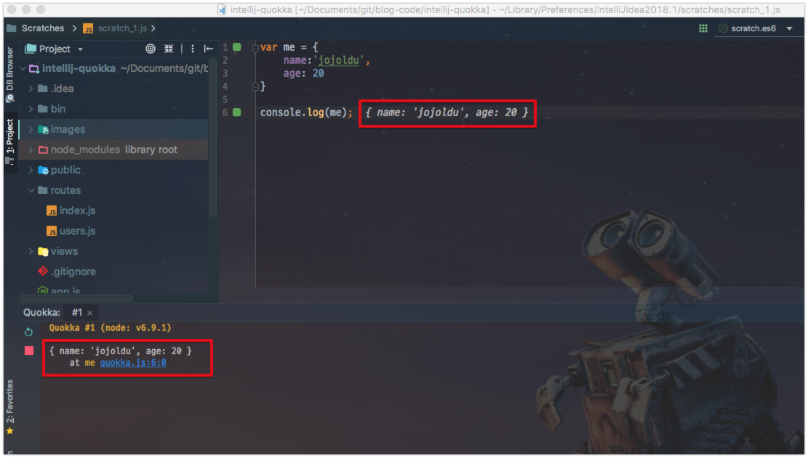
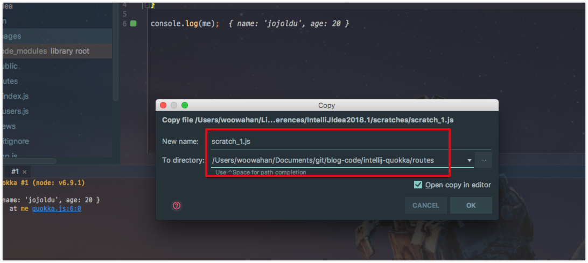
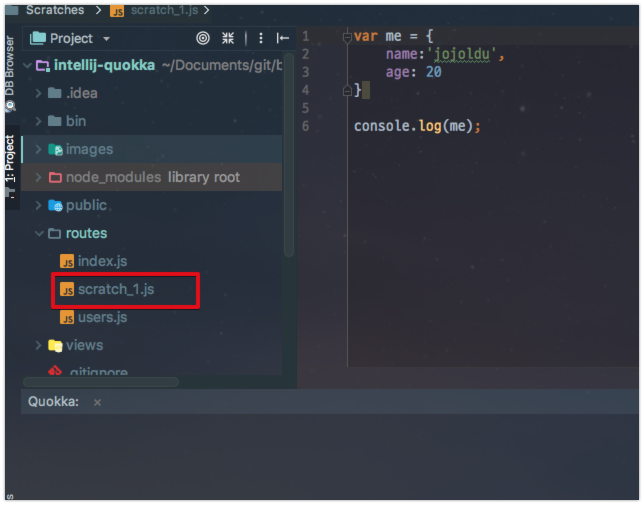
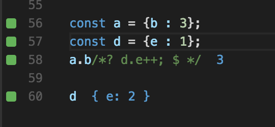
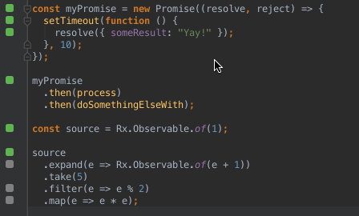

# intellij-quokka

안녕하세요? 이번 시간엔 IntelliJ의 Quokka 플러그인을 소개드리려고 합니다.  
모든 코드는 [Github](https://github.com/jojoldu/blog-code/tree/master/intellij-quokka)에 있기 때문에 함께 보시면 더 이해하기 쉬우실 것 같습니다.  
(공부한 내용을 정리하는 [Github](https://github.com/jojoldu/blog-code)와 세미나+책 후기를 정리하는 [Github](https://github.com/jojoldu/review), 이 모든 내용을 담고 있는 [블로그](http://jojoldu.tistory.com/)가 있습니다. )<br/>
  

## 소개

Javascript 개발을 진행하다보면 여러 이유로 **프로토 타입을 개발을 위한 격리된 공간**이 필요할때가 있습니다.

* 특정 라이브러리의 함수가 어떤 결과를 출력하는지 잠깐 확인하고 싶을때
* JS를 강의하거나, 배우기 위해 결과를 바로 실행해보고 싶을때
* 새로운 언어의 기능이나 프레임워크를 실험해보고 싶을때

보통 이런 이유로 온라인 편집기 (브라우저 개발자 도구의 Console, [jsbin](http://jsbin.com/?html,output))를 사용합니다.  
하지만 이런 온라인 편집기의 최대 단점은 **기존에 사용하던 개발환경이 아니라는 것**입니다.  

기존에 VS Code, IntelliJ, Webstorm, ATOM 등에서 개발하다가, 실습/강연/테스트를 위해 온라인 도구를 사용한다면 얼마나 불편할까요?  

* 모든 키보드 단축키가 다릅니다.
* 자동 완성도 잘 지원되지 않습니다.
* 코드 하이라이트가 기존과 다릅니다.
* 혹시나 새로고침하여 작성한 코드가 사라지면 어떡할까요?
 
이 모든 단점을 해결해줄 플러그인 [Quokka.js](https://quokkajs.com/)을 찾았습니다!  
기쁜 나머지 얼른 블로그에 정리를 시작했습니다.  

## 0. 설치 방법

기본적으로 Quokka는 3가지 도구를 지원합니다.  
VS Code, Jetbrains Tool (IntelliJ, Webstorm 등), ATOM  
(그외는 지원하지 않는것 같습니다.)  
  
이번 편에서는 **IntelliJ에서 설치 & 사용법**을 정리했습니다.  
다른 도구에서도 동일하게 사용할 수 있으니 참고하시면 될것 같습니다.  
  
먼저 IntelliJ의 Plugins으로 가셔서 ```quokka```를 검색해서 설치합니다.


이 플러그인을 설치만 하시면 끝납니다!  
설치하시고 IntelliJ를 재실행하시면 바로 사용하실 수 있습니다!  
  


## 1. 기본 사용법

먼저 Action 검색 (맥기준: ```command+shift+a```)에서 ```quokka```를 검색합니다.  



검색결과를 바로 클릭하시면 아래와 같이 Quokka 모드로 전환되는데요.  


화면에 나오는대로 신규 스크랩치 파일을 단축키(```command+shift+n```) 로  생성합니다.  
스크래치 파일이라고해서 별도의 파일 확장자는 아니구요.  
**quokka모드가 실행된 후, 생성되는 모든 JS 파일**을 지칭합니다.  
저는 여기서 일반 JS 파일을 생성해보겠습니다.  
(ES6, Typescript 모두 지원합니다.)  
  


그럼 이렇게 Quokka로 실행되는 JS 에디터로 전환됩니다.



간단하게 테스트 해볼까요?  

```js
var me = {
    name:'jojoldu',
    age:
}
```

만 입력해보겠습니다.  
그러면 Quokka에서 즉시! 실시간 코드 피드백을 줍니다.



(age 프로퍼티가 비어있다는 실시간 오류 메세지를 남깁니다.)  
  
만약 ```console.log```에서 ```console.```만 쳐도 아래와 같이 메세지를 보여줍니다.



만약 특정 객체를 사용한다면 (```me```) 실시간으로 그 객체의 현재 값을 보여줍니다.



이렇게 프로토 타이핑했던 파일들을 실제 JS 파일로 저장하고 싶으실때는 ```F5```를 누르시면 됩니다.





어떠신가요? 사용처가 무궁무진할것 같지 않으신가욤?  
아래부터는 Community 버전과 Pro 버전에서 지원하는 기능들을 소개하겠습니다.

## 2. Community 버전 기능

무료 버전인 커뮤니티 버전에서 지원하는 기능들을 Gif로 소개드립니다.

### 2-1. Live Feedback

위에서 설명드린 실시간 피드백 기능입니다.


### 2-2. Live Logging/Compare

만약 2개의 객체가 있다면 이를 실시간으로 비교를 하단에서 진행해줍니다.


### 2-3. Live Code Coverage

실시간 코드 커버리지도 지원합니다.


* 회색 사각형은 해당 소스 라인이 테스트에 포함되지 않았음을 의미합니다.
* 녹색 사각형은 해당 소스 라인이 최소 하나 이상의 테스트에 포함됐음을 의미합니다.
* 노란색 사각형은 해당 소스 라인이 테스트 중 일부에서만 부분적으로 커버됐음을 의미합니다
* 빨간색 사각형은 해당 소스 라인이 오류/실패가 예상됨을 의미합니다.

## 3. Pro 버전

위 4가지 기능 외에 유료 버전을 사용하시게 되면 추가로 4가지 기능을 더 사용할 수 있습니다.


(개인용 유료라이센스와 회사용 유료라이센스가 따로 있습니다.)  
  
### 3-1. Live Comments


console.log만으로 값을 확인할 수 있지만, 때때로 코드의 중간에서 값을 보고 싶을때가 있습니다.  
예를 들어, ```a.b().c().d()```와 같은 코드에서 ```.d()```가 호출되기 전에 ```a.b().c()```의 결과를 확인할 수 있습니다.  
  
사용법은 간단합니다.  
quokka만 이해할 수 있는 특별한 주석(```/*?*/``` 혹은 ```//?```)을 사용하시면 되는데요.  

예를 들어,

```js
a.b()/*?*/.c().d()
```

로 하시면 ```a.b()```의 결과가 ```/*?*/```자리에 출력될것입니다.  

```js
a.b().c().d() /*?*/
// 혹은
a.b().c().d() //?
```

로 표현하시면 ```a.b().c().d()```의 결과가 출력 될 것입니다.  
  
추가로 JS 코드로도 표현식을 나타낼 수도 있습니다.  
여기서 ```$```는 주석의 대상인 ```a.b```를 나타내는 변수입니다.  
보시면 ```/*? d.e++;```가 있는데요.  
d.e값을 1증가시켰더니 실제로 d.e의 결과가 2가 됩니다.



하나더!  
promise의 then 절마다 결과도 실시간 출력할 수 있습니다.



### 3-2. Project Files Import

Community 버전을 사용하면 **로컬에 설치된 node_modules**을 Quokka 파일로 가져올 수 있습니다.  
Pro버전에서는 **프로젝트의 모든 파일**을 가져올 수 있습니다.  
  
필요한 경우 **Babel 또는 TypeScript 컴파일 기능**도 지원합니다.  
또한 변경 사항이있는 프로젝트 파일을 Watch 하면서 **의존성 파일이 변경되면 자동으로 반영**합니다.


### 3-3. Quick Package Install

개꿀 기능인데요.  
**패키지 이름을 입력하지 않아도 IDE에서 npm 또는 yarn을 통해 모든 노드 패키지를 바로 설치**할 수 있습니다.  


### 3-4. Live Performance Testing

각 코드의 성능이 얼마나 나오는지 바로 확인할 수 있습니다.


## 마무리

정말 쓸만한 플러그인을 찾은것 같습니다!  
아직 커뮤니티 버전을 쓰고 있지만 좀 더 사용해보고 괜찮으면 PRO 버전을 구매해야할것 같습니다.  
좀 더 자세한 기능 설명이 필요하신 분들은 [공식 문서](https://quokkajs.com/docs/?editor=vsc)를 참고해보세요!
