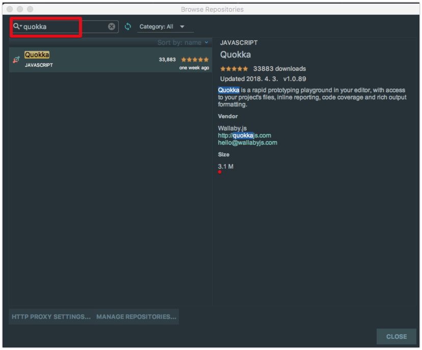
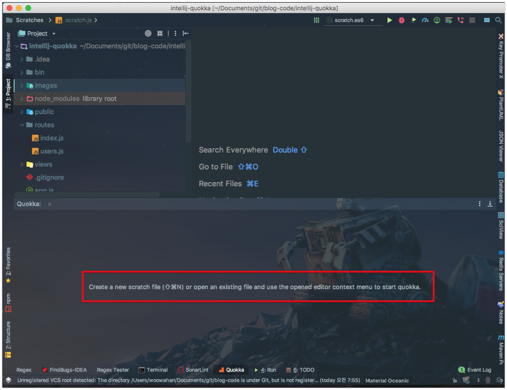
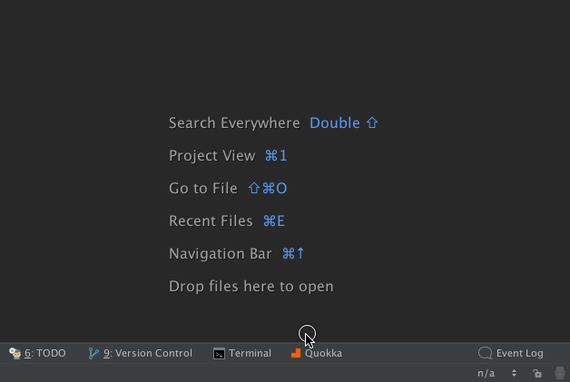
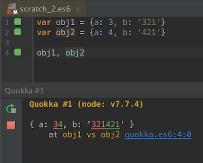
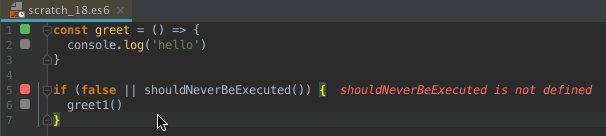
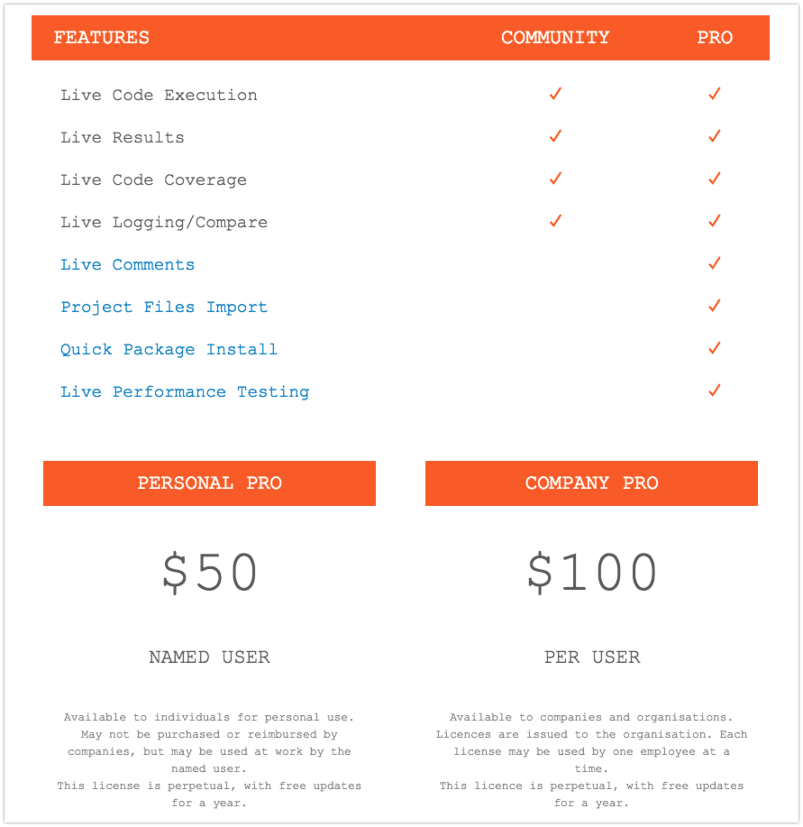
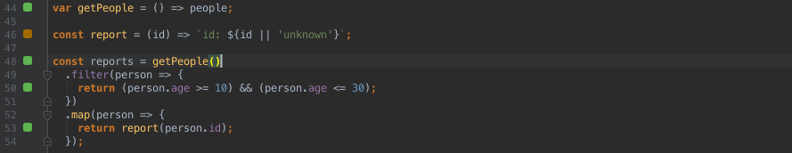
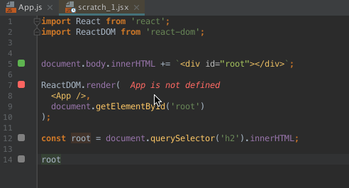
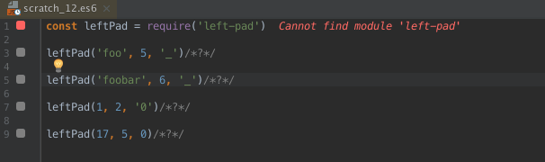
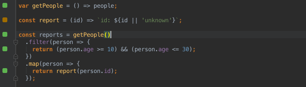

# intellij-quokka

안녕하세요? 이번 시간엔 IntelliJ의 Quokka 플러그인을 소개드리려고 합니다.  
모든 코드는 [Github](https://github.com/jojoldu/blog-code/tree/master/intellij-quokka)에 있기 때문에 함께 보시면 더 이해하기 쉬우실 것 같습니다.  
(공부한 내용을 정리하는 [Github](https://github.com/jojoldu/blog-code)와 세미나+책 후기를 정리하는 [Github](https://github.com/jojoldu/review), 이 모든 내용을 담고 있는 [블로그](http://jojoldu.tistory.com/)가 있습니다. )<br/>
  

## 소개

Javascript 개발을 진행하다보면 여러 이유로 프로토 타입을 위한 격리된 개발 공간이 필요할때가 있습니다.

* 특정 라이브러리의 함수가 어떤 결과를 출력하는지 잠깐 확인하고 싶을때
* JS를 강의하거나, 배우기 위해 바로 실행해보고 싶을때
* 새로운 언어의 기능이나 프레임워크를 실험해보고 싶을때

보통 이런 이유로 온라인 편집기 (브라우저 개발자 도구의 Console, [jsbin](http://jsbin.com/?html,output))를 사용합니다.  
하지만 이런 온라인 편집기의 최대 단점은 **기존에 사용하던 개발환경이 아니라는 것**입니다.  

기존에 VS Code, IntelliJ, Webstorm, ATOM 등에서 개발하다가, 실습/강연/테스트를 위해 온라인 도구를 사용한다면 얼마나 불편할까요?  

* 모든 키보드 단축키가 다릅니다.
* 자동 완성도 잘 지원되지 않습니다.
* 코드 하이라이트가 기존과 다릅니다.
* 혹시나 새로고침하여 작성한 코드가 사라지면 어떡할까요?
 
이 모든 단점을 해결해줄 플러그인 [Quokka.js](https://quokkajs.com/)을 찾았습니다!  
기쁜 나머지 얼른 블로그에 정리를 시작했습니다.  

## 0. 설치 방법

기본적으로 Quokka는 3가지 도구를 지원합니다.  
VS Code, Jetbrains Tool (IntelliJ, Webstorm 등), ATOM  
(그외는 지원하지 않는것 같습니다.)  
  
이번 편에서는 **IntelliJ에서 설치 & 사용법**을 정리했습니다.  
다른 도구에서도 동일하게 사용할 수 있으니 참고하시면 될것 같습니다.  
  
먼저 IntelliJ의 Plugins으로 가셔서 ```quokka```를 검색해서 설치합니다.



이 플러그인을 설치만 하시면 끝납니다!



## 1. Community 버전


### 1-1. Live Feedback



### 1-2. Live Logging/Compare



### 1-3. Live Code Coverage



* 회색 사각형은 해당 소스 라인이 테스트에 포함되지 않았음을 의미합니다.
* 녹색 사각형은 해당 소스 라인이 최소 하나 이상의 테스트에 포함됐음을 의미합니다.
* 노란색 사각형은 해당 소스 라인이 테스트 중 일부에서만 부분적으로 커버됐음을 의미합니다
* 빨간색 사각형은 해당 소스 라인이 오류/실패가 예상됨을 의미합니다.

## 2. Pro 버전

위 4가지 기능 외에 유료 버전을 사용하시게 되면 추가로 4가지 기능을 더 사용할 수 있습니다.



(개인용 유료라이센스와 회사용 유료라이센스가 따로 있습니다.)  
  


### 2-1. Live Comments




### 2-2. Project Files Import



### 2-3. Quick Package Install



### 2-4. Live Performance Testing



