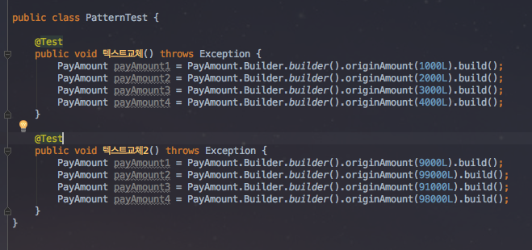
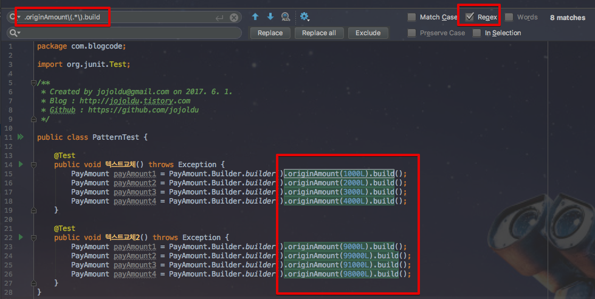

# IntelliJ에서 패턴으로 텍스트 교체하기

안녕하세요? 이번 시간엔 IntelliJ에서 패턴으로 텍스트 교체하기 예제를 진행해보려고 합니다.  
모든 코드는 [Github](https://github.com/jojoldu/blog-code/tree/master/intellij-tip-regex-replacement)에 있기 때문에 함께 보시면 더 이해하기 쉬우실 것 같습니다.  
(공부한 내용을 정리하는 [Github](https://github.com/jojoldu/blog-code)와 세미나+책 후기를 정리하는 [Github](https://github.com/jojoldu/review), 이 모든 내용을 담고 있는 [블로그](http://jojoldu.tistory.com/)가 있습니다. )<br/>
 
### 본문



여기서 ```.originAmount(XXX)```를 ```.originAmount(XXX).supplyAmount(XXX).vat(XXX)```로 테스트 내용이 전부 수정되어야 한다고 가정해보겠습니다.  
문제는 ```originAmount```는 동일하지만 파라미터인 금액들이 서로 다른 

단축키 ```command+r```

regex 체크(정규표현식 허용)를 한 뒤에, 해당 텍스트를 선택할 수 있도록 정규표현식을 입력합니다.  
위와 같은 패턴을 검색하기 위한 정규표현식은 아래와 같습니다.

```
.originAmount\(.*\).build
```



```
.originAmount\((.*)\).build
```

기존에 정규표현식이였던 ```\(.*\)```를 ```\((.*)\)```로 변경한것입니다.  
괄호(```()```)로 ```.*```를 감싼것입니다.  여기서 중요한 것이 괄호(```()```)

* [공식사이트](https://www.jetbrains.com/help/idea/finding-and-replacing-text-in-file-using-regular-expressions.html)