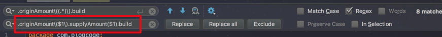
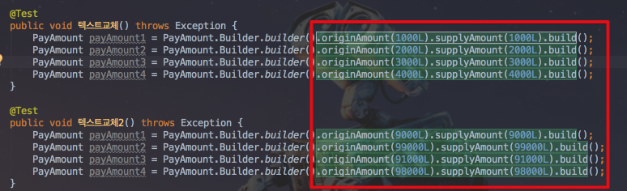

# IntelliJ에서 패턴으로 텍스트 교체하기

안녕하세요? 이번 시간엔 IntelliJ에서 패턴으로 텍스트 교체하기 예제를 진행해보려고 합니다.  
모든 코드는 [Github](https://github.com/jojoldu/blog-code/tree/master/intellij-tip-regex-replacement)에 있기 때문에 함께 보시면 더 이해하기 쉬우실 것 같습니다.  
(공부한 내용을 정리하는 [Github](https://github.com/jojoldu/blog-code)와 세미나+책 후기를 정리하는 [Github](https://github.com/jojoldu/review), 이 모든 내용을 담고 있는 [블로그](http://jojoldu.tistory.com/)가 있습니다. )<br/>
 
### 문제 상황

예를 들어 아래와 같이 테스트 코드가 작성되어있다고 가정해보겠습니다.  
서로 다른 amount에 대해 각각 계산을 진행하는 코드입니다.  


헌데 요구사항이 변경되어 originAmount의 계산에 supplyAmount와 vat도 추가 파라미터로 포함되어야 합니다.  
즉, ```.originAmount(XXX)```를 ```.originAmount(XXX).supplyAmount(XXX).vat(XXX)```로 테스트 내용이 전부 수정되어야 하는 것입니다.  
  
문제는 ```originAmount```는 동일하지만 **파라미터인 금액들이 서로 다른** 상황이다보니 **전체 수정하기가 쉽지 않다**는 것입니다.  
이를 IntelliJ의 regex replacement로 해결해보겠습니다.

### 해결

단축키 ```command+r```을 사용하여 replace창을 open하고 regex 체크(정규표현식 허용)를 한 뒤에, 해당 텍스트를 선택할 수 있도록 정규표현식을 입력합니다.  
위와 같은 패턴을 검색하기 위한 정규표현식은 아래와 같습니다.

```
.originAmount\(.*\).build
```

위 정규 표현식을 통해 해당 영역이 선택된 것을 확인할 수 있습니다.


여기서 저희에게 필요한 originAmount(XXX)의 XXX는 정규표현식에서 어느 부분일까요?  
바로 ```.*``` 입니다.  
이 패턴에 포함된 텍스트들을 우리는 ```originAmount()```와 ```supplyAmount()```, ```vat()```에 포함시켜야 하는 것입니다.  
이 부분(```.*```)만 **변수로 치환해서 replace 텍스트에 추가**시킬 수 없을까요?  
IntelliJ에선 이 기능을 지원합니다.  
아래 정규표현식을 보겠습니다.

```
.originAmount\((.*)\).build
```

기존에 정규표현식이였던 ```\(.*\)```를 ```\((.*)\)```로 변경하였습니다.  
괄호(```()```)로 ```.*```를 감싼것인데요, 여기서 중요한 것이 괄호(```()```)입니다.  
특수기호를 지정하는 ```\```로 감싸지 않고 바로 괄호를 사용하면 그 부분은 ```$```변수에 순차적으로 할당됩니다.  
즉, 여기서는 ```.*``` 부분이 ```$1``` 변수에 할당된 것입니다.  
  
확인을 위해 replace 대상에 아래와 같이 입력합니다.

```
.originAmount($1).supplyAmount($1).build
```



그리고 Replace all 버튼을 클릭하시면!



짠, 이렇게 각각의 금액은 유지하면서 supplyAmount가 추가된 것을 확인할 수 있습니다.  
만약 괄호(```()```)가 여러개라면 괄호의 순서대로 ```$1```, ```$2```, ```$3```,... 등으로 치환이 됩니다.  
  
이 기능은 생각보다 많은 곳에서 사용됩니다.  
JS 혹은 CSS의 경로가 전체적으로 변경되어야 하거나,  
HTML 태그가 추가되어야 하거나,  
테스트 코드를 전체적으로 수정해야 하는 등,  
**비슷한 패턴의 코드를 전체 수정해야할 때** 꼭 필요합니다.  
다음에도 좋은 팁을 갖고 오겠습니다.  
감사합니다!

* [공식사이트](https://www.jetbrains.com/help/idea/finding-and-replacing-text-in-file-using-regular-expressions.html)