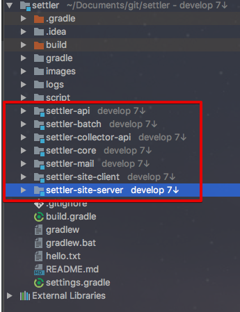
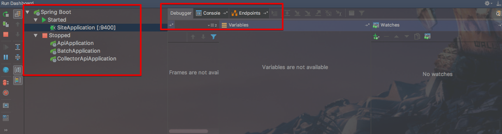
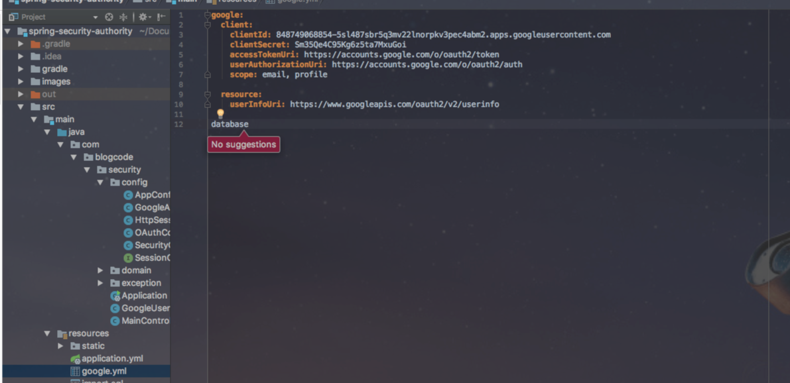
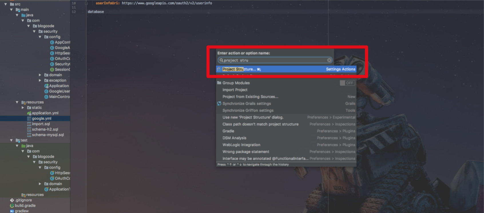
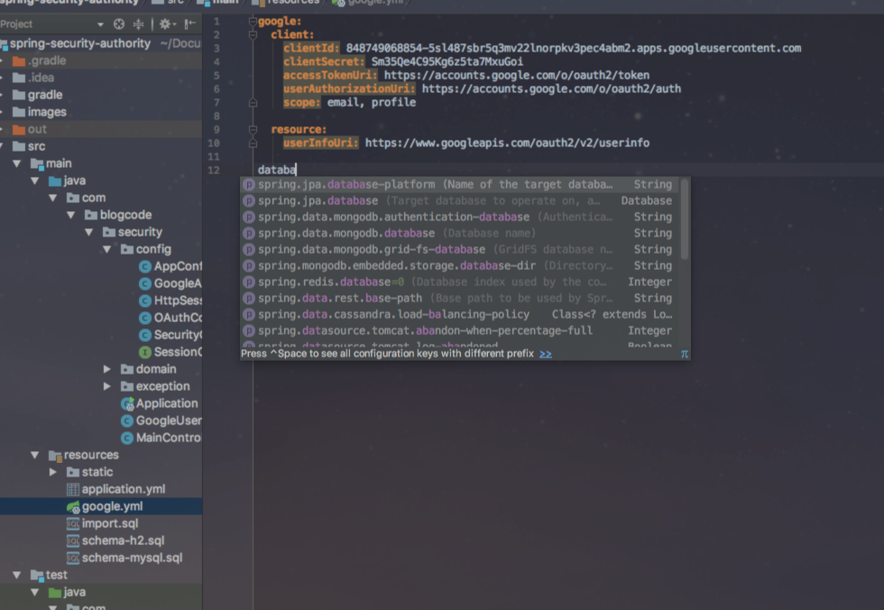
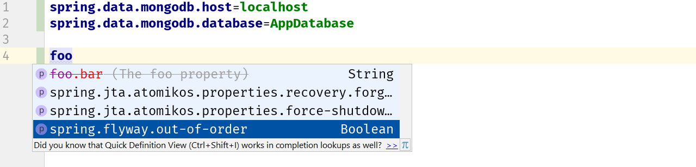
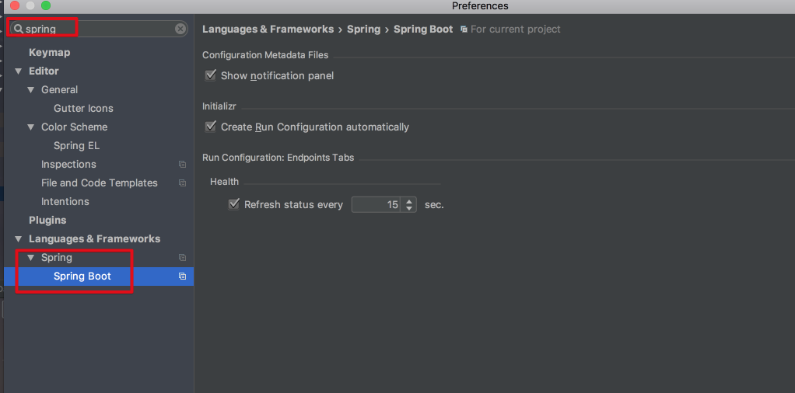

# 2017.2 버전에서의 스프링부트 기능 강화

IntelliJ 2017.2 버전에서 추가된 기능에 대한 소개가 [IntelliJ 블로그](https://blog.jetbrains.com/idea/2017/08/intellij-idea-2017-2-spring-boot-improvements/)에 올라와 정리하였습니다.  

## Endpoints Tab

Endpoints Tab이 추가되었습니다.  
Run/Debug 실행시 등장하는 화면에는 이제 **SpringBoot Actuator의 Beans, Health, Mapping 정보**들이 같이 노출됩니다.  
  
단, 해당 기능은 ```compile('org.springframework.boot:spring-boot-starter-actuator')```과 같이 프로젝트에 spring-boot-starter-actuator 의존성이 포함되어있어야만 합니다.  
  


(spring-boot-starter-actuator가 없을 경우)


(spring-boot-starter-actuator가 있을 경우 - Health)


(spring-boot-starter-actuator가 있을 경우 - Mappings)  
  
해당 프로젝트의 Health 체크, Mapping 정보등을 모두 IntelliJ IDEA 내부에서 확인할 수 있게 되어, 굳이 웹브라우저에서 URL 요청할 필요가 없어졌습니다.  
  
추가로, Run Dashboard가 추가되어 하나의 프로젝트에 서브모듈이 여러개 있을 경우 해당 **서브모듈 실행에 관한 내용을 편하게 관리**할 수 있게 되었습니다.



(하나의 프로젝트에 멀티모듈이 있는 형태)  



**동시에 여러 모듈을 실행, 정지등을 관리** 할 수 있게 되었습니다.

## Initializr

Gradle 기반 프로젝트의 경우 : 자동 설치 문제가 수정되어 실행 구성이 자동으로 생성 될 수 있습니다 (아래 Application Settings 참조).

## Configuration Files

기존에는 application.yml 혹은 applocation.properties 외에 다른 yml, properties에서 자동완성 지원이 어려웠습니다.



(SpringBoot에서 제공하는 설정값을 자동완성으로 조회가 안되는 상황)  
  
이제는 직접 생성한 설정파일들이 application.yml/properties 와 동일하게 IDE의 지원을 받을수 있게 되었습니다.  
  
아래에 설정 방법을 기록하였습니다.  

#### 커스텀 파일 추가하기

먼저 Action 검색(Mac 기준 : ```command + shift + a```)에서 ```project structure```를 찾습니다.



Facets -> 추가하고자 하는 설정 파일이 있는 모듈 -> 화면 하단의 스프링 버튼을 차례로 클릭합니다.


화면 하단의 ```+``` 버튼을 클릭하여 추가로 등록하고자 하는 설정파일을 등록합니다.  

여기서는 google.yml을 등록하였습니다.


최종 OK버튼 클릭후, 등록한 google.yml에서 Spring 설정 값을 일부 생성해서 자동완성(```ctrl+space```) 기능을 확인해봅니다.



짠! google.yml도 스프링 지원을 받을 수 있도록 변경된것을 확인할 수 있습니다.  
  
추가) application.yml 대신에 google.yml을 메인 설정으로 교체할 수도 있습니다.


스프링 부트 1.5에서는 설정 키의 deprecation 상태를 나타내는 "Level"(경고 / 오류)이 추가되었습니다.  
IntelliJ 2017.2에서는 이것 역시 완전히 지원되며 설정 파일 사용시 혹은 문서에서 강조 표시됩니다. 



## Auto-Configuration

auto-configuration 클래스들은 ```@AutoConfigureOrder```및 ```@AutoConfigureAfter/Before``` 에 따라 정렬됩니다.  
```@ConditionalOnProperty```의 경우 실제 설정 키 값이 평가되므로 IntelliJ IDEA는 code에서 자동 설정된 Spring Bean을보다 정확하게 평가할 수 있습니다.

## Application Settings

마지막으로 SpringBoot 설정을 쉽게 찾을수 있게 되었습니다.  
기존 2017.1에선 Spring 관련 설정이 없었습니다


(기존 2017.1에서의 설정화면)  
  
2017.2에선 공식적으로 Spring과 SpringBoot 설정이 추가된 것입니다.  



앞서 언급했듯이 이제 "Create Run Configuration automatically"설정이 Maven뿐 아니라 Gradle에도 적용됩니다.
