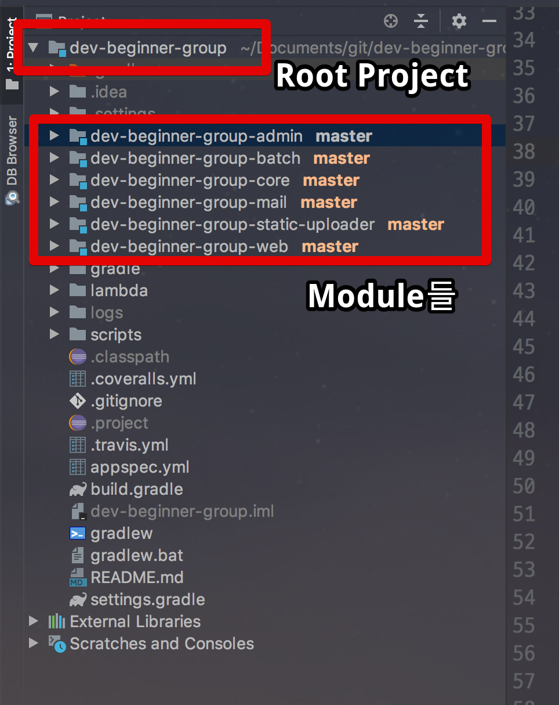

# Eclipse의 Workspace와 IntelliJ의 Project

최근 [인프런에 강의 영상](https://www.inflearn.com/course/intellij-guide/)을 올리고 여러 질문을 받았습니다.  
그 중에서 자주 접하는 질문이 바로 **Eclipse의 Workspace가 IntelliJ의 Project가 맞는건지**에 대한 질문이였습니다.  

(질문)  
  
그래서 이 부분에 대해 한번 정리를 하고자 합니다.  
  
먼저 결론부터 말씀드리면 **IntelliJ에는 Workspace 라는 개념이 없습니다**.  
아래는 IntelliJ 공식 문서에 나와 있는 용어 비교 표입니다.

이 표 때문에 오해가 많았을거라 생각합니다.  
근데 이 표 위에 적힌 소개 글을 보시면 이야기가 다르다는 것을 알 수 있습니다.  
아래는 IntelliJ 공식 문서의 글입니다.  

> The first thing you'll notice when launching IntelliJ IDEA is that it has no workspace concept.  
This means that you can work with only one project at a time. While in Eclipse you normally have a set of projects that may depend on each other, in IntelliJ IDEA you have a single project that consists of a set of modules.  
If you have several unrelated projects, you can open them in separate windows.  
If you still want to have several unrelated projects opened in one window, as a workaround you can configure them all in IntelliJ IDEA as modules.

(구글이) 번역 해보면 다음과 같습니다. 

> IntelliJ IDEA를 시작할 때 가장 먼저 주목할 것은 **Workspace 개념이 없다**는 것입니다.  
즉, **한 번에 하나의 프로젝트만 사용**할 수 있습니다.  
Eclipse 에서는 일반적으로 서로 의존 할 수 있는 일련의 프로젝트를 가지고 있지만 IntelliJ IDEA에서는 일련의 모듈로 구성된 단일 프로젝트가 있습니다.  
서로 관련이 없는 프로젝트가 여러 개 있는 경우 **별도의 창에서 열 수 있습니다**.
서로 관련이 없는 여러 프로젝트를 **하나의 창에서 열어보고 싶다면 IntelliJ IDEA 모듈로 로 구성해야만 합니다**.

즉, **서로 연관관계가 없는 프로젝트들을 굳이 하나의 창에서 열어보고 싶다면** 프로젝트들이 모여있는 장소를 Project로 선택하고, 해당 프로젝트들을 Module로 등록하면 된다는 이야기입니다.  
  
이 방식은 **IntelliJ에서 권장하지 않습니다**.  
workspace 개념 자체가 없고, 단일 프로젝트를 하나의 창에서 사용하는것을 권장합니다.  
  
특히나 요즘 같은 **Multi Module 환경**에선 하나의 창에 하나의 프로젝트를 구성하는 것이 훨씬 도움 됩니다.  
  
Multi Module이란 간단하게 **하나의 도메인을 위한 프로젝트 모음**이라고 생각하시면 됩니다.

예를 들어 dev-beginner-group이란 서비스를 구현하다고 가정하겠습니다.  
이 서비스를 구현하기 위해선 다음과 같은 여러 프로젝트가 필요합니다.

* admin
* batch
* mail
* web
* 정적파일 업로더 (static-uploader)
* Entity와 같은 중요 비지니스를 담은 core

이 프로젝트들은 모두 dev-beginner-group 이란 서비스를 구현하기 위한 프로젝트들이며 서로가 서로에게 의존하는 경우가 발생할 수도 있습니다.  
그래서 이런 경우엔 하나의 Root 프로젝트에 각각의 프로젝트를 Module로 구성하여 프로젝트를 생성합니다.

> Multi Module을 처음 들어보신 분들은 예전에 작성한 [Gradle Multi Module 구성하기](http://jojoldu.tistory.com/123?category=721560)를 참고해보세요  
아주 상세하게 적용법과 소개를 진행합니다.

이는 꼭 IntelliJ에서만 권장하는것이 아니라, 많은 프로젝트들이 Multi Module 구성으로 진행하고 있습니다.

([spring batch](https://github.com/spring-projects/spring-batch))

실제로 많은 프로젝트가 다 Multi Module로 구성하고 있습니다.

* [dev-beginner-group](https://github.com/jojoldu/dev-beginner-group)

하지만 여러 프로젝트가 있다고 해서 Workspace와 같은 이야기는 아닙니다.  
**Workspace는 단순히 여러 프로젝트를 모아놓은 디렉토리**일 뿐입니다.  
이는 Eclipse에만 있는 개념입니다.  
하지만 IntelliJ의 Project는 코드를 구성할 수 있는 엄연히 Project입니다.  
즉, **Eclipse의 Project와 IntelliJ의 Project는 같습니다**.  
다만

* Eclipse에는 Module 개념이 없고
* IntelliJ에는 Workspace 개념이 없습니다.  

그래서 서로 Multi Module 구성 방식이 다를수는 있습니다.  

> Eclipse에서는 Sub Module을 어떻게 만드나요?  
라고 하실 수 있습니다.  
이건 [donzbox님의 포스팅](http://donzbox.tistory.com/594)을 참고하시면 됩니다.

모두가 오해하고 있듯이 **Eclipse의 Project와 IntelliJ의 Module이 같다는 이야기는 아닙니다**.  
  
IntelliJ에는 Workspace개념이 없으니 **서로 관련 없는 프로젝트를 하나의 창에서 다 열려고 하지 않는걸 추천**드립니다.  
서로 관련 없는 프로젝트라면 해당 프로젝트마다 하나의 창을 할당해서 여시는걸 추천드립니다.

## 참고

* [migrating-from-eclipse-to-intellij-idea.html#migratingEclipseProject](https://www.jetbrains.com/help/idea/migrating-from-eclipse-to-intellij-idea.html#migratingEclipseProject)