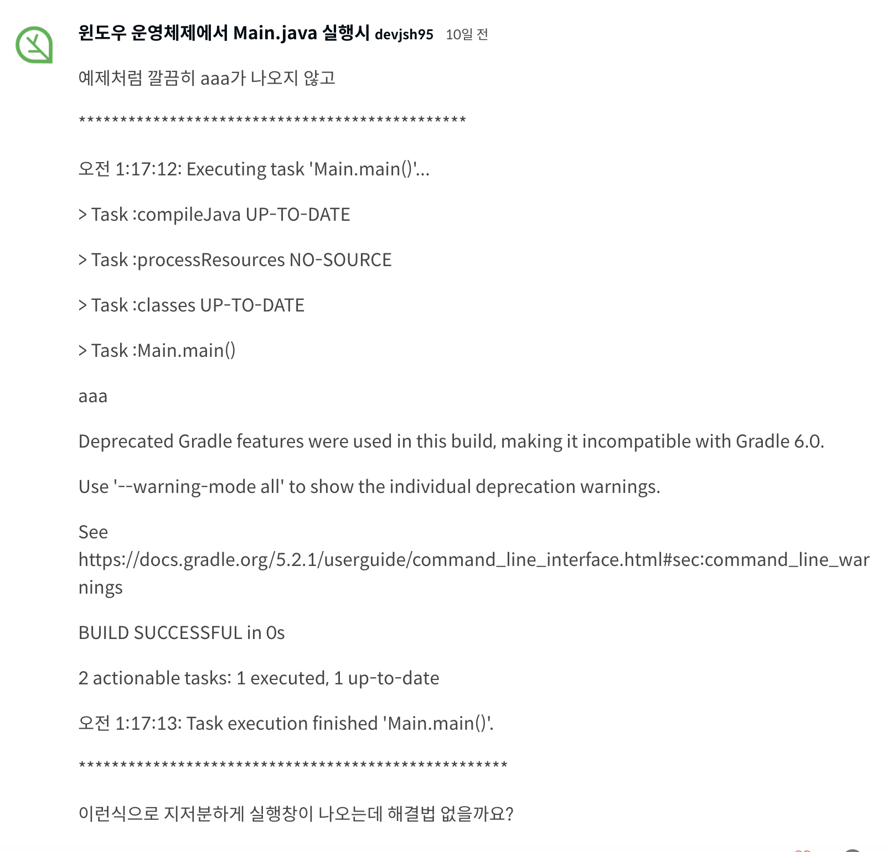
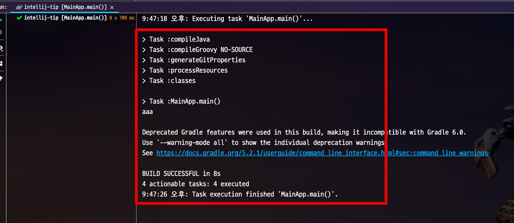
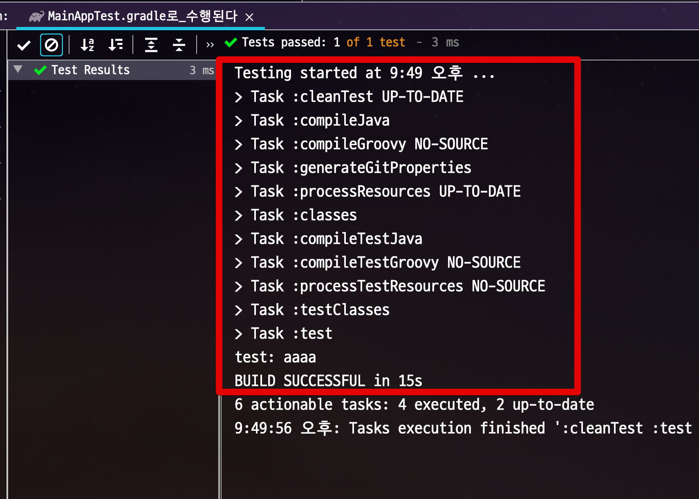
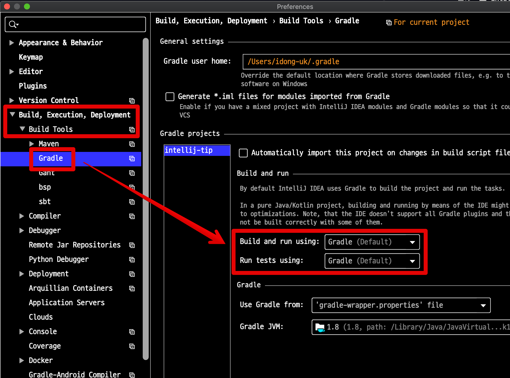
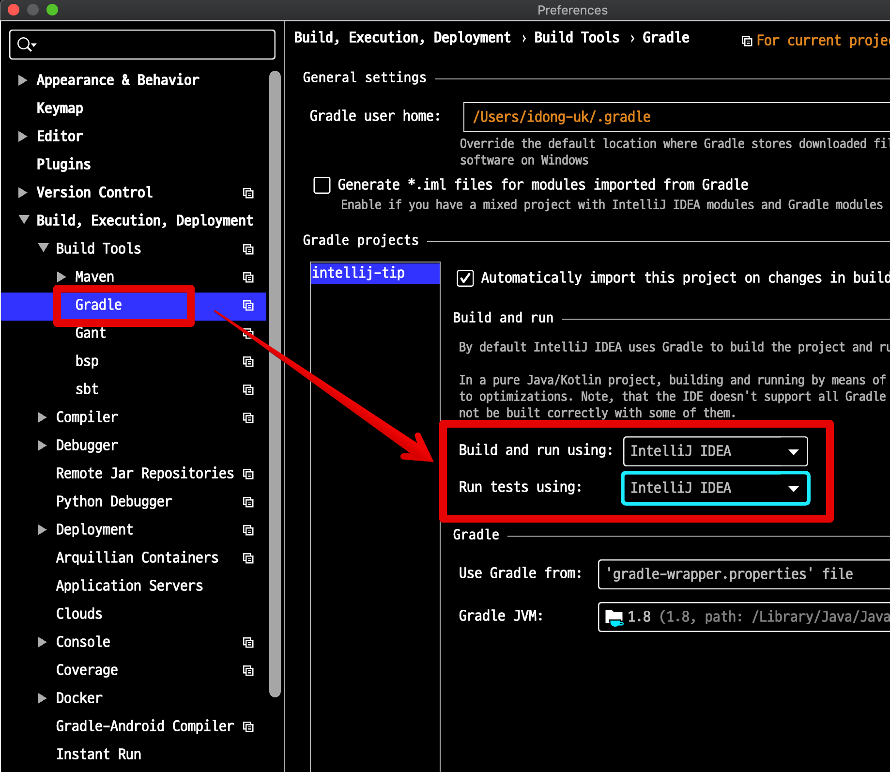
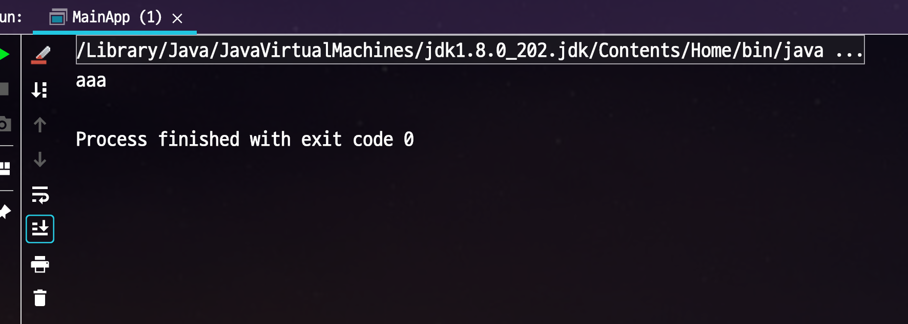
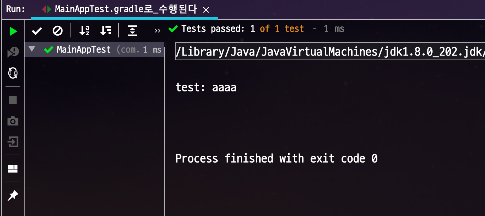

# IntelliJ 2019.2 에서 Gradle로 run과 test가 실행될때

[인프런 강의](https://www.inflearn.com/course/intellij-guide)를 올린 뒤 최근에 받은 질문이 있습니다.  



즉, IntelliJ로 메인 메소드를 실행했는데 그레이들로 실행한것처럼 로그가 출력된다는 것인데요.  
실제로 IntelliJ 2019.2로 버전 업데이트 이후 메인 메소드와 테스트 메소드를 실행하면 다음과 같은 로그가 발생합니다.  
  
**메인 메소드**



**테스트 메소드**



이는 **명령 실행자의 기본값**이 변경되었기 때문입니다.  
  
확인 하기 위해 다음과 같이 설정을 찾아봅니다.  
  
Preferences (윈도우라면 Settings) 에서 ```Build, Execution, Deployment``` -> ```Build Tools``` -> ```Gradle``` 로 이동합니다.  
그리고 다음의 2가지 항목을 확인합니다.

* Build and run using
* Run tests using



2가지 항목이 모두 Gradle로 되어 있습니다.  
셀렉트 박스를 선택해 IntelliJ 로 변경합니다.



이렇게 변경 하신 뒤 다시 메인 메소드와 테스트 메소드를 실행해보시면

**메인 메소드**



**테스트 메소드**



예전처럼 Gradle 없이 실행되는 것을 확인할 수 있습니다.  

## 마무리
  
설정을 변경하시면서 "왜 기본값을 Gradle로 한거지?" 라는 의문이 드실수 있습니다.  
  
Preferences 선택 항목에 있는 내용에도 있지만, 공식 문서에서 이렇게 Gradle을 디폴트 값으로 선택한 이유에 대해 다음과 같이 이야기 합니다.

> IntelliJ IDEA는 Gradle을 기본 실행기로 합니다.  
결과적으로 **CI (Continuous Integration) 서버에서 동일한 테스트 결과**를 얻습니다.  
또한 명령 줄에서 실행되는 테스트는 항상 IDE에서 작동합니다.

로컬 PC에서 그레이들로 실행할 수 있게 되어 더이상 "내 PC에선 잘되는데 배포하려니 안된다" 등의 일이 발생하지 않도록 배려한것 같습니다.  

> 물론 저는 IntelliJ 모드로 사용합니다.  
그레이들 모드가 너무 느려서요 ㅠ
