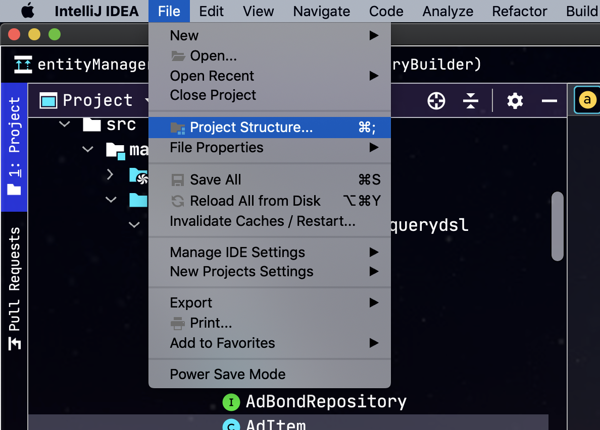
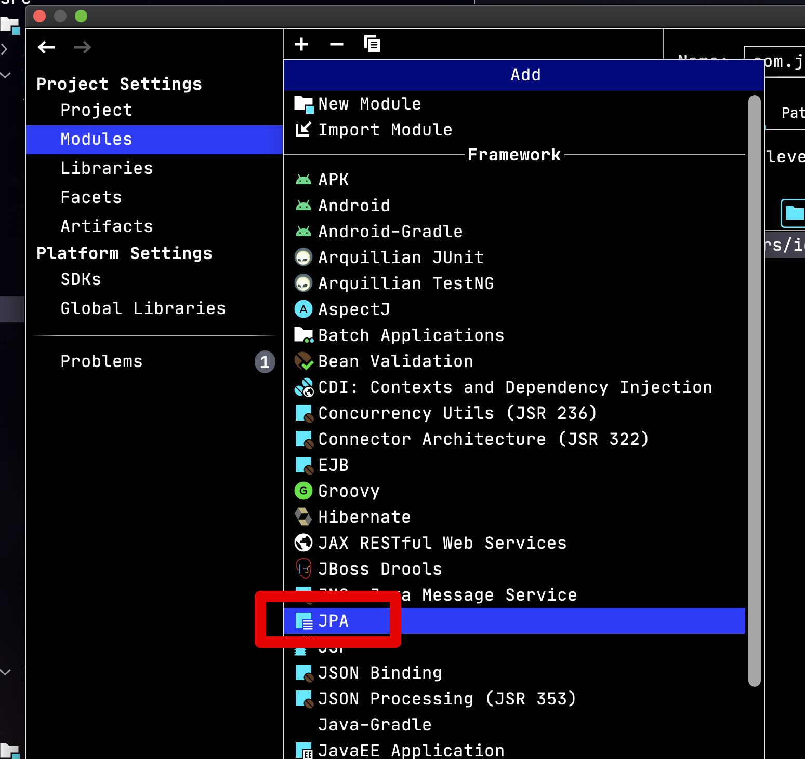
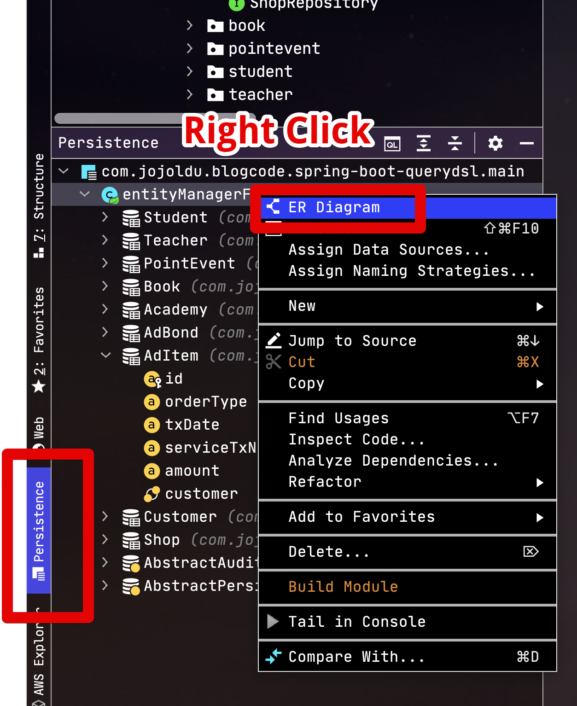
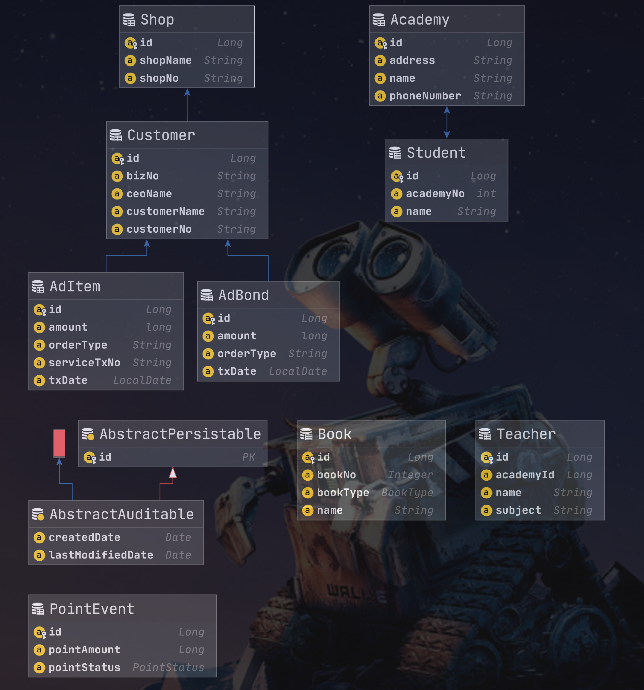
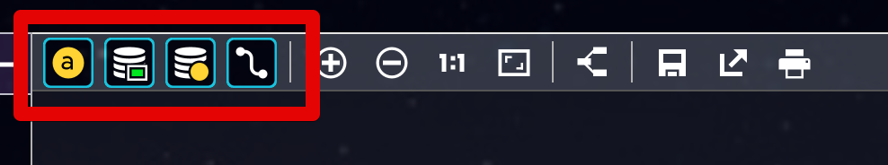

# IntelliJ에서 JPA ER Diagram 확인 방법

최근엔 IntelliJ 환경에서 JPA로 개발 하시는 분들이 많아졌는데요.  
JPA로 개발하다보면 실제 테이블의 연관관계를 확인하기 보다는 JPA Entity 간의 관계를 한눈에 보길 원할때가 많습니다.  
특히나 복잡한 Entity 간의 관계는 코드만으로는 쫓아가는데 한계가 있는데요.  
  
이럴때 IntelliJ에서는 JPA Entity 기반의 ER Diagram을 지원합니다.  
특별히 큰 설정없이 확인할 수 있으니, 어떻게 하면 되는지 바로 확인해보겠습니다.

## 1. 프로젝트에 JPA Support 활성화

> 이미 프로젝트에 JPA Support 를 활성화 시키신 분들은 바로 2번으로 가시면 됩니다.  

먼저 IntelliJ 좌측 상단의 **File** -> **Project Structure** 를 차례로 클릭해서 이동합니다.



Project Structure 팝업에서 좌측 Project Settings 항목에 **Modules** -> 프로젝트의 **main** 선택 -> 상단의 ```+``` 버튼을 클릭합니다.


 ```+``` 버튼을 누르면 아래와 같이 여러 Support를 보실 수가 있는데요.  
여기서 JPA를 선택합니다.
 


JPA를 선택하시면 아래와 같이 우측 하단에 JPA Default Provider를 선택할 수 있는데요.  
본인이 사용하는 JPA 구현체를 선택합니다.  
일반적으로는 Hibernate가 대부분의 구현체일겁니다.  

> Spring Data JPA 쓰시는 분들도 마찬가지로 Hibernate를 선택하시면 됩니다.


자 이렇게 하면 프로젝트의 설정은 끝났습니다.  
바로 ER Diagram를 열어보겠습니다.

## 2. ER Diagram 열어보기

IntelliJ 좌측 하단 탭 쪽을 보시면 **Persistence** 탭을 볼 수 있는데요.  
해당 탭을 선택하신뒤 **entityManagerFactory**를 **우클릭** 하시고 ER Diagram을 선택하면 됩니다.  

> 만약 entityManagerFactory가 보이지 않으면 Persistence 탭에 있는 Entity 아무거나 선택하신뒤 우클릭하셔도 ER Diagram 선택창을 볼 수 있습니다.



이렇게 ER Diagram을 선택하시면 아래와 같이 Entity 연관관계가 그려진 ER Diagram을 확인할 수 있습니다.



ER Diagram 화면의 상단에는 여러 옵션들이 있는데요.  



이 옵션들은 차례로 다음과 같은 설정들을 on/off 할 수 있습니다.

* Entity의 속성값 on/off
* Embeddable Entity on/off
* SuperClass Entity on/off

본인이 보고싶은 영역에 한해서 선택적으로 활성화만 시켜서 보셔도 됩니다.
