# JetBrains IDE AI Assistant EAP 후기 (2023.07.12)

2023년 6월 26일, JetBrains에서 AI Assistant 기능이 추가 되었다.  

- [JetBrains IDE의 AI Assistant](https://blog.jetbrains.com/ko/idea/2023/06/ai-assistant-in-jetbrains-ides/)

현재 (2023.07.12) 까지 **정식 기능은 아니며 EAP 버전에서만 사용 가능**하다.  
  
GPT 채팅이 있어서 IDE에서는 어떤 차별점이 있을까 궁금해서 EAP 버전을 설치해서 사용해보기 시작했다.

> 아래 모든 단축키는 **Mac을 기준**으로 한다.
 
## 1. 설치

IntelliJ나 WebStorm 등 IDEA 에서는 다 지원하기 때문에 어떤 IDE라도 EAP 버전을 설치하면 바로 사용할 수 있다.  
  
EAP 버전을 설치하는 방법은 [JetBrains Toolbox](https://www.jetbrains.com/ko-kr/toolbox-app/) 를 설치하고, 이를 실행해보면 다음과 같이 설치된 IDE들의 목록이 나온다.  
  
여기서 EAP 버전을 설치하고 싶은 IDE의 `Settings` 버튼을 클릭해서

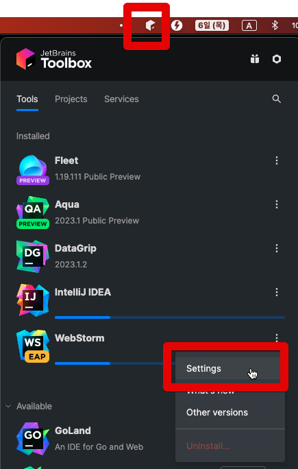

Settings 페이지에서 **Early Access Program**을 체크한다.

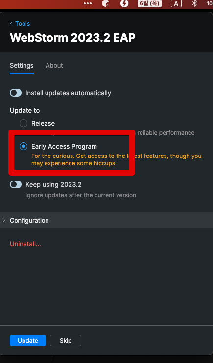

그리고 다시 IDE 목록으로 돌아가서 해당 IDE의 Update 버튼을 클릭하면 EAP 업데이트가 진행된다.

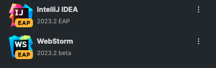

설치가 끝나고 실행해보면 아래와 같이 EAP 버전인 것을 확인할 수 있다.

(IntelliJ 2023 EAP)

(WebStorm 2023 EAP)

실행이 완료되면 다음과 같이 우측 탭 영역에 AI Assistant가 추가된 것을 확인할 수 있다.

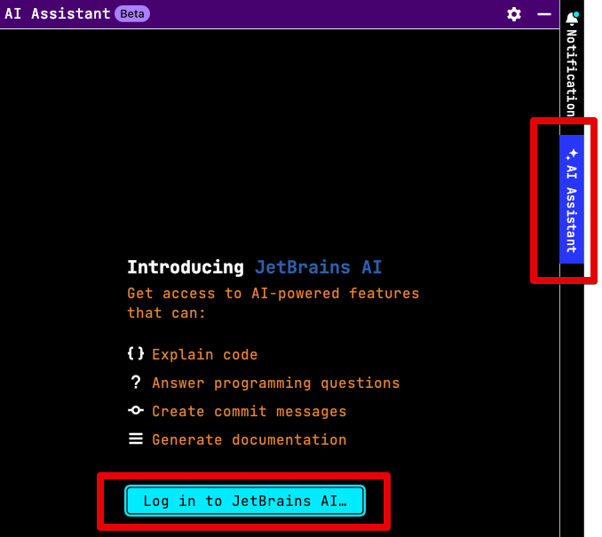

해당 탭을 클릭후 **Log in to JetBrains AI**을 클릭한다.  
가입한 JetBrains 계정으로 로그인을 성공하면

다음과 같이 AI Chat이 활성화 된 것을 확인할 수 있다.

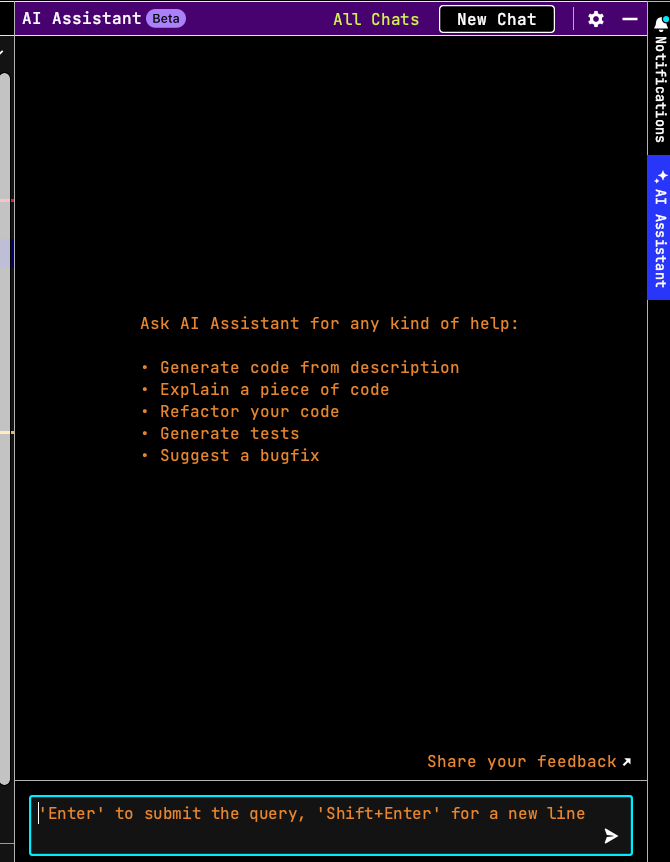

## 2. 주요 기능

이렇게 설치된 JetBrains IDE 의 AI 주요 기능들은 다음과 같다.

- AI 채팅 & 코드 분석
- 리팩토링 & 이름 제안
- 주석 생성
- 커밋 메세지 작성

### 2-1. 기본 사용 방법

기본적으로 `Option + Enter` 로 AI 메뉴바가 활성화 된다.

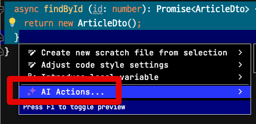

해당 AI Actions 을 선택하면 여러가지 옵션들이 나온다.

### 2-2. AI 채팅 & 코드 분석

IDE의 우측 상단에 AI 채팅 버튼이 추가되었다.

해당 버튼을 클릭하면 다음과 같이 IDE 안에서 GPT와의 채팅이 가능하다.

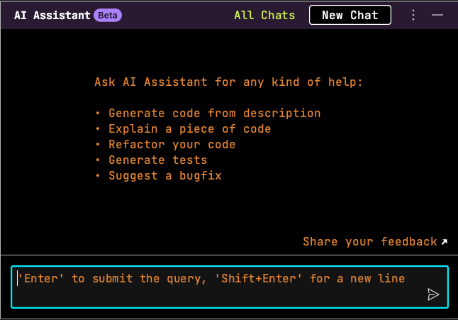

여기서 여러가지 질문을 할 수도 있지만, 이러면 그냥 open ai chat 브라우저로 가는 것과 큰 차이가 없다.  
  
JetBrains IDE와 AI의 결합은 개발 하는 현재 내 코드와 AI의 시너지 효과가 크다.  
  
예를 들어 **타인이 작성한 코드를 분석**해야할 때, 해당 코드에 대한 분석을 AI에게 요청할 수 있다.  
  
아래와 같이 현재 보고 있는 메소드를 선택해서 `Option + Enter` 로 AI 메뉴바를 노출시킨뒤 **Explain code** 를 선택해보면

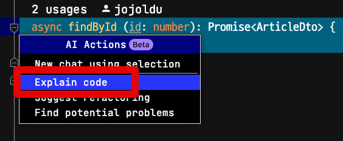

다음과 같이 해당 메소드에 대해 분석과 설명을 해준다.

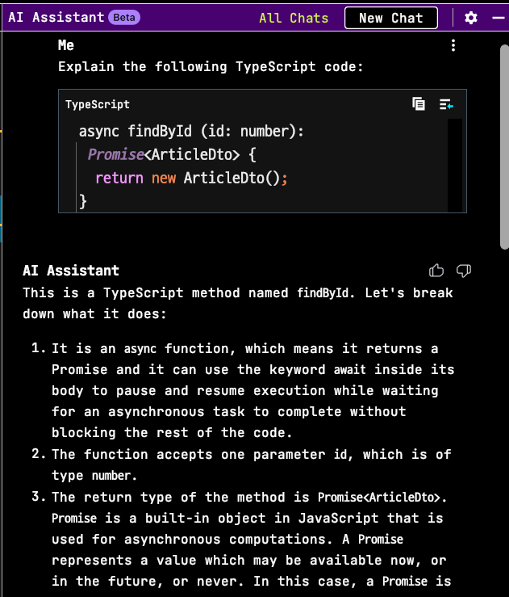

물론 한글로의 번역을 요청하면 이 역시 잘 수행해준다.

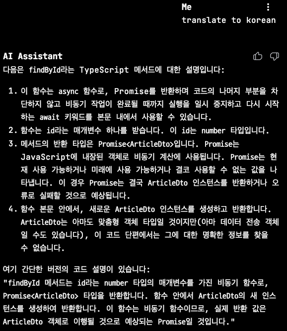

### 리팩토링

AI 메뉴에는 **리팩토링**도 지원한다.  
  
이번에는 좀 더 긴 메소드를 선택해서 **Suggest refactoring**을 선택했다.

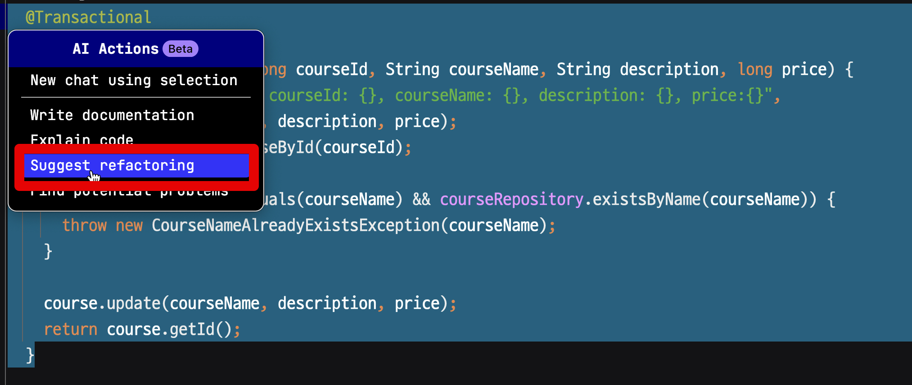

그러면 AI Chat 메뉴에서 다음과 같이 AI가 코드를 리팩토링 해준다.

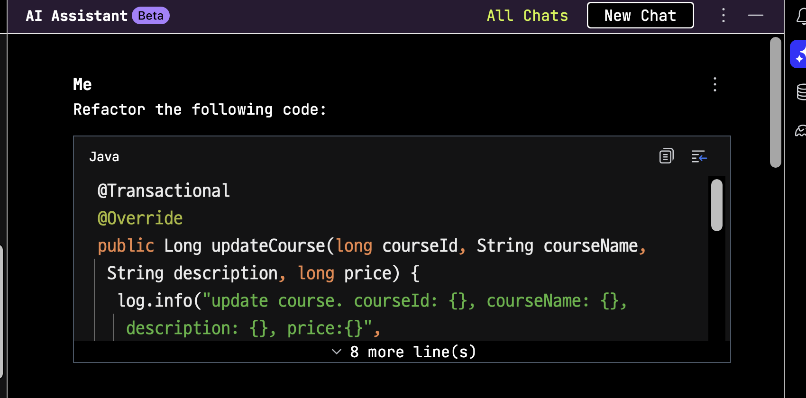

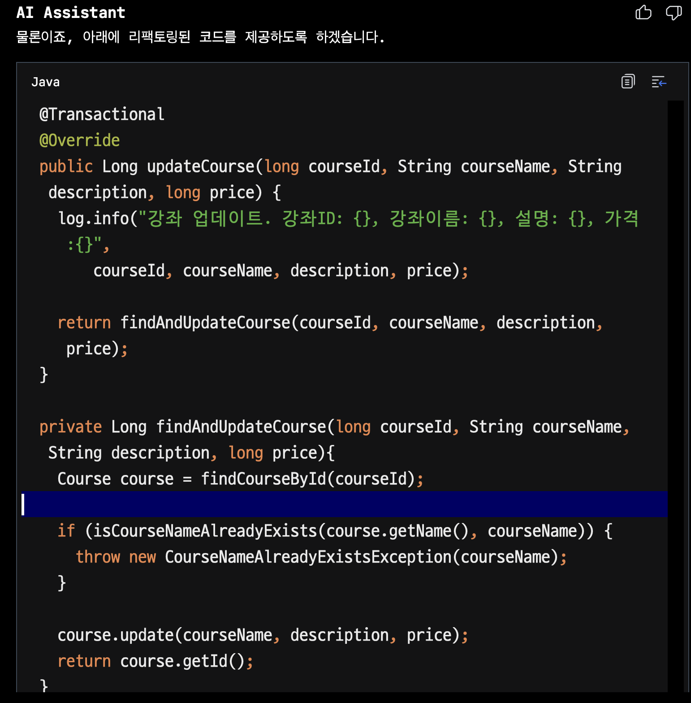

왜 그렇게 리팩토링 하는게 좋은지에 대해서도 설명을 남겨준다.

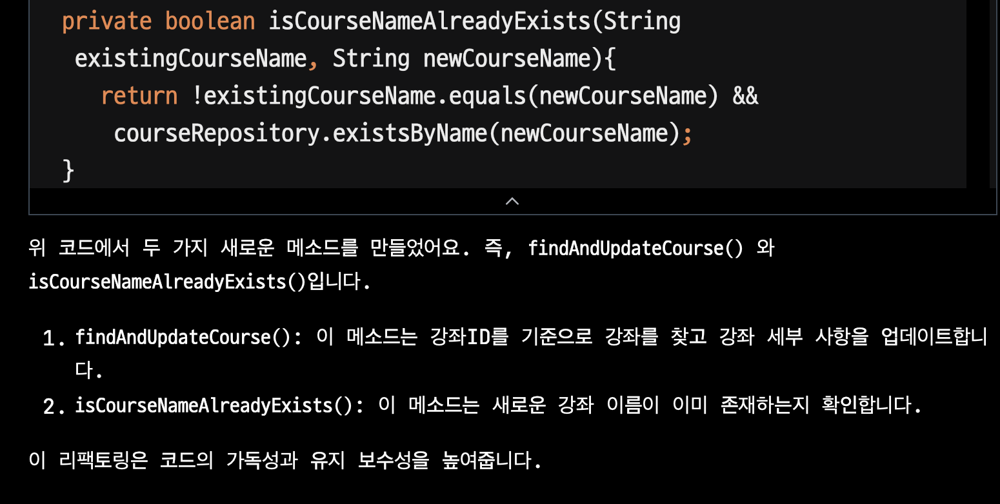

물론 해당 리팩토링이 마음에 안들어서 **내가 원하는 방향의 리팩토링을 요청**하면 이를 반영한 버전도 제안해준다.

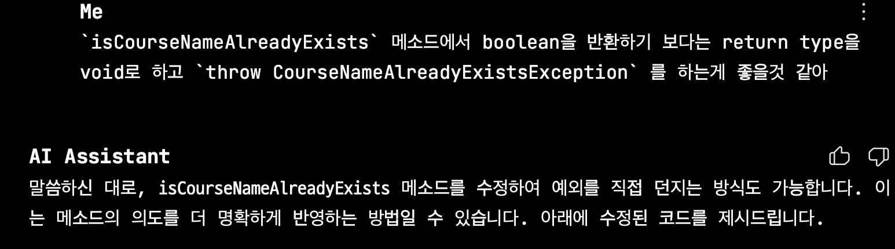

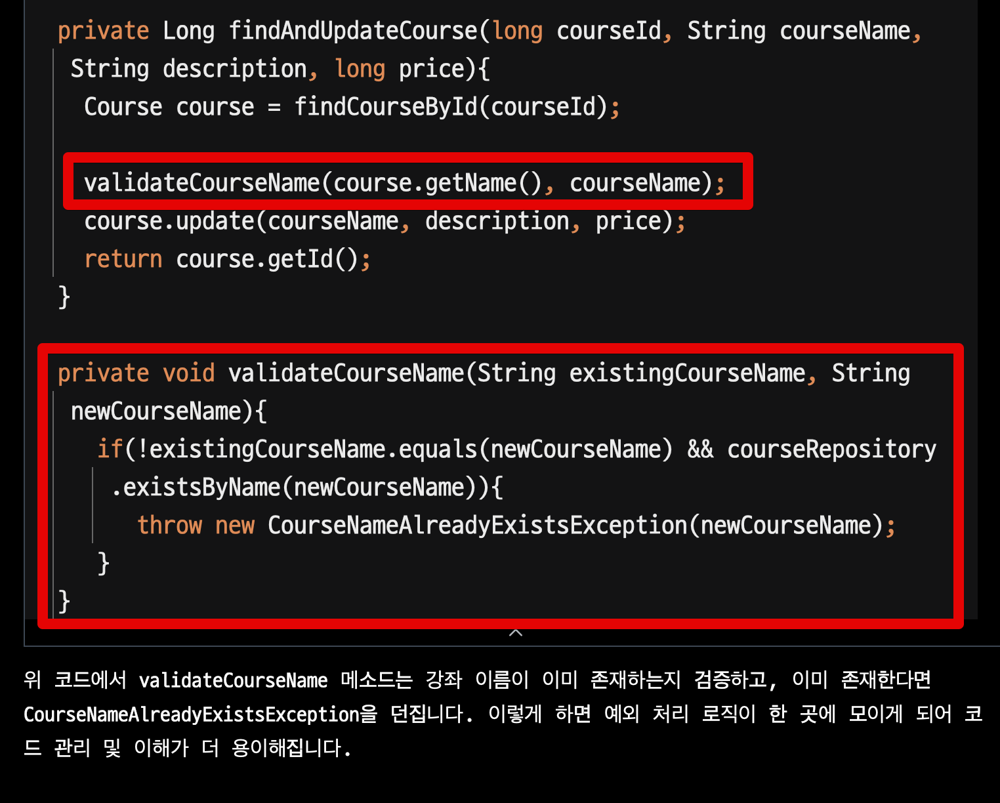

이렇게 작업된 코드는 AI 메세지 내부의 우측 상단을 보면 나오는 **Insert Snippet at Caret** 버튼을 클릭하면 코드가 자동으로 현재 파일에 반영이 된다.

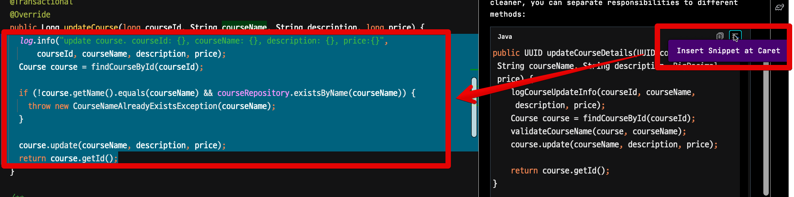

### 함수, 변수명 추천

> Java, Kotlin, Python만 가능

Mac 기준으로 함수명, 변수명, 클래스명을 변경하는 단축키는 `Shift + F6` 이다.  
해당 단축키로 이름을 변경하려고 하면, **AI에서 여러 이름을 추천**해준다.

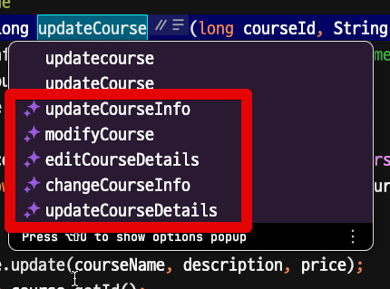

### 2-3. 주석 생성

> Java, Kotlin, Python만 가능

메소드나 클래스의 코드를 분석해서 주석을 생성할 수 있다.  
  
원하는 메소드나 클래스를 선택한 뒤에 `Option + Enter` 로 AI Actions를 선택하면

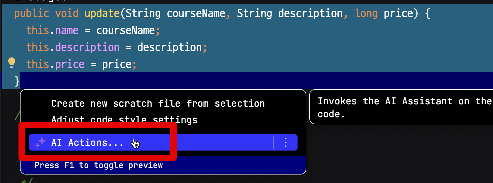

다음과 같이 선택된 코드들을 분석해서 주석을 자동으로 생성해준다.

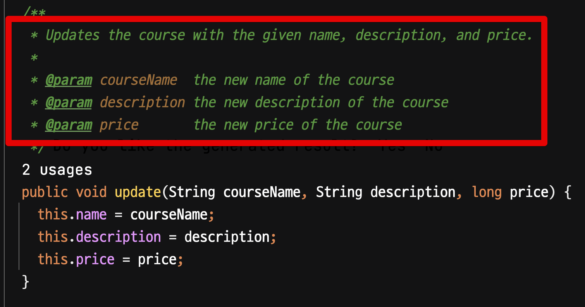

좀 더 편하게 사용할 수 있도록 메소드나 클래스 상단에 `/**` 을 입력하면 자동으로 AI 주석을 사용할 것인지 메세지가 뜬다.

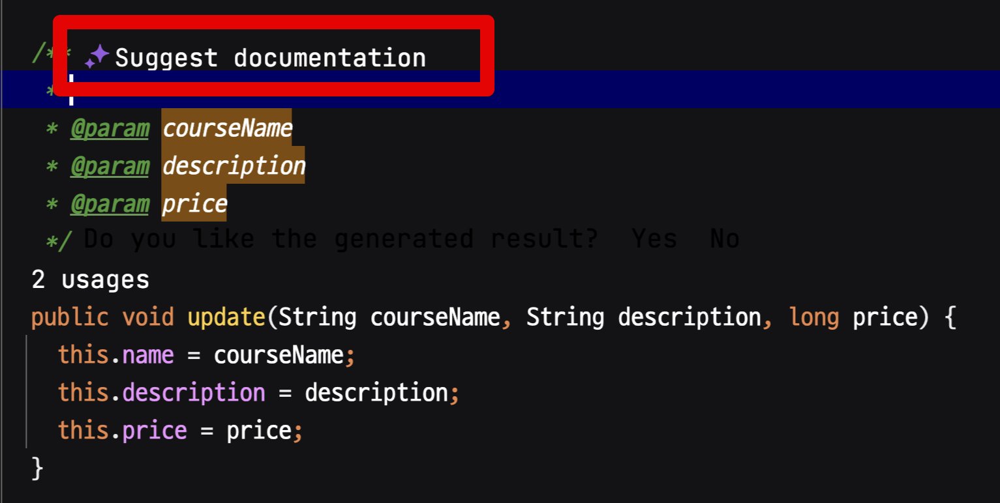

해당 메세지를 클릭하면 자동으로 주석이 생성된다.

### 커밋 메세지 작성

commit dialog에서도 AI 버튼이 추가되었다.  
**이번에 커밋할 파일들의 Diff 내용을 기반으로 커밋 메세지를 작성**해준다.  

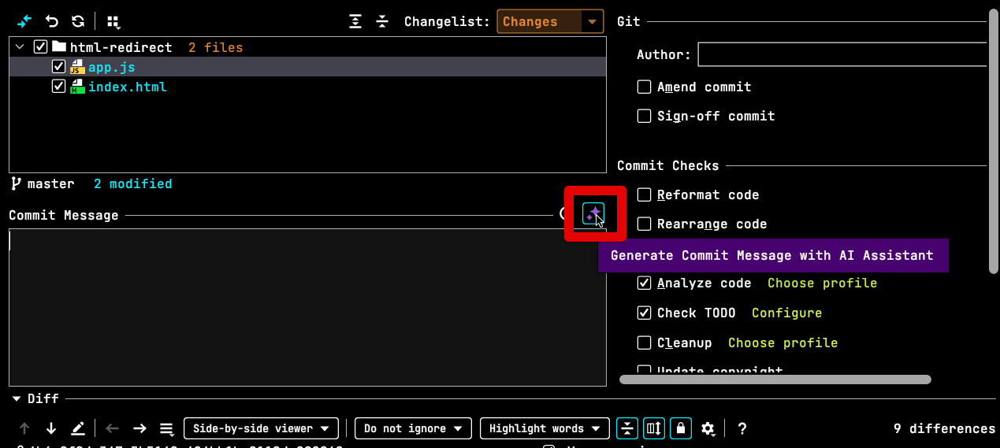

위 버튼을 클릭하면 아래와 같이 메세지가 자동으로 dialog에 추가된다.

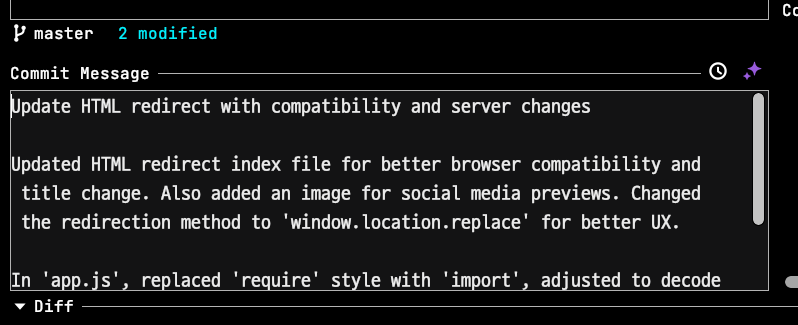

> 단... 영어로만 작성된다.

## 기타

Korean Language Pack을 설치하면 AI 메세지들이 모두 한글로 번역되서 나오지 않을까 추측했지만, 한국어팩을 설치해도 그냥 영어로 주석/커밋메세지들이 작성되었다.

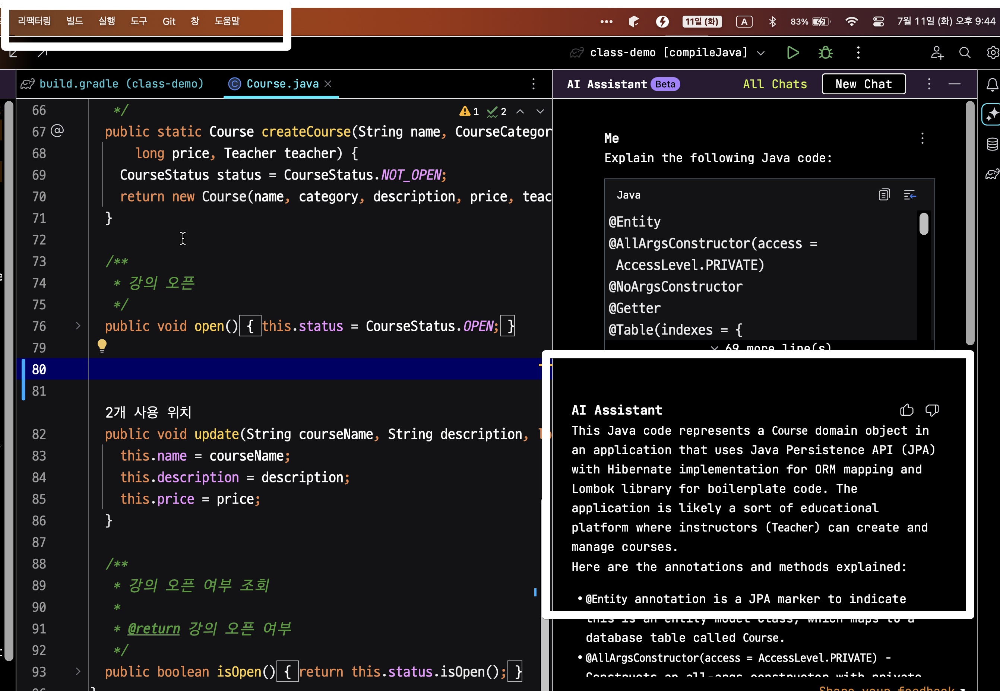

## 마무리

IDE에 AI 기능이 내장되니 확실히 도움이 된다.
 
- 기존 레거시 코드를 분석해야할 때
- 큰 함수를 작은 함수들로 분해 & 리팩토링 해야할때
- 적절한 함수명/변수명을 추천받고 싶을때

특히 실제 개발하는 과정에서 IDE <-> 브라우저 전환이 빈번하게 이루어지던 현상이 많이 개선 되었다.

다만 아쉬운 점은

- 주석/커밋메세지 등 각 언어에 맞게 지원해야할 부분에서 큰 효과를 보긴 어려웠다.
- JS/TS가 아직까지 미지원이라 일부 기능을 사용하지 못하는게 아쉽다.

## 함께보면 좋은 글

- [ChatGPT와 함께 춤을](https://jojoldu.tistory.com/709)