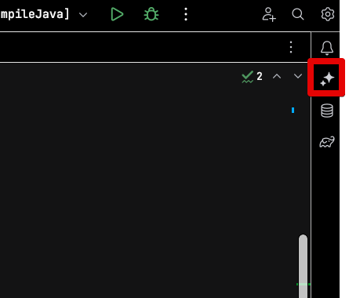

# JetBrains IDE AI Assistant

https://blog.jetbrains.com/ko/idea/2023/06/ai-assistant-in-jetbrains-ides/

## AI 채팅

## Editor

`Option + Enter` 로 사용 가능

### 주석 파라미터 자동생성 

(jsDoc)

### 함수, 변수명 추천

## Git

### 커밋 메세지 작성

