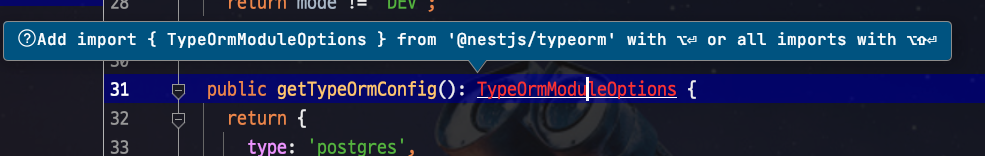

# IntelliJ & Webstorm import시 double quotes 대신에 single quotes 기본값으로 사용하기

IntelliJ나 Webstorm을 통해 JS / TS를 개발하다보면 `import` 구문에서 `"` 로 인해 불편할때가 많은데요.  
  
이를테면 팀 컨벤션으로 `import`를 Single Quotes 로 해놓은 경우에는 자동 `import` 를 통해 `"`로 `import` 되면 매번 수동으로 Single Quotes 로 바꿔야만 합니다.  
  
## 1. Auto Import 하는법

먼저 Jetbrains IDE의 Auto Import 는 다음과 같이 사용할 수 있는데요.
  
아래와 같이 Import되지 않는 클래스나 function에 포커스를 두고, 단축키를 통해 `import`를 수행합니다.

* `option` + `Enter`: 제안 목록 보기
* `option` + `shift` + `Enter`: 전체 full import

여기서 단일 `import`인 `option` + `Enter`를 사용하면 아래와 같이 여러 제안 항목들이 나오는데, 이 중 `Add import statement`를 선택하시면 import 구문이 자동 생성됩니다.

아직까지 세팅 안되어있는 상태 (Default) 에서는 아래와 같이 `"`로 `import` 구문이 생성됩니다.

개인 IDE 때문에 팀 컨벤션을 변경하는 것은 어려우니 IDE의 세팅을 변경해보겠습니다.

## 2. Single Quotes Import로 교체

아래의 순서를 따라 진행합니다.

* `Preferences` (`Settings`) -> `pun` 검색 -> `Editor` -> `Code Style` -> `JS` 혹은 `TS` 선택 -> `Punctuation` 이동

여기서 `Use` 항목의 `double`을 `single`로 교체합니다.

설정을 저장하신뒤, 다시 1번의 방식으로 `import`를 수행해보시면?

Single Quotes로 `import` 구문이 잘 생성된 것을 볼 수 있습니다.