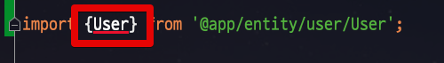
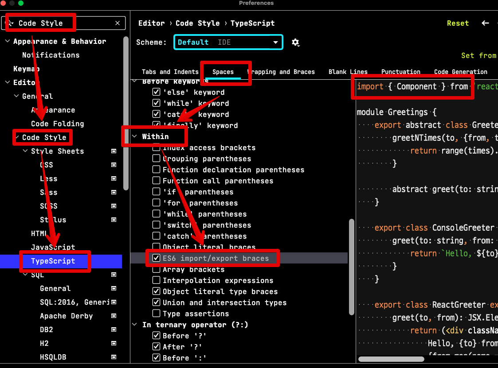
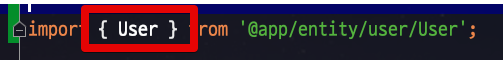

# IntelliJ & WebStorm에서 ES6(& TS) Import 문에 space 포함시키기

IntelliJ나 WebStorm의 기본 `import` 구문은 `space`가 없는 형태인데요.

NestJS를 비롯해서 사내 프로젝트등의 Lint 규칙이 `space`가 포함된 형태라면 import 템플릿을 변경할 필요가 있습니다.

## import 템플릿 변경

IntelliJ나 WebStorm에서 아래를 따라 체크박스를 해줍니다.

* `Preferences` -> `Editor` -> `Code Style` -> `JavaScript` `TypeScript` -> `Spaces` -> `Within` -> `ES6 import/export braces`

그럼 아래와 같이 **import**시에도 자동으로 `space`가 포함된 형태가 됩니다.

