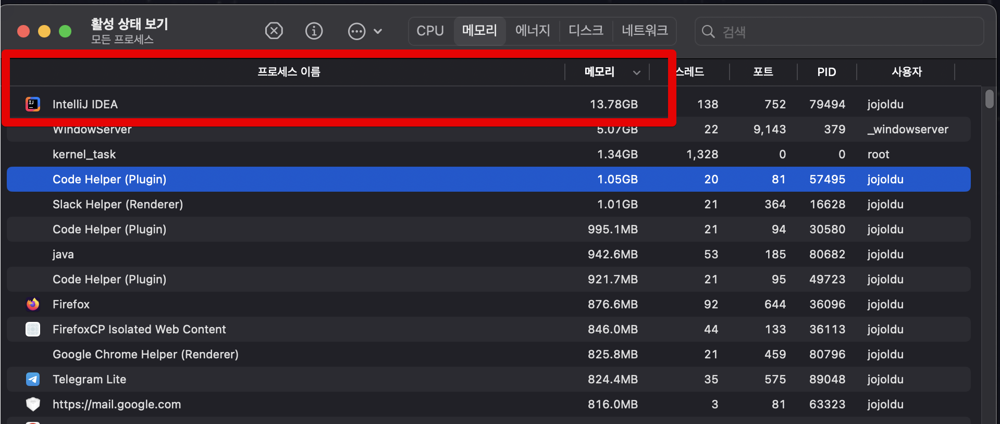
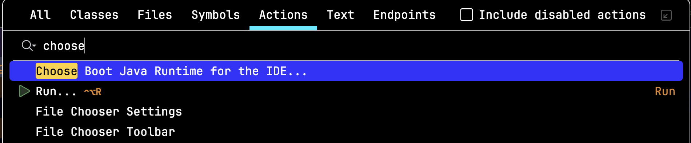
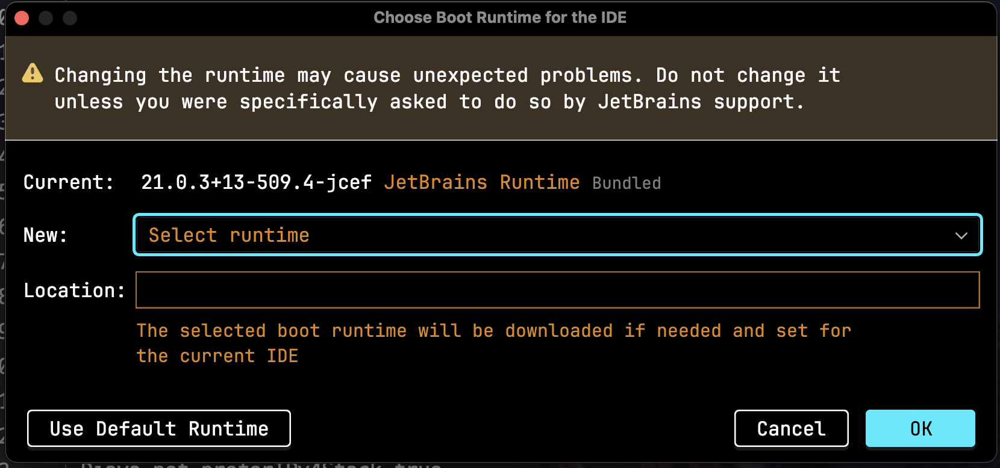
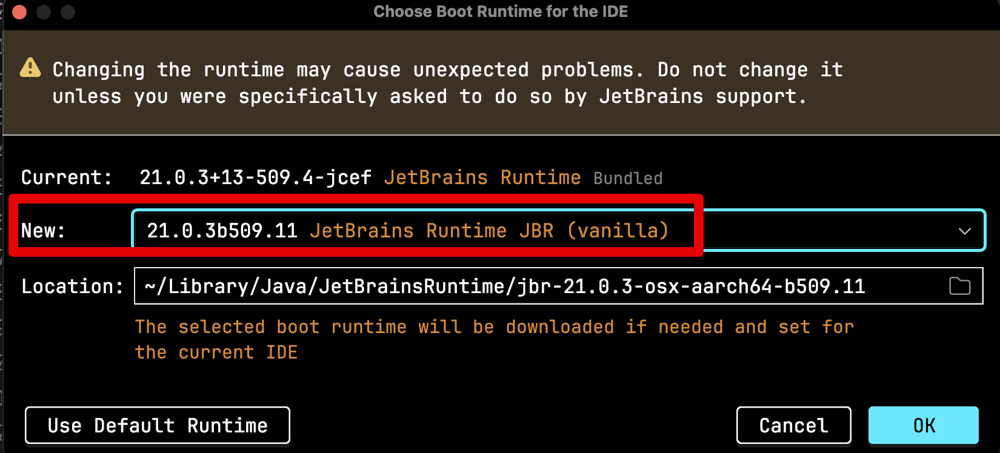
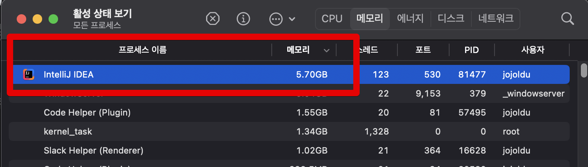

# IntelliJ 등에서 메모리 점유율이 계속 높아질 때 (feat. vanilla JBR)

silicon M1 맥북을 사용하고나서 IntelliJ를 계속 켜놓고 있으면 끝도 없이 메모리가 올라가는 이슈가 발생했다.  
  
현재 내 IntelliJ VM Option 에서 메모리 설정은 다음과 같다.

(PC는 M1 Pro 16GB)

```bash
-Xms1024m
-Xmx4096m
```

위와 같이 설정하고 IntelliJ를 켜두고 오랜 시간이 지나면 IntelliJ의 자체 Memory 분석 도구에서는 여전히 아래와 같이 정상적인 사용량이 노출되는 반면,


실제 IntellIJ의 메모리 사용량은 다음과 같이 **설정한 VM Option을 크게 초과해서 사용하는 것**을 확인할 수 있다.



16GB RAM을 가진 PC에서 14GB에 가까운 메모리를 사용중인데, 이건 **더 높은 메모리 사양을 가진 맥북을 사용하면 더 크게 메모리를 점유한다**.  
(테스트 결과 36GB 메모리 PC에서는 20GB를 사용한다.)  
  
즉, **아무리 사양이 좋은 맥북을 사용하더라도 메모리로 인한 성능 저하 문제를 피할 수가 없다**.  
  
이 이슈를 해결하기 위해 여러 설정들을 테스트 해봤다.

## 해결 방법

위 이슈에 대해 [YouTrack](https://youtrack.jetbrains.com/) 이슈들을 확인 해보니, 이 이슈가 3년전부터 있었던 이슈였다.

- [Intellij high memory usage on apple silicon M1, 7-8GB of RAM](https://youtrack.jetbrains.com/issue/JBR-3631)

댓글에서 여러가지 방법들이 이야기 되었지만, 실제 효과가 있었던 방법은 하나였다.  
바로 ["IDE의 Java Runtime을 바꾸는 것"](https://www.jetbrains.com/help/webstorm/switching-boot-jdk.html)이다.  
  
IntelliJ 역시 Java로 만들어진 애플리케이션이며, 이를 구동시키는데는 Java Runtime 환경 (JRE)이 필요하다.  
기본적으로 JetBrains IDE들은 IDE에 포함된 JetBrains Runtime(OpenJDK의 Fork 버전)을 사용한다.  
JetBrains Runtime은 알려진 다양한 OpenJDK 및 Oracle JDK 버그를 수정하고 더 나은 성능과 안정성을 제공하지만, 이번 경우와 같이 문제가 될 경우 변경할 수 있는 설정을 지원한다.  
  
우리가 변경할 버전은 [JBR Vanilla](https://youtrack.jetbrains.com/issue/JBR-3631/Intellij-high-memory-usage-on-apple-silicon-M1-7-8GB-of-RAM#focus=Comments-27-8283737.0-0)이다.  
  
변경 하는 방법은 다음과 같다.  
`CMD + Shift A` 로 Actions 검색 화면에서 `choose boot java` 를 검색하여 `Choose Boot Java Runtime for the IDE...` 를 선택한다.



현재 사용중인 버전을 확인해보면 `21.0.3+13-509.4-jcef` 인 것을 확인할 수 있다.  
(이건 개인 PC마다 다름)  
  


여기서 `jcef` 가 아니라 동일 버전의 `vanilla` JBR을 선택하면 된다.  
나 같은 경우 `21.0.3b509.11 (vanilla)` 를 선택했다.



여기까지하면 설정은 끝났다.  
OK를 누르고 IntelliJ를 완전히 종료 후, 재실행 해본다.  
  
그리고나서 사용해보면 **몇시간이 지나도 IntelliJ에서 안정적으로 메모리를 사용**하는 것을 확인할 수 있다.



> 당연히 이 설정은 이후 IntelliJ가 메모리 이슈를 해소하고 나면 다시 Default Runtime을 선택할 수 있음을 염두해 둔다.


 

