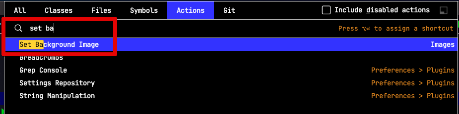
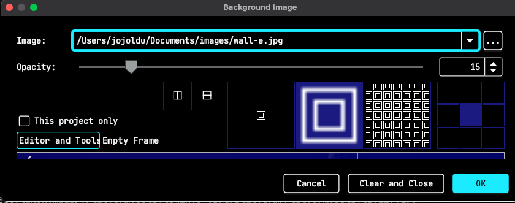
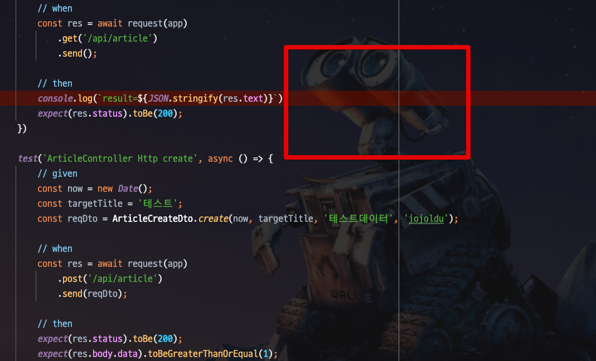
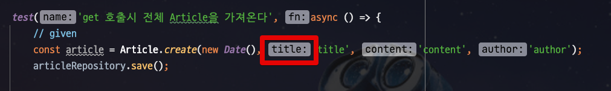
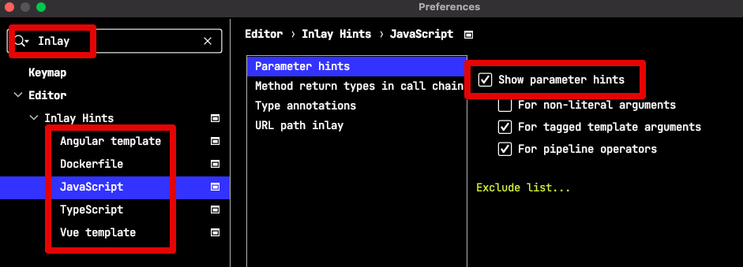
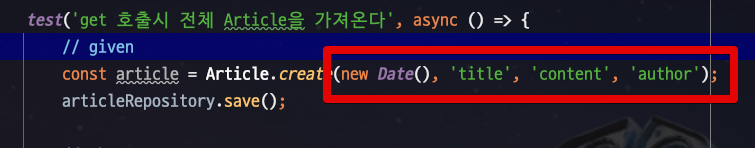

# IntelliJ 설치시 하는 설정들

## Background 이미지 설정

IDE Editor에서 

Action 검색 단축키 (`CMD+Shift+A` or `Ctrl+Shift+A`) 를 찾아

## 메소드 Parameter Hint Disable

파라미터 힌트로 인해 IDE 가로가 길어지는게 보기 싫어서 이 Hint를 Disable해서 사용합니다.

> 어차피 `CMD + P` (Windows: `Ctrl+P`) 로 어차피 파라미터를 다 볼 수 있습니다.

Preferences (Settings) 에서 `Inlay`를 검색 -> 파일 유형마다의 `Show parameter hints`를 체크 해제합니다.

