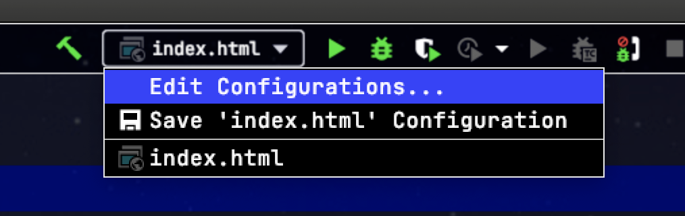
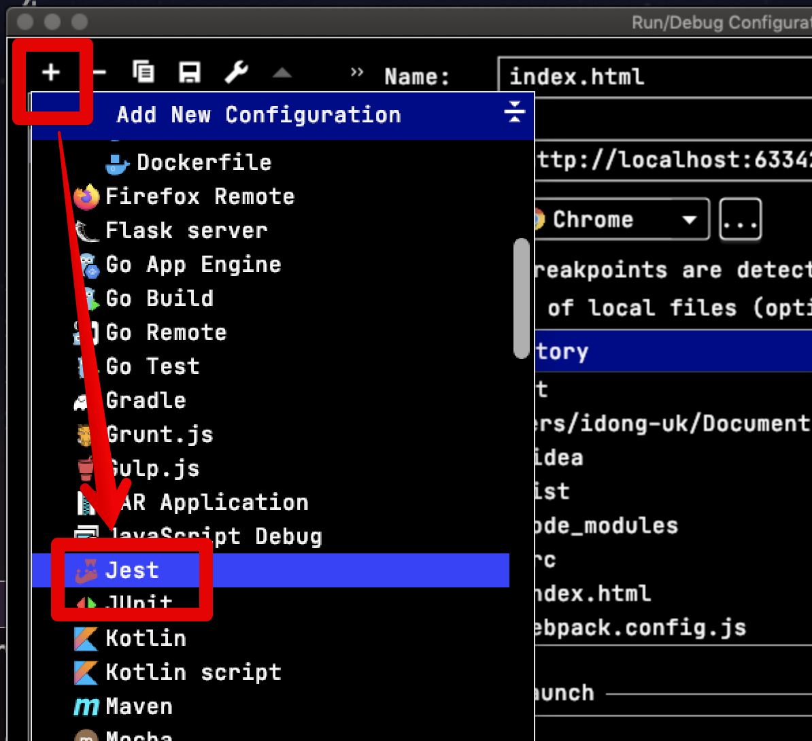
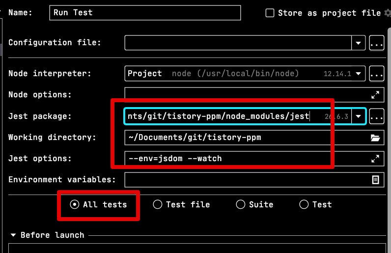
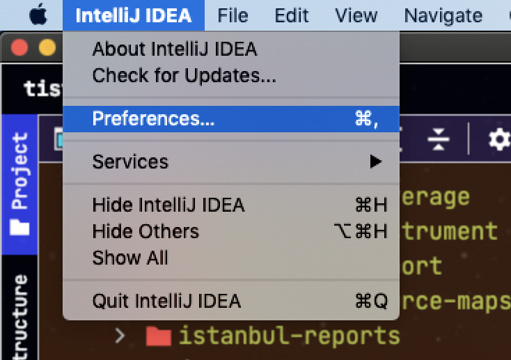
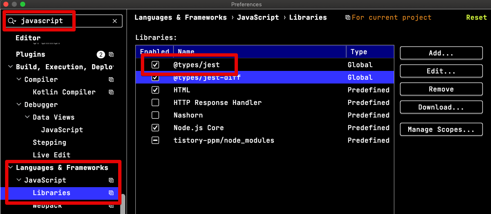
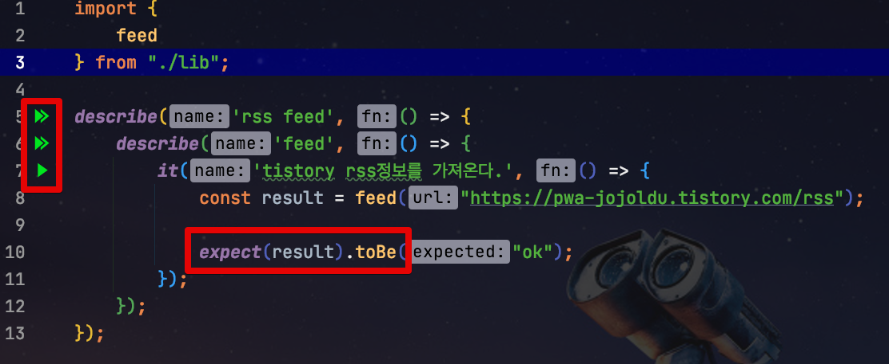
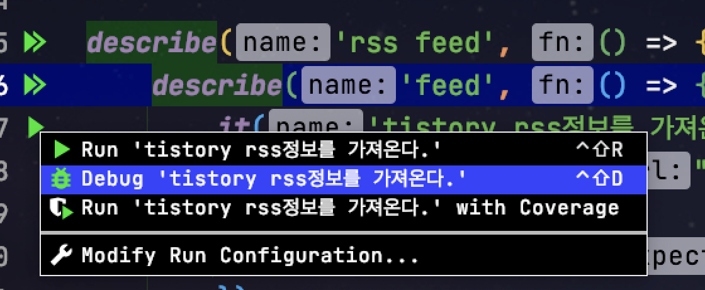
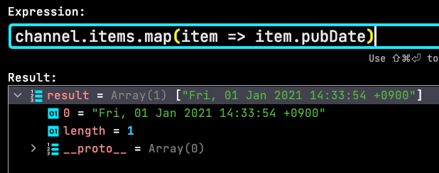

# Jest를 IntelliJ (or Webstorm) Debug 모드로 실행하기

VS Code에 비해 Javascript 개발 환경에서 IntelliJ (+ WebStorm)이 갖는 가장 큰 장점은 디버깅 기능입니다.  
  
코드의 호출 스택을 쫓아간다거나, 곳곳의 코드에서 브레이크를 걸고 Expression으로 임시코드를 실행해보는 등 다양한 디버깅 기능을 IntelliJ에서는 사용해볼 수 있는데요.  
  
Javascript의 테스트 프레임워크인 Jest를 사용할때도 IntelliJ의 디버깅 기능을 활용할 수 있습니다.  
  
이번 시간에는 IntelliJ에서 Jest를 디버깅 모드로 사용하는 방법을 알아보겠습니다.

> 실습을 위해서는 본인의 프로젝트에 **Jest 패키지와 테스트 코드**가 필수입니다.  
> 현재 포스트에 사용된 코드는 [Github](https://github.com/jojoldu/tistory-ppm)에서 확인할 수 있습니다.
 
## 1. Debug 실행 환경 구성

IntelliJ 우측 상단의 실행 환경 설정 (**Edit Configurations**) 를 클릭합니다.



팝업창이 새롭게 열리는데요.  
팝업창 좌측 상단의 ```+``` -> Jest를 차례로 선택합니다. 
 


Jest 실행 환경을 아래와 같이 입력합니다.



* ```Jest package```
  * Jest 실행 스크립트가 있는 위치를 등록합니다.
  * ```npm```으로 프로젝트에 Jest를 설치하셨으면 ```프로젝트디렉토리/node_modules/jest``` 를 선택하시면 됩니다.
* ```Working directory```
  * 프로젝트 디렉토리를 지정하면 됩니다.
  * 보통은 자동으로 지정되어 있습니다.
* ```Jest options```
  * 지금 지정하는 IntelliJ 실행환경에서 Jest를 실행할때 기본적으로 추가될 Jest Options을 등록합니다.
 
이렇게만 하시면 Jest의 디버깅 실행환경은 끝입니다!  
다만, 여기서만 끝내지 않고 **Jest의 문법지원/자동완성**도 함께 설정하겠습니다.

## 2. Jest 문법 지원

IntelliJ의 좌측 상단에 있는 Preferences (Windows/Linux에서는 Settings) 를 선택합니다.



검색창에 javascript -> Languages & Frameworks -> JavaScript -> Libraries를 차례로 선택하시면 아래와 같이 화면이 나오는데요.  
  
여기서 ```@types/jest```를 체크 선택합니다.



여기까지 하셨다면 모든 설정은 끝입니다!  
  
그럼 바로 디버깅 모드로 Jest를 실행해보겠습니다.

## 3. 디버깅 모드 테스트

먼저 기존의 Jest 테스트 파일을 열어서 문법지원이 잘 되는지 확인해봅니다.



문법지원이 잘 되는게 확인되셨으면, 라인 넘버 옆에 있는 실행버튼 (삼각형 버튼)을 클릭해보시면 아래와 같이 Debug로 테스트 메소드를 실행할 수 있습니다.



Jest가 실행하는 코드 중 디버깅을 해보고 싶은 Line에 브레이크 포인트를 걸어놓고 실행해보시면?  
  
아래와 같이 디버깅 모드가 잘 되는 것을 확인할 수 있습니다.


브레이크가 걸린 상태에서 디버깅 모드의 여러가지 기능들을 실행해볼 수 있습니다.  
  
Expression 팝업창을 열어 **현재 상태의 상태/변수값**도 확인하고,


실제 임의로 코드를 작성해 실행해보고 미리 결과를 확인해보기도 할 수 있습니다.



> IntelliJ & Webstorm의 좀 더 다양한 디버깅 기능을 활용해보고 싶으시면 [IntelliJ를 시작하시는 분들을 위한 IntelliJ 가이드](https://www.inflearn.com/course/intellij-guide#) 를 참고해주세요.