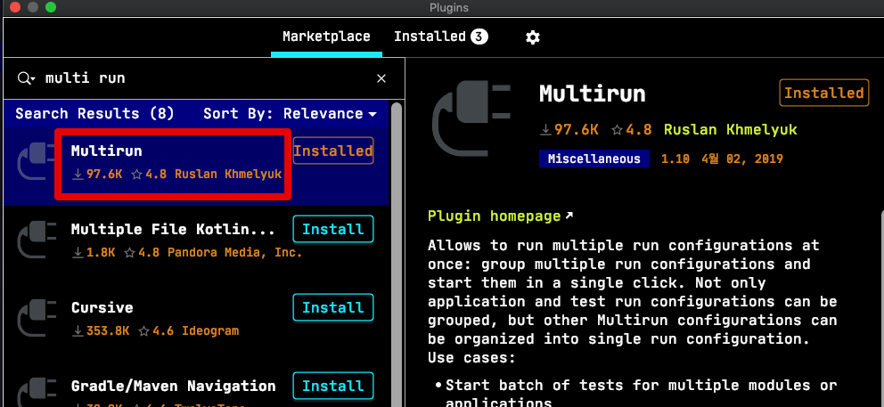
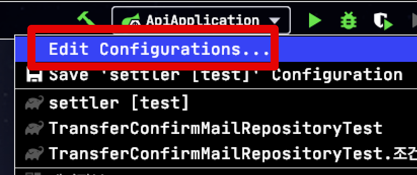
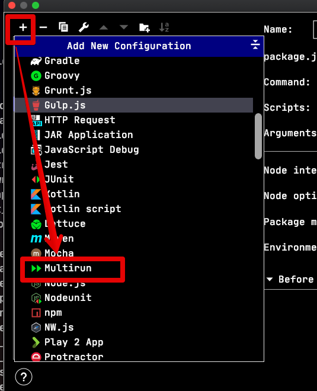
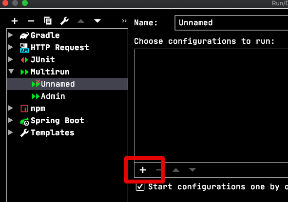
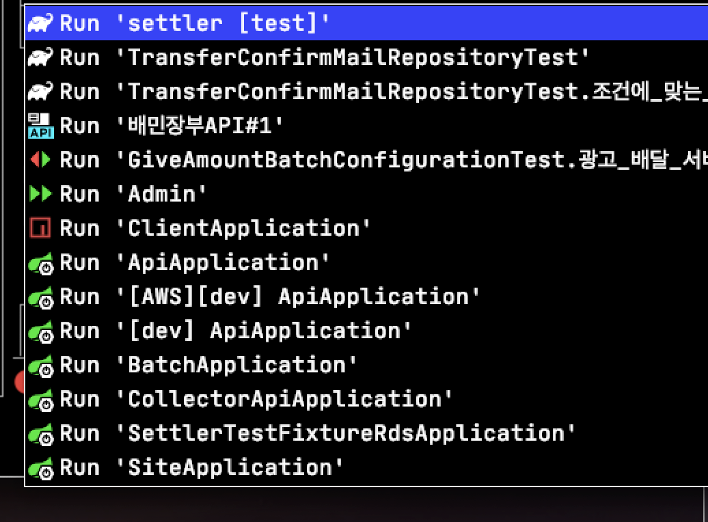
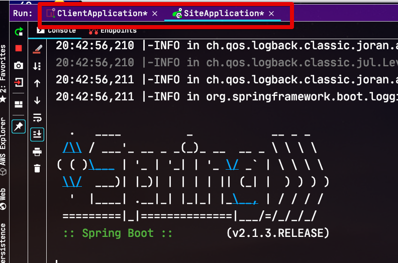

# IntelliJ에서 동시에 여러 Run환경 함께 실행하기

최근의 웹 개발은 프론트엔드와 백엔드를 프로젝트 단위로 분리해서 개발하고 있습니다.  
그러다보니 개발자들은 항상 개발을 시작할때 다음의 행위를 하는데요.

* 프론트엔드 환경 ```npm run``` 해서 실행
* 백엔드 환경 (ex: Spring Boot) IntelliJ에서 실행

매번 2가지 환경을 직접 실행해야만 합니다.  
  
이외에도 MSA 개발을 위해 여러 API를 동시에 실행해서 테스트하거나 개발해야할때도 마찬가지입니다.

* API 1 애플리케이션 실행
* API 2 애플리케이션 실행
* API 3 애플리케이션 실행

**하나의 기능을 실제로 확인해보기 위해서** 매번 하나씩 실행하는 것도 허들이지만, 어느 프로젝트를 실행해야할지 기억하고 있어야 하는 것도 고역입니다.  
  
**이 웹 서비스를 실행하기 위해선 이것 하나만 실행하면 돼**! 가 된다면 얼마나 편할까요?  
  
그래서 이번 시간에서는 IntelliJ의 Multi Run을 이용하여 내가 원하는 환경들을 한번에 다 실행할 수 있는 방법을 소개드리겠습니다.

## 설정

Multi Run의 경우 IntelliJ에서 공식적으로 지원하는 기능은 아닌데요.  
대신, 풍부한 플러그인 생태계 덕분에 플러그인으로 해당 기능을 지원하고 있습니다.

* [플러그인 주소](https://plugins.jetbrains.com/plugin/7248-multirun)

해당 플러그인을 먼저 설치하신 뒤 진행하겠습니다.



설치가 되셨다면 IntelliJ 상단에 있는 Edit Configuration 버튼을 클릭합니다.



Edit 화면의 좌측 상단을 보시면 ```+``` 버튼이 있는데요.  
이를 클릭하면 여러 Run 설정이 가능한데, **플러그인을 설치하셨다면** 아래와 같이 Multirun을 볼 수 있습니다.



해당 환경을 선택하시면 아래와 같이 생성 화면이 나오는데, ```+``` 버튼을 클릭하시면 



아래와 같이 기존에 사용중이던 Run 환경이 나옵니다.  
여기서 **함께 실행하고 싶은 Run 환경을 등록**합니다.



저는 아래와 같이 Npm Run 환경과 Spring Boot Run 환경 2가지를 같이 등록하였는데요.  

> IntelliJ에서 Npm Run 설정을 등록하는 방법은 [이전 포스팅](https://jojoldu.tistory.com/468#2-npm-run%EB%8F%84-intellij%EC%97%90%EC%84%9C-%EC%8B%A4%ED%96%89%ED%95%98%EA%B8%B0) 을 참고해주세요.

여러 API 애플리케이션을 실행하고 싶다면 해당 API 애플리케이션들을 선택하시면 됩니다.  


Apply 버튼을 클릭해서 적용하시면 아래와 같이 Multi Run 실행 버튼을 볼 수 있습니다.


Run 혹은 Debug로 실행해보시면!?



한번의 실행으로 2개의 Run 환경이 실행되는 것을 확인할 수 있습니다.  

> 동시에 실행하는 방법은 아직 찾지 못했습니다.  
> 그래서 현재 상태로 하신다면 순차적으로 실행이 됩니다.


