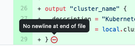
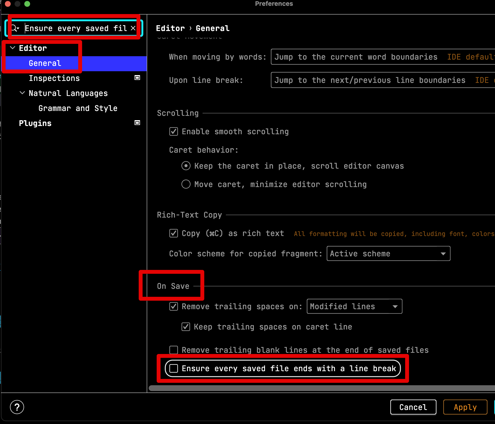
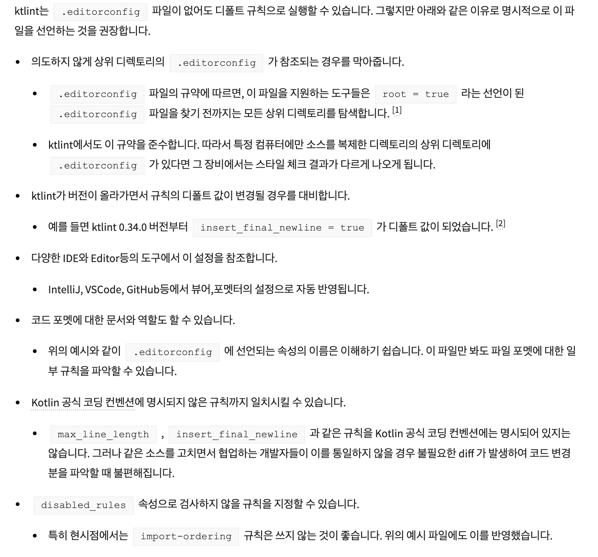
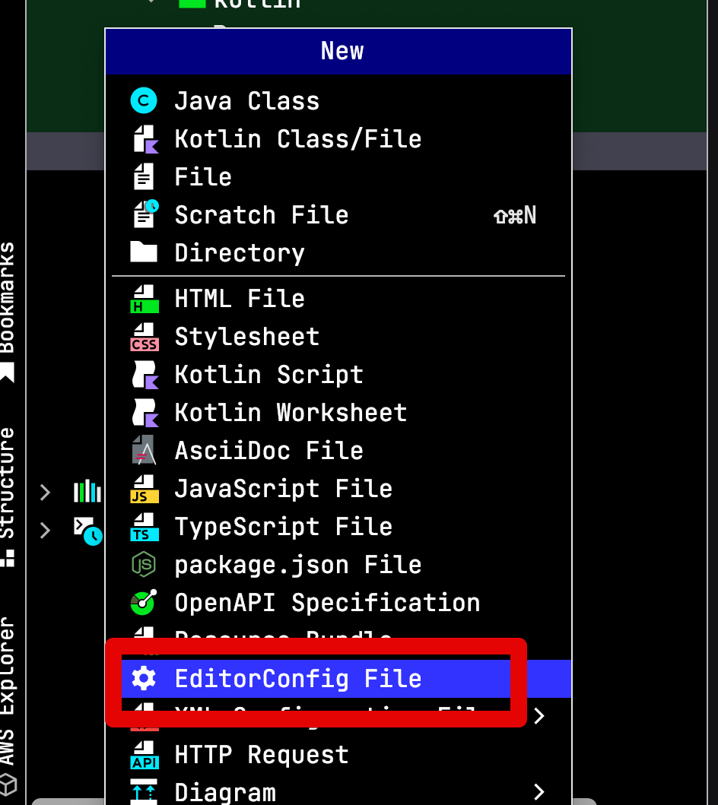
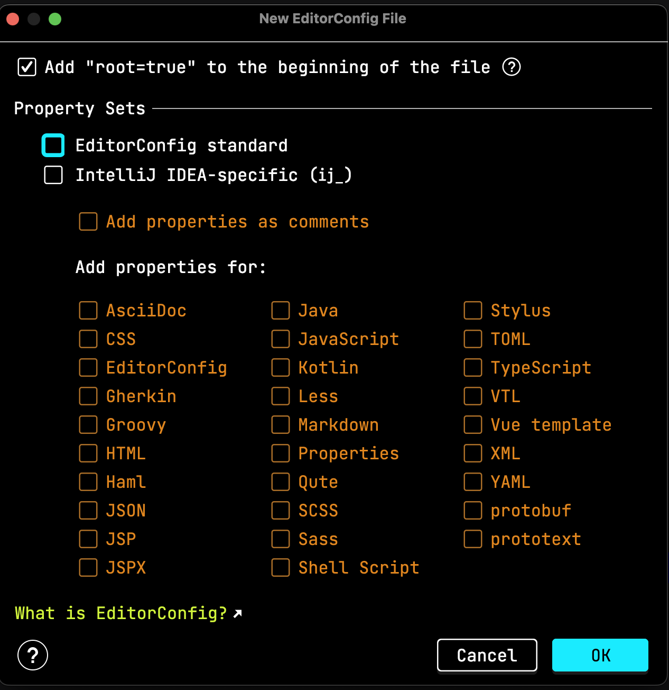
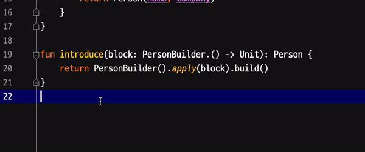

# IntelliJ (Kotlin) 매 파일마다 newline 자동으로 추가하기 (feat. EditorConfig)

Github 의 코드리뷰를 보면 다음과 같이 `No newline at end of file` 메세지를 보여준다



이는 `파일 끝에 개행문자(newline)이 없습니다` 라는 의미인데, [POSIX 기반의 규칙](https://pubs.opengroup.org/onlinepubs/9699919799/basedefs/V1_chap03.html#tag_03_206)에 기반한다.  
EOF 가 없으면 컴파일 에러가 나는 상황을 대비한 규칙이다.  
요즘 그럴일은 없지만 그래도 의도한대로 파일이 작동되는 것을 보장하기 위해 웬만해선 자동으로 규칙을 정해놓고 관리하는 것을 추천한다.   
  
이를 매번 파일 생성때마다 수동으로 계행문자를 넣는 것은 꽤나 불편한 일이다.  
그래서 자동으로 해결하는 방법은 크게 2가지이다.

## 1. IDE 설정으로 해결하기

가장 쉬운 방법은 IDE의 설정으로 항상 파일 끝에 `newline`을 추가하도록 하는 것이다.  

* IDE 설정 (Settings/Preferences) 을 열어 `Ensure every saved file ends` 을 검색한다.  
* 아래와 같이 `Ensure every saved file ends` 항목을 **체크**한다.



이렇게 하면 **파일을 저장할때마다 항상 newline을 추가**한다.  
  
다만, 이 방법을 추천하진 않는다.  
웬만하면 아래 **2번째 방법을 사용하자**.


## 2. EditorConfig로 프로젝트 자체 설정으로 해결하기

**IDE 설정을 수정하기 보다는 editorconfig로 설정**을 하는 것이 프로젝트 관리하는데 있어서 편하다.  

* 개발환경이 집/회사/개인노트북 등 여러 곳에 분산되어서 개발해야하는 경우
* 나 외에 다른 사람들도 같이 개발해야하는 경우
  
등등 IDE 설정을 매번 하기보다는 `.editorconfig` 로 하는 것을 강력 추천 한다.  
  
[EditorConfig](https://editorconfig.org/) 는 코드 스타일을 관리하는 표준 도구이다.  
대부분의 IDE에서 이를 지원하기 때문에 **파일 저장시 각종 규칙에 맞게 일관된 코드 스타일을 관리**할 수 있다.  
  
[Ktlint](https://ktlint.github.io/) 를 쓰더라도 [EditorConfig](https://editorconfig.org/) 를 사용하는 이유는 다음과 같다.



* 출처: [benelog님의 블로그](https://blog.benelog.net/ktlint.html#editorconfig_%EC%84%A4%EC%A0%95)

(이미 benelog님이 너무 잘 정리해주셔서) 위 이유 중에서 

* **코드 포맷의 문서 역할**
* **ktlint 업데이트로 인해 변경되는 규칙 보장**

이 2가지에 굉장히 공감하기 때문에 `.editorconfig` 을 설정하는 것을 추천한다.  
  
젯브레인 계열 IDE에서는 다음과 같이 `.editorconfig` 를 생성할 수 있다.  
(그냥 파일을 생성해도 된다.)  
  
프로젝트 선택후 우클릭 -> New 를 선택하고 (Mac 단축키로는 `Command + N`) 



해당 목록에서 `EditorConfig File` 을 선택한다.  
그럼 다음과 같이 여러 옵션으로 생성이 가능하다.  
이미 사용할 포맷이 있기 때문에 아무 옵션도 선택하지 않고 OK 를 누른다.



생성된 `.editorconfig` 에 아래와 같이 무난한 Kotlin 옵션을 추가한다.

```bash
root = true

[*]
charset = utf-8
end_of_line = lf
indent_size = 4
indent_style = space
trim_trailing_whitespace = true
insert_final_newline = true
max_line_length = 120
tab_width = 4

[*.{kt,kts}]
disabled_rules=import-ordering
```

* 출처: [benelog님의 블로그](https://blog.benelog.net/ktlint.html#editorconfig_%EC%84%A4%EC%A0%95)

이와 같이 설정하면 **파일 저장시마다 설정된 옵션에 따라 파일이 정리**된다.



> 젯브레인 계열 IDE에서 EditorConfig를 사용하는 자세한 방법은 [공식 문서](https://www.jetbrains.com/help/idea/editorconfig.html)를 참고하면 좋다

