# 웹 JS 애플리케이션 개발시 IntelliJ 디버거 사용하기

Vue 혹은 React로 개발시 **Webstorm** (혹은 **IntelliJ Ultimate**) 라이센스가 있으신 분들도 VS Code로 개발하시는 경우를 종종 봅니다.  
  
백엔드 개발자 분들이라면 아무래도 IntelliJ가 더 익숙하실텐데요.  
Chrome + VS Code로 **디버깅** 하는게 아무래도 어색하고, **굳이 이렇게 많은 도구를 배워야하나**라는 생각이 드신다면 한번 이번 포스팅을 참고해보시면 좋을것 같습니다.  

이번 포스팅에서는 **IntelliJ 디버거로 웹 애플리케이션 디버깅**하는 방법입니다.  

> 여기서 웹 애플리케이션이란 Vue, React 등 모던 JS 스택으로 개발하고 있는 프론트엔드 프로젝트를 이야기합니다.

**IntelliJ의 강력한 디버거**를 모던 웹 프론트 개발시에도 사용해보고 싶으신 분들이라면 참고하셔도 좋을것 같습니다.

## 0. 준비물

일단 2가지가 필요합니다.

* IntelliJ **Ultimate** (**유료**버전)
  * Community (무료 버전)은 웹 개발 도구가 지원되지 않습니다.
  * 혹은 Webstorm이 있으셔도 됩니다.
* Chrome과 [JetBrains IDE Support 플러그인](https://chrome.google.com/webstore/detail/jetbrains-ide-support/hmhgeddbohgjknpmjagkdomcpobmllji)
  * 원격 디버깅을 위해서 [JetBrains IDE Support 플러그인](https://chrome.google.com/webstore/detail/jetbrains-ide-support/hmhgeddbohgjknpmjagkdomcpobmllji)이 필수로 설치되어 있어야만 합니다.

2가지가 모두 준비되셨다면 차례로 진행해보겠습니다.

## 1. 원격 디버거 설정

여기서는 VueJS 프로젝트로 진행하겠습니다.  

> React, Angular 등도 무방하게 진행가능합니다.

본인의 프론트엔드 프로젝트를 ```npm```으로 **미리 실행해놓습니다**.  

> 저 같은 경우 localhost:3000으로 프로젝트를 실행했습니다.

프로젝트를 IntelliJ (혹은 Webstorm) 으로 열어서 우측 상단을 보시면 프로젝트 실행 버튼이 있습니다.  

여기서 select box를 클릭해 **Edit Configurations**... 를 선택합니다.

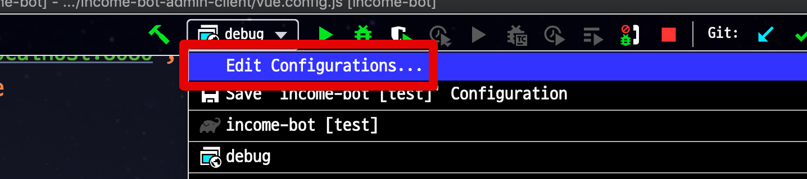

실행 환경이 열리면 좌측에 + 버튼 클릭 -> **JavaScript Debug**를 차례로 선택합니다.

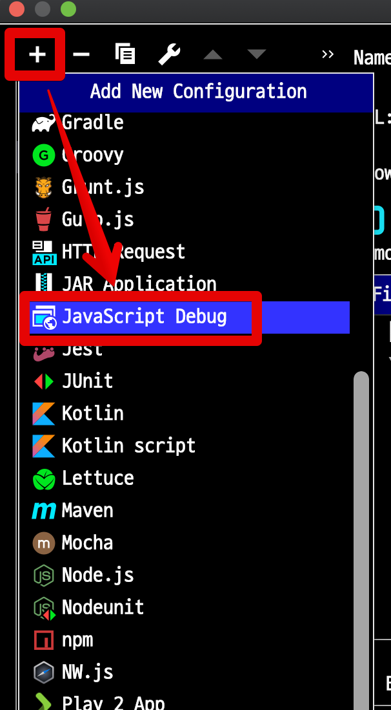

JavaScript Debug 실행 설정 화면에서는 아래와 같이 각 항목을 등록합니다.

* JS 프로젝트 개발 환경시 사용되는 URL
  * 보통 ```localhost:8080```으로 사용하시는 그 주소입니다.
  * 저는 백엔드는 8080, 프론트엔드는 3000 혹은 4000으로 포트를 지정해서 사용합니다.
  * 여기서는 프론트엔드 포트를 3000으로 사용하기 때문에 ```localhost:3000```으로 URL을 지정했습니다.

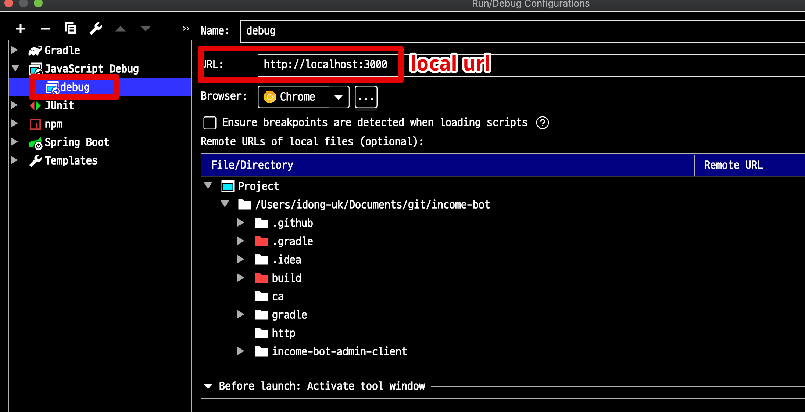

설정이 완료 되셨다면 OK를 누르신후 설정 정보를 저장합니다.  
그럼 아래와 같이 방금 등록한 JavaScript Debug 정보가 보이는데, 벌레 모양 (디버거 실행 버튼) 을 클릭합니다.


그럼 아래와 같이 브라우저에서 **JetBrains IDE Support에서 이 브라우저를 디버깅 하는 중입니다** 팝업이 등장하며 **원격 디버깅이 활성화** 된 것을 알 수 있습니다.


위 팝업이 확인되셨다면, IntelliJ에서 ```vue``` 혹은 ```.js``` 파일에 **브레이크 포인트를 걸어서** 해당 기능을 실행해보시면!  
  
아래와 같이 브레이크가 걸리며 **IntelliJ 디버거를 사용할 수 있음**을 알 수 있습니다.

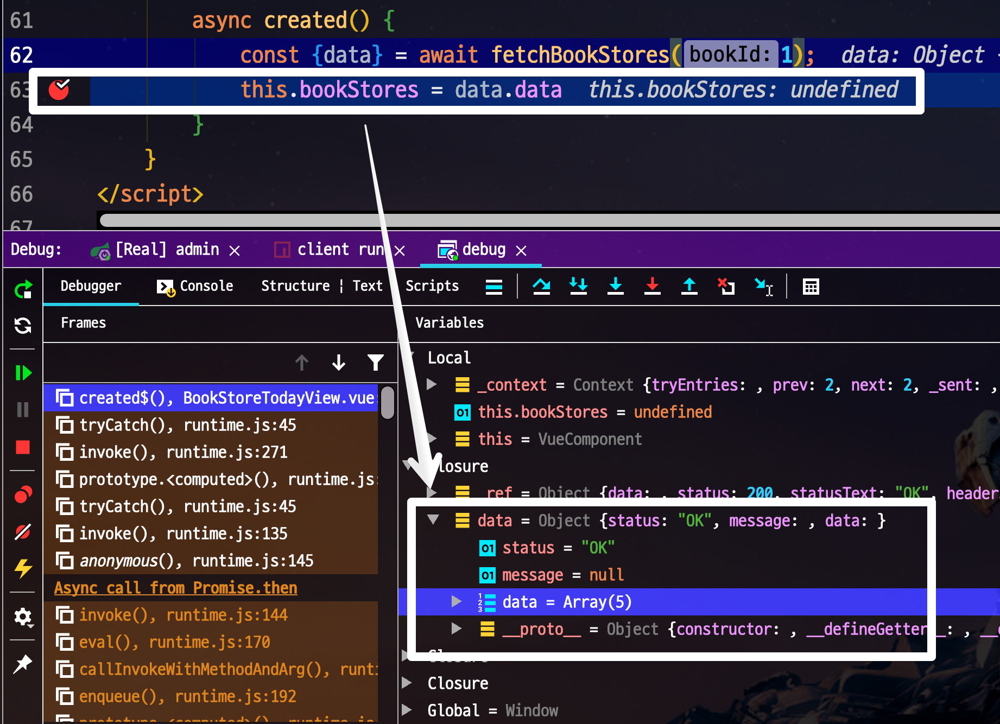

브레이킹 포인트가 걸린 이후에는 **자바 프로젝트와 동일하게** 강력한 IntelliJ 디버거를 사용하시면 됩니다.

> IntelliJ 디버거 사용법을 익히고 싶으시다면 [블로그 포스팅](https://jojoldu.tistory.com/149) 혹은 [인프런 영상](https://www.inflearn.com/course/intellij-guide/#)을 참고해주시면 됩니다.

## 2. npm run도 IntelliJ에서 실행하기

[Gradle Multi Module](https://jojoldu.tistory.com/123) 과 같이 **하나의 저장소에 여러 서브 모듈이 모여있는** 경우에는 매번 JS 프로젝트로 이동후 ```npm run serve``` 의 명령어를 수행하는게 제법 귀찮은 일입니다.

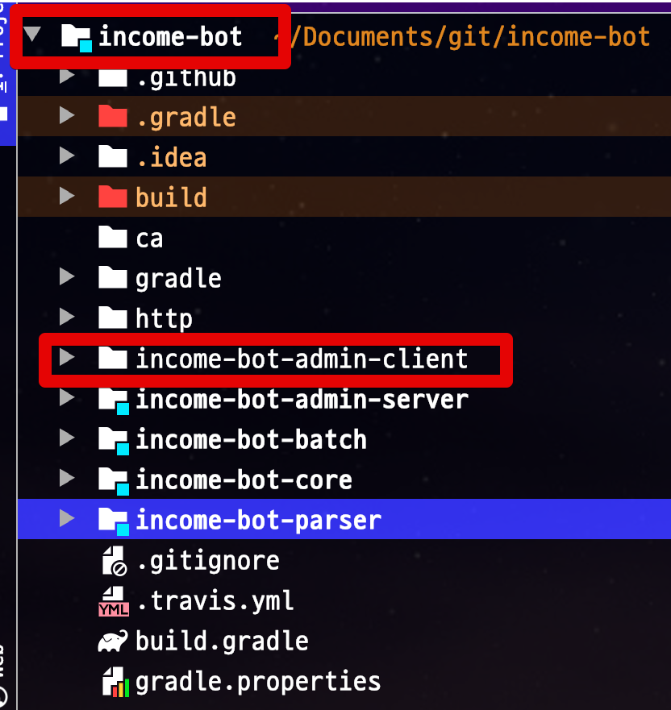

매번 CLI로 실행하면 귀찮으니, ```npm run```도 IntelliJ 실행 환경에 등록해서 쉽게 실행하도록 해보겠습니다.  

JS Debug와 마찬가지로 **Edit Configurations**... 를 클릭합니다.  

이번엔 **npm**을 선택합니다.

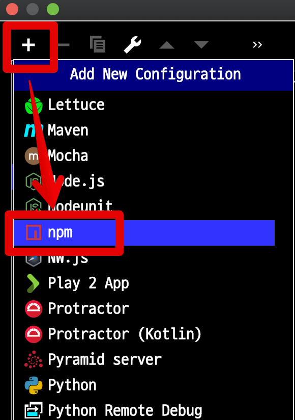

제가 등록할 커맨드는

```bash
npm run serve
```

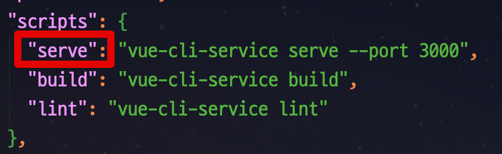

입니다.  
  
이럴 경우에 npm 실행 정보는 아래와 같이 등록하시면 됩니다.

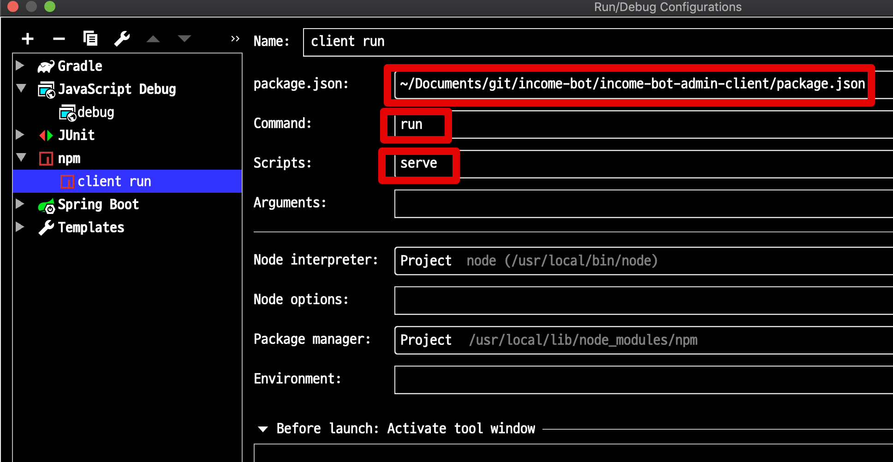

* package.json 정보도 같이 등록해주셔야 합니다.

이렇게 등록한 실행 정보를 **디버깅 모드**로 실행해봅니다.

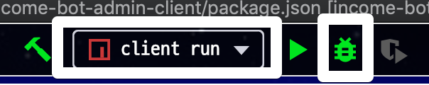

그럼 아래와 같이 npm 커맨드가 실행되는 것을 확인할 수 있습니다.

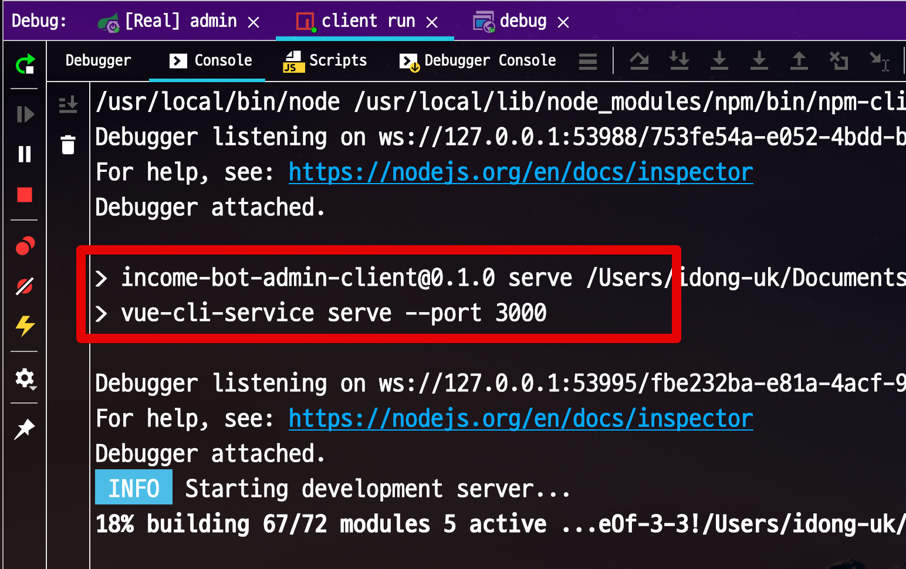

Webpack Dev Server도 정상적으로 잘 실행된 것을 확인할 수 있습니다.

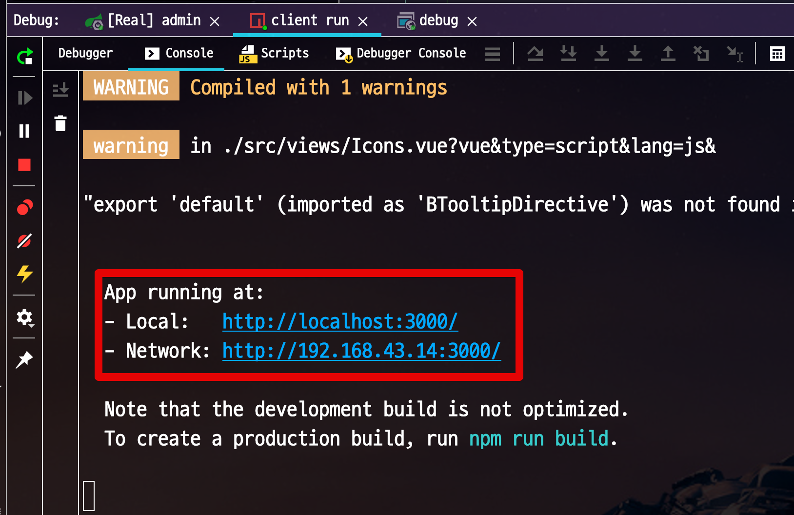


