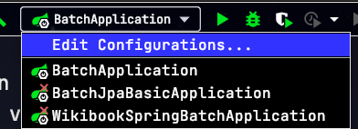
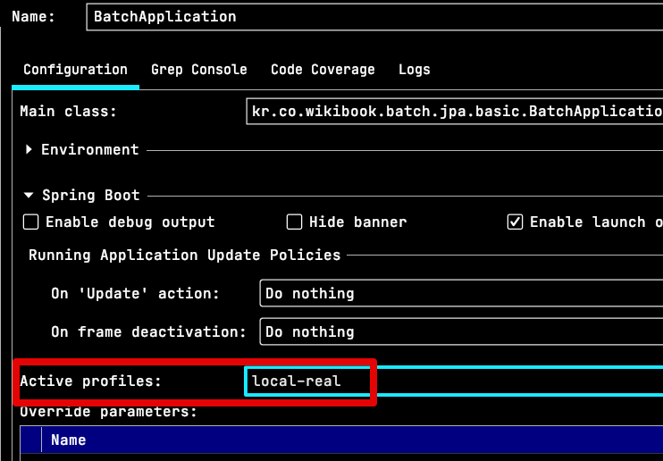
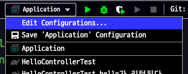
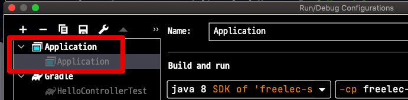
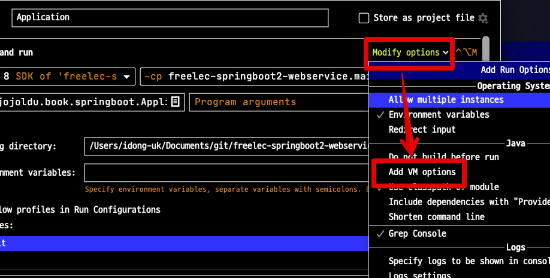
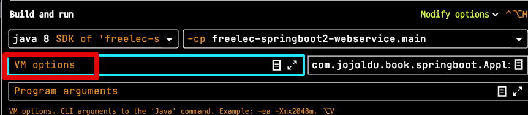
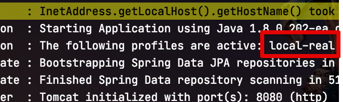

# IntelliJ (Ultimate & Community) 에서 스프링부트 active profile 설정하기

IntelliJ Community로 스프링부트 환경에서 개발하시는 분들이 종종 질문 주시는 내용이라 정리하게 되었습니다.  
  
스프링부트로 개발을 하다보면 기본 active profile 외에 다른 profile로 실행이 필요할때가 있는데요.  

* ex) ```local```이 기본 active profile인데, ```local-real```이란 profile로 실행하고자 할 경우

Ultimate의 경우 이에 대한 기본적인 설정을 지원하지만, Community 버전에서는 별도로 VM Option을 추가해서 진행해야됩니다.  
  
차례로 보겠습니다.

## 1. IntelliJ Ultimate (유료)

Ultimate 버전의 경우 간단합니다.  
  
아래와 같이 IDEA 상단에 위치한 ```Edit Configurations``` 버튼을 클릭하신 뒤,



Active profiles 항목에 본인이 원하는 profiles을 입력하시면 됩니다.



## 2. IntelliJ Community (무료)

IDEA의 무료버전인 Community에서는 공식적으로는 ```Active profiles``` 옵션을 지원하지 않는데요.  
다만, ```bootJar```를 실행할때 처럼 VM Options을 줄 수 있습니다.  
  
Ultimate와 마찬가지로 ```Edit Configurations``` 버튼을 클릭하신 뒤,



스프링 부트 애플리케이션 실행 환경을 선택 하신 뒤,



팝업창의 우측 상단을 보시면 ```Modify options```가 있는데요.  
이를 클릭 하시면 아래와 같이 리스트로 여러 옵션이 나오는데 이 중, ```Add VM options```를 선택 합니다.



그럼 아래와 같이 VM options 입력 항목이 추가됩니다.



여기에 아래와 같이 ```-Dspring.profiles.active=원하는profile```을 추가합니다.


저는 아래와 ```local-real``` profile을 실행하기 위해서 아래와 같이 옵션을 추가하였습니다.

```bash
-Dspring.profiles.active=local-real
```

저장 하신 뒤, Application 을 실행해보시면?  
아래와 같이 지정된 profile로 실행되는 것을 확인할 수 있습니다.


