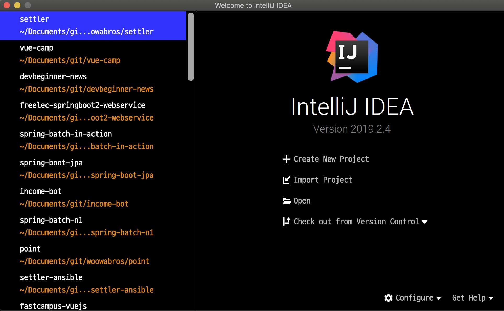
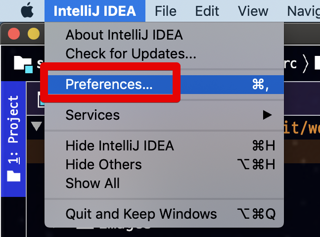
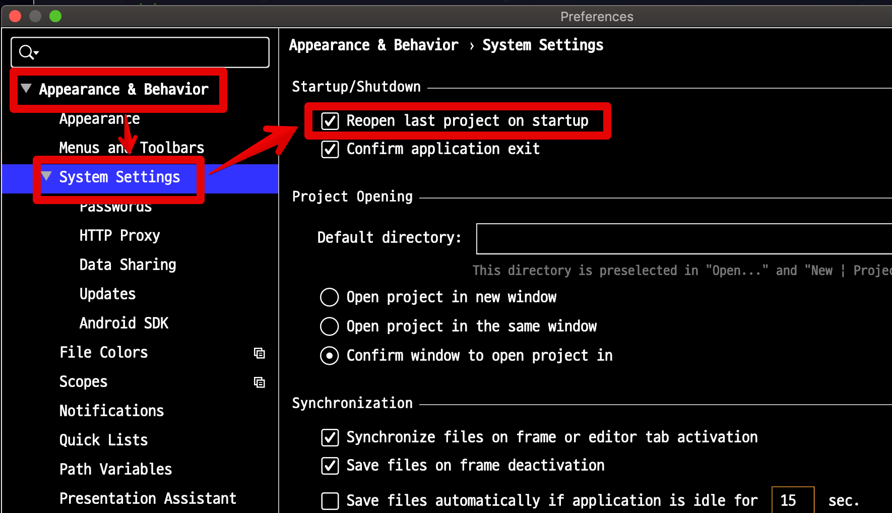

# IntelliJ 실행시 최근 종료한 프로젝트 바로 실행되지 않게 하기

IntelliJ를 실행하면 항상 **가장 최근에 종료한 프로젝트가 자동 실행**됩니다.  
한개의 프로젝트를 개발중이라면 크게 문제가 되진 않겠지만, 여러 프로젝트를 개발중이신 분들이라면 매번 다시 새 프로젝트를 열어야만 합니다.  
  
특히나 전에 종료한 프로젝트가 2개나 3개라면 처음 실행할때 2~3개가 동시에 실행됩니다.  
이럴 경우 사양이 높지 않은 노트북은 중간에 프리징에 가까운 멈춤 현상을 겪을수도 있습니다.  

> 실행시 인텔리제이는 인덱싱 기능을 수행하기 때문에 실행시 많은 리소스가 필요합니다.  
> 대신 이런 인덱싱 기능 때문에 실제 개발단계에서 파일 검색등에서 많은 속도 향상이 있습니다.

그래서 다음과 같이 매번 실행할때마다 프로젝트 선택 화면이 나오길 바라는 분들이 계십니다.  

그래서 해당 설정을 진행해보겠습니다.  
  
인텔리제이 좌측 상단의 IntelliJ IDEA -> Preferences (윈도우에선 Settings) 을 차례로 클릭합니다.

그리고 Appearance & Behaviour -> System Settings 메뉴로 차례로 이동합니다.  
  
System Settings 의 여러 설정 항목중에 Startup/Shutdown 메뉴에서 **Reopen last project on startup** 가 있습니다.  
기본값이 체크상태일텐데, 이를 **체크 해제** 하시면 됩니다.

그럼 처음 화면을 봤던것 처럼 매번 실행시마다 프로젝트 선택 화면이 등장합니다.

