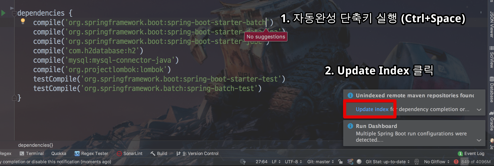
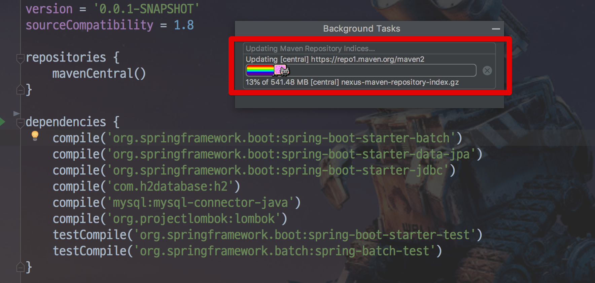
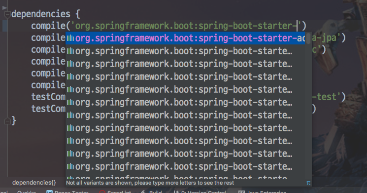

# IntelliJ 의존성 목록 확인 및 자동 완성

IntelliJ로 개발할때맏 불편한 것이 의존성을 추가하는 일입니다.  
  
항상 [mvnrepository](https://mvnrepository.com/) 로 가서 검색한 결과를 복사해서 build.gradle에 복사해야만 합니다.  
이걸 IntelliJ에서 검색기능이나 자동완성 기능을 지원하면 좋을것 같다는 생각이 있었는데, 비슷한 기능이 있었습니다.  
  
프로젝트의 build.gradle로 이동합니다.  
의존성 이름을 앞부분만 작성해서 아래와 같이 자동완성 단축키를 실행해봅니다.
그러면 maven 저장소와 동기화를 하기 위해 인덱싱 작업이 필요하다는 알람이 나옵니다.



**Update Index** 버튼을 클릭해 인덱싱 작업을 시작합니다.  
  
그럼 아래와 같이 인덱싱 작업이 시작됩니다.



작업이 끝나고 완성되지 않은 의존성 이름에 (여기서는 ```starter-```까지만 되어 있는 상태) 다시 자동 완성 단축키를 실행해보면!



스프링부트 스타터 이름을 갖고 있는 의존성 목록들이 나열됩니다.  
여기서 본인이 원하는 의존성을 선택만 하면 바로 해당 버전의 의존성이 자동완성됩니다.

## 사용 후기

사용해보고 난 소감은 아직은 애매하다? 입니다.  
예를 들어 ```starter-web```으로만 검색하면 제대로 검색이 되지 않습니다.  
즉, **개발자가 의존성명을 제대로 기억하고 있어야만** 쓸수있는데, 그럴거면 개인적으로는 그냥 메이븐 저장소에서 검색해서 바로 붙여넣기하는게 낫겠다 싶습니다.  
  
좀 더 개선되면 그때 써보시는게 좋을것 같습니다.  


