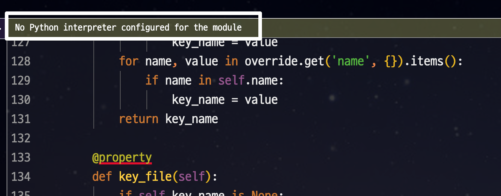
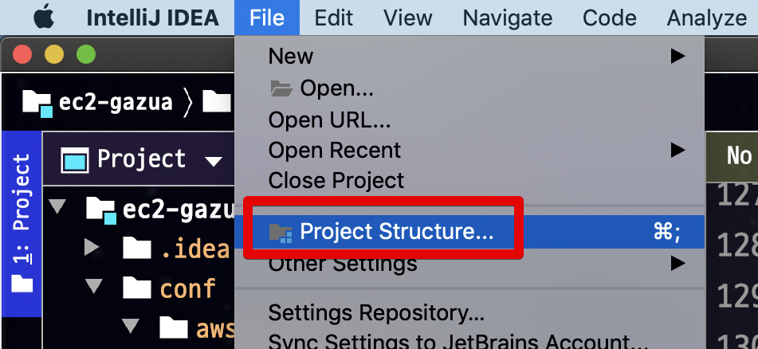
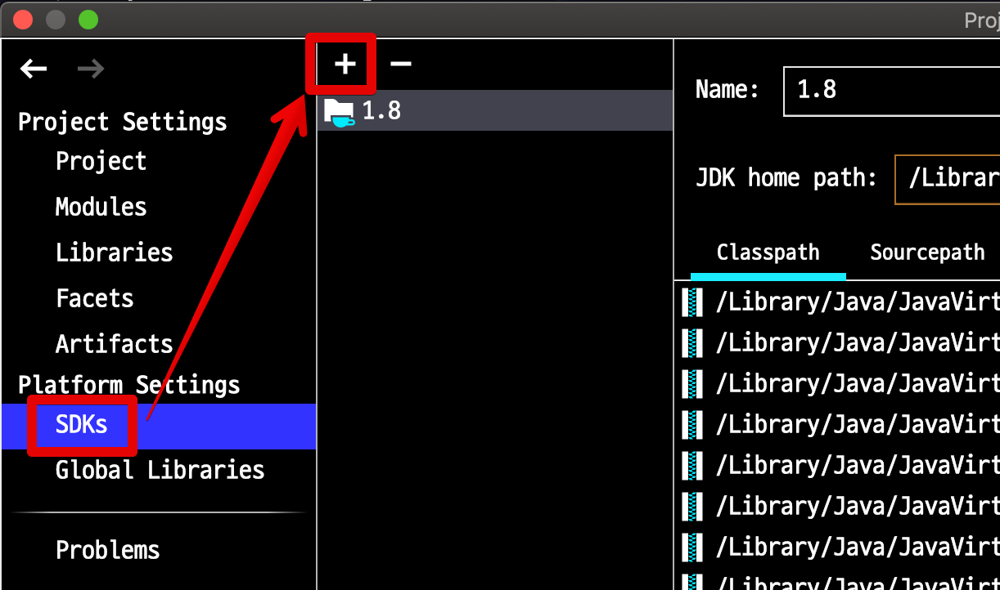
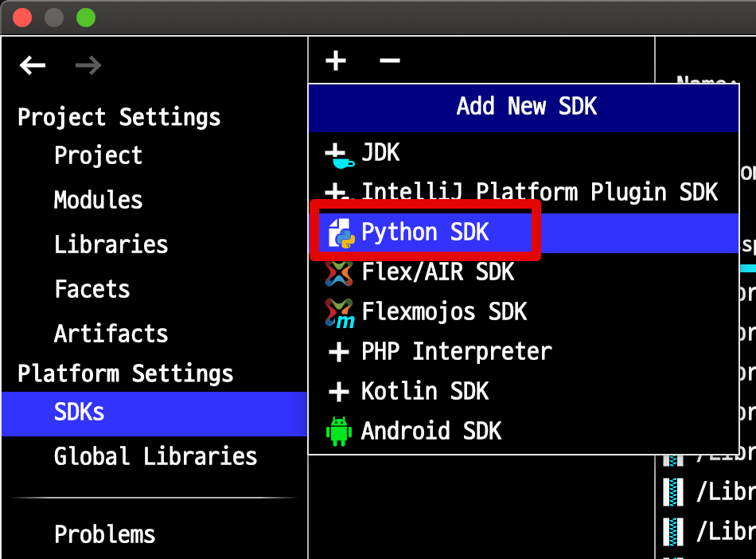
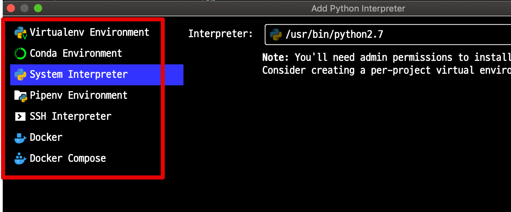
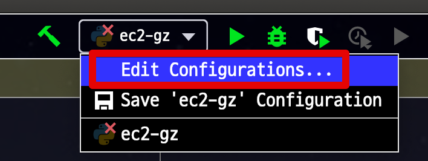
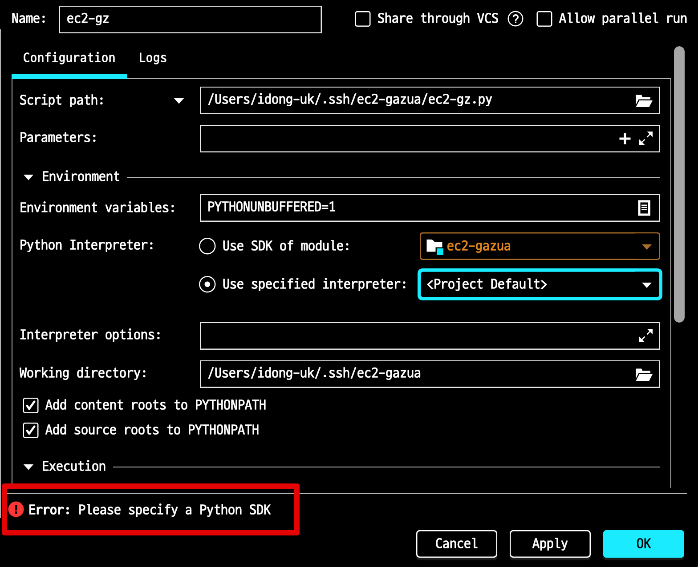
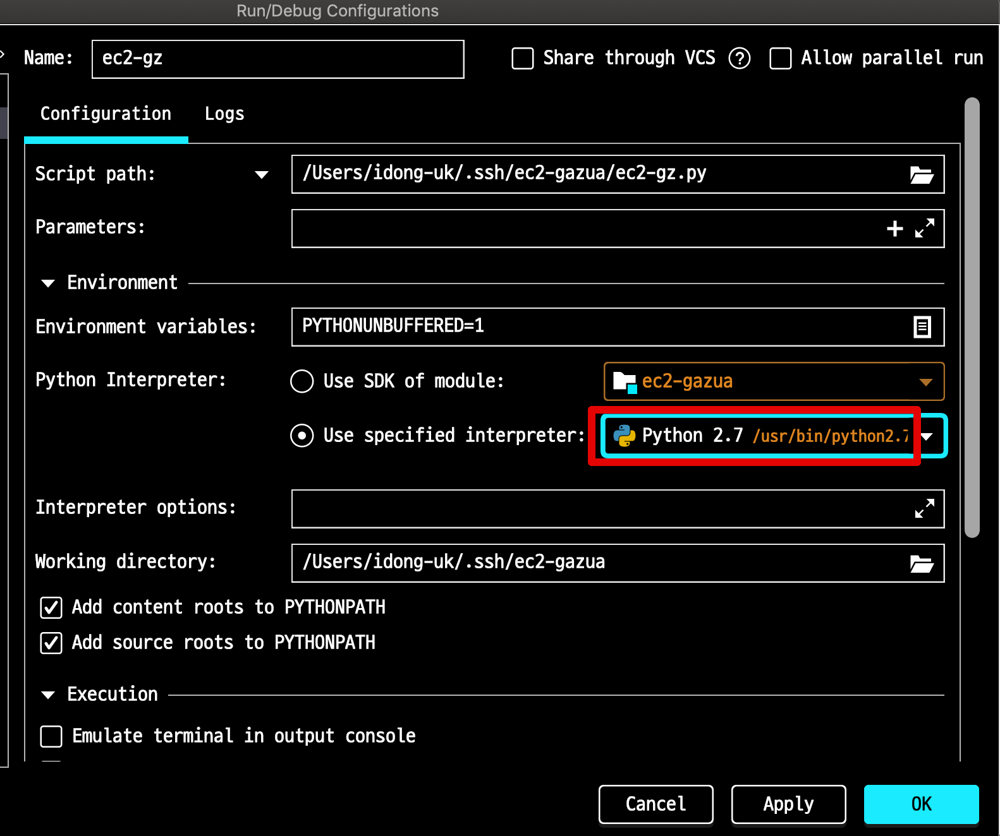

# 인텔리제이에 파이썬 인터프리터 설정하기

자바로 개발을 진행하더라도 파이썬 스크립트를 사용해야할 때가 있습니다.  
(ex - 인프라 작업)  
  
스크립트를 새로 만들때는 문제가 없지만, 이미 있는 스크립트를 수정하려면 인텔리제이에 파이썬 인터프리터를 등록해야합니다.

> Python 플러그인은 이미 설치되어있다고 가정합니다.

처음으로 파이썬 프로젝트 혹은 스크립트를 인텔리제이에서 열어보면 다음과 같이 인터프리터 미등록 메세지를 볼 수 있습니다.

아래 과정을 따라 프로젝트에 차례로 등록합니다.  
  
File -> Project Structure

Platform Settings -> SDKs -> +

+ 클릭을 하게 되면 여러 유형의 SDK가 등장하는데, 이중 파이썬 SDK를 선택합니다.
+ 

어떤 환경에서의 파이썬 인터프리터를 선택할지 나옵니다.

본인의 취향대로 venv를 할지, 시스템 인터프리터를 쓸지 선택하시면 됩니다.  
저는 여기서 시스템 인터프리터를 선택했습니다.  
  
다 등록하셨으면 프로젝트 실행 환경 설정으로 이동해봅니다.

여기서 아래와 같이 프로젝트에 파이썬 SDK가 선택되어 있지 않다고 나옵니다.  

Python Interperter -> Use specified interpreter를 선택하시면 아래와 같이 좀전에 등록한 파이썬 SDK를 선택할 수 있습니다.

선택하신 후, 실행해보시면 정상적으로 실행되는 것을 확인할 수 있습니다.